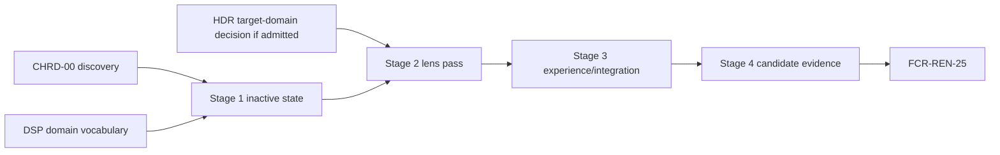

# Chromatic Aberration Delivery Plan

**Status:** conditional implementation plan; Stage 0 is permitted, Stages 1-4 are blocked until `CHRD-00 PASS` and `DSP-6` prerequisites

**Responsibility:** order discovery, inactive state, semantic pass, editor/debug/capture integration, and candidate evidence for `FCR-REN-25`

**Authority boundary:** [Discovery](Discovery.md) freezes decisions; [Semantics](Semantics.md), [Execution Architecture](ExecutionArchitecture.md), and [User Experience](UserExperience.md) own accepted target contracts; [README](README.md) owns acceptance; [Display And Reconstruction](../../../../FirstRelease/DisplayAndReconstruction.md#dsp-6--chromatic-aberration) owns release sequence

**Current readiness:** **0/100** — target only.

## Outcome

Deliver one small, stateless, per-view chromatic-aberration effect with a Stage-0-selected fixed three-channel model, exact reference-height units, analytic CPU/GPU agreement, bounded clamp sampling, target-linear pre-encode/pre-UI placement, zero-cost neutral state, truthful workflow, and admitted backend/package evidence. Completion is `FCR-REN-25` for one immutable candidate—not a colorful screenshot or compiled shader.

## Gate And Dependency Graph



An available display-pipeline seam does not bypass `CHRD-00`. HDR output may remain blocked independently; Stage 0 must either define a separately testable HDR target-linear cell or exclude that cell from the current candidate without weakening SDR truth.

## Planning Envelope

The ranges are initial engineering hours for one experienced owner/reviewer stream, including stage-local review/check work but excluding queue time for unavailable machines. Stage 0 must replace them after current owner and model scope are frozen.

| Stage | Initial effort range | Main uncertainty | Budget/capacity record |
| --- | ---: | --- | --- |
| 0 | 25-40 h | fixed model choice, geometry/domain, evidence classifier | experiment time/artifacts, model quality/cost thresholds |
| 1 | 15-25 h | fitting state/digest/result into existing settings/View vocabulary | public/state bytes, serialization, graph zero-work impact |
| 2 | 30-50 h | coordinate/filter parity, exact stage, backend sampler behavior | transient bytes, reads/writes/dispatch, 1080p/4K time, variants |
| 3 | 25-45 h | state truth across views/resize/debug/UI/package | convergence, capture/support size/time, accessibility review |
| 4 | 40-70 h | complete profile/backend/package/fault/performance matrix | candidate runtime and artifact storage; machine/adapter availability |
| **Total** | **135-230 h** | complete first-release closure | all admitted criteria, failures, backends, package, and evidence |

Stage 0 replaces initial estimates with current owner/file touchpoints, expected review slices, numeric budgets, check duration/artifact size, and escalation triggers. Cutting analytic/raw/backend/package/artifact-classification evidence is a scope decision, not an estimate reduction. Needing a spectral asset, quality framework, persistent history, or guard-band system exceeds the envelope and returns to product discovery.

## Execution Contract

Each stage maps the touched `AC-CHR-*`, `FM-CHR-*`, `RISK-CHR-*`, and `CHK-CHR-*`; starts from current status/revision/dirty state; uses the smallest defect-detecting check; extends current settings/View/graph/shader/editor/capture/package owners; removes replaced names; and stops on an unresolved domain, unit, channel, edge, debug, or budget decision. No compatibility path, spectral-LUT framework, history, quality tiers, permanent test code, or silent fallback is allowed.

Every stage records prerequisites, production files and generated/build/package membership, owned output, non-goals, deletions, checks/results, unrun checks, downstream evidence invalidated, revision, and dirty boundary. Temporary test-only classes/files/executables remain local and are removed before submission unless the user separately authorizes them.

## Cross-Stage Invariants

1. One accepted model, coordinate/filter contract, semantic revision, and state vocabulary govern editor, manifest, CPU oracle, shader, captures, and all backends.
2. Global/default and per-view intent resolves once into immutable frame state; no UI/global shadow cache exists.
3. Active rectangle—not window, monitor, DPI, or full backing resource—defines coordinates and reference-height scaling.
4. Zero, invalid, unavailable, and minimized states schedule no effect pass/resource.
5. Active execution is stateless, asset-free, history-free, bounded, and preserves alpha/product identity.
6. Target tone/gamut, lens effect, encoding, debug, UI, capture, and presentation remain separately identifiable.
7. Incidental fringes remain defects unless matching active effect lineage proves intentional output.
8. D3D12/Vulkan use one Renderer semantic implementation with RHI mechanism adapters only.
9. Excluded spectral/profile/volume/history/quality/guard-band/player surfaces stay unreachable.
10. Any semantic, stage, sampler, precision, result, fusion, or candidate change invalidates dependent evidence explicitly.

## Stage Contract Matrix

| Stage | Required inputs | Owned output | Non-goals | Minimum falsifiers |
| --- | --- | --- | --- | --- |
| 0 | current source, pinned research, release/product boundary | accepted seven-document package and `CHRD-00` result | production code/readiness | `CHK-CHRD-01` through `10`, hand cases, independent review |
| 1 | accepted types/state/defaults/ranges and current settings/View owners | serializable request/digest/result plus neutral graph/program seam | sampling, non-neutral pixels, new manager/UI framework | round trip, two Views, invalid/off/minimized truth, graph omission, build/package surface |
| 2 | accepted equations/domain/edge/precision/budgets | one distinct backend-neutral lens pass/product | UI polish, fusion, spectral/quality/history | analytic patterns, seeded defects, alpha/stage/extent, native validation, cost |
| 3 | stable runtime state/result/product vocabulary | complete UX, debug/UI/capture/automation/package integration | player UI or new framework | first use, reset, states/errors, rapid edits, views/resize, capture lineage, manifest parity |
| 4 | frozen candidate/manifests/thresholds | acceptance artifacts and clean closure | tuning thresholds/model after output | all `CHK-CHR-*`, fault controls, paired backend, package, cost, exclusions/classification |

## Stages

### Stage 0 — Close `CHRD-00`

Run `CHR-EXP-01` through `06`, disposition `CHRD-01` through `10`, freeze model/controls/domains/units/bounds/state/debug/budgets/evidence, and accept exact document revisions. No production code changes.

**Exit:** the semantics can be independently implemented without choosing a constant or coordinate rule, and every risk/criterion/failure has a defect-detecting check.

```text
Execute only Chromatic Aberration Stage 0. Inspect current post/display/settings/View/shader/debug/capture/UI/package paths, compare simple RGB and spectral precedent, and freeze every CHRD decision, model constant, control range, domain, unit, edge rule, matrix, budget, fixture, tolerance, and invalidation trigger. Update only the owning documents. Stop instead of choosing from visual preference alone.
NON-NEGOTIABLE: no production changes, model choice is justified by predeclared quality/cost evidence, and every accepted document revision is named or the gate remains `Blocked`.
```

### Stage 1 — Add State And A Neutral Seam

Extend public display settings, persistence, per-view overrides, immutable View resolution, graph vocabulary, shader registration, and requested/resolved/active diagnostics. Keep strength neutral and omit all GPU work.

**Exit:** neutral and invalid states are truthful; two views isolate; settings round-trip; output extent is the only geometry input; no second state owner or persistent resource appears.

```text
Execute only Chromatic Aberration Stage 1 from accepted CHRD-00 revisions. Add the smallest typed settings/View/graph/shader-catalog state and requested/resolved/active result. Keep output unchanged and omit the pass. Exercise neutral, invalid/non-finite/range values, persistence, per-view override, two views, resize/minimize, missing program membership, and package surface. Do not implement sampling yet.
NON-NEGOTIABLE: zero/invalid/minimized state schedules no effect work, View truth does not alias, no second state owner appears, and pixels remain the existing output.
```

### Stage 2 — Implement And Prove The Lens Pass

Implement `CHR-MATH-*` in one shader with an independent CPU coordinate/filter oracle. Insert the distinct target-linear pass, preserve alpha/product identity, clamp all reads, omit zero, and use no history.

**Exit:** `AC-CHR-01` through `04` semantic portions pass; swapped channel, wrong scale/aspect/stage, wrap, alpha, and zero-work defects are detected; D3D12/Vulkan shaders compile through owned routes and cost meets the frozen budget.

```text
Execute only Chromatic Aberration Stage 2. Implement the accepted three-channel model at the accepted target-linear boundary with output-extent pixel units, bilinear clamp, alpha preservation, and exact zero omission. Compare an independent double-precision CPU evaluator over impulse/grid/edge/alpha patterns, all admitted aspects/resolutions/centers/offsets/strengths, and seeded semantic defects. Inspect typed bindings, native validation, raw pre/post products, and pass cost on both backends. Stop on any unexplained mismatch.
NON-NEGOTIABLE: one model/domain/filter contract serves both backends, every seeded channel/scale/aspect/stage/edge/alpha defect fails, no history/asset/quality tier exists, and zero remains no-work.
```

### Stage 3 — Complete Experience And Integration

Add the narrow DevelopmentEditor controls to the existing rendering settings surface, neutral reset, per-view override, active/error state, capture metadata, exact-debug bypass, UI exclusion, and automation fields. Exercise rapid edits, resize, view switch, invalid state, missing pipeline, capture, and package operation.

**Exit:** `AC-CHR-05/06/08` and all controlled failure paths pass; a developer can identify whether the intentional effect is active; ordinary artifacts cannot be mislabeled.

```text
Execute only Chromatic Aberration Stage 3. Wire accepted controls and status through the existing settings/editor/View owners, classify every debug mode, keep UI downstream, and publish bounded capture/automation metadata. Exercise first use, reset, invalid values, two views, rapid edits, resize/DPI/minimize, mode/debug changes, missing pipeline, capture lineage, and packaged settings. Do not add a player-facing menu or generic post-process framework.
NON-NEGOTIABLE: requested/active/artifact truth comes from runtime state, reset is exact, incidental fringes cannot be labeled intentional, and excluded workflow surfaces remain absent.
```

### Stage 4 — Candidate Evidence And Closure

Run `CHK-CHR-01` through `05` for one immutable candidate, including analytic defect controls, matched resolutions, temporal camera motion, SDR/HDR cells, D3D12/Vulkan raw comparison, native validation, package, cost/memory, excluded-surface audit, and artifact classification. Remove temporary probes and submit `FCR-REN-25`.

**Exit:** all `AC-CHR-01` through `08` pass conjunctively, each failure/risk has detecting evidence, and the acceptance owner records the verdict.

```text
Execute only Chromatic Aberration Stage 4 for one frozen candidate. Run the complete predeclared CHK-CHR matrix and seeded defects across domains, resolutions, aspects, views, debug/UI/capture, backends, package, and cost. Remove temporary test-only code; reconcile source/header/shader/generated/CMake/settings/package/docs membership; and file FCR-REN-25 with exact evidence and limitations. Do not retune the model or thresholds after seeing candidate output.
NON-NEGOTIABLE: candidate/model/thresholds are frozen before output, all criteria and controlled failures close conjunctively, temporary probes are removed, and any ambiguous artifact or missing cell yields `Blocked`.
```

## Phase-To-Acceptance Traceability

| Claim | Establishing stage | Closing evidence | Invalidated by |
| --- | --- | --- | --- |
| `AC-CHR-01` exact neutral/no resources | 1; re-proved after pass in 2 | Stage 4 `CHK-CHR-01/04` plus graph/resource trace | neutral predicate, graph/fusion, state/result change |
| `AC-CHR-02` model/coordinate/filter agreement | 2 | `CHK-CHR-01` with retained hand cases/defects | model/constant/range/coordinate/filter/precision/compiler change |
| `AC-CHR-03` resolution-independent authored units | 2 | `CHK-CHR-03` across frozen extents/aspects/subrects | strength units/extent source/scaling/viewport policy change |
| `AC-CHR-04` stage/alpha/product identity | 2; UX join in 3 | `CHK-CHR-02` raw topology/captures | display/HDR/debug/UI/capture/fusion ordering change |
| `AC-CHR-05` per-view state/workflow | 1 state; 3 complete experience | `CHK-CHR-04` | settings precedence, digest, reset, View/extent/result vocabulary change |
| `AC-CHR-06` controlled invalid/failure behavior | 1 validation; 2 graph; 3 recovery | `CHK-CHR-03/04` | validation/fallback/program/device/graph behavior change |
| `AC-CHR-07` backend/package/cost | incremental 2-3 | Stage 4 `CHK-CHR-03/05` | shader/RHI/package/budget/candidate change |
| `AC-CHR-08` artifact classification/exclusions | 0 contract; 3 labels/reachability | Stage 4 `CHK-CHR-05/NEG-01` | selector/source/shader/package/docs claim change |

## Deletion And Preservation Ledger

| Surface | Preserve | Delete before handoff |
| --- | --- | --- |
| display/tone/encoding/debug/UI/capture owners | their independent policy and products | duplicate aberration ordering or result authority |
| settings/View | existing default/override and immutable frame preparation patterns | prototype global lens manager, UI state cache, aliases |
| graph/resources | current dependency/transient lifetime mechanisms | hidden in-place route, persistent history/profile/LUT workarounds |
| shader/program/RHI | typed registration and mechanism ownership | ad hoc bindings, backend-specific semantic forks, experimental model variants |
| editor/automation/package | current display workflow/config/reachability route | console-only enable, player menu, duplicate manifest schema |
| evidence | final accepted candidate artifacts/reports | local probes, temporary fixtures/classes/executables, stale screenshots |
| repository | unrelated user-owned dirty work | only superseded paths introduced or explicitly replaced by this feature |

## Stop And Escalation Rules

Stop and record `Blocked` when:

- any `CHRD-*` rule, constant, range, domain, matrix cell, budget, tolerance, owner, or fallback remains unresolved;
- current source contradicts the accepted graph/settings/View owner and resolution would broaden the stage;
- three-channel quality cannot meet the frozen artifact bound without spectral/multisample/history/guard-band scope;
- active rectangle/subrect or SDR/HDR target domain cannot be named coherently;
- zero/invalid/minimized state still schedules work or a failure is silently relabeled `Off`/`Active`;
- the independent oracle shares shader code or a seeded channel/scale/aspect/stage/wrap/alpha defect survives;
- one backend requires different effect semantics instead of an RHI mechanism adapter;
- UI/debug/capture/product ordering cannot remain independently identifiable;
- cost, transient memory, capture, package, or matrix workload exceeds its accepted budget;
- concurrent user work overlaps owned files and cannot be reconciled without changing intent;
- a required check is unavailable and the unresolved claim is necessary for stage exit.

Return policy questions to Discovery, equations to Semantics, ownership/lifetime to Execution Architecture, observable states to User Experience, release scope to the release owner, and evidence disposition to Acceptance. Do not hide ambiguity in a shader, widget, backend special case, or relaxed threshold.

## Completion Rule

A working shader is not completion. The plan closes only when the authored units remain stable across the admitted matrix, the effect is distinguishable from accidental fringing, zero is exact no-work identity, and `FCR-REN-25` records an accepted candidate result.
