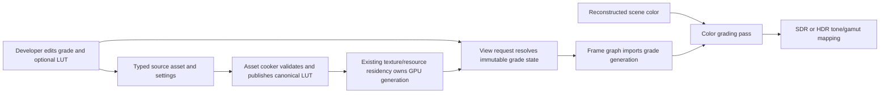
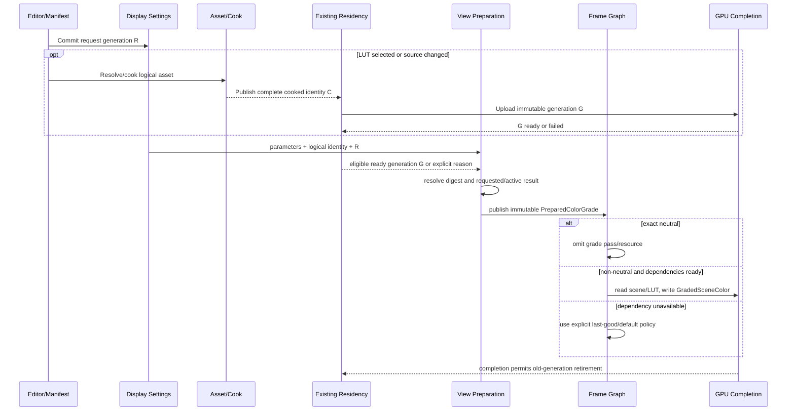

# Color Grading Execution Architecture

**Status:** proposed target architecture; blocked until `CGRD-00`, not implementation proof

**Responsibility:** define color-grading owners, data flow, source/cooked/runtime identity, View publication, frame-graph execution, failure, lifetime, capacity, packaging, and clean-break shape

**Authority boundary:** [Semantics](Semantics.md) owns math and data interpretation; [User Experience](UserExperience.md) owns author-visible behavior; [Plan](Plan.md) owns delivery order; RHI owns resource and command mechanics but not grade policy

**Current readiness:** **0/100 — target only**.

## Delivery Priority And First Usable Slice

The first usable slice is parameter-only grading with exact neutral omission, one View-resolved immutable state, a distinct raw pre-tone product, and an independent numeric oracle. Typed LUT ingestion follows only after the grade domain and pass edge are proved. This ordering exposes math and ownership errors without coupling them to parsing, cooking, upload, or sampling failures.

The feature is lower priority than preserving the existing display route. A failure to resolve a grade must leave a truthful prior/default/neutral result and must never corrupt tone mapping, output encoding, presentation, or unrelated views.

## Product And Architectural Claim

The target makes one bounded claim: a developer can request one global or per-view scene-referred grade; the existing owners resolve that request into an immutable parameter/LUT generation; the frame graph applies it once before target tone/gamut mapping; and every visible/captured result names the requested and active identities.

The architecture does not create a general color-management graph, runtime OCIO host, grade volume system, shot timeline, file watcher, or player-facing settings service. It does not move display-device policy into the grade owner.

## Current Route Versus Target Route

| Concern | Current source at `ca55e7d8` | Target delta | Preserved owner |
| --- | --- | --- | --- |
| display state | exposure/tone/output encoding only | add narrow grade request/result vocabulary | Renderer display settings and View preparation |
| graph products | reconstructed/debug, tone-mapped, encoded, published | add one distinct graded scene-color product only when non-neutral | Renderer frame graph |
| source/cook | no `.cube` semantic asset | add bounded source parser and canonical cooked generation | existing asset/cook infrastructure |
| runtime resource | no LUT generation | import immutable resident LUT via existing upload/retirement route | existing residency owner |
| editor | no grade workflow | extend existing rendering/display settings surface | ApplicationEditor |
| package | no grade dependency discovery | stage cooked LUT when the selected product references it | existing package dependency owner |
| RHI | texture/sampler/upload/command mechanics | no public color-grade policy | RHI remains mechanism-only |

Source presence after implementation will prove only that these paths exist. Acceptance still requires the package's numeric, lifecycle, backend, workflow, and package evidence.

## Current-To-Target Trace



The important boundary is the join between View selection and residency-owned LUT generation. The View owns which grade is requested and active; it does not own file parsing, uploads, or GPU retirement.

## Intended Source Shape

Names are candidates until Stage 0 audits existing vocabulary; they describe ownership, not a mandate to add one file per type.

```text
Renderer/Public/Settings
  ColorGradeParameters                 narrow serializable intent
  ColorGradeSelection                  optional logical LUT asset plus override provenance

Renderer/Private/View
  ResolveColorGrade(...)               settings/default/override resolution
  PreparedColorGrade                   immutable per-view frame value

Asset/Cook owner selected by discovery
  ColorGradeLutSource                  checked canonical parser result
  CookedColorGradeLutHeader            schema and content contract

Existing residency owner
  ResidentColorGradeLutGeneration      resource, descriptor, content and device generation

Renderer/Private/Passes/PostProcessing
  AddColorGradePass(...)               declared graph reads/write and omission
  ColorGrading.hlsl                    one accepted semantic transform

Capture/diagnostics
  ColorGradeResultSummary              bounded requested/resolved/active lineage
```

If existing owners already provide equivalent value/generation/result types, extend them rather than duplicate this vocabulary. Public types contain logical values and handles only—no file paths, parser tokens, RHI handles, fences, or editor callbacks.

## Owners

| Owner | Owns | Must not own |
| --- | --- | --- |
| public Renderer display types | narrow serializable parameters, LUT asset handle, requested-state vocabulary | parser internals, GPU handles, editor widgets |
| ApplicationEditor/settings surface | authoring, validation feedback, commit/reset, selected source identity | mutable render-thread or GPU truth |
| asset/cook owner | `.cube` subset parsing, canonical representation, content/provenance identity, transactional cooked publication | View selection or shader execution |
| existing residency owner | upload, active GPU resource generation, replacement, completion-safe retirement, memory accounting | color math or fallback policy |
| View preparation | global/default plus per-view resolution, immutable grade digest, requested/resolved/active/unavailable state | file IO or in-place LUT mutation |
| frame graph / grade pass | declared scene-color and LUT reads, graded-color write, exact stage order, pass omission | hidden global settings or output-device policy |
| shader program catalog/runtime | program membership, typed binding, pipeline/cache generation | authoring semantics |
| capture/diagnostics | stage/product identity and requested/active reason | a second grade state authority |

## State Model

```text
RequestedGradeState
  parameters
  optional source asset identity
  per-view override provenance

ResolvedGradeState
  accepted semantic revision
  sanitized parameters or explicit invalid result
  requested LUT source/cooked identity
  immutable grade digest

ActiveGradeState
  resolved digest
  optional resident LUT generation
  activation status and reason
```

States are values carried through existing settings and View publication. Do not add an observer registry, grade manager singleton, or mirrored mutable state. A new request may remain pending while the last explicit good generation stays active, but diagnostics must show requested and active digests separately.

## Contract Vocabulary

| Value | Required fields | Identity/lifetime rule |
| --- | --- | --- |
| `ColorGradeParameters` | slope, offset, power, saturation, semantic revision | pure value; exact neutral predicate is centralized |
| `ColorGradeRequestId` | monotonically comparable View-local request generation | changes for every committed intent; never reused after View destruction |
| `ColorGradeDigest` | canonical parameters, logical asset/content identity, semantic revision | stable across process runs; excludes pointers and presentation state |
| `CookedColorGradeLutIdentity` | logical asset, source hash, schema, semantic/layout revision, data hash | validates package/cook/runtime agreement |
| `ResidentColorGradeLutGeneration` | cooked identity, device generation, resource/descriptor, ready completion | immutable after publication and pinned through GPU completion |
| `PreparedColorGrade` | resolved parameters, optional pinned generation, requested/active status | one frame/View value; contains no source bytes or mutable GPU state |
| `ColorGradeResult` | requested, resolved, active identities; status/reason; stage/product identity | diagnostic truth derived from owners; not a writable authority |

Status vocabulary is closed for the first release: `Off`, `ParameterOnly`, `PendingDependency`, `Active`, `Unavailable`, and `Rejected`. Each non-active result carries a stable reason code plus bounded detail. The editor may render friendlier text but cannot invent another state machine.

## End-To-End Request And Frame Sequence



No callback from GPU/residency mutates an already published frame. A completion becomes eligible only during a later View preparation and only when its request/content/device identities still match.

## State And Lifetime

| Object | Created by | Published to | Invalidated by | Retired by |
| --- | --- | --- | --- | --- |
| authored settings value | editor/settings owner | settings persistence and View resolver | user commit/reset or settings schema clean break | owning settings lifetime |
| canonical source result | asset parser | cooker only | source content/parser semantic revision | cook task completion |
| cooked LUT generation | cooker transaction | asset registry/package/load path | content/schema/layout/tool revision | normal cooked-artifact replacement |
| resident LUT generation | residency after complete upload | eligible Views/frame imports | cooked identity or device-generation change | residency after last GPU completion |
| prepared grade | View preparation | one immutable frame graph | next frame, View destruction, request/default change | frame/View lifetime |
| graph resource/product | frame graph | later display passes/capture | frame completion or graph abort | graph/RHI completion owner |

Shutdown, View close, device loss, asset replacement, and package unload must be safe at every row. Source/cook tasks own their source bytes; runtime never holds editor/source-parser memory. Frame imports pin resources, not asset registry entries or UI objects.

## Invalidation Classification

| Change | Re-resolve View | Rebuild/upload LUT | Rebuild grade pipeline | Reset unrelated temporal history |
| --- | --- | --- | --- | --- |
| slope/offset/power/saturation | yes | no | no, unless program identity changes | no |
| LUT selection/content/domain/dimension | yes | yes for new cooked identity | no | no |
| semantic/layout/precision revision | yes | yes | possibly; exact owner records it | no unrelated history; grade product identity changes |
| View override/default precedence | affected Views only | no if generation reusable | no | no |
| output extent/subrect | republish constants/products | no | no | only histories whose own owner requires it |
| SDR/HDR output profile | no grade semantic change | no | no | no grade-driven reset |
| shader program generation | yes | no | yes | no unrelated history |
| device generation/loss | yes | re-upload | rebuild native pipeline/resource state | follow device-recovery owners |

Color-grade changes alter the displayed result but are not a reason to erase TAA/upscaler/exposure history unless the owner of that history explicitly classifies the dependency. The grade owner cannot reset histories by broad “post-process changed” policy.

## Asset And Publication Lifecycle

1. The source loader reads a bounded `.cube` file and parses the accepted grammar into checked floats and metadata.
2. The cooker writes one canonical little-endian representation with schema identity, dimension, domain, precision, sample count, source hash, and tool/compiler identity.
3. Transactional publication makes complete cooked bytes visible only after validation succeeds.
4. Runtime loading validates schema, size/count, finite data, content identity, and resource ceilings before scheduling upload.
5. Residency publishes a generation only after upload completion; a late old generation is discarded.
6. View preparation resolves the latest eligible generation into immutable frame state.
7. Frame-graph import pins that generation through GPU completion; replacement retirement follows the existing completion identity.

No compatibility reader or dual source/cooked representation is admitted. During alpha development, a schema change regenerates owned cooked artifacts and deletes the replaced reader/writer in the same change.

## Frame-Graph Contract

The grade consumes `ResolvedSceneColor` at `OutputExtent` and creates a distinct scene-referred graded resource. The accepted `CGRD-03` order determines the exposure join. Debug replacement must either bypass the grade for exact diagnostic products or declare a scene-referred grade policy from the Debug Views owner. Tone mapping consumes only the graded resource when the grade is active.

Pass omission is the neutral path. Fusion with tone mapping is not part of the first implementation because it would hide stage products and weaken defect localization. A later evidence-backed optimization may fuse execution only if semantics, raw capture points, selector truth, and acceptance remain independently observable.

## Resource And Binding Contract

The graph declares the source scene color and optional LUT generation as reads and a distinct graded scene-color product as the write. Input/output extent, active rectangle, viewport origin, format, alpha policy, semantic revision, and View identity are explicit. The pass may reuse/transient-alias memory only through existing graph rules; it may not read and write an undeclared in-place product.

Bindings are typed and generated through the existing shader/program path. An absent LUT is a compile/runtime branch selected by the accepted implementation shape or a parameter-only variant—not a null/garbage descriptor and not an identity texture whose existence becomes accidental correctness. Sampler filter/address state is fixed by the semantic contract and belongs to program/resource binding, not user settings.

## Secondary Artifact Contract

Raw evidence artifacts identify: candidate revision/build, backend/adapter/driver, View/camera/extent/subrect, frame or deterministic input identity, working-space/semantic revision, requested/resolved/active grade digests, LUT source/cooked/resident identities, stage/product/domain/format, capture tool/version, tolerance manifest, and check ID. Pre-grade and post-grade products use a lossless representation capable of retaining negative and HDR values; display screenshots are secondary review artifacts only.

Support summaries are bounded snapshots. They do not emit every-frame logs, duplicate full LUT data, or make captures a runtime dependency.

## Support Matrix

| Cell | Target behavior |
| --- | --- |
| D3D12 / Vulkan | one backend-neutral grade contract and identical shader semantics; native resource validation per backend |
| Editor viewport | global defaults plus per-view override, live commit, requested/active/error state |
| packaged Runtime | consume cooked grade/LUT state included by product scope; no source parser or editor dependency |
| no LUT | parameter-only grade or full pass omission at neutral defaults |
| invalid/missing LUT | visible unavailable/pending/failed request; retain explicit prior/default active state without claiming requested look |
| SDR / HDR | identical scene-referred graded product feeds different target output transforms |
| exact debug modes | follow Debug Views classification; never grade a signal whose contract requires exact values |

## Failure And Recovery

| Failure | Detection boundary | Safe result | Recovery |
| --- | --- | --- | --- |
| parse/cook validation | source/cook result | no cooked generation published | correct source and recook |
| missing/corrupt cooked asset | runtime load | requested state unavailable; prior/default state remains explicit | restore package/asset and retry load |
| upload/capacity failure | residency | no partial GPU generation; bounded prior/default state | free resources or select no LUT, then retry |
| stale completion | publication generation check | discard stale result | newest request continues |
| missing shader/pipeline/binding | graph materialization | fail the feature request visibly; do not label identity as active grade | repair cook/build/package and rebuild route |
| device loss | RHI/residency recovery | active GPU generation invalidated; request remains known | reload/re-upload under recovered device generation |

Recovery is transactional. A parse, cook, load, upload, binding, or graph failure cannot partially mutate the active generation. Retry creates a new request/work generation; it never revives a cancelled generation in place. If the explicit policy retains a last-good grade, the result reports both the failed requested identity and the retained active identity. Reset to neutral cancels eligibility of all older completions.

The fallback chain must be frozen by discovery. Candidate order is: requested generation when complete and valid; otherwise explicit last-good generation only for a still-valid View/session; otherwise parameter-only if the LUT dependency alone failed and product policy admits it; otherwise neutral. Each branch is visible and independently testable. Silent fallback to an unrelated default LUT is prohibited.

## Performance And Capacity

The cost model separates source parse/cook time, cooked bytes, CPU runtime validation, persistent LUT bytes, upload bytes/latency, descriptor/pipeline cost, GPU texture reads/ALU, extra output-resolution resource bandwidth, live-edit rebuild latency, and retirement high-water. `CGRD-12` freezes ceilings before implementation.

The first release uses one active LUT per View and one pass at output resolution. It does not add per-object grades, local volumes, a blend stack, per-frame LUT generation, background filesystem watching, or permanent diagnostics streams.

Stage 0 records numeric ceilings for source bytes, line/token count/length, dimension, canonical/cooked bytes, persistent GPU bytes per unique generation, concurrent pending uploads, descriptors, per-view references, retirement high-water, parse/cook/upload latency, live-edit convergence, pass time, and output-resource bandwidth. Deduplication may share an identical immutable LUT generation across Views, but capacity accounting and per-view selection remain explicit.

Exceeding a ceiling is a deterministic `Rejected` or `Unavailable` result before partial allocation/publication. Automatic quality/dimension reduction is not admitted because it changes the authored transform.

## Design Decisions And Rejected Shapes

| Decision | Selected target | Rejected shape and reason |
| --- | --- | --- |
| selection owner | existing settings resolved into immutable per-View state | global mutable grade singleton would couple Views and duplicate settings truth |
| LUT ownership | typed source/cook plus existing residency generation | editor-owned texture/upload would cross lifetime and package boundaries |
| neutral execution | omit pass/resource | identity LUT/pass adds hidden cost and weakens no-op evidence |
| stage structure | distinct scene-grade product for first release | immediate fusion with tone mapping obscures ordering, raw capture, and defect localization |
| source support | bounded accepted `.cube` 3D subset | runtime OCIO/full format matrix exceeds product claim and attack/evidence budget |
| updates | immutable request/content/device generations | in-place mutation permits torn/stale frames and ambiguous capture identity |
| failure | explicit requested/active result and transactional last-good/default policy | silent identity/default substitution lies about the selected look |
| backend | one Renderer semantic shader contract, RHI mechanism only | backend-specific grading policy creates divergent feature authorities |
| validation | independent CPU/parser oracle plus raw GPU products | self-comparison or final screenshot cannot expose shared semantic defects |

## Architecture Invariants

1. Scene-grade policy lives in Renderer; RHI exposes only general resource/command/presentation mechanisms.
2. One settings path and one View-prepared value are authoritative for selection.
3. Source, cooked, resident, requested, and active identities never collapse into a filename or pointer.
4. Only complete, valid, current generations publish; frames pin immutable generations through completion.
5. Neutral means exact omission; invalid/unavailable never masquerades as neutral success.
6. Grade executes at most once and before target tone/gamut/output encoding.
7. LUT domain/layout/sampling semantics match the independent CPU contract on both backends.
8. Alpha, View, extent, subrect, stage, and product identities survive the pass.
9. Grade changes do not reset unrelated histories by default.
10. Packaged runtime consumes cooked dependencies only; editor/parser/source paths are absent.
11. Bounded diagnostics derive from owners and never become another mutable state authority.
12. Every optimization preserves independently observable semantics, captures, selector truth, and acceptance checks.

## Support And Evidence Matrix

| Product / mode | Target reachability | Required evidence | Current state |
| --- | --- | --- | --- |
| DevelopmentEditor D3D12 | global/default and per-view parameters + LUT | first use, raw oracle comparison, lifecycle/failure, capture | absent |
| DevelopmentEditor Vulkan | same semantic contract and workflow | same plus backend comparison/native validation | absent |
| packaged Runtime D3D12 | cooked selected grade, no source parser/editor | package manifest, clean-machine load/use/failure | absent |
| packaged Runtime Vulkan | same if release matrix admits backend | package and backend evidence | absent |
| neutral/no LUT | exact graph omission or parameter-only branch | graph/resource trace and raw identity | absent |
| SDR/HDR output | same pre-tone graded product | matched raw stage identity under both output selections | HDR output itself blocked |
| exact debug products | bypass or explicit Debug Views-owned policy | product classification and sentinel capture | unresolved in discovery |
| player-facing controls, volumes, blending, runtime arbitrary files | excluded | reachability/absence audit | must remain absent |

## Evidence And Current Status

This page describes a target only. At committed revision `ca55e7d8`, there is no grade state, parser, cooked contract, resident LUT generation, pass, selector, workflow, package route, or conformance artifact in source. Therefore all matrix cells remain `absent`, no acceptance criterion has passed, and no backend/runtime/release claim is earned by this architecture text.

## Clean-Break Ledger

| Surface | Disposition |
| --- | --- |
| current tone mapping and output encoding | preserve as separate downstream owners; update input edge only |
| current display settings resolution | extend with one grade value path; do not create a second settings system |
| generic texture cooking/residency | extend only where its invariants fit; add a typed cooked grade-LUT contract when generic texture metadata cannot express semantics honestly |
| temporary parser/math/evidence harnesses | local-only and removed before submission unless the user separately authorizes submitted tests |
| identity LUT workaround | do not add; neutral state omits work |
| old or experimental grade names introduced during delivery | delete with all producers/consumers in the same stage |
