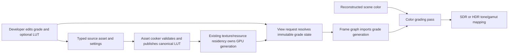

# Color Grading Execution Architecture

**Status:** proposed target architecture; blocked until `CGRD-00`, not implementation proof

**Responsibility:** define color-grading owners, data flow, source/cooked/runtime identity, View publication, frame-graph execution, failure, lifetime, capacity, packaging, and clean-break shape

**Authority boundary:** [Semantics](Semantics.md) owns math and data interpretation; [User Experience](UserExperience.md) owns author-visible behavior; [Plan](Plan.md) owns delivery order; RHI owns resource and command mechanics but not grade policy

**Current readiness:** **0/100 — target only**.

## Current-To-Target Trace



The important boundary is the join between View selection and residency-owned LUT generation. The View owns which grade is requested and active; it does not own file parsing, uploads, or GPU retirement.

## Owners

| Owner | Owns | Must not own |
| --- | --- | --- |
| public Renderer display types | narrow serializable parameters, LUT asset handle, requested-state vocabulary | parser internals, GPU handles, editor widgets |
| ApplicationEditor/settings surface | authoring, validation feedback, commit/reset, selected source identity | mutable render-thread or GPU truth |
| asset/cook owner | `.cube` subset parsing, canonical representation, content/provenance identity, transactional cooked publication | View selection or shader execution |
| existing residency owner | upload, active GPU resource generation, replacement, completion-safe retirement, memory accounting | color math or fallback policy |
| View preparation | global/default plus per-view resolution, immutable grade digest, requested/resolved/active/unavailable state | file IO or in-place LUT mutation |
| frame graph / grade pass | declared scene-color and LUT reads, graded-color write, exact stage order, pass omission | hidden global settings or output-device policy |
| shader program catalog/runtime | program membership, typed binding, pipeline/cache generation | authoring semantics |
| capture/diagnostics | stage/product identity and requested/active reason | a second grade state authority |

## State Model

```text
RequestedGradeState
  parameters
  optional source asset identity
  per-view override provenance

ResolvedGradeState
  accepted semantic revision
  sanitized parameters or explicit invalid result
  requested LUT source/cooked identity
  immutable grade digest

ActiveGradeState
  resolved digest
  optional resident LUT generation
  activation status and reason
```

States are values carried through existing settings and View publication. Do not add an observer registry, grade manager singleton, or mirrored mutable state. A new request may remain pending while the last explicit good generation stays active, but diagnostics must show requested and active digests separately.

## Asset And Publication Lifecycle

1. The source loader reads a bounded `.cube` file and parses the accepted grammar into checked floats and metadata.
2. The cooker writes one canonical little-endian representation with schema identity, dimension, domain, precision, sample count, source hash, and tool/compiler identity.
3. Transactional publication makes complete cooked bytes visible only after validation succeeds.
4. Runtime loading validates schema, size/count, finite data, content identity, and resource ceilings before scheduling upload.
5. Residency publishes a generation only after upload completion; a late old generation is discarded.
6. View preparation resolves the latest eligible generation into immutable frame state.
7. Frame-graph import pins that generation through GPU completion; replacement retirement follows the existing completion identity.

No compatibility reader or dual source/cooked representation is admitted. During alpha development, a schema change regenerates owned cooked artifacts and deletes the replaced reader/writer in the same change.

## Frame-Graph Contract

The grade consumes `ResolvedSceneColor` at `OutputExtent` and creates a distinct scene-referred graded resource. The accepted `CGRD-03` order determines the exposure join. Debug replacement must either bypass the grade for exact diagnostic products or declare a scene-referred grade policy from the Debug Views owner. Tone mapping consumes only the graded resource when the grade is active.

Pass omission is the neutral path. Fusion with tone mapping is not part of the first implementation because it would hide stage products and weaken defect localization. A later evidence-backed optimization may fuse execution only if semantics, raw capture points, selector truth, and acceptance remain independently observable.

## Support Matrix

| Cell | Target behavior |
| --- | --- |
| D3D12 / Vulkan | one backend-neutral grade contract and identical shader semantics; native resource validation per backend |
| Editor viewport | global defaults plus per-view override, live commit, requested/active/error state |
| packaged Runtime | consume cooked grade/LUT state included by product scope; no source parser or editor dependency |
| no LUT | parameter-only grade or full pass omission at neutral defaults |
| invalid/missing LUT | visible unavailable/pending/failed request; retain explicit prior/default active state without claiming requested look |
| SDR / HDR | identical scene-referred graded product feeds different target output transforms |
| exact debug modes | follow Debug Views classification; never grade a signal whose contract requires exact values |

## Failure And Recovery

| Failure | Detection boundary | Safe result | Recovery |
| --- | --- | --- | --- |
| parse/cook validation | source/cook result | no cooked generation published | correct source and recook |
| missing/corrupt cooked asset | runtime load | requested state unavailable; prior/default state remains explicit | restore package/asset and retry load |
| upload/capacity failure | residency | no partial GPU generation; bounded prior/default state | free resources or select no LUT, then retry |
| stale completion | publication generation check | discard stale result | newest request continues |
| missing shader/pipeline/binding | graph materialization | fail the feature request visibly; do not label identity as active grade | repair cook/build/package and rebuild route |
| device loss | RHI/residency recovery | active GPU generation invalidated; request remains known | reload/re-upload under recovered device generation |

## Performance And Capacity

The cost model separates source parse/cook time, cooked bytes, CPU runtime validation, persistent LUT bytes, upload bytes/latency, descriptor/pipeline cost, GPU texture reads/ALU, extra output-resolution resource bandwidth, live-edit rebuild latency, and retirement high-water. `CGRD-12` freezes ceilings before implementation.

The first release uses one active LUT per View and one pass at output resolution. It does not add per-object grades, local volumes, a blend stack, per-frame LUT generation, background filesystem watching, or permanent diagnostics streams.

## Clean-Break Ledger

| Surface | Disposition |
| --- | --- |
| current tone mapping and output encoding | preserve as separate downstream owners; update input edge only |
| current display settings resolution | extend with one grade value path; do not create a second settings system |
| generic texture cooking/residency | extend only where its invariants fit; add a typed cooked grade-LUT contract when generic texture metadata cannot express semantics honestly |
| temporary parser/math/evidence harnesses | local-only and removed before submission unless the user separately authorizes submitted tests |
| identity LUT workaround | do not add; neutral state omits work |
| old or experimental grade names introduced during delivery | delete with all producers/consumers in the same stage |

