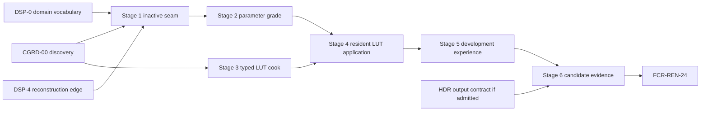

# Color Grading Delivery Plan

**Status:** conditional implementation plan; Stage 0 is permitted, production Stages 1-6 are blocked until `CGRD-00 PASS` and `DSP-5` prerequisites

**Responsibility:** order discovery, semantics, ownership, parametric grade, LUT workflow, editor/runtime integration, evidence, packaging, and closure for `FCR-REN-24`

**Authority boundary:** [Discovery](Discovery.md) authorizes the accepted design revision; [README](README.md) owns feature acceptance; [Display And Reconstruction](../../../../FirstRelease/DisplayAndReconstruction.md#dsp-5--color-grading) owns release-wide order; this plan owns only feature-local delivery

**Current readiness:** **0/100** — plan presence is not implementation or evidence.

## Outcome

Deliver one narrow, source-backed, scene-referred color-grade feature whose neutral path costs no pass, whose parametric and optional LUT results match an independent oracle, whose View/request/resource generations remain truthful through edits and failures, and whose exact cooked configuration reaches admitted packaged products. Completion is the `FCR-REN-24` verdict for one candidate, not the existence of a shader or editor panel.

## Gate And Dependency Graph



Stages 2 and 3 may proceed in separate changes after their shared accepted decisions exist, but Stage 4 cannot integrate either against an unfrozen semantic/cooked identity. Release ordering does not authorize a stage whose local prerequisites are missing.

## Planning Envelope

Effort is expressed as reviewable engineering slices, not calendar promises. These are initial engineering-hour ranges for one experienced owner/reviewer stream, including design review and the named stage checks but excluding queue time for unavailable machines. Stage 0 must re-estimate them from current owners and accepted scope.

| Stage | Initial effort range | Dominant uncertainty | Required capacity/budget freeze |
| --- | ---: | --- | --- |
| 0 | 30-50 h | working domain, `.cube` subset, oracle, ownership | research/review time; fixture and evidence workload |
| 1 | 20-35 h | fitting identity/state into existing public/View vocabulary | public-type growth; settings serialization; zero-work graph impact |
| 2 | 30-50 h | negative/HDR math and exact graph edge | shader variants, output resource bytes, pass time, capture bytes |
| 3 | 45-75 h | safe deterministic parser/cook/package dependency | source/token/dimension/cooked-byte limits; parse/cook time |
| 4 | 45-80 h | upload/publication/retirement and CPU/GPU sampling parity | persistent/upload/descriptor/retirement high-water; convergence |
| 5 | 25-45 h | truthful workflow across editor and manifest | edit rate, pending work, capture/support size, accessibility review |
| 6 | 50-90 h | paired backends, package, fault controls, performance | candidate matrix time, artifact storage, machine/adapter availability |
| **Total** | **245-425 h** | complete first-release closure | all admitted criteria, failures, backends, package, and evidence |

Each stage report replaces initial estimates with actual touched owners, expected files, resource equations, check duration/artifact size, and an escalation trigger. Cutting parser safety, raw products, paired-backend/package evidence, or failure cases is a scope decision rather than an estimate reduction. If a stage exceeds its envelope because an excluded framework or new subsystem becomes necessary, stop and return to discovery.

## Universal Execution Contract

Every stage starts from current status/revision/dirty state, maps its touched `AC-CGR-*`, `FM-CGR-*`, `RISK-CGR-*`, and `CHK-CGR-*`, and names the smallest claim-falsifying check. Extend existing settings, View, frame-graph, shader, asset/cook, residency, editor, capture, and package owners. Use one scene-grade semantic contract on D3D12 and Vulkan. Delete replaced names/paths in the same stage; add no compatibility reader, alternate settings authority, generic color framework, permanent test-only code, or silent fallback.

Every stage stops when an accepted discovery decision is missing or contradicted; working space/order is ambiguous; requested and active state cannot be distinguished; source/cooked/runtime identity forks; a stale/partial generation can publish; an excluded feature becomes reachable; or the selected check cannot detect its seeded defect.

## Cross-Stage Invariants

1. The accepted semantic revision and working-space identity travel with settings, cooked bytes, runtime state, captures, and evidence.
2. Source, cooked, resident, requested, resolved, active, View, frame, backend, and device generations remain distinguishable.
3. Only complete current generations publish; reset/cancel makes older completions permanently ineligible.
4. Neutral parameters plus no LUT omit grade work exactly.
5. Scene grade, target tone/gamut mapping, output encoding, debug policy, UI composition, and presentation stay separate authorities.
6. One Renderer semantic implementation serves D3D12 and Vulkan; RHI contains no grade policy.
7. Temporary probes and fixtures remain local-only unless the user separately authorizes submitted test additions.
8. No stage adds volume blending, masks, curves, multiple LUTs, OCIO runtime, arbitrary packaged file loading, or player-facing controls.
9. An earlier stage's evidence is invalidated whenever a later change alters its semantic, identity, ordering, representation, or owner assumptions.
10. Every handoff records current revision, dirty boundary, exact checks/results, unrun checks, limitations, and deletions.

## Stage Map

| Stage | Result | Prerequisites |
| --- | --- | --- |
| 0 | `CGRD-00` decision package | source/research access |
| 1 | narrow types, identity, and inactive vertical seam | Stage 0 `PASS`, `DSP-0/4` domain prerequisites |
| 2 | parameter-only scene-referred grade | Stage 1 |
| 3 | typed `.cube` source-to-cooked contract | accepted LUT semantics and asset-owner decision |
| 4 | residency join and LUT-applied grade | Stages 2-3 |
| 5 | editor, capture, two-view, and automation experience | Stage 4 |
| 6 | backend/package/performance evidence and FCR handoff | Stage 5 and release candidate identity |

## Stage Contract Matrix

| Stage | Required inputs | Primary owned output | Non-goals | Minimum falsifiers |
| --- | --- | --- | --- | --- |
| 0 | current source trace, pinned research, template contract | exact accepted dossier revisions and `CGRD-00` result | production code or readiness credit | `CHK-CGRD-01` through `10` and independent review |
| 1 | accepted semantics/owners/types and display prerequisites | serializable request/digest/result plus neutral graph seam | non-neutral pixels, parser, upload, UI redesign | neutral omission, round trip, two Views, invalid-state refusal, package/build membership |
| 2 | accepted parameter math and graph edge | one parameter-only graded product | LUT/source/cook, fusion, output-profile policy | CPU/GPU hand cases, defect mutations, alpha/stage/extent, backend shader/native checks |
| 3 | accepted grammar/layout/capacity/provenance | deterministic typed source-to-cooked artifact | runtime upload/render, extra formats, OCIO dependency | valid/malformed/hostile corpus, deterministic recook, dependency discovery, transaction failure |
| 4 | proved parameter pass and cooked artifact | immutable resident LUT generation applied by the one grade pass | editor polish, multiple/blended LUTs | known cells/interiors, stale completion, OOM/device failure, two Views, retirement high-water |
| 5 | stable runtime request/result contract | complete editor/manifest/capture/support workflow | player UI, file browser, color suite | first use, every state/action, rapid edit/cancel/reset, accessibility, automation parity |
| 6 | frozen candidate and predeclared manifests | exact acceptance evidence and clean closure | threshold tuning or feature expansion | all `CHK-CGR-*`, seeded faults, package/clean-machine, paired backend, cost, exclusion audit |

Every stage is independently reviewable. Its report must list production files changed, generated/build/package membership, old paths deleted, local-only probes created/removed, acceptance IDs advanced, and any downstream evidence invalidated.

## Stage 0 — Close Discovery

**Work:** execute `CGR-EXP-01` through `07`; disposition `CGRD-01` through `12`; freeze semantic, architecture, experience, budget, evidence, rights, and deletion revisions. Reconcile target wording when decisions change.

**Exit:** all `AC-CGRD-*` pass, no implementation-shaping unknown remains, and the accepted document revisions are named. Otherwise record `Blocked` with the exact owner and next experiment.

```text
Execute only Color Grading Stage 0. Do not change production code. Inspect current Renderer/display/settings/shader/asset/cook/residency/editor/capture/package owners; run the seven discovery experiments; freeze every CGRD decision, risk, fixture, tolerance, budget, and invalidation trigger. Update only the owning feature documents. Stop rather than choosing working space, negative math, LUT grammar/layout/interpolation, ownership, UX, or evidence thresholds by convenience.
NON-NEGOTIABLE: production remains untouched, every implementation-shaping unknown is closed/excluded/blocked explicitly, and the report names exact accepted revisions or records `Blocked`.
```

## Stage 1 — Establish Types, Identity, And The Inactive Seam

**Work:** add the narrow public/internal parameter, asset-handle, semantic revision, digest, and requested/resolved/active result types; extend settings persistence and View preparation; add target resource/stage vocabulary and shader registration/build membership without applying a non-identity grade. Prove neutral omission, serialization, two-view isolation, and invalid-state refusal.

**Exit:** neutral state adds no pass/resource; identical intent hashes identically; distinct view/asset/semantic generations do not alias; invalid requests never report active; no second settings or residency owner exists.

```text
Execute only Color Grading Stage 1 from the accepted CGRD-00 revisions. Extend existing display settings, View preparation, frame-graph resource vocabulary, shader catalog, and build membership with the smallest grade state/identity seam. Keep runtime output exactly neutral and omit work. Prove settings round trip, digest stability, two-view isolation, requested/resolved/active truth, invalid enum/value rejection, and clean package/build membership. Do not add parsing, LUT upload, non-neutral math, or a manager singleton.
NON-NEGOTIABLE: no pixel changes or GPU grade work, no second state/residency owner, and every invalid request remains distinguishable from active neutral.
```

## Stage 2 — Deliver The Parameter-Only Grade

**Work:** implement accepted SOP and saturation semantics in one shared HLSL owner plus independent CPU oracle; insert the distinct scene-referred pass at the accepted boundary; preserve alpha/product identity and exact debug policy. Exercise identities, edge values, order mutations, non-finite inputs, backend shader compilation, and output-resolution extents.

**Exit:** `AC-CGR-01/02/05` parameter portions and `FM-CGR-01/03` pass; seeded wrong order, weights, negative rule, channel, alpha, and double-application defects are detected; cost remains within the Stage-0 budget.

```text
Execute only Color Grading Stage 2. Implement the accepted CGR-MATH parameter transform once, after the accepted reconstruction/exposure boundary and before target tone mapping. Use typed binding and an independent double-precision oracle. Keep LUT absent. Exercise neutral omission, analytic colors/ramps/negative/HDR/non-finite values, alpha sentinel, wrong-order/weight/rule defects, debug classifications, output extents, D3D12/Vulkan shader paths, native validation, and pass cost. Stop on any semantic or stage ambiguity.
NON-NEGOTIABLE: one accepted semantic transform, one exact stage, independent defect-detecting values, no LUT/fusion, and unchanged unrelated histories/SDR behavior.
```

## Stage 3 — Add The Typed LUT Source And Cooked Contract

**Work:** extend the owning asset/cook route with the accepted bounded `.cube` subset, canonical representation, source hash, schema/semantic identity, transactional write, deterministic recook, errors, and package dependency discovery. Use parser/math probes locally; do not add submitted test files unless separately authorized.

**Exit:** valid fixtures produce deterministic bytes; malformed/hostile/unsupported cases fail before publication/allocation; dimension/domain/count/axis data are unambiguous; package planning sees the logical dependency; old schema paths do not survive.

```text
Execute only Color Grading Stage 3. Add the accepted .cube source parser and canonical cooked grade-LUT format at the existing asset/cook owner. Enforce checked counts and byte/dimension limits, finite/domain/directive rules, deterministic bytes, provenance, transactional publication, and clear errors. Exercise identity/asymmetric known-cell plus malformed/truncated/extra/non-finite/overflow/unsupported fixtures. Do not upload, render, embed OCIO, or accept extra formats.
NON-NEGOTIABLE: every token/count/allocation is bounded before publication, cooked identity is deterministic, runtime source loading is absent, and no unaccepted grammar/schema survives.
```

## Stage 4 — Join Residency And Apply The LUT

**Work:** load/validate the cooked contract, reuse the existing residency/upload/retirement path, bind the immutable LUT generation, and implement accepted domain/axis/texel/interpolation/composition semantics. Exercise stale completion, upload/capacity/device failure, repeated replacement, two views, and CPU/GPU known-cell parity.

**Exit:** `AC-CGR-03/04/06` runtime portions pass; no partial/stale generation activates; requested/active identities stay truthful; LUT application detects axis, half-texel, interpolation, domain, order, and stale-generation defects.

```text
Execute only Color Grading Stage 4. Reuse existing residency to publish a checked cooked LUT generation and bind it to the one grading pass. Implement the accepted LUT mapping/composition exactly. Exercise known asymmetric cells and interpolation points, boundary/out-of-domain values, missing/corrupt cooked data, upload/OOM/capacity/device loss, randomized replacement completion, two views, and delayed GPU retirement. Preserve the explicit last-good/default state and never claim the pending request active.
NON-NEGOTIABLE: only complete current immutable generations activate, CPU/GPU axis/domain/filter/order agree, failures are transactional, and retirement follows real completion identity.
```

## Stage 5 — Complete The Development Experience

**Work:** implement the [User Experience](UserExperience.md) through the current rendering settings/editor surface, source asset selection, state/error presentation, reset, live edit/cancel, capture metadata, and noninteractive manifest. No player-facing menu or file browser is admitted.

**Exit:** first use, all control states, keyboard/text access, rapid edit, failure/recovery, reset, two-view isolation, capture lineage, and editor/manifest equivalence pass; no console-only step or silent substitute remains.

```text
Execute only Color Grading Stage 5. Add the accepted DevelopmentEditor controls and automation fields over the existing settings and active-state owners. Show semantic domain, neutral values, LUT metadata/identity, requested versus active/pending/unavailable reason, and reset. Exercise first use, invalid source, recook/upload failure, rapid edits/cancel, two views, capture metadata, package-missing state, accessibility, and manifest equivalence. Do not create a color-suite, volume system, runtime player UI, or alternate state cache.
NON-NEGOTIABLE: visible/editor/automation truth derives from the same runtime owners, reset reaches exact omission, no silent substitute exists, and excluded controls/workflows remain unreachable.
```

## Stage 6 — Evidence, Package, And Close

**Work:** run all predeclared `CHK-CGR-*` against the exact candidate; compare D3D12/Vulkan raw stage products, SDR/HDR joins, package operation, memory/cost, clean machine, and excluded-surface audit. Remove local probes and superseded paths; audit CMake, generated shaders, assets, package allowlists, rights, docs, and dirty work. Submit `FCR-REN-24`.

**Exit:** all applicable `AC-CGR-01` through `08` pass conjunctively, every failure/risk has detecting evidence, all excluded surfaces remain absent, and the acceptance owner records the real verdict. Documentation, a successful build, or one attractive screenshot cannot close the feature.

```text
Execute only Color Grading Stage 6 for one frozen candidate. Run CHK-CGR-01 through 06 with seeded defect controls, raw pre/post-grade products, backend comparisons, two-view and replacement stress, package/clean-machine route, cost/memory, capture lineage, and excluded-feature audit. Remove temporary test-only code and reconcile source/header/shader/generated/CMake/asset/package/docs membership. File FCR-REN-24 with exact PASS/BLOCKED/EXCLUDED evidence and limitations; do not tune thresholds after candidate output.
NON-NEGOTIABLE: one immutable candidate/manifest/threshold set, all applicable criteria conjunctive, all temporary probes removed, and any missing/mismatched evidence produces `Blocked` rather than a partial score.
```

## Phase-To-Acceptance Traceability

| Acceptance claim | Earliest establishing stage | Closing stage/checks | Invalidated by |
| --- | --- | --- | --- |
| `AC-CGR-01` exact neutral/omission | 1; re-proved after math in 2/4 | 6: `CHK-CGR-01/02/04` | neutral predicate, pass topology, representation, or fallback change |
| `AC-CGR-02` parametric semantics | 2 | 6: `CHK-CGR-01/04` | working domain, order, range, luma, precision, shader/compiler change |
| `AC-CGR-03` typed LUT/correct sampling | 3 source/cook; 4 GPU application | 6: `CHK-CGR-03/04` | grammar/schema/layout/interpolation/format/sampler change |
| `AC-CGR-04` View state and isolation | 1 state; 4 resident generation; 5 workflow | 6: `CHK-CGR-04/05` | precedence/digest/publication/retirement/settings change |
| `AC-CGR-05` exact stage/domain | 2; re-proved with LUT in 4 | 6: `CHK-CGR-02/04` | graph ordering, debug/capture, reconstruction/exposure/tone join change |
| `AC-CGR-06` transactional failures | 1 refusal, 3 parser/cook, 4 runtime, 5 user recovery | 6: `CHK-CGR-03/05` | any failure/fallback/result-vocabulary change |
| `AC-CGR-07` backend/package/cost | incremental measurements 2-5 | 6: `CHK-CGR-04/05` | shader/RHI/package/capacity/candidate change |
| `AC-CGR-08` controls/exclusions | 0 contract; 5 reachability | 6: `CHK-CGR-06` | public/editor/manifest/source/package/docs surface change |

## Deletion And Preservation Ledger

| Surface | Preserve | Delete before stage handoff |
| --- | --- | --- |
| tone mapping/output encoding/debug/capture owners | their separate contracts and current behavior unless explicitly updated by owner | temporary grade aliases or duplicated transform branches |
| settings/View route | existing default/override and immutable frame preparation patterns | experimental grade singleton, shadow config, observer registry |
| asset/cook/package | existing dependency, transaction, and generated-artifact mechanisms | prototype direct filesystem/runtime loader, old schema reader/writer, copied source artifact |
| residency/RHI | existing upload, generation, completion, and retirement mechanisms | grade-specific RHI policy or editor-owned resource handles |
| shader/program catalog | typed registration/generation path | ad hoc string binding, unchecked null/identity descriptor workaround |
| evidence | final candidate manifests/artifacts owned by acceptance | local probes, temporary fixtures/classes/executables, stale candidate output |
| repository | unrelated user-owned dirty work | only superseded paths introduced or explicitly replaced by this feature |

## Stop And Escalation Rules

Stop the current stage and record `Blocked` when:

- a required `CGRD-*` disposition, owner, semantic constant, capacity, tolerance, or fallback rule is missing;
- current source contradicts the accepted owner/edge and resolving it would broaden the stage;
- another View, temporal history, output profile, or presentation owner must change beyond the accepted contract;
- a source/cooked/runtime identity cannot be made stable without a new compatibility or global-cache system;
- input can cause unchecked work/allocation, unbounded diagnostics, partial publication, or path escape;
- the independent oracle shares production parsing/layout/math or a seeded defect is not detected;
- one backend/package requires different color semantics rather than a mechanism adapter;
- a clean-break deletion would touch external/user-owned data whose version/scope has not been classified;
- concurrent changes overlap an owned path and cannot be reconciled without changing intent;
- the smallest relevant check is unavailable and the unresolved claim is necessary for the stage exit.

Escalation returns to the narrowest owner: Discovery for policy, Semantics for math/data interpretation, Execution Architecture for ownership/lifetime, User Experience for observable behavior, release planning for product scope, or Acceptance for evidence disposition. Do not solve the ambiguity inside code or by weakening a check.

## Completion Rule

This plan completes only when `FCR-REN-24` is decided against one immutable candidate and evidence set. A parameter-only pass is not LUT completion; a valid LUT parser is not runtime activation; a visually pleasing image is not colorimetric proof; and an identity fallback is never the requested grade.
