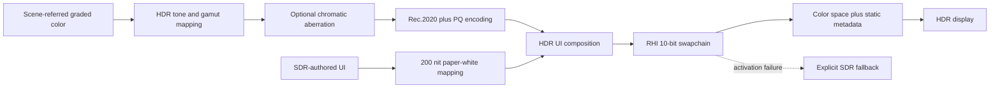

# HDR Display Output

**Status:** first-release target dossier plus verified current absence; not implementation proof

**Verified baseline:** 2026-09-08 at committed revision `ffe60e3a`; implementation source is unchanged from audited baseline `8414b5dc`

**Scope:** `REN-POST-09`; Windows HDR10 presentation through D3D12 and Vulkan

**Release admission:** mandatory `FCR-REN-26`; staged by [`DSP-7`](../../../../../../../Plans/FirstRelease/Renderer/DisplayAndReconstruction.md#dsp-7--hdr10-display-output)

**Current readiness:** **0/100**, `Blocked` — no HDR swapchain format/color-space negotiation, PQ output transform, static metadata, display capability policy, or candidate evidence was found. See [Current Feature Readiness](../../../../../../../Acceptance/CurrentReadiness.md#renderer).

## At A Glance

| Question | First-release answer |
|---|---|
| What ships? | One Windows HDR10 path: Rec.2020 primaries, D65 white, ST 2084/PQ transfer, 10-bit output, and static HDR metadata. |
| What remains mandatory? | The existing SDR path and truthful automatic fallback when HDR is unavailable or activation fails. |
| Who owns the image transform? | Renderer owns scene-referred grading/tone mapping, the HDR output-device transform, and SDR-to-HDR UI composition. |
| Who owns display activation? | RHI owns adapter/output capability discovery, swapchain format and color-space activation, metadata submission, present, and requested/active/fallback reporting. |
| What is deliberately excluded? | scRGB, HLG, Dolby Vision, dynamic metadata, automatic display calibration, multiple mastering profiles, and HDR editor/offscreen output unless separately admitted. |

## First-Release Contract

The HDR path consumes the same scene-referred image as SDR but uses a distinct output-device transform. The fixed first-release mastering target is **1000 nit peak**, with SDR-authored UI mapped to **200 nit paper white**. These values are explicit product policy, not inferred from swapchain format or monitor marketing data.

Requested, supported, active, and fallback state are different facts. An HDR request may become active only after the RHI confirms the selected output, compatible swapchain format, matching HDR10 color space, and successful metadata/application calls. A Linear or 10-bit surface alone is never evidence of HDR output.

## Ownership And Lifetime

| Owner | Responsibility | Must not own |
|---|---|---|
| Renderer display pipeline | mastering target, scene-to-display transform, gamut mapping, PQ encoding, UI paper-white mapping, diagnostic values | platform output enumeration or backend API calls |
| RHI presentation owner | output capability, swapchain recreation, format/color-space pairing, metadata submission, present state | artistic grading, exposure, or tone policy |
| View/runtime settings | user request and observable requested/active/fallback state | fabricated active state before backend confirmation |
| Acceptance evidence | monitor/backend matrix, measurement/capture interpretation, transition and fallback results | replacing executable proof with documentation |

## Reference Implementations

- [Unreal Engine HDR Display Output](https://dev.epicgames.com/documentation/en-us/unreal-engine/high-dynamic-range-display-output-in-unreal-engine) is precedent for separating scene-referred rendering, an output-device transform, display gamut/device selection, and HDR-aware UI. It is not local proof.
- [Microsoft D3D12 HDR sample](https://github.com/microsoft/DirectX-Graphics-Samples/tree/master/Samples/Desktop/D3D12HDR) is the native D3D12 oracle for format, color-space, capability, and metadata transitions.
- [Vulkan `VK_EXT_hdr_metadata`](https://registry.khronos.org/vulkan/specs/1.3-extensions/man/html/VK_EXT_hdr_metadata.html) is the Vulkan metadata contract. Metadata does not select or repair an incompatible swapchain color space.

## Acceptance Criteria

- `AC-HDR-01` — the product exposes separate HDR requested, supported, active, and fallback states, including the selected output, format, color space, peak target, and UI paper white.
- `AC-HDR-02` — active HDR10 uses a compatible 10-bit swapchain, Rec.2020/D65 colorimetry, ST 2084/PQ transfer, and matching static metadata on both admitted backends.
- `AC-HDR-03` — the Renderer applies one documented scene-referred-to-HDR output-device transform with bounded gamut and luminance behavior; no stage double-applies exposure, grading, tone mapping, or transfer encoding.
- `AC-HDR-04` — SDR-authored UI is composited at the 200-nit paper-white policy without becoming dim, clipped, or double encoded.
- `AC-HDR-05` — unsupported displays, remote sessions, backend failures, output changes, and HDR OS-state changes produce a truthful, visible SDR fallback rather than a black/washed-out image or false active claim.
- `AC-HDR-06` — resize, fullscreen/window transitions, monitor moves, suspend/resume, and device recovery re-evaluate and restore the complete format/color-space/metadata state.
- `AC-HDR-07` — D3D12 and Vulkan agree on the authored visual intent and requested/active/fallback semantics; backend-specific limitations are recorded rather than hidden.
- `AC-HDR-08` — a frozen release candidate has the required HDR/SDR monitor matrix, image/measurement evidence, transition results, and packaged-build proof attached to `FCR-REN-26`.

## Failure Modes

| ID | Failure | Required detection or recovery |
|---|---|---|
| `FM-HDR-01` | 10-bit or floating-point format is advertised as HDR without the matching color space and transform | reject active state; report the incomplete tuple |
| `FM-HDR-02` | color space or metadata application fails | preserve/recreate a valid SDR swapchain and surface the fallback reason |
| `FM-HDR-03` | PQ is applied twice, omitted, or applied to SDR UI | reference-ramp and UI-paper-white checks fail |
| `FM-HDR-04` | monitor/OS HDR state changes leave stale presentation state | transition test forces capability re-query and full state restoration |
| `FM-HDR-05` | one backend silently clamps, washes out, or diverges from the other | paired-backend image/measurement matrix blocks closure |
| `FM-HDR-06` | metadata values disagree with the fixed mastering policy | runtime diagnostic and captured API state block the report |

## Required Checks

- `CHK-HDR-01` — focused source/build audit proving one Renderer transform owner and one RHI presentation-state owner per backend.
- `CHK-HDR-02` — native API inspection proving the active swapchain format, HDR10 color space, static metadata, and requested/active/fallback state.
- `CHK-HDR-03` — deterministic PQ ramps, gamut wedges, peak/black patches, and 200-nit UI reference content on admitted HDR hardware.
- `CHK-HDR-04` — SDR fallback plus resize, monitor move, OS HDR toggle, fullscreen/window, suspend/resume, and device-recovery transitions.
- `CHK-HDR-05` — candidate-bound D3D12/Vulkan and SDR/HDR artifact matrix with limitations recorded in `FCR-REN-26`.

## Current Negative Boundary

At the verified baseline, `REN-E34` remains the source/build/selector/pass/shader/presentation audit proving this path is absent. Admission to the release plan changes the required destination, not the current implementation score: until the contract above is implemented and evidenced, HDR display output remains **0/100** and `Blocked`.
