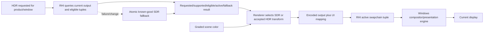

# HDR Display Output Execution Architecture

**Status:** proposed cross-boundary target architecture; blocked until `HDRD-00`, not implementation or backend-support proof

**Responsibility:** define Renderer color-policy ownership, RHI presentation capability/activation, output identity, swapchain lifecycle, transitions, fallback, UI/capture joins, and D3D12/Vulkan parity

**Authority boundary:** [Semantics](Semantics.md) owns pixels; Renderer owns target selection/transform; RHI owns native display/swapchain/color-space/metadata mechanics and returns facts; [User Experience](UserExperience.md) owns visible state; [Plan](Plan.md) owns delivery

**Current readiness:** **0/100 — target only**.

## Delivery Priority And First Usable Slice

The first slice is a neutral, backend-independent presentation facts/request/result contract that reports current SDR truth and an HDR request as unsupported/ineligible without creating HDR surfaces or changing pixels. The second and third slices prove native activation/fallback independently per backend. The Renderer HDR transform is proved offscreen/raw before it is allowed to join active presentation. Only then may one generation-qualified transaction publish HDR frames.

At every stage, the known SDR route and a bounded no-present transition are more important than HDR availability. No partial HDR state may make the window black, washed out, or plausibly wrong while reporting success.

## Product And Architectural Claim

The target architecture has one Renderer color-policy owner and one RHI presentation-facts/state owner. RHI publishes an immutable active presentation profile for a current window/output/swapchain/device generation. Renderer prepares the matching SDR, HDR10, or separately admitted scRGB signal and UI composition for that generation. Publication occurs only when both halves agree; failures transition to a known-good SDR profile or an explicit no-valid-presentation error.

This architecture does not make RHI a color pipeline, expose native APIs to Renderer, make Renderer poll DXGI/Vulkan, create a second Windows display service per backend, or treat metadata/captures as state authority.

## Current Route Versus Target Route

| Concern | Current source at `ca55e7d8` | Target delta | Preserved owner |
| --- | --- | --- | --- |
| presentation contract | format/current index/resize/present oriented; no output color facts/result | neutral profile request/capabilities/result with generations and reasons | RHI presentation service |
| Windows output facts | no shared Advanced Color/luminance/SDR-white generation | one platform-owned immutable query snapshot per window/output generation | selected existing window/RHI platform boundary |
| D3D12 swapchain | SDR format lifecycle only | exact admitted DXGI tuple, interface/interposer, set/reapply/fallback | D3D12 RHI swapchain owner |
| Vulkan swapchain | requested format + SRGB nonlinear only | exact enumerated HDR tuple/extensions/metadata disposition/fallback | Vulkan RHI swapchain owner |
| Renderer display | SDR tone/encode/publish only | separate profile-specific target/output transform chosen from RHI active result | Renderer display pipeline |
| UI | separate overlay/presentation interaction | admitted target-linear mapping/composition or explicit ineligible profile | Renderer UI plus host/interposer owners |
| settings/UX/capture/package | no HDR request/result/lineage/reachability | extend current owners over the same state and profile identity | existing settings/editor/capture/package routes |

Source presence after implementation is not support proof. Native tuple, semantic, transition, display, package, and fallback evidence remain conjunctive.

## Target Ownership Flow



Renderer never chooses a transform from requested state alone. RHI never chooses artistic tone/gamut/UI policy. The active result is the join.

## Intended Source Shape

Exact names and placement require Stage-0 source review; this sketch defines responsibility and forbidden coupling rather than file count.

```text
RHI/Public/Presentation
  RhiDisplayOutputProfile              neutral SDR/HDR10/(optional scRGB) identity
  RhiDisplayOutputRequest              desired profile + logical window generation
  RhiDisplayOutputCapabilities         immutable platform/backend facts snapshot
  RhiDisplayOutputResult               state, active tuple/profile/generations/reason

RHI/Private/Windows/Presentation
  WindowsDisplayOutputFacts            HWND/output association, Advanced Color,
                                       luminance/SDR-white validity and generation

RHI/Private/D3D12/SwapChain
  D3D12DisplayOutputAdapter             eligible tuple and lifecycle mechanics

RHI/Private/Vulkan/SwapChain
  VulkanDisplayOutputAdapter            extension/surface tuple and lifecycle mechanics

Renderer/Public-or-Private Display Settings/View
  DisplayOutputIntent                  product/user intent
  PreparedDisplayOutput                immutable active-profile-derived transform identity

Renderer/Private/Passes/Presentation + UI
  profile-specific target/output transform and composition

Diagnostics/Capture/Editor/Automation
  read-only adapters over result and prepared transform lineage
```

If current types can represent these values without ambiguity, extend them. Public neutral types contain no COM/Vulkan handles, API enums, window pointers, tone-curve parameters, shader resources, or editor callbacks.

## Public Neutral Contract

The RHI needs a backend-neutral presentation request/result, not DXGI/Vulkan types in Renderer:

```text
RhiDisplayOutputRequest
  desired output mode: SDR or admitted HDR target
  window/output identity

RhiDisplayOutputCapabilities
  current output identity and generation
  SDR/HDR/Advanced-Color state
  eligible neutral surface tuples
  luminance/colorimetry and SDR-white facts with validity
  backend extension/interface availability

RhiDisplayOutputResult
  requested, supported, eligible, activating, active, fallback, or error
  active neutral tuple and output generation
  reason and optional metadata disposition
```

Exact fields are frozen in `HDRD-03/07/08/10`. This contract belongs beside presentation services/capabilities and should reuse the current RHI capability/result style. It must not expose COM/Vulkan handles or make Renderer poll native state.

## Contract Vocabulary And Identity

| Value | Required fields | Identity/lifetime rule |
| --- | --- | --- |
| `DisplayOutputProfileId` | `SDR`, `HDR10_PQ_P2020_UINT10`, optional separately named `scRGB_FP16`, semantic revision | closed product vocabulary; no generic ambiguous `HDR` payload |
| `DisplayOutputRequestId` | logical window/product request generation and desired profile | changes on committed intent; request contains no asserted support |
| `WindowsOutputFactsGeneration` | stable output identity, association method, OS Advanced Color state, luminance/SDR-white facts+validity, query/event generation | immutable snapshot; never reused after display topology generation changes |
| `RhiSurfaceTuple` | neutral pixel format/color-space/range/alpha/present profile ID | backend-neutral meaning; native adapter retains exact API values privately |
| `SwapchainGeneration` | logical window, backend/device, extent/window mode, native recreation generation | changes on recreation/resize path as frozen |
| `MetadataDisposition` | policy, values/validity, omitted/submitted/call-failed/unknown-effect, tuple/output generation | auxiliary state; excluded from active-profile equality except if Stage 0 makes call success required |
| `RhiDisplayOutputResult` | request, supported/eligible/activating/active/fallback/error, active profile/tuple, facts/swapchain/device generations, stable reason | only RHI presentation owner publishes; atomic immutable value |
| `PreparedDisplayOutput` | matching RHI result identity, Renderer semantic/target/UI policy and shader/resource generation | immutable per View/frame; enables exactly one signal chain |
| `PublishedDisplayFrameIdentity` | prepared transform + active tuple + source View/frame + present result | evidence/capture truth; never reconstructed from UI checkbox |

Reasons are closed, stable categories with bounded detail: OS/display/profile unsupported, window/profile ineligible, required interface/extension/tuple missing, output association/query invalid, recreation/set/present/metadata policy failure, stale/mixed generation, device loss, fallback failed, and internal contract violation. Backends map native errors into this common vocabulary while retaining native codes in bounded diagnostics.

## Renderer Responsibilities

- resolve global/product/View request into one target output intent;
- choose SDR or accepted HDR image transform from the current active RHI result;
- apply target luminance/gamut and Rec.2020/PQ semantics once;
- map self-composited SDR UI using the accepted current/fallback white;
- expose transform identity, peak/white policy, raw stage products, and invalid counters;
- preserve exact debug-view classification and capture labels;
- produce no PQ image when RHI has fallen back to an SDR tuple.

## RHI Responsibilities

- identify the current window-associated output and invalidate stale descriptions;
- query neutral capability/color/luminance/white facts and required interfaces/extensions;
- select/create/recreate a compatible format plus color-space tuple;
- apply color-space state after creation/resize and metadata only under accepted policy;
- atomically publish active/fallback result with output/swapchain generation;
- retain or recreate the known-good SDR tuple on unsupported state or failure;
- respond to display/OS/window/resize/fullscreen/suspend/device/interposer events;
- expose bounded diagnostics without importing tone, gamut, UI, or artistic policy.

## End-To-End Activation And Frame Transaction

```mermaid
sequenceDiagram
    participant Intent as Settings/Product
    participant Facts as Windows Output Facts
    participant RHI as RHI Presentation Owner
    participant Native as D3D12/Vulkan Swapchain
    participant Renderer as Renderer Display Pipeline
    participant Present as OS/Display

    Intent->>RHI: request profile R for window generation W
    RHI->>Facts: query/validate current output generation O
    Facts-->>RHI: immutable capabilities + luminance/white validity
    RHI->>RHI: select eligible profile/tuple T
    RHI->>Native: create/recreate T; set color space; metadata per policy
    Native-->>RHI: complete current swapchain generation S or failure
    RHI-->>Renderer: publish immutable active/fallback result G=(R,O,S,T)
    Renderer->>Renderer: prepare matching transform/UI generation X
    Renderer->>Native: submit frame tagged (G,X)
    alt generations/profile agree and present succeeds
        Native->>Present: present current encoded product
        Present-->>RHI: completion/current result
    else state changes or mismatch/failure
        RHI->>RHI: invalidate G; enter revalidation/fallback transaction
        RHI-->>Renderer: publish activating/fallback/error result G2
    end
```

An active RHI result makes an HDR transform eligible; it does not retroactively relabel frames prepared for another generation. Renderer refuses a mismatched submission. RHI refuses or invalidates presentation whose recorded profile/tuple/output generation is no longer current. The exact handshake should reuse existing frame/presentation synchronization rather than add a cross-module callback graph.

## State And Lifetime

| Object | Created/published by | Invalidated by | Retired by |
| --- | --- | --- | --- |
| display output intent | settings/product owner | user/product change, window destruction, clean-break schema | settings/window lifetime |
| Windows output facts snapshot | shared Windows presentation/platform owner | display/topology/OS HDR/SDR-white/window association event, query failure, suspend/resume | replacement generation after readers release |
| backend capabilities/eligible tuple set | RHI adapter from facts + API/interface/extension queries | output/surface/backend/device/interposer/extension generation | RHI owner |
| native swapchain/profile generation | backend swapchain owner after complete create/set policy | resize/window-mode/output/profile/device/present failure as frozen | existing GPU/present completion owner |
| presentation result | RHI presentation owner | any request/facts/tuple/swapchain/device/metadata-required state change | atomic value replacement |
| prepared Renderer transform | Renderer View/frame preparation | presentation result, scene/target/UI policy, shader/resource generation | frame/View completion |
| published frame | Renderer + RHI transaction | present completion/failure or generation invalidation | existing frame/present completion owner |
| support/capture artifact | diagnostics/capture from immutable values | new candidate/run; never mutates old artifact | bounded artifact retention policy |

No backend callback may retain Renderer/View/UI objects. Renderer retains neutral result identities/values, not native handles. Facts and results are copied immutable snapshots whose size/copy frequency is bounded by Stage 0; large native enumeration arrays remain private.

## Invalidation Classification

| Event | Output facts | Eligible tuple | Swapchain/profile | Renderer transform/UI | Active publication |
| --- | --- | --- | --- | --- | --- |
| HDR/SDR request change | reuse if current | re-evaluate requested profile | recreate/set as required | rebuild from later result | activating then active/fallback |
| window monitor move/straddle decision | invalidate/re-query | invalidate | recreate/revalidate | rebuild if profile/facts change | clear stale active immediately |
| OS Advanced Color/HDR toggle | invalidate | invalidate | recreate/reapply | rebuild from result | revalidate/fallback |
| SDR-white change | invalidate white field generation | tuple may remain | no unless policy says | rebuild UI mapping | active result carries new facts generation |
| resize/minimize/restore | retain/revalidate per policy | retain if still eligible | resize/recreate; no present at zero | new extent/frame | new swapchain/frame generation |
| fullscreen/window mode | re-associate/re-query as required | re-evaluate | recreate/reapply | new profile result | revalidate/fallback |
| display hotplug/topology/suspend | invalidate all facts | invalidate | retire/rebuild | withhold HDR until current result | fallback/no-frame until safe |
| backend/interposer/device generation | re-query where needed | invalidate mechanism support | rebuild | rebuild program/profile binding | no stale active |
| tone/gamut/UI semantic change | facts unchanged | tuple unchanged | unchanged | new semantic generation | old frames remain old; new frames carry new X |
| metadata-value/policy change | facts unchanged | tuple unchanged unless required policy changes eligibility | apply per policy/generation | pixels change only if target policy separately changed | record separate disposition |

Queries are event-driven and generation-qualified. A timer may be a bounded safety revalidation if Stage 0 justifies it, but per-frame native enumeration or log polling is not the owner model.

## Frozen Renderer And Presentation Inputs

Each prepared HDR frame freezes: scene/grade product identity and domain; View/camera/frame/extent; display-output request/result/profile; output-facts and swapchain/device generations; target peak/black/FALL/diffuse policy and source validity; SDR-white policy/value/validity; semantic/matrix/tone/PQ/packing/dither/UI revisions; shader/resource generation; and stage/capture identity. RHI freezes the selected neutral tuple, exact native tuple privately, window/output association, present mode/extent, metadata disposition, and transition generation.

If any required identity changes before submission/publication, the frame is discarded or routed through the explicit coherent fallback/no-frame policy. It is never patched in place.

## D3D12 Target Route

The candidate route associates the HWND with the current `IDXGIOutput6`, queries Advanced Color/color/luminance facts, creates the accepted flip-model surface format, checks and sets the exact DXGI color space, optionally applies metadata under `HDRD-09`, and re-applies/revalidates state after resize/recreation. The existing native/interposer swapchain interface resolution must yield the interfaces required for the accepted calls or report the cell ineligible.

All native calls return checked typed results. A format-created swapchain is not active until color-space selection and active-result publication succeed for the current output generation.

The D3D12 adapter must retain exact results for output association, `IDXGIOutput6` facts validity, swapchain interface availability through the native/interposer path, `CheckColorSpaceSupport`, chosen format/create/resize, `SetColorSpace1`, optional `SetHDRMetaData`, present, and fallback recreation. A successful query on an earlier output or swapchain generation is stale, not cached support.

## Vulkan Target Route

The candidate route enables and verifies required WSI extensions, enumerates `VkSurfaceFormatKHR` pairs, selects the accepted packed format plus `VK_COLOR_SPACE_HDR10_ST2084_EXT`, creates/recreates the swapchain with that pair, and optionally calls `vkSetHdrMetadataEXT` only when available and accepted. The exact Win32 output/color/luminance/SDR-white query may be platform-owned and shared with D3D12, while Vulkan still owns its extension/surface/present facts.

Failure to enumerate the tuple or extension is an explicit unsupported/fallback result. It cannot silently select `VK_COLOR_SPACE_SRGB_NONLINEAR_KHR` while Renderer keeps PQ active.

The Vulkan adapter retains enabled instance/device extension generations, enumerated surface formats/color spaces, surface capabilities, selected tuple, swapchain generation, optional function/metadata disposition, present results, and the shared Windows output-facts generation. The Windows display reports color/luminance facts; Vulkan WSI reports surface tuple eligibility. Neither alone is sufficient.

## Backend And Profile Contract Matrix

| Profile | D3D12 mechanism | Vulkan mechanism | Active invariant |
| --- | --- | --- | --- |
| existing SDR | existing accepted 8-bit format + SDR color space | accepted format + `VK_COLOR_SPACE_SRGB_NONLINEAR_KHR` | existing Renderer SDR encoding and current SDR tuple agree |
| HDR10 UINT10/PQ | accepted packed format + `DXGI_COLOR_SPACE_RGB_FULL_G2084_NONE_P2020` after support check/set | accepted packed format paired with `VK_COLOR_SPACE_HDR10_ST2084_EXT` and required extensions | Renderer HDR10 Rec.2020/PQ/packing generation and exact current tuple agree |
| optional FP16/scRGB | accepted FP16 format + exact scRGB DXGI color space/profile, only if admitted | no assumed equivalence; separate Vulkan tuple/profile must be proven or cell excluded | Renderer scRGB semantic generation and exact current tuple agree |

No adapter maps an unavailable profile to a “closest” color space while preserving the requested/active label. Profile-specific limitations are first-class `Unsupported` or `Ineligible` cells.

## State Machine

```text
SDR Active
  -> HDR Requested
  -> Capability Known / Ineligible
  -> HDR Recreate Pending
  -> HDR Active
  -> Revalidation Pending
  -> HDR Active or SDR Fallback
```

Every state carries request, output, swapchain, backend/device, and settings generation. New display/window/device events invalidate the affected generation. Frames use one immutable active tuple; no frame may combine an old PQ transform with a new SDR swapchain.

## Transaction And Rollback Protocol

1. Capture current request/window/output/device generation and known-good active result.
2. Re-query or validate immutable output facts; reject stale association.
3. Compute eligible profile tuples without mutating current presentation.
4. Enter `Activating/Revalidating` and make the currently displayed result explicit.
5. Create/recreate candidate native state and apply required color-space/metadata policy off the active publication path where mechanisms allow.
6. Validate the complete tuple and generations; only then publish the RHI result.
7. Renderer prepares matching transform/UI state; first HDR publication requires the joined generation.
8. On any failure, retire partial candidate state, restore/retain the known-good SDR tuple if possible, publish `Fallback SDR` with reason, and bound retries.
9. If SDR restoration also fails, publish `Error/no valid presentation`, stop automatic recreation storm, and retain a manual/event-driven retry action.

Rollback never reuses a surface whose required color-space state is unknown. A last-known HDR tuple is not a safe fallback after output/OS/device invalidation. Stage 0 freezes whether transition frames continue using the old coherent profile or withhold presentation; mixing profiles is prohibited.

## Transition And Failure Matrix

| Event/failure | Required result |
| --- | --- |
| unsupported SDR display or OS HDR off | remain/return SDR, requested HDR visible with reason |
| window moves or straddles displays | re-associate by accepted Windows policy, invalidate output facts, re-evaluate tuple |
| resize/fullscreen/windowed change | drain/retire as current owner requires, recreate, reapply color space/metadata, publish new generation |
| color-space support/set fails | discard HDR candidate and restore known-good SDR atomically |
| metadata call fails | follow `HDRD-09`; never misreport pixel/color-space state |
| invalid luminance/SDR-white query | use accepted bounded fallback with visible reason or reject HDR |
| minimize/zero extent | preserve normal no-present state without losing request; revalidate on restore |
| suspend/resume/display change | invalidate and re-query before HDR active publication |
| device loss/recovery | invalidate native tuple and rebuild from request after device/output facts return |
| interposer interface insufficient | explicit ineligible/fallback result; no bypass around interposer ownership |

## Failure And Recovery Contract

Every native operation returns a typed category, native code/context, affected request/output/swapchain/device generation, whether current presentation remains coherent, whether rollback was attempted/succeeded, and the next legal retry trigger. Partial candidate resources are never published and retire through existing completion/lifetime owners.

Fallback is a transaction, not a boolean. It selects the existing SDR Renderer transform and a known-good SDR native tuple for the same new generation. `Fallback SDR` means that join succeeded; if either half is missing, the state is `Error`, not a comforting fallback badge. Automatic retries are bounded by count/time/event policy and cannot oscillate HDR/SDR every frame.

Two windows or viewports, if admitted, maintain distinct window/output/swapchain results while sharing immutable platform facts safely. A move or failure in one window cannot change another window's transform/profile without its own generation event.

## UI, Debug, Capture, And Publication

UI composition occurs in the accepted linear target domain before final PQ encoding if Sparkle owns the composition. If host/backend overlay mechanics require another route, `HDRD-03/05/11` must define it without double conversion. Viewport products and screenshots are labeled by domain/encoding/output generation; a compositor screenshot is not raw PQ or display measurement.

Debug Views owns which products are scene-referred, target-linear, or exact. HDR output may map a display-intent diagnostic but must not PQ-transform an exact buffer value and call it exact.

## Secondary Artifact And Support Contract

| Artifact class | Required identity | Claim it can support | Claim it cannot support alone |
| --- | --- | --- | --- |
| scene/target-linear raw buffer | candidate, View/frame, product/domain/format, semantic/target/UI generation | upstream/target/gamut/UI numeric behavior | PQ packing, native activation, display luminance |
| PQ/scRGB encoded raw input | above plus profile/packing/dither | encoded signal values and backend raw agreement | current color-space tuple or display behavior |
| native state trace | request/output/swapchain/device generation, exact format/color-space, support/set/extension/metadata/present results | native tuple/state/fallback lifecycle | Renderer pixels or emitted luminance |
| compositor screenshot | OS/capture path, output/profile generation and limitations | user-visible compositor symptom/review | raw code values or physical panel measurement |
| external capture/measurement/photo | device/calibration/settings/environment/method/time uncertainty plus all candidate lineage | bounded external signal/display observation | universal display behavior or internal math by itself |
| bounded support snapshot | current request/result/reason/profile/facts validity/tuple/policies/last transition | diagnosis/reproduction routing | acceptance without retained raw/native/external artifacts |

Artifacts are written transactionally with manifests/hashes; partial sets list missing products and never report a complete evidence bundle. Diagnostics do not expose native handles or emit unbounded per-frame logs.

## Performance And Memory

Budgets cover output-transform GPU time, extra resources/barriers, 10-bit/FP16 bandwidth, UI mapping, swapchain recreation latency/black-frame count, transition stalls, capability queries, memory high-water, and backend present cost. Queries are event-driven and cached by output generation, not performed per pixel or logged per frame.

Stage 0 freezes numeric ceilings for public/result snapshot bytes and copy frequency; platform query count/latency; eligible-tuple enumeration; swapchain/back-buffer bytes and recreation high-water; HDR/scRGB shader variants; target/UI resources, barriers, and GPU time at 1080p/4K; encode/pack/dither work; transition duration and black/no-present frames; automatic retry count/rate; support/capture bytes/time; and evidence-matrix runtime/storage.

Exceeding a budget does not silently select another profile or lower the target peak. It produces an explicit blocked/ineligible/fallback result or returns to product discovery.

## Design Decisions And Rejected Shapes

| Decision | Target | Rejected shape and reason |
| --- | --- | --- |
| policy boundary | Renderer color/target/UI policy; RHI native facts/mechanics | Renderer DXGI/Vulkan calls or RHI tone curves create cross-module authority leaks |
| shared contract | neutral profile/request/capabilities/result values | two backend-specific HDR state stores make UX/Renderer truth incomparable |
| current state | immutable generation-qualified output/swapchain/profile result | boolean `SupportsHDR`/`HDRActive` cannot represent window/output/transition/fallback truth |
| profile identity | exact SDR, HDR10 UINT10/PQ, optional separate scRGB profiles | generic `HDR` label permits mismatched encoding/tuple |
| activation | complete tuple + current output + Renderer generation join | format, OS toggle, monitor badge, metadata, or request alone is insufficient |
| metadata | separate auxiliary disposition | using it as color-space/activation/tone authority contradicts platform contracts |
| failure | bounded transactional SDR restoration, then explicit error | stale HDR reuse, per-frame retry, or silent disable risks black/washed output |
| facts | shared Windows output snapshot plus backend WSI/API facts | duplicate D3D12/Vulkan Windows queries can disagree for one HWND |
| evidence | numeric + native + transition + external + package classes | screenshot/self-comparison cannot prove the full claim |

## Clean Break

Add one neutral RHI presentation contract and extend both backends; do not create Renderer-to-DXGI/Vulkan access, two HDR state stores, or backend-specific artistic transforms. Extend the existing presentation service, swapchain, settings, frame graph, UI, capture, and package owners. Update PixelFormat/back-buffer support only for admitted tuples. Delete experimental aliases and obsolete fixed-metadata assumptions when `HDRD-00` chooses the replacement.

## Architecture Invariants

1. Renderer owns image/color/target/UI policy; RHI owns neutral native presentation facts and mechanics.
2. Request, support, eligibility, activation, active profile, fallback, and error are distinct values.
3. HDR10, scRGB, and SDR have exact non-interchangeable profile and product identities.
4. Current output, facts, swapchain, device, Renderer semantic, and frame generations agree before active publication.
5. A format, OS toggle, metadata call, screenshot, or monitor badge never establishes active HDR alone.
6. Output/display/window/OS/device events clear stale active truth before re-query/recreation.
7. Partial native or Renderer generations never publish; failures restore coherent SDR transactionally or report explicit error.
8. Metadata is auxiliary and cannot change pixel interpretation implicitly.
9. SDR UI white/value validity and composition are part of the prepared transform, not UI-only mutable state.
10. Backend adapters expose limitations without changing Renderer color semantics.
11. Captures/support derive from immutable owners and preserve artifact-class boundaries.
12. Existing SDR behavior is re-proved through every stage and remains the mandatory safe route.
13. Excluded profiles/platforms/metadata/calibration/export/player surfaces remain absent.
14. All retries, queries, resources, logs, captures, and transition stalls are bounded.

## Support And Evidence Matrix

| Cell | Required architecture/evidence | Current state |
| --- | --- | --- |
| D3D12 HDR10 eligible display/window | complete DXGI/output/interposer tuple + matching Renderer HDR10 frame | absent |
| Vulkan HDR10 eligible display/window | required extensions/surface tuple/shared output facts + matching Renderer frame | absent |
| optional scRGB profile | separate semantics/native/UI/capture/package cells | blocked and not admitted by current contract |
| SDR/OS HDR off/unsupported/ineligible | unchanged known-good SDR tuple/transform and truthful reason | SDR exists; HDR result/fallback contract absent |
| monitor move/straddle/hotplug/OS toggle | event-driven facts invalidation, generation join, bounded revalidation/fallback | absent |
| resize/fullscreen/minimize/suspend/device/interposer | transaction/rollback/retirement/no-loop evidence | absent |
| DevelopmentEditor UI composition | admitted profile/alpha/interposer route and SDR-white mapping | unresolved/absent |
| packaged Runtime D3D12/Vulkan | exact config/dependencies/profile activation and clean-machine fallback | absent |
| raw/native/compositor/external evidence | class-specific manifests/oracles and limitations | absent |
| excluded HLG/Dolby/dynamic metadata/calibration/export/non-Windows/player controls | no selectors/types/shaders/native/package claims | must remain absent |

## Evidence And Current Status

At committed revision `ca55e7d8`, Sparkle has an SDR presentation path but none of the HDR profile types, output facts, generation-qualified result, native tuples, Renderer transform, UI-white mapping, transition transaction, capture lineage, package route, or hardware evidence described here. This page is target architecture only and earns no implementation, backend, hardware, visual, performance, package, or release claim.
