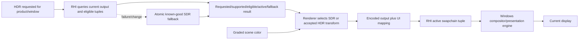

# HDR Display Output Execution Architecture

**Status:** proposed cross-boundary target architecture; blocked until `HDRD-00`, not implementation or backend-support proof

**Responsibility:** define Renderer color-policy ownership, RHI presentation capability/activation, output identity, swapchain lifecycle, transitions, fallback, UI/capture joins, and D3D12/Vulkan parity

**Authority boundary:** [Semantics](Semantics.md) owns pixels; Renderer owns target selection/transform; RHI owns native display/swapchain/color-space/metadata mechanics and returns facts; [User Experience](UserExperience.md) owns visible state; [Plan](Plan.md) owns delivery

**Current readiness:** **0/100 — target only**.

## Target Ownership Flow



Renderer never chooses a transform from requested state alone. RHI never chooses artistic tone/gamut/UI policy. The active result is the join.

## Public Neutral Contract

The RHI needs a backend-neutral presentation request/result, not DXGI/Vulkan types in Renderer:

```text
RhiDisplayOutputRequest
  desired output mode: SDR or admitted HDR target
  window/output identity

RhiDisplayOutputCapabilities
  current output identity and generation
  SDR/HDR/Advanced-Color state
  eligible neutral surface tuples
  luminance/colorimetry and SDR-white facts with validity
  backend extension/interface availability

RhiDisplayOutputResult
  requested, supported, eligible, activating, active, fallback, or error
  active neutral tuple and output generation
  reason and optional metadata disposition
```

Exact fields are frozen in `HDRD-03/07/08/10`. This contract belongs beside presentation services/capabilities and should reuse the current RHI capability/result style. It must not expose COM/Vulkan handles or make Renderer poll native state.

## Renderer Responsibilities

- resolve global/product/View request into one target output intent;
- choose SDR or accepted HDR image transform from the current active RHI result;
- apply target luminance/gamut and Rec.2020/PQ semantics once;
- map self-composited SDR UI using the accepted current/fallback white;
- expose transform identity, peak/white policy, raw stage products, and invalid counters;
- preserve exact debug-view classification and capture labels;
- produce no PQ image when RHI has fallen back to an SDR tuple.

## RHI Responsibilities

- identify the current window-associated output and invalidate stale descriptions;
- query neutral capability/color/luminance/white facts and required interfaces/extensions;
- select/create/recreate a compatible format plus color-space tuple;
- apply color-space state after creation/resize and metadata only under accepted policy;
- atomically publish active/fallback result with output/swapchain generation;
- retain or recreate the known-good SDR tuple on unsupported state or failure;
- respond to display/OS/window/resize/fullscreen/suspend/device/interposer events;
- expose bounded diagnostics without importing tone, gamut, UI, or artistic policy.

## D3D12 Target Route

The candidate route associates the HWND with the current `IDXGIOutput6`, queries Advanced Color/color/luminance facts, creates the accepted flip-model surface format, checks and sets the exact DXGI color space, optionally applies metadata under `HDRD-09`, and re-applies/revalidates state after resize/recreation. The existing native/interposer swapchain interface resolution must yield the interfaces required for the accepted calls or report the cell ineligible.

All native calls return checked typed results. A format-created swapchain is not active until color-space selection and active-result publication succeed for the current output generation.

## Vulkan Target Route

The candidate route enables and verifies required WSI extensions, enumerates `VkSurfaceFormatKHR` pairs, selects the accepted packed format plus `VK_COLOR_SPACE_HDR10_ST2084_EXT`, creates/recreates the swapchain with that pair, and optionally calls `vkSetHdrMetadataEXT` only when available and accepted. The exact Win32 output/color/luminance/SDR-white query may be platform-owned and shared with D3D12, while Vulkan still owns its extension/surface/present facts.

Failure to enumerate the tuple or extension is an explicit unsupported/fallback result. It cannot silently select `VK_COLOR_SPACE_SRGB_NONLINEAR_KHR` while Renderer keeps PQ active.

## State Machine

```text
SDR Active
  -> HDR Requested
  -> Capability Known / Ineligible
  -> HDR Recreate Pending
  -> HDR Active
  -> Revalidation Pending
  -> HDR Active or SDR Fallback
```

Every state carries request, output, swapchain, backend/device, and settings generation. New display/window/device events invalidate the affected generation. Frames use one immutable active tuple; no frame may combine an old PQ transform with a new SDR swapchain.

## Transition And Failure Matrix

| Event/failure | Required result |
| --- | --- |
| unsupported SDR display or OS HDR off | remain/return SDR, requested HDR visible with reason |
| window moves or straddles displays | re-associate by accepted Windows policy, invalidate output facts, re-evaluate tuple |
| resize/fullscreen/windowed change | drain/retire as current owner requires, recreate, reapply color space/metadata, publish new generation |
| color-space support/set fails | discard HDR candidate and restore known-good SDR atomically |
| metadata call fails | follow `HDRD-09`; never misreport pixel/color-space state |
| invalid luminance/SDR-white query | use accepted bounded fallback with visible reason or reject HDR |
| minimize/zero extent | preserve normal no-present state without losing request; revalidate on restore |
| suspend/resume/display change | invalidate and re-query before HDR active publication |
| device loss/recovery | invalidate native tuple and rebuild from request after device/output facts return |
| interposer interface insufficient | explicit ineligible/fallback result; no bypass around interposer ownership |

## UI, Debug, Capture, And Publication

UI composition occurs in the accepted linear target domain before final PQ encoding if Sparkle owns the composition. If host/backend overlay mechanics require another route, `HDRD-03/05/11` must define it without double conversion. Viewport products and screenshots are labeled by domain/encoding/output generation; a compositor screenshot is not raw PQ or display measurement.

Debug Views owns which products are scene-referred, target-linear, or exact. HDR output may map a display-intent diagnostic but must not PQ-transform an exact buffer value and call it exact.

## Performance And Memory

Budgets cover output-transform GPU time, extra resources/barriers, 10-bit/FP16 bandwidth, UI mapping, swapchain recreation latency/black-frame count, transition stalls, capability queries, memory high-water, and backend present cost. Queries are event-driven and cached by output generation, not performed per pixel or logged per frame.

## Clean Break

Add one neutral RHI presentation contract and extend both backends; do not create Renderer-to-DXGI/Vulkan access, two HDR state stores, or backend-specific artistic transforms. Extend the existing presentation service, swapchain, settings, frame graph, UI, capture, and package owners. Update PixelFormat/back-buffer support only for admitted tuples. Delete experimental aliases and obsolete fixed-metadata assumptions when `HDRD-00` chooses the replacement.

