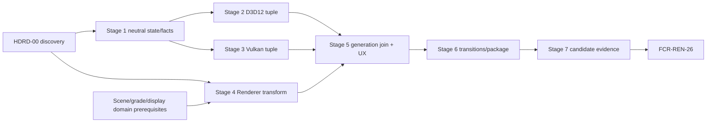

# HDR Display Output Delivery Plan

**Status:** conditional implementation plan; Stage 0 is permitted, Stages 1-7 are blocked until `HDRD-00 PASS` and `DSP-7` prerequisites

**Responsibility:** order discovery, neutral presentation contracts, D3D12/Vulkan activation, Renderer color transform, UX/transitions, evidence, packaging, and `FCR-REN-26` handoff

**Authority boundary:** [Discovery](Discovery.md) authorizes the accepted design; [Semantics](Semantics.md), [Execution Architecture](ExecutionArchitecture.md), and [User Experience](UserExperience.md) own target contracts; [README](README.md) owns feature acceptance; [Display And Reconstruction](../../../../FirstRelease/DisplayAndReconstruction.md#dsp-7--hdr10-display-output) owns release-wide order; Renderer/RHI module owners retain their boundaries

**Current readiness:** **0/100** — plan and source precedent are not implementation/evidence.

## Outcome

Deliver one Windows HDR display-output capability whose Renderer HDR10 signal/UI math matches an independent oracle, whose D3D12 and admitted Vulkan paths activate an exact current native tuple, whose transform and tuple generations commit together, and whose unsupported/fault/transition/package cells recover to a usable truthfully labeled SDR route. Completion is `FCR-REN-26` for one frozen candidate plus hardware/software matrix—not a PQ helper, 10-bit swapchain, metadata call, or bright monitor.

## Gate And Dependency Graph



Stages 2 and 3 can be reviewed independently after Stage 1. Stage 4 may prove raw Renderer semantics without active hardware, but it cannot be called HDR display output. Stage 5 admits only the backend/profile cells that have complete native and Renderer prerequisites; it may not force all cells active by common naming.

## Planning Envelope

The ranges are initial engineering hours for one experienced cross-module owner/reviewer stream, including stage-local design, implementation, and checks but excluding calendar queue time for unavailable displays, drivers, meters, or external reviewers. Stage 0 must re-estimate after the exact profile/hardware matrix is frozen.

| Stage | Initial effort range | Dominant uncertainty | Required budget/capacity freeze |
| --- | ---: | --- | --- |
| 0 | 60-100 h | product/profile fork, UI/interposer eligibility, hardware/evidence | probe machines/displays, standards review, fixture/artifact workload |
| 1 | 45-75 h | neutral public/RHI/platform owner fit and event generations | snapshot bytes/copy/query rate, state transitions/retry, SDR preservation |
| 2 | 55-95 h | DXGI output/interface/interposer/recreate/fallback lifecycle | swapchain high-water, transition/black time, native fault matrix |
| 3 | 60-105 h | Vulkan extension/surface tuple plus Windows output facts | enumeration/recreate/present cost and driver/display matrix |
| 4 | 55-95 h | scene units, tone/gamut/PQ/UI/packing precision | shader variants, target/UI resources/time, oracle/capture bytes |
| 5 | 50-85 h | mixed-generation prevention and truthful complete workflow | join latency, support/capture, UI composition/accessibility |
| 6 | 70-120 h | combinatorial transitions/backends/packages/failures | matrix runtime, retry/black bounds, resource leaks/high-water |
| 7 | 70-130 h | external measurement and exact candidate availability | hardware time, artifact storage, calibration/uncertainty/reviewer time |
| **Total** | **465-805 h** | complete first-release closure | all admitted profiles/backends/transitions/package and physical evidence |

Stage 0 replaces initial estimates with exact current owner/files, review slices, named hardware/software availability, resource equations, check durations/artifact sizes, and escalation triggers. Cutting SDR preservation, transition faults, paired-backend/native evidence, UI-white proof, or external evidence required by the claim is a scope decision, not an estimate reduction. If optional scRGB or a second UI composition route makes the matrix unaffordable, exclude or re-scope it before Stage 1.

## Universal Execution Contract

Every stage records current revision/dirty state, owner path, touched `AC-HDR-*`, `FM-HDR-*`, `RISK-HDR-*`, and `CHK-HDR-*`, and the cheapest defect-detecting check. Preserve the working SDR route continuously. Renderer owns color/target/UI policy; RHI owns output/native presentation facts. Requested state never implies active state. Metadata never substitutes for color-space/pixel/measurement proof. Use no Renderer native API calls, backend-specific artistic transforms, compatibility paths, second HDR state store, permanent test-only code, or silent fallback.

Stop when an accepted decision is missing/contradicted; active tuple is incomplete/stale; SDR cannot be restored atomically; a frame can combine HDR pixels with SDR presentation or the reverse; UI/capture domains are ambiguous; required hardware/native validation is unavailable; or the selected check cannot detect its seeded defect.

Every stage report records exact revision/dirty boundary; prerequisites; touched owners and public/private types; generated/CMake/package membership; semantic/state/profile changes; resources/performance; old paths deleted; local-only probes created/removed; checks/results; unavailable checks; limitations; and downstream evidence invalidated.

## Cross-Stage Invariants

1. Renderer owns scene/target/gamut/tone/PQ/scRGB/UI policy; RHI owns neutral Windows/backend/native facts and mechanics.
2. SDR, HDR10 UINT10/PQ, and optional scRGB have distinct profile/product identities and evidence cells.
3. Request, support, eligibility, activation, active, fallback, and error never collapse into a boolean.
4. Current output, facts, swapchain/device, Renderer transform, View/frame, and profile generations agree before publication.
5. Format, OS toggle, metadata, screenshot, monitor badge, or request alone never establishes active HDR.
6. Every partial/fault/transition path restores coherent SDR transactionally or reports explicit no-valid-presentation error within bounds.
7. Display/OS/window/device/interposer events clear stale active truth before re-query/recreation.
8. UI-white facts/validity and composition are generation-bound; metadata remains auxiliary.
9. D3D12/Vulkan adapters cannot choose different artistic/color semantics.
10. Raw numeric, native state, compositor, external measurement, package, and performance artifacts remain distinct.
11. Existing SDR behavior is re-proved at every production stage.
12. Temporary test-only additions remain local and are removed unless separately authorized by the user.
13. Excluded platform/profile/metadata/calibration/export/player surfaces remain unreachable.

## Stage Contract Matrix

| Stage | Required inputs | Owned output | Non-goals | Minimum falsifiers |
| --- | --- | --- | --- | --- |
| 0 | current source, pinned research, named probe hardware/software, product/release boundary | accepted seven-document package and `HDRD-00` result | production code/readiness claim | `CHK-HDRD-01` through `10`, semantic/native/transition/evidence dry runs, independent reviews |
| 1 | accepted neutral types/owners/events/reasons/budgets | SDR-preserving request/capabilities/result/facts generations on both backends | HDR format/color space, Renderer HDR pixels | source/boundary check, SDR raw/native preservation, query faults, stale generations, two windows if admitted |
| 2 | accepted D3D12 profile/tuple/interface/metadata/rollback | complete D3D12 eligible activation/fallback transaction | Renderer tone/PQ, Vulkan, new UI | support/set/recreate/output/interposer/metadata/present/device faults and SDR restore |
| 3 | accepted Vulkan extensions/surface/profile/metadata/rollback | complete Vulkan eligible activation/fallback transaction | Renderer tone/PQ, D3D12 redesign | missing extension/tuple/function, recreate/present/output/device faults, validation, SDR restore |
| 4 | accepted scene/target/UI/profile semantics and raw artifact contract | independent Renderer target/PQ/(scRGB if admitted)/UI products | native activation or display claim | hand cases, seeded transform/packing/UI defects, SDR preservation, paired raw shaders |
| 5 | eligible native cells + proved Renderer semantics + state/UX contract | generation-qualified publication and complete controls/status/debug/capture/automation | transition-matrix closure or universal support | mixed-generation faults, first use/states/fallback/UI/capture/require-active manifests |
| 6 | stable joined profile path | hardened event/failure/rollback/package route and measured budgets | threshold tuning/feature expansion | complete transitions/faults, black/retry/resource bounds, paired backend/package/clean machine |
| 7 | immutable candidate/hardware/manifests/thresholds | acceptance evidence, cleanup, and `FCR-REN-26` handoff | code fixes or post-output policy changes | all `CHK-HDR-*`, raw/native/external/package/perf/exclusion evidence and defect controls |

## Stage Map

| Stage | Result | Prerequisites |
| --- | --- | --- |
| 0 | `HDRD-00` accepted package | research and named probe hardware |
| 1 | neutral RHI request/capability/result and SDR-preserving state machine | Stage 0 |
| 2 | D3D12 eligible tuple activation and fallback | Stage 1 |
| 3 | Vulkan eligible tuple activation and fallback | Stage 1 |
| 4 | independent Renderer HDR target/PQ transform | Stages 1 and accepted semantics; may use offscreen/native-neutral fixture |
| 5 | joined active-result, UI, debug, capture, and settings experience | Stages 2-4 |
| 6 | transition/recovery/backend/package hardening | Stage 5 |
| 7 | candidate colorimetric/physical/performance evidence and FCR handoff | Stage 6, release candidate/hardware |

## Stage 0 — Close Discovery

Run `HDR-EXP-01` through `08`; disposition `HDRD-01` through `12`; freeze exact standards/platform versions, output routes, target/white/metadata policy, semantic constants, ownership, state machine, hardware matrix, budgets, evidence, rights, and document revisions. No production code.

**Exit:** all `AC-HDRD-*` pass; fixed 1000/200, UINT10/FP16, and metadata choices are explicit; no implementation prompt has to choose platform or color policy.

```text
Execute only HDR Display Output Stage 0. Do not change production code. Inspect current Renderer/RHI/window/swapchain/interposer/settings/UI/capture/package paths; run all HDR discovery probes on named Windows/display/backend cells; freeze scene and target color semantics, UINT10 versus FP16 eligibility, peak/black and SDR-white policy, metadata role, native contracts, state transitions, budgets, fixtures, tolerances, and evidence lineage. Reconcile owning docs and stop on any unresolved active/fallback or color-domain choice.
NON-NEGOTIABLE: production remains untouched, and every profile, color-policy, native-state, transition, UX, and evidence decision is accepted with named revisions or explicitly remains `Blocked`.
```

## Stage 1 — Add Neutral Presentation State Without HDR Activation

Extend RHI presentation types/services/capabilities with the accepted neutral request/capability/result/output-generation model; add platform output association and bounded query facts; extend Renderer/settings/UI consumers to display truthful SDR-active/requested-HDR-unavailable state. Do not add HDR format, transform, or native color-space calls yet.

**Exit:** the existing SDR route is byte/behavior preserved; stale output generations reject; requested/support/eligible/active/fallback states are distinct; both backends and interposer expose coherent neutral facts; failure queries retain usable SDR.

```text
Execute only HDR Stage 1 from accepted HDRD-00 revisions. Add one backend-neutral presentation request/capability/result and output-generation contract at RHI, with platform output/Advanced Color/SDR-white facts and typed failures. Surface it through existing settings/Renderer/UI without activating HDR. Exercise SDR preservation, invalid/stale output identities, query failure, display change, two windows if admitted, D3D12/Vulkan/interposer cells, and bounded diagnostics. Do not add PQ, 10-bit/FP16 formats, metadata, or alternate state stores.
NON-NEGOTIABLE: existing SDR pixels and behavior remain unchanged, HDR cannot activate, no PQ or second state store appears, and every published fact is generation-qualified.
```

## Stage 2 — Activate And Recover The D3D12 Tuple

Add the accepted PixelFormat/DXGI tuple, swapchain interface checks, output/color-space capability, create/recreate/set order, optional metadata policy, active-result publication, and atomic SDR fallback. Reconcile the interposer/native swapchain interface path.

**Exit:** D3D12 never reports active without the complete current tuple; unsupported/set/recreate/metadata/output-change faults yield the accepted result and usable SDR; resize/display changes reapply state; native diagnostics are clean.

```text
Execute only HDR Stage 2 in RHI D3D12 presentation owners. Implement the accepted packed-10 or FP16 tuple, current-output association, CheckColorSpaceSupport/SetColorSpace1 lifecycle, accepted metadata policy, generation publication, interposer interface contract, and atomic SDR fallback. Inject unsupported display, stale output, interface, create/resize, color-space, metadata, minimize/restore, monitor-change, and device failures. Inspect native state/validation. Do not add Renderer tone/PQ logic or call DXGI outside RHI.
NON-NEGOTIABLE: only the complete current DXGI tuple may publish active, every partial failure restores coherent SDR atomically, and Renderer owns no DXGI or native presentation policy.
```

## Stage 3 — Activate And Recover The Vulkan Tuple

Enable the accepted instance/device extensions, enumerate/select the exact surface format/color-space pair, implement create/recreate/present and optional metadata policy, publish neutral active state, and preserve SDR fallback.

**Exit:** Vulkan never substitutes sRGB for requested HDR while reporting active; extension/tuple/call/recreate/present faults produce explicit fallback; current output generation and Windows display facts remain coherent; validation is clean.

```text
Execute only HDR Stage 3 in RHI Vulkan and shared Windows presentation owners. Implement the accepted extension gates, HDR surface format/color-space tuple, swapchain lifecycle, optional vkSetHdrMetadataEXT policy, result generation, and SDR fallback. Exercise missing extension/tuple, query/create/recreate/metadata/present failure, resize/minimize, monitor/OS change, suspend/resume, and device recovery with Vulkan validation. Keep color policy out of RHI and never report HDR active on an SRGB_NONLINEAR tuple.
NON-NEGOTIABLE: the exact enumerated Vulkan tuple, required extensions, current output facts, and successful lifecycle must precede active publication; every failure restores SDR without semantic divergence from D3D12.
```

## Stage 4 — Implement The Renderer HDR Transform

Implement accepted scene-to-target/gamut/tone/Rec.2020/PQ semantics and SDR UI mapping through existing display, frame-graph, shader-runtime, and UI packet owners. Provide independent CPU reference products and explicit raw stage identities. The transform may execute only for an immutable active HDR result in joined runs.

**Exit:** `HDR-MATH-*` matches high-precision ramps/patches/matrices; wrong constants/scale/gamut/double transform/UI white/alpha defects are detected; SDR path remains unchanged; D3D12/Vulkan shader outputs agree before native presentation.

```text
Execute only HDR Stage 4 from accepted Semantics. Add one Renderer-owned HDR target/gamut/PQ output path and accepted SDR-UI white mapping through existing settings/View/frame graph/shader/UI/capture owners. Compare an independent high-precision oracle over ramps, wedges, peaks, black, diffuse/SDR white, alpha, invalid values, and seeded transform defects. Keep native display APIs in RHI and preserve current SDR tone/encoding exactly. Stop on unnamed scene units or output domain.
NON-NEGOTIABLE: an independent oracle detects every seeded semantic defect, existing SDR output remains unchanged, and this stage makes no claim about native display activation.
```

## Stage 5 — Join Active State And Complete The Experience

Make Renderer choose SDR/HDR transform from the current immutable RHI active result; implement [User Experience](UserExperience.md), debug classification, capture labels, support record, settings persistence, and automation. Ensure each frame's output transform and swapchain tuple share one generation.

**Exit:** first use and every state are truthful; no mixed-generation frame publishes; UI is readable at accepted white; captures cannot be mistaken across domains; automation returns failure when required HDR does not activate.

```text
Execute only HDR Stage 5. Join the accepted RHI active-result generation to Renderer transform selection, then implement the existing-settings UI, state/reason vocabulary, debug/capture classification, bounded support record, persistence, and automation. Exercise enable/disable, unsupported/ineligible, activation pending/failure, two output generations, UI white, exact debug modes, every capture boundary, and require-active manifests. Do not let request alone select PQ or duplicate native state in Renderer.
NON-NEGOTIABLE: Renderer selects HDR only from the matching current active generation, no frame mixes profile generations, and UI, capture, debug, and automation truth derive from the same owners.
```

## Stage 6 — Harden Transitions, Recovery, Backend Parity, And Package

Exercise and repair monitor move/straddle policy, OS HDR toggle, resize/fullscreen/windowed, minimize/restore, suspend/resume, hotplug/display change, device loss, interposer availability, backend switch/restart, package dependencies, and clean-machine first use. Measure transition latency/black frames, memory, and steady-state cost.

**Exit:** every transition reaches current HDR active or usable SDR fallback within frozen bounds; D3D12/Vulkan state semantics agree; no stale tuple, indefinite black output, leak, or package-only failure remains.

```text
Execute only HDR Stage 6 on the frozen transition/backend/package matrix. Inject every accepted output/OS/window/swapchain/metadata/device/interposer failure and transition, verify generation ordering and atomic SDR recovery, and measure black-frame/latency/memory/steady-state budgets. Run D3D12 and Vulkan native validation plus clean packaged first-use. Fix defects at their owner; do not hide a backend or transition with silent disable.
NON-NEGOTIABLE: every transition is bounded and generation-current, fallback is demonstrably coherent SDR, backend/package behavior stays semantically aligned, and no failure is hidden by silent disable.
```

## Stage 7 — Earn Candidate Evidence And Close

Run the complete `CHK-HDR-*` protocol for one immutable candidate: raw numeric products, native tuple/state, output queries, metadata consistency if used, external HDR display measurements/images under frozen interpretation, SDR/HDR displays, both backends, UI, transitions, package, performance, capture lineage, excluded routes, and seeded defects. Remove temporary probes and submit `FCR-REN-26`.

**Exit:** all `AC-HDR-01` through `08` pass conjunctively; every `FM-HDR-*`/risk has detecting evidence; SDR remains proven; external/display limitations are explicit; acceptance owner records the verdict.

```text
Execute only HDR Stage 7 for one frozen candidate and hardware/software matrix. Run all CHK-HDR checks with seeded color/native/state/fallback/capture defects; retain raw scene/target/PQ values, native tuple/query results, transition artifacts, external display measurements, UI patches, backend/package/performance evidence, hashes, and limitations. Remove temporary test-only code, reconcile source/header/shader/generated/CMake/settings/package/docs, and file FCR-REN-26. Metadata success, screenshots, responsive presentation, or one backend cannot substitute for the full oracle.
NON-NEGOTIABLE: candidate, hardware matrix, tools, and thresholds are frozen; every applicable criterion closes conjunctively; temporary probes are removed; and any missing or ambiguous evidence yields `Blocked`.
```

## Phase-To-Acceptance Traceability

| Claim | Establishing stages | Closing evidence | Invalidated by |
| --- | --- | --- | --- |
| `AC-HDR-01` complete state/facts/result truth | 1, native detail 2/3, UX 5 | Stage 7 `CHK-HDR-01/02/04/05` | public/result/reason/event/generation/profile change |
| `AC-HDR-02` exact current native HDR10 tuple + colorimetry/PQ | 2/3 native, 4 pixels, 5 join | `CHK-HDR-02/03/05` | format/color-space/output/profile/semantic/metadata-required policy change |
| `AC-HDR-03` target/gamut/tone exactly once | 4 | `CHK-HDR-01/03/05` | scene domain, target policy, matrix/tone/PQ/packing/shader change |
| `AC-HDR-04` SDR UI white/composition | 4 semantics, 5 joined workflow | `CHK-HDR-03/05` | query/validity/fallback/bounds/alpha/blend/profile/UI route change |
| `AC-HDR-05` unsupported/fault SDR fallback | 1 neutral; 2/3 native; 5 UX; 6 complete faults | `CHK-HDR-02/04/05` | transition/rollback/retry/output association/SDR path change |
| `AC-HDR-06` transition restoration | 1 event model; 2/3 lifecycle; 6 full matrix | `CHK-HDR-02/04/05` | window/display/OS/device/interposer/swapchain lifecycle change |
| `AC-HDR-07` backend semantic/state agreement | 2/3 + 4 + 5 | `CHK-HDR-01/02/03/05` | backend adapter, shader compiler, profile/matrix/limitation change |
| `AC-HDR-08` candidate hardware/package evidence | incremental artifacts 4-6 | Stage 7 full protocol | candidate/build/driver/OS/adapter/display/settings/package/threshold change |

## Deletion And Preservation Ledger

| Surface | Preserve | Delete before handoff |
| --- | --- | --- |
| SDR Renderer/presentation route | exact existing semantic/native/package behavior and fallback | temporary HDR-forced replacement or duplicated SDR path |
| RHI presentation service | one neutral request/capability/result authority | per-backend public HDR booleans, duplicate Windows facts/state stores |
| Windows/window/interposer | existing ownership and interface route | direct Renderer native queries or bypass around the admitted interposer |
| D3D12/Vulkan swapchains | native mechanism/lifetime/completion ownership | experimental tuple aliases, silent closest-format/color-space fallback |
| Renderer display/UI | one profile-selected transform/composition path | backend-specific artistic shaders, ambiguous generic HDR encoding |
| settings/UX/capture/package | existing owner routes and bounded adapters | developer-console-only activation, duplicate config/status/capture authority |
| metadata | only accepted separate disposition path | assumptions that metadata selects color space/tone or proves display |
| evidence | final candidate manifests/raw/native/external/package/perf report | local probes, temporary fixtures/classes/executables, stale candidate artifacts |
| repository | unrelated user-owned dirty work | only superseded paths introduced or explicitly replaced by this feature |

## Stop And Escalation Rules

Stop and record `Blocked` when:

- a required `HDRD-*` profile, semantic constant, output/UI policy, tuple, event, fallback, metadata, budget, tolerance, matrix cell, owner, or evidence rule is unresolved;
- Renderer/RHI/window/interposer ownership cannot be preserved without native policy leaking across the boundary;
- HDR10 and optional scRGB cannot be represented as separate exact profiles/artifacts;
- current output/facts/swapchain/device/Renderer generations cannot be joined atomically;
- a partial fault can publish mixed HDR pixels/SDR tuple or vice versa;
- known-good SDR cannot be restored within the frozen attempt/latency/black-frame/resource bounds;
- D3D12 or Vulkan needs a backend-specific artistic/color contract instead of a mechanism adapter;
- display/OS/window/device changes can leave stale active state or unbounded re-query/recreation;
- metadata, screenshot, monitor badge, or raw/native evidence class is being used to prove another class;
- the independent oracle shares production math or seeded PQ/matrix/UI/packing/state/fallback defects survive;
- required named hardware/native/external measurement evidence is unavailable for a stage whose exit needs it;
- package/clean-machine/UI/interposer profile differs from the admitted DevelopmentEditor route;
- concurrent user changes overlap an owned path and cannot be reconciled without changing intent.

Escalate product/profile decisions to Discovery/release ownership, color math to Semantics, boundary/state/lifetime to Execution Architecture, observable behavior to User Experience, backend mechanisms to their RHI owners, and evidence interpretation to Acceptance. Do not solve a missing decision by changing a shader literal, native fallback, UI label, or threshold after output.

## Completion Rule

The plan closes only when `FCR-REN-26` is accepted for one immutable candidate. A correct PQ shader without native activation is incomplete; a correct native tuple with the wrong Renderer transform is incomplete; metadata is never completion; and HDR failure without a usable truthful SDR fallback is a failed feature.
