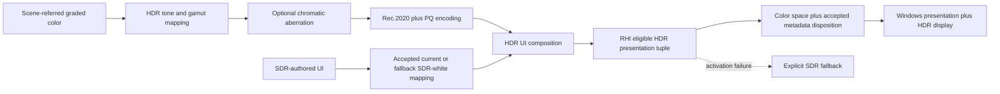

# HDR Display Output

**Status:** first-release target dossier plus verified current absence; `HDRD-00` and production implementation are `Blocked`

**Responsibility:** define the bounded Windows HDR output product, current absence, target feature set, ownership, acceptance, failures, checks, and definition of done for `FCR-REN-26`

**Authority boundary:** [Discovery](Discovery.md) freezes product/platform/color decisions; [Research](Research.md) owns precedent; [Semantics](Semantics.md) owns color/luminance math; [Execution Architecture](ExecutionArchitecture.md) owns Renderer/RHI state and lifetime; [User Experience](UserExperience.md) owns visible behavior; [Plan](Plan.md) owns delivery; code/build configuration owns implementation; `FCR-REN-26` owns candidate results

**Verified baseline:** 2026-09-10 at committed revision `ca55e7d8`; Renderer/RHI/window/swapchain/settings/UI/capture/package source inspected; no executable HDR hardware check was run; concurrent user-owned dirty paths were not treated as committed proof

**Scope:** `REN-POST-09`; Windows HDR10 presentation through D3D12 and Vulkan

**Release admission:** mandatory `FCR-REN-26`; staged by [`DSP-7`](../../../../FirstRelease/DisplayAndReconstruction.md#dsp-7--hdr10-display-output)

**Current readiness:** **0/100**, `Blocked` — no HDR swapchain format/color-space negotiation, PQ output transform, display capability policy, or candidate evidence was found. See [Current Feature Readiness](../../../../../../../../Acceptance/CurrentReadiness.md#renderer).

## At A Glance

| Question | First-release answer |
|---|---|
| What is admitted? | One Windows HDR10 signal path: Rec.2020 primaries, D65 white, and ST 2084/PQ through D3D12 and Vulkan. The eligible swapchain route and metadata role remain `HDRD-00` decisions. |
| What remains mandatory? | The existing SDR path and truthful automatic fallback when HDR is unavailable or activation fails. |
| Who owns the image transform? | Renderer owns scene-referred grading/tone mapping, the HDR output-device transform, and SDR-to-HDR UI composition. |
| Who owns display activation? | RHI owns adapter/output capability discovery, swapchain format and color-space activation, accepted metadata disposition, present, and requested/active/fallback reporting. |
| What is deliberately excluded? | HLG, Dolby Vision, dynamic metadata, automatic calibration, multiple creative mastering profiles, and HDR offscreen/export unless separately admitted. FP16/scRGB eligibility is a blocked platform decision, not a claimed feature. |

## First-Release Contract

The HDR path consumes the same scene-referred graded image as SDR but uses a distinct output-device transform. The current candidate is a **1000-nit** creative target with approximately **200-nit** SDR UI white, but [`HDRD-00`](Discovery.md) must ratify or revise those values against current display capability and Windows SDR-white guidance. A fixed value is product policy, not detected hardware fact.

Requested, supported, eligible, activating, active, and fallback state are different facts. An HDR request may become active only after RHI confirms the current output and the complete accepted format/color-space tuple, and Renderer selects the matching transform for the same generation. Metadata follows the policy accepted by `HDRD-09`; it never determines pixel interpretation or proves display behavior. A Linear, FP16, or 10-bit surface alone is not HDR evidence.

## Outcome And Bounded Claim

The admitted outcome is a Windows display-output feature that joins one Renderer-owned scene-to-target/UI transform to one RHI-owned, current-output native presentation result, publishes HDR active only for a generation-consistent eligible tuple, and recovers to a usable truthfully labeled SDR route across every admitted failure and transition. The target release profile remains HDR10/Rec.2020/PQ; whether any DevelopmentEditor/UI cell requires FP16/scRGB is a discovery decision and must not be conflated with HDR10 encoding.

Completion claims signal construction and native activation on the frozen machine/display/backend matrix. It does not claim monitor calibration, mastering-monitor accuracy, vendor tone-mapping behavior, screenshot fidelity, OS-wide HDR correctness, Dolby Vision, HLG, dynamic metadata, automatic content mastering, or universal HDR support.

## Feature Set

| ID | Surface | First-release disposition | Proof owner |
| --- | --- | --- | --- |
| `HDR-FS-01` | Windows HDR10 Rec.2020/D65/PQ output | admitted target; exact surface route blocked | semantics + native tuple + `AC-HDR-02/03` |
| `HDR-FS-02` | D3D12 presentation | admitted | RHI D3D12 state/transition evidence |
| `HDR-FS-03` | Vulkan Win32 presentation | admitted if Stage-0 extensions/tuple are usable | RHI Vulkan state/transition evidence |
| `HDR-FS-04` | existing SDR output and atomic fallback | mandatory | all transition/failure/package cells |
| `HDR-FS-05` | fixed/adaptive 1000-nit creative target policy | candidate blocked by `HDRD-04` | Renderer semantic and measurement evidence |
| `HDR-FS-06` | system SDR-white-aware UI mapping with bounded fallback | candidate blocked by `HDRD-05` | Windows query + UI patch evidence |
| `HDR-FS-07` | requested/supported/eligible/activating/active/fallback/error state | included | shared presentation result and UX checks |
| `HDR-FS-08` | output association and display/OS/window/device revalidation | included | state-machine fault/transition evidence |
| `HDR-FS-09` | static metadata | omit, best-effort diagnostic, or required remains blocked; never pixel/activation authority | `HDRD-09`, native consistency evidence |
| `HDR-FS-10` | DevelopmentEditor and packaged Runtime reachability | admitted only per frozen backend/window/UI/profile matrix | package/clean-machine and UI-composition evidence |
| `HDR-FS-11` | HLG, Dolby Vision, dynamic metadata, automatic calibration/mastering profiles | excluded | selector/type/shader/native/package absence audit |
| `HDR-FS-12` | HDR offscreen/export/screenshot guarantee and non-Windows platforms | excluded unless separately admitted | capture/product/platform claim audit |

## Product And Support Matrix

| Cell | Candidate route | Required disposition/evidence |
| --- | --- | --- |
| DevelopmentEditor + D3D12 + eligible HDR display | HDR10 UINT10/PQ or explicitly selected FP16/scRGB editor route | output/UI/interposer eligibility, transform/tuple/state/transition evidence |
| DevelopmentEditor + Vulkan + eligible HDR display | exact enumerated HDR surface tuple or explicit ineligible/fallback | extension/surface/Win32 output association and paired semantic evidence |
| packaged Runtime + D3D12 | admitted HDR10 tuple with cooked transform/config | package/clean-machine activation, UI, transitions, fallback |
| packaged Runtime + Vulkan | same only if frozen release matrix admits it | package plus native extension/surface proof |
| SDR display / OS HDR off / remote or ineligible session | known-good SDR tuple | explicit unsupported/ineligible/fallback state and unchanged SDR pixels |
| windowed/fullscreen/minimized/straddling/moved | policy frozen per cell | output-generation revalidation and bounded black-frame/latency result |
| SDR-authored UI | system/current or bounded fallback white mapping | target-linear composition and measured/reference patch evidence |
| exact debug/raw capture | explicit scene/target/PQ/native/compositor domains | product lineage; never infer display light from a screenshot |

## Ownership And Lifetime

| Owner | Responsibility | Must not own |
|---|---|---|
| Renderer display pipeline | mastering target, scene-to-display transform, gamut mapping, PQ encoding, UI paper-white mapping, diagnostic values | platform output enumeration or backend API calls |
| RHI presentation owner | output capability, swapchain recreation, format/color-space pairing, metadata submission, present state | artistic grading, exposure, or tone policy |
| View/runtime settings | user request and observable requested/active/fallback state | fabricated active state before backend confirmation |
| Acceptance evidence | monitor/backend matrix, measurement/capture interpretation, transition and fallback results | replacing executable proof with documentation |

## Design Decisions And Tradeoffs

| Candidate direction | Benefit | Cost/constraint | Decision owner |
| --- | --- | --- | --- |
| one backend-neutral presentation request/capability/result | Renderer can select transform from current truth without native APIs | shared contract must represent different D3D12/Vulkan limitations honestly | `HDRD-07/08/10` |
| HDR10 UINT10/PQ release profile | interoperable bounded signal target | narrower Windows composition/alpha/UI eligibility than general FP16/scRGB guidance | `HDRD-03` |
| optional editor FP16/scRGB cell | may fit Advanced Color composition/UI better | is a different encoding/tuple and doubles some semantic/native/evidence cells | `HDRD-01/03/11/12` |
| system SDR white with bounded fallback | respects user/system UI brightness policy | dynamic query/update/failure ownership and validation required | `HDRD-05` |
| fixed or bounded-adaptive peak | reproducible creative intent or improved display use | detected capability is not mastering policy; adaptation can change authored result | `HDRD-04` |
| metadata non-authority | prevents false activation/color claims | diagnostics must separate requested/submitted/accepted/unknown effect | `HDRD-09` |
| generation-joined Renderer/RHI state | prevents PQ-on-SDR and SDR-on-HDR mixed frames | transition protocol and handoff latency become explicit | `HDRD-10` |
| atomic SDR fallback | preserves usability on failure | requires recreatable known-good tuple and bounded recovery/black-frame behavior | `HDRD-07/08/10` |

These are not accepted by appearing here. Discovery must update every affected semantic, architecture, UX, plan, support, and evidence surface together when selecting them.

## Start Here

| Question | Owning document |
| --- | --- |
| What must the feature provide and prove? | This dossier |
| Which product, target, white-level, surface, metadata, and evidence choices block implementation? | [Discovery](Discovery.md) |
| What do current ITU, Microsoft, D3D12, and Vulkan sources establish? | [Research](Research.md) |
| What are the exact Rec.2020/PQ, luminance, gamut, UI-white, and artifact rules? | [Semantics](Semantics.md) |
| How do Renderer, RHI, Windows, swapchains, transitions, and fallback join? | [Execution Architecture](ExecutionArchitecture.md) |
| What can a person or automation request, observe, and recover? | [User Experience](UserExperience.md) |
| In what order can delivery proceed? | [Plan](Plan.md) |
| What did a candidate prove? | [`FCR-REN-26`](../../../../../../../../Acceptance/FeatureCompletionReports.md#initial-completion-report-registry) and retained evidence |

## Acceptance Criteria

- `AC-HDR-01` — the product exposes separate HDR requested, supported, eligible, activating, active, and fallback states, including current output generation, format, color space, peak policy, SDR white, and metadata disposition.
- `AC-HDR-02` — active HDR10 uses the complete surface tuple accepted by `HDRD-03`, Rec.2020/D65 colorimetry, and ST 2084/PQ on both admitted backends; metadata follows `HDRD-09` and is never the active-state oracle.
- `AC-HDR-03` — the Renderer applies one documented scene-referred-to-HDR output-device transform with bounded gamut and luminance behavior; no stage double-applies exposure, grading, tone mapping, or transfer encoding.
- `AC-HDR-04` — SDR-authored UI is composited at the current or fallback white policy accepted by `HDRD-05`, with nominal 80-nit conversion explicit and no dimming, clipping, or double encoding.
- `AC-HDR-05` — unsupported displays, remote sessions, backend failures, output changes, and HDR OS-state changes produce a truthful, visible SDR fallback rather than a black/washed-out image or false active claim.
- `AC-HDR-06` — resize, fullscreen/window transitions, monitor moves, OS HDR/SDR-white changes, suspend/resume, and device recovery re-evaluate and restore the complete format/color-space/output-generation state plus the accepted metadata disposition.
- `AC-HDR-07` — D3D12 and Vulkan agree on the authored visual intent and requested/active/fallback semantics; backend-specific limitations are recorded rather than hidden.
- `AC-HDR-08` — a frozen release candidate has the required HDR/SDR monitor matrix, image/measurement evidence, transition results, and packaged-build proof attached to `FCR-REN-26`.

## Failure Modes

| ID | Failure | Required detection or recovery |
|---|---|---|
| `FM-HDR-01` | 10-bit or floating-point format is advertised as HDR without the matching color space and transform | reject active state; report the incomplete tuple |
| `FM-HDR-02` | color-space activation fails, or metadata fails under the accepted policy | preserve/recreate a valid SDR swapchain when required and surface the exact disposition/reason |
| `FM-HDR-03` | PQ is applied twice, omitted, or applied to SDR UI | reference-ramp and UI-paper-white checks fail |
| `FM-HDR-04` | monitor/OS HDR state changes leave stale presentation state | transition test forces capability re-query and full state restoration |
| `FM-HDR-05` | one backend silently clamps, washes out, or diverges from the other | paired-backend image/measurement matrix blocks closure |
| `FM-HDR-06` | metadata values, when used, disagree with the accepted pixel target policy or are treated as activation proof | runtime diagnostic and captured native/pixel state block the report |

## Required Checks

- `CHK-HDR-01` — focused source/build audit proving one Renderer transform owner and one RHI presentation-state owner per backend.
- `CHK-HDR-02` — native API inspection proving the current output generation, active swapchain format/color-space tuple, accepted metadata disposition, and requested/eligible/active/fallback state.
- `CHK-HDR-03` — deterministic PQ ramps, gamut wedges, peak/black patches, and current/fallback SDR-white UI reference content on admitted HDR hardware.
- `CHK-HDR-04` — SDR fallback plus resize, monitor move, OS HDR toggle, fullscreen/window, suspend/resume, and device-recovery transitions.
- `CHK-HDR-05` — candidate-bound D3D12/Vulkan and SDR/HDR artifact matrix with limitations recorded in `FCR-REN-26`.

## Cross-Document Traceability

| Surface | Discovery | Research | Semantics | Architecture / UX | Plan | Acceptance / checks | Result |
| --- | --- | --- | --- | --- | --- | --- | --- |
| scene-to-target/gamut/PQ | `HDRD-02/04/06` | `HDR-REF-ITU-PQ/2020`, `HDR-REF-DX-01` | `HDR-MATH-01` through `07` | Renderer transform generation and raw product UX | Stage 4 | `AC-HDR-02/03`; `FM-HDR-03`; `CHK-HDR-01/03/05` | `FCR-REN-26` |
| UI/SDR white | `HDRD-05/11` | `HDR-REF-MS-AC-01/02` | `HDR-MATH-08/09` | UI mapping/composition and visible policy | Stages 4-5 | `AC-HDR-04`; `FM-HDR-03`; `CHK-HDR-03/05` | `FCR-REN-26` |
| D3D12 output tuple | `HDRD-03/07/09/10` | `HDR-REF-MS-AC-01`, `HDR-REF-DX-01/02` | encoded product identity | shared state + D3D12 adapter + transition UX | Stages 1-2/5-6 | `AC-HDR-01/02/05/06`; `FM-HDR-01/02/04/06`; `CHK-HDR-01/02/04` | `FCR-REN-26` |
| Vulkan output tuple | `HDRD-03/08/09/10` | `HDR-REF-VK-01/02/03` | same Renderer signal semantics | shared state + Vulkan adapter + transition UX | Stages 1/3/5-6 | `AC-HDR-01/02/05/06/07`; `FM-HDR-01/02/04/05/06`; `CHK-HDR-01/02/04/05` | `FCR-REN-26` |
| transitions/fallback | `HDRD-07/08/10/12` | Windows/output and native state precedent | generation consistency rule | transaction/state machine and recovery experience | Stages 1-3/5-6 | `AC-HDR-01/05/06/07`; `FM-HDR-02/04/05`; `CHK-HDR-02/04/05` | `FCR-REN-26` |
| capture/measurement/support | `HDRD-11/12` | source limits and oracle ladder | artifact-domain rules | capture/support/workflow contract | Stages 5/7 | `AC-HDR-08`; `FM-HDR-06`; `CHK-HDR-03/05` | `FCR-REN-26` |
| exclusions | `HDRD-01` | rejected-transfer ledger | no semantic rules | absent selectors/profiles/routes | all stages | negative/source/package audit | `FCR-REN-26` |

## Current Negative Boundary

At the verified baseline, `REN-E34` remains the source/build/selector/pass/shader/presentation audit proving this path is absent. Admission to the release plan changes the required destination, not the current implementation score: until the contract above is implemented and evidenced, HDR display output remains **0/100** and `Blocked`.

## Definition Of Done

HDR Display Output is complete only when `HDRD-00` passed before implementation, the accepted scene/target/UI-white semantics drive one Renderer transform joined to one current RHI active tuple on every admitted backend/profile, all `AC-HDR-01` through `08` pass, every `FM-HDR-*` and material risk has controlled detecting evidence, transition and package routes retain a usable truthful SDR fallback, metadata/capture claims remain bounded, temporary probes are removed, and the acceptance owner records `FCR-REN-26 PASS` against one immutable candidate and hardware/software evidence set.
