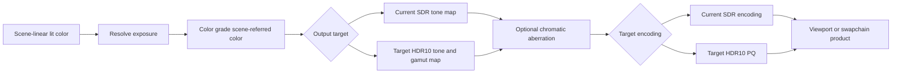

# Renderer Display Pipeline

**Status:** Renderer post-processing feature-family index

**Scope:** route implemented scene-to-display transforms, admitted first-release display targets, output encoding, and target publication

This family owns the meaning of the pixel after lighting: how scene-linear values are exposed, mapped into a display range, optionally transformed by future looks, encoded, and handed to presentation.

**Current readiness:** **23/100** across six described display capabilities — exposure, tone mapping, and SDR output are **45/100**; color grading, chromatic aberration, and HDR10 output are admitted **0/100** targets. See [Current Feature Readiness](../../../../../../../Acceptance/CurrentReadiness.md#renderer).

## At A Glance

| Stage | Current state | What readers must not infer |
| --- | --- | --- |
| exposure | implemented source path with manual/automatic state and history | accepted adaptation quality or temporal stability |
| tone mapping | selectable Reinhard, ACES approximation, and ACES fitted source routes | exact standards compliance or calibrated display output |
| color grading | first-release target; not found | tone mapping is not a grading or LUT system |
| chromatic aberration | first-release target; not found | generic filtering/reconstruction is not lens simulation |
| output/presentation handoff | implemented SDR-oriented encoding/copy route | accepted color accuracy or HDR support |
| HDR10 display output | first-release target; not found | 10-bit or Linear output alone is not HDR activation |

## Choose By Stage

| Document | Open it for |
| --- | --- |
| [Exposure](Exposure.md) | luminance measurement, history, manual/automatic exposure, and frame placement |
| [Tone Mapping](ToneMapping.md) | selectable scene-referred HDR to display-linear operators and their limits |
| [Color Grading](ColorGrading/README.md) | feature definition, discovery, research, semantics, architecture, experience, and conditional delivery plan |
| [Chromatic Aberration](ChromaticAberration/README.md) | feature definition, discovery, research, semantics, architecture, and conditional delivery plan |
| [Presentation And Output](PresentationAndOutput.md) | current SDR encoding, back-buffer or viewport publication, and debug handoff |
| [HDR Display Output](HDRDisplayOutput/README.md) | feature definition, discovery, research, semantics, architecture, experience, and conditional delivery plan |

The parent [Post Processing](../README.md) dossier owns shared stage order. Each transformation retains a separate input/output and proof contract.

The order is semantic: exposure acts on scene-linear lighting, grading authors the reconstructed scene-referred look, the selected SDR or HDR tone/gamut mapping creates target-linear intent, chromatic aberration acts before target encoding and UI, and SDR/HDR output paths own their final encoding/publication contracts. Reordering stages requires an explicit color-domain decision, not only a graph edit.
