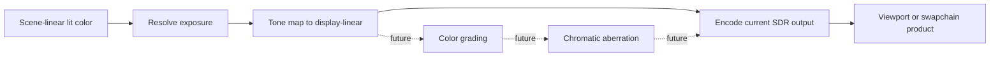

# Renderer Display Pipeline

**Status:** Renderer post-processing feature-family index

**Scope:** route scene-to-display transforms, explicitly absent display effects, output encoding, and target publication

This family owns the meaning of the pixel after lighting: how scene-linear values are exposed, mapped into a display range, optionally transformed by future looks, encoded, and handed to presentation.

## At A Glance

| Stage | Current state | What readers must not infer |
| --- | --- | --- |
| exposure | implemented source path with manual/automatic state and history | accepted adaptation quality or temporal stability |
| tone mapping | selectable Reinhard, ACES approximation, and ACES fitted source routes | exact standards compliance or calibrated display output |
| color grading | not found | tone mapping is not a grading or LUT system |
| chromatic aberration | not found | generic filtering/reconstruction is not lens simulation |
| output/presentation handoff | implemented SDR-oriented encoding/copy route | HDR negotiation, metadata, or accepted color accuracy |

## Choose By Stage

| Document | Open it for |
| --- | --- |
| [Exposure](Exposure.md) | luminance measurement, history, manual/automatic exposure, and frame placement |
| [Tone Mapping](ToneMapping.md) | selectable scene-referred HDR to display-linear operators and their limits |
| [Color Grading](ColorGrading.md) | explicit negative capability boundary for grading and LUT workflows |
| [Chromatic Aberration](ChromaticAberration.md) | explicit negative capability boundary for the named lens effect |
| [Presentation And Output](PresentationAndOutput.md) | output encoding, format/HDR boundary, back-buffer or viewport publication, and debug handoff |

The parent [Post Processing](../README.md) dossier owns shared stage order. Each transformation retains a separate input/output and proof contract.

The order is semantic: exposure acts on scene-linear lighting, tone mapping produces display-linear intent, look/lens operations would act only at their declared domain, and output encoding/presentation owns the final target contract. Reordering stages requires an explicit color-domain decision, not only a graph edit.
