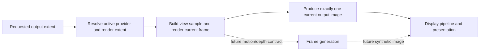

# Renderer Reconstruction And Generation

**Status:** Renderer post-processing feature-family index

**Scope:** route resolution reconstruction/upscaling and the independently absent generated-frame capability

This family separates *where the frame is sampled*, *how one current output image is reconstructed*, and *whether new display frames are synthesized*. Those are different products and must never share a vague “upscaling” claim.

## At A Glance

| Capability | Current state | Key limitation |
| --- | --- | --- |
| render/output extent and temporal samples | explicit extents plus Halton view jitter; active attachments remain single-sample | no dynamic-resolution controller, Renderer MSAA, or standalone TAA/FXAA/SMAA |
| linear reconstruction | implemented source path | quality, scale range, temporal behavior, and cost unproved |
| DLSS Super Resolution / Ray Reconstruction | optional capability-gated D3D12 provider path | vendor/runtime/hardware/package prerequisites and no Vulkan route |
| frame generation | not implemented | no synthetic-frame product, interpolation inputs, pacing, or UI/presentation policy |

## Choose By Question

| Document | Open it for |
| --- | --- |
| [Resolution, Sampling, And Anti-Aliasing](ResolutionSamplingAndAntiAliasing.md) | output/render extents, sample policy, provider selection, resize invalidation, and explicit absent AA/dynamic-resolution modes |
| [Image Reconstruction And Upscaling](ImageReconstructionAndUpscaling.md) | linear and provider-backed reconstruction, extent/history contracts, readiness, fallback, and output identity |
| [Frame Generation](FrameGeneration.md) | explicit negative capability boundary and the additional pacing, latency, UI, provenance, and presentation obligations |

Reconstruction produces one resolved image for the submitted frame. Frame generation would create additional presented frames and cannot be inferred from an upscaler or latency provider. The parent [Post Processing](../README.md) dossier owns shared stage order.

The one-current-image invariant protects presentation, capture, history, and latency identity. A future frame generator must introduce a separately named synthetic product rather than hiding interpolation inside reconstruction.
