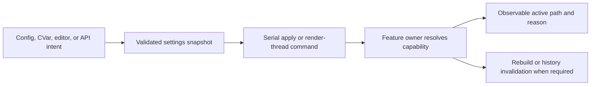

# Renderer Runtime Configuration

**Status:** Renderer feature-family index

**Scope:** route the independently maintained catalogs for aggregate rendering settings, persistence, selectors, defaults, requested state, and active-state reachability

Runtime configuration turns user/editor/startup intent into feature-owner requests. It coordinates state transport, but it does not decide whether a requested path is supported or semantically acceptable.

## At A Glance

| Layer | Owns | Must expose |
| --- | --- | --- |
| settings aggregate | defaults, editable values, persistence names, startup load, and whole-state commit | loaded/saved state, invalid values, restart requirements, and commit failure |
| selector catalog | every reachable CVar/control and its exact consumer | domain, default, requested value, active result, fallback/rejection, topology/history effect |
| feature owner | capability resolution and actual implementation selection | why the request became active, inactive, substituted, or rejected |

## Choose By State

| Document | Open it for |
| --- | --- |
| [Settings State And Persistence](SettingsStateAndPersistence.md) | aggregate settings transport, defaults, startup/editor commit, persistence, restart requirements, and diagnostics |
| [Feature Selector Catalog](FeatureSelectorCatalog.md) | exact public/CVar selector membership, consumers, requested-versus-active behavior, and ineffective or absent controls |

Settings state owns the durable aggregate. The selector catalog owns exact reachability and must not become a second persistence schema. The parent [Renderer Feature Dossiers](../README.md) index owns capability routing.

## Shared Risks

- A registered CVar without a real consumer is documentation and product debt, not a working selector.
- Persisted intent can differ from active state because of build, backend, device, provider, or restart prerequisites.
- Threaded application must preserve the same ordering and final state as serial application.
- Topology-affecting changes must rebuild the right graph state and invalidate only the histories that became incompatible.
