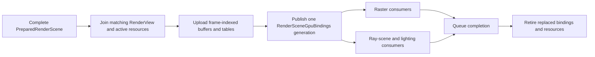

# Renderer GPU-Scene Publication

**Status:** current feature dossier; source-backed, not upload, capacity, raster/ray parity, residency, or runtime evidence

**Verified:** 2026-09-06 against committed `master` revision `d236da11`

**Scope:** `REN-SCENE-01` and GPU-publication portions of `REN-SCENE-03` through `REN-SCENE-07`; persistent/frame-indexed GPU-scene storage, binding identity, upload, publication, and completion-safe replacement

**Current readiness:** **50/100** — one checked GPU-scene publication path exists; stale/capacity/partial-failure, resource-generation, backend, lifetime, memory, and stress proof remains open. See [Current Feature Readiness](../../../../../../Acceptance/CurrentReadiness.md#renderer).

## At A Glance

| Published family | Consumers | Identity/lifetime concern |
| --- | --- | --- |
| lights and mesh-instance/slot tables | deferred geometry and lighting | counts, slots, and scene generation must agree |
| current/previous joint and morph data | deformed raster/ray geometry and motion | continuity and frame-slot identity cannot mix |
| ray vertices/indices/influences/hit instances/materials | BLAS/TLAS, ray GBuffer, shadows, and indirect paths | scene-to-hit/SBT mapping must use the matching generation |
| material texture table and binding revision | eligible ray material evaluation | fixed capacity and completion-safe texture-generation replacement |
| per-view instance/partition payload | selected classic/PTLAS strategy | view identity joins shared scene identity without becoming scene authority |

The publication object is a coherence boundary, not a second copy of scene truth. It trades broader up-front preparation/upload for simple downstream binding: passes either receive one complete matching generation or fail before dispatch.

## Feature Promise

After scene and view preparation agree on one admitted identity, `RenderGpuScene` publishes one coherent `RenderSceneGpuBindings` generation. Raster, ray GBuffer, lighting, and RT-scene consumers cannot observe a mixture of old and new geometry, deformation, material, texture, light, or partition state.

## Published State

- directional, point, spot, and rect light buffers;
- mesh instances and compact instance-slot indirection;
- current and previous joint matrices and morph weights;
- ray-hit vertices, indices, skin influences, morph deltas, hit instances, and hit materials;
- material texture table and binding state used by eligible ray consumers;
- per-view RT instance/partition data and TLAS preparation inputs.

Persistent scene resources and frame-indexed storage have distinct lifetimes. Handle/generation identity must survive recording; replacement and reclamation wait for every consuming queue token.

## Publication Boundaries

- Publication occurs only after complete scene and view preparation, preserving one semantic identity across GBuffer, lighting, and ray work.
- Publication consumes only active generations from [Mesh and Texture Residency](../GeometryAndResources/MeshAndTextureResidency.md); pending/failed/evicted resources cannot masquerade as the prior generation.
- Fixed descriptor/light/resource capacities reject before upload/dispatch, never by truncating into plausible output.
- Scene reset, resource reload, shader/provider change, and frame-slot reuse retire affected resources through completion authority.
- Equal layouts or successful upload do not prove raster/ray deformation, material, or backend parity.

Feature-family proof is owned by [Acceptance](Acceptance.md), especially `AC-SVP-02` through `AC-SVP-04`, `AC-SVP-06` through `AC-SVP-09`, and `CHK-SVP-03`/`04`.

## Primary Source Routes

- [`RenderGpuScene.cpp`](../../../../../../../Engine/Renderer/Private/Scene/GpuScene/RenderGpuScene.cpp)
- `Engine/Renderer/Private/Scene/GpuScene`, `Engine/Renderer/Private/Scene/Materials`, and `Engine/Renderer/Private/ShaderData`
- [Geometry, Materials, and GBuffer](../GeometryAndResources/GeometryMaterialsAndGBuffer.md) and [Ray Tracing](../RayTracing/README.md)
