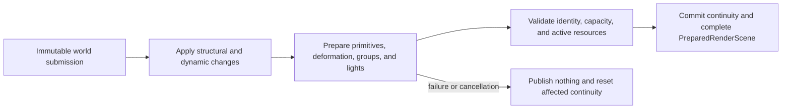

# Renderer Scene Preparation

**Status:** current feature dossier; source-backed, not task, continuity, residency, capacity, or runtime evidence

**Verified:** 2026-09-06 against committed `master` revision `d236da11`

**Scope:** scene-owned portions of `REN-SCENE-02` through `REN-SCENE-07`; persistent `RenderScene` mutation, frame-slot preparation, deformation continuity, light preparation, active-resource references, and failure before publication

**Current readiness:** **50/100** — persistent-scene to prepared-scene source flow exists; failure/cancellation, capacity, deformation continuity, serial/threaded equivalence, and performance evidence does not. See [Current Feature Readiness](../../../../../../Acceptance/CurrentReadiness.md#renderer).

## At A Glance

| Input | Persistent owner | Frame result | Refusal boundary |
| --- | --- | --- | --- |
| structural add/update/remove changes | `RenderScene` scene generation and object/resource identity | resolved primitives and groups for one frame slot | non-monotonic identity or invalid structural change rejects before publication |
| current dynamic transforms, joints, and morph weights | scene deformation continuity | current/previous deformation pairs | failed or cancelled preparation resets continuity and publishes no partial state |
| directional, point, spot, and rectangular lights | scene light identity | bounded GPU-ready light records | more than 2 directional or 1024 of another kind rejects before upload |
| active mesh/texture generations | residency owners remain authoritative | references to safe active resources | pending, stale, failed, or evicted generations cannot masquerade as current |

The owner keeps scene continuity so downstream raster and ray paths share the same current/previous geometry meaning. The cost is strict transactional publication: partial task work is discarded rather than exposed for best-effort rendering.

## Feature Promise

An admitted immutable submission updates one persistent Renderer scene generation, then produces one complete `PreparedRenderScene`. The owner commits deformation continuity only after all required work succeeds; failure or cancellation leaves no partial prepared scene visible.

## Ownership And Work

`RenderScene` consumes structural add/update/remove changes and moved dynamic arrays while retaining geometry, material, texture, light, GPU-scene, and ray-scene identity. `PreparedRenderScene` belongs to one RHI frame-in-flight slot and contains resolved primitives, instance groups, current/previous deformation, prepared lights/sky, and the eventual GPU-binding pointer.

`RenderScenePreparation` reuses a capacity-bucketed Tasks graph:

| Work | Serial threshold / grain / max partitions | Result |
| --- | --- | --- |
| primitive transforms and bounds | 128 / 64 / 8 | prepared transforms, bounds, draw/material identity |
| joint-matrix copies | 64 / 16 / 8 | current and previous joint matrices |
| morph-weight copies | 64 / 16 / 8 | current and previous morph weights |
| light preparation | 32 / 16 / 4 | directional, point, spot, and rect GPU-ready semantics |

Capacities round to a power of two beyond the serial threshold to reuse the compiled task graph. These are scheduling constants, not proven optimal workloads or total memory bounds.

## Failure, Capacity, And Lifetime

- Non-monotonic frame identity rejects before scene mutation/publication.
- Preparation failure/cancellation resets continuity and publishes no partial result; success commits continuity before moving merged output into the frame slot.
- Scene reset unloads scene textures and invalidates dependent scene/view/provider/frame history.
- Scene preparation consumes only the active generation exposed by [Mesh and Texture Residency](../GeometryAndResources/MeshAndTextureResidency.md); it does not own admission, decode, upload, eviction, or their budgets.
- Light payload limits are 2 directional and 1024 each for point, spot, and rect; overflow rejects before GPU upload.
- Static BLAS reuse and deforming BLAS rebuild are downstream RT consequences; this page does not claim BLAS refit.

Feature-family proof is owned by [Acceptance](Acceptance.md), especially `AC-SVP-01` through `AC-SVP-04`, `AC-SVP-06` through `AC-SVP-08`, and `CHK-SVP-01`/`03`/`04`. Residency state-machine proof stays in [Mesh and Texture Residency](../GeometryAndResources/MeshAndTextureResidency.md).

## Primary Source Routes

- [`FramePipeline::AcceptFrameSubmission` and `PrepareRenderFrame`](../../../../../../../Engine/Renderer/Private/Frame/FramePipeline.cpp)
- [`RenderScenePreparation.cpp`](../../../../../../../Engine/Renderer/Private/Scene/Preparation/RenderScenePreparation.cpp)
- [`RenderFrameSubmission.h`](../../../../../../../Engine/GameFramework/Public/Rendering/RenderFrameSubmission.h)
