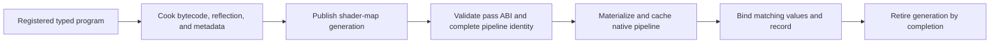

# Renderer Shader Runtime

**Status:** Renderer feature-family index

**Scope:** route exact shader-program membership and the runtime materialization, binding, generation, and retirement contract

Shader runtime answers two different questions: which programs are part of the Renderer build contract, and whether one of those programs can safely become a bound native pipeline for the current backend and generation.

## At A Glance

| Layer | Authority | Result |
| --- | --- | --- |
| registration catalog | Renderer registration translation units and CMake membership | exact virtual source, entry point, stage, targets, and declared metadata identity |
| cooked shader map | ShaderCompiler publication | backend bytecode, reflection, parameter signature, provenance, and generation |
| runtime validation/materialization | Renderer typed pass contract plus RHI pipeline services | compatible layout, bindings, pipeline state, and native pipeline |
| generation replacement | Renderer runtime cache and queue-completion lifetime | one active complete generation; old generation retires after last use |

## Choose By Question

| Document | Open it for |
| --- | --- |
| [Shader Program Catalog](ShaderProgramCatalog.md) | exact registered program, source, entry, stage, target, and declared-metadata membership |
| [Pipeline Materialization And Typed Binding](PipelineMaterializationAndTypedBinding.md) | runtime ABI validation, complete pipeline identity, typed binding, cache behavior, generation activation, and retirement |

The catalog proves membership only. Runtime materialization owns readiness and use; it cannot infer a usable pipeline from a catalog row. The parent [Renderer Feature Dossiers](../README.md) index owns capability routing.

## Shared Risks

- A registration row can exist while cooking, lookup, ABI validation, or native creation fails.
- Cache identity must contain every shader-generation and pipeline-semantic field.
- Partial reload must never mix old bytecode, new reflection, and old bindings.
- A successful pipeline creation says nothing about the correctness of the feature shader output.
