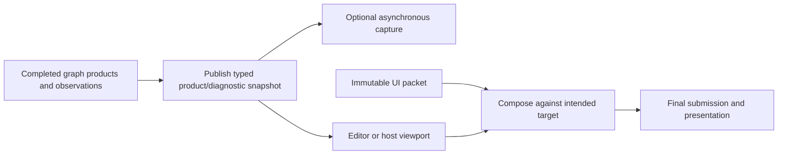

# Renderer Viewport And Diagnostics

**Status:** Renderer feature-family index

**Scope:** route viewport-facing products, capture and observation, immutable UI composition, and editor/host publication boundaries

This family explains how a completed frame becomes inspectable: named products and diagnostic facts are published first, then immutable UI data may be composed into the intended viewport or host target.

**Current readiness:** **40/100** family projection — viewport/UI/debug/capture source paths exist with partial diagnostics truth; candidate semantics, lifetime, observer-cost, and Shipping proof is absent. See [Current Feature Readiness](../../../../../../Acceptance/CurrentReadiness.md#renderer).

## At A Glance

| Concern | Produced result | Boundary |
| --- | --- | --- |
| frame diagnostics | attributable frame/pass/timing/memory/active-state observations | observation does not own or prove feature semantics |
| render products | stable product identity, format, extent, and generation for viewport/capture consumers | a native texture handle alone is not a semantic product |
| capture/preview | asynchronous result with product and provenance identity | delivery is not visual correctness |
| UI composition | immutable draw packet replayed after scene work and before final submission | widgets, input, and editor intent remain outside RHI lowering |

## Choose By Result

| Document | Open it for |
| --- | --- |
| [Diagnostics, Products, And Capture](DiagnosticsProductsAndCapture.md) | diagnostic observations, render products, capture requests/results, provenance, bounds, and failure |
| [UI And Viewport Composition](UiAndViewportComposition.md) | immutable UI packets, viewport texture identity, composition order, host/editor integration, and lifetime |

Diagnostics and capture own observable facts and products. UI/viewport composition owns how already-produced data reaches a viewport; it does not recompute diagnostic truth. The parent [Renderer Feature Dossiers](../README.md) index owns capability routing.

## Shared Risks

- Product, frame, shader, resource, and viewport generations can become stale independently.
- Diagnostic collection must be bounded and its cost classified.
- Captures and previews need exact color/encoding provenance to be interpretable.
- UI texture handles must remain valid through the same submission that consumes the packet.
