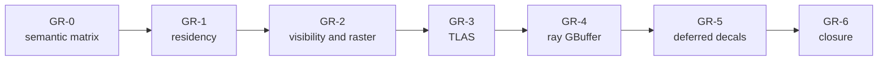

# Renderer Geometry And Ray-Tracing Closure Plan

**Status:** implementation plan; not visual, native-validation, performance, or release evidence

**Families:** `FCR-REN-04`, `FCR-REN-05`, `FCR-REN-12`, `FCR-REN-17`, `FCR-REN-21`, `FCR-REN-23`

**Current readiness:** section projection **38/100**; substantial raster/residency source and partial ray routes, while deferred decals are absent; all six families are `Blocked`

**Responsibility:** sequence resident visible geometry through raster and ray GBuffer production with one identity and material contract

**Parent:** [First Release Renderer Plans](README.md)

**Architecture:** [Geometry And Resources](../Features/GeometryAndResources/README.md), [Renderer Ray Tracing](../Features/RayTracing/README.md), and [RHI Ray Tracing](../../RHI/Features/PipelineAndExecution/RayTracing.md)

## Plan At A Glance



| Phase | Primary family | Product result |
| --- | --- | --- |
| `GR-0` | all six | one geometry/material/identity and oracle matrix |
| `GR-1` | `FCR-REN-17` | bounded generation-safe mesh/texture residency |
| `GR-2` | `FCR-REN-21`, `FCR-REN-04` | deterministic visible raster GBuffer |
| `GR-3` | `FCR-REN-12` | correct classic/refit/partitioned TLAS policy and identity |
| `GR-4` | `FCR-REN-05` | shared-semantic inline/RGS ray GBuffer |
| `GR-5` | `FCR-REN-23` | authored decals through raster and secondary-ray composition |
| `GR-6` | all six | candidate-bound raster/ray/decal parity and failure closure |

NVIDIA's [RTXDI integration guide](https://github.com/NVIDIA-RTX/RTXDI/blob/main/Doc/Integration.md) is useful because it makes host-owned scene/material/GBuffer responsibilities explicit; the [DirectX raytracing samples](https://github.com/microsoft/DirectX-Graphics-Samples/tree/master/Samples/Desktop/D3D12Raytracing) and [Khronos ray-tracing guide](https://docs.vulkan.org/guide/latest/extensions/ray_tracing.html) are native oracles. None defines Sparkle's scene/material semantics.

## `GR-0` — Freeze Geometry, Material, And Traversal Semantics

**Goal:** establish one authored-to-GPU semantic contract and deterministic fixtures shared by raster, inline ray query, and native ray pipeline.

**Non-goals:** implementing missing features, adding LOD/occlusion/GPU-driven rendering, or treating raster output as an unquestioned ray oracle.

**Required work:** map geometry/submesh/material/texture/instance identities and generations; coordinate/tangent/normal/UV/material channel/color-space/alpha/two-sided/skin/morph/motion semantics; visibility/group/sort rules; residency/TLAS/SBT lifetimes; requested/active traversal states; backend/content matrices; and all feature-local criteria/checks.

**Failure modes:** raster and ray decode material differently; instance contribution aliases; alpha/two-sided policy is implicit; motion history uses different identity; unsupported route silently falls back; absent features enter release claims.

**Phase exit criteria:** fixtures and analytic/reference oracles cover admitted static/skinned/morph, material, alpha, two-sided, transform, visibility, and traversal cells; every family contract is binary and current.

**Ready-to-use prompt:**

```text
Execute GR-0 without implementation. Create ITER-REN-GR-00 mapped to the six FCRs and their AC/FM/CHK. Inspect imported/cooked geometry and materials, world publication, Renderer scene/GPU scene, residency, visibility/draw preparation, raster GBuffer, decal composition, motion data, BLAS/TLAS, SBT, ray GBuffer, selectors, RHI, shaders, and CMake. Record one identity/generation and semantic matrix across raster/inline/RGS/D3D12/Vulkan, plus negative capabilities. Select minimal deterministic fixtures and independent or analytic oracles. Fix stale Architecture wording only. Stop on divergent semantics or an unowned identity.
```

## `GR-1` — Mesh And Texture Residency

**Goal:** close `FCR-REN-17` with bounded CPU work, upload, activation, replacement, cancellation, and completion-safe eviction.

**Non-goals:** a general virtual-texturing system, speculative streaming tiers, or placeholder behavior that disguises required content failure.

**Required work:** preserve immutable asset generations; reconcile job/backlog limits, decode/staging/upload/token ownership, activation boundary, stale work, replacement, cancellation, all-queue completion, eviction, refusal/placeholder policy, and diagnostics; exercise exact/over-budget plus the documented 16-job and 256-backlog boundaries; measure CPU/GPU memory and streaming stability.

**Failure modes:** stale generation activates; cancellation leaks staging; upload token failure publishes; resource evicted while another queue uses it; backlog exceeds bound; placeholder changes silently; memory never returns after reload.

**Phase exit criteria:** all residency criteria and negative checks pass at/below/above limits; activation is transactional; memory and queue high-water are bounded; reload/eviction leaves no stale binding.

**Ready-to-use prompt:**

```text
Implement GR-1 in current mesh/texture residency, task/decode, upload, activation, replacement, and retirement owners. Reconcile asset and GPU generations plus all queue-completion edges. Keep immutable input and one active generation; bound jobs/backlog/staging/memory and make refusal/placeholder state explicit. Exercise empty/small/large assets, exact and over budgets, 16 concurrent jobs, 256 backlog, decode/task/upload/token failures, cancellation, stale generation, replacement, eviction in flight, and repeated reload. Measure CPU/GPU high-water and stability. Delete superseded queues/caches and stop on partial activation or ambiguous completion.
```

## `GR-2` — Visibility, Draw Preparation, And Raster GBuffer

**Goal:** close `FCR-REN-21` and `FCR-REN-04` with deterministic visible work and a semantically correct PBR GBuffer.

**Non-goals:** occlusion culling, LOD, mesh shaders, indirect GPU-driven submission, stereo, or broad material-system redesign.

**Required work:** close analytic frustum classification, invalid identity rejection, authored/fallback grouping, deterministic opaque sorting/batching, transparent single-item order, task cancellation/failure, and diagnostic reconciliation; then prove depth, normal/tangent, material channels, precision/spaces, skin/morph, alpha/two-sided, motion data, draw bounds, and map coverage.

**Failure modes:** invalid bounds pass culling; transparent order batches incorrectly; task failure emits partial draw list; stale resident handle draws; normal/tangent space differs; alpha route writes inconsistent depth/material; motion missing after deformation.

**Phase exit criteria:** analytic visibility cases, serial/parallel draw equivalence, batching correctness/benefit, controlled failures, deterministic GBuffer fixtures, and native validation pass for admitted content on both backends.

**Ready-to-use prompt:**

```text
Implement GR-2 through existing visibility classification, draw preparation, raster mesh/GBuffer passes, shader bindings, and RHI draw lowering. Start from FCR-REN-21/04 AC/FM/CHK and the GR-0 semantic fixtures. Preserve authored groups where eligible, deterministic opaque order, transparent single-item order, and explicit negative feature claims. Exercise inside/outside/intersecting/invalid bounds, stale identities, fallback groups, cancellation/failure, static/skinned/morph, material variants, alpha/two-sided, tangent/normal/UV/precision, motion, and backend validation. Compare serial/parallel outputs and measure cull/build/draw costs. Stop on partial draw publication or semantic mismatch.
```

## `GR-3` — Renderer TLAS Policy And Publication

**Goal:** close `FCR-REN-12` by converting current scene generations into the correct acceleration structure and operation plan consumed by every ray effect.

**Non-goals:** putting scene update policy in RHI, rebuilding unconditionally, or making partitioned TLAS the only route without capability and benefit evidence.

**Required work:** reconcile classic build/refit/update and partitioned choices, capability and requested/active truth, geometry/instance/contribution identity, static/dynamic/topology-change policy, transform/move/delete/reload, operation-buffer bounds, scratch/result ownership, queue synchronization, publication, and retirement; measure build/update/traversal/memory frontiers.

**Failure modes:** refit after topology change; deleted instance persists; contribution maps wrong hit group; operation buffer overflows; new TLAS publishes before completion; old TLAS retires early; unsupported partitioned path lies about active state.

**Phase exit criteria:** selection, identity, update policy, bounds, failure, synchronization, native validation, and cost criteria pass across both backends and admitted TLAS routes.

**Ready-to-use prompt:**

```text
Implement GR-3 with Renderer owning scene/TLAS policy and RHI owning native mechanics. Audit persistent scene geometry/instances, BLAS generations, classic/refit/partitioned planner, operation buffers, contribution/SBT mapping, scratch/result lifetime, queue tokens, publication, consumers, and selectors. Exercise initial build, transform-only update, topology/material/geometry change, move/delete/reuse/reload, exact/over operation bounds, allocation/submit failure, unsupported capability, and in-flight replacement on D3D12/Vulkan. Verify active-state truth and deterministic instance mapping; measure build/update/traversal and memory. Stop on identity or lifetime ambiguity.
```

## `GR-4` — Ray-Traced GBuffer

**Goal:** close `FCR-REN-05` with automatic/inline/native-pipeline traversal adapters producing one shared semantic GBuffer result.

**Non-goals:** duplicated effect shaders, route-specific materials, or accepting visual similarity without hit/material identity checks.

**Required work:** reconcile route selection, capability/fallback truth, common inputs/outputs, miss/hit/instance/primitive/material/SBT mapping, alpha/two-sided/skinned/morph behavior, motion/history inputs, barriers and failure; use identical deterministic rays/fixtures and compare intermediate identities plus final channels; measure quality/time/memory crossover.

**Failure modes:** automatic selects unavailable route; inline/RGS miss differs; SBT contribution selects wrong material; alpha/two-sided behavior diverges; provider failure leaves stale output; one route lacks motion; backend compiler/validation failure hidden.

**Phase exit criteria:** shared semantic criteria and controlled failures pass for every admitted route/backend/content cell; route state is observable; differences are within owned numerical tolerances and cost evidence supports defaults.

**Ready-to-use prompt:**

```text
Implement GR-4 in the current ray GBuffer semantic owner with thin inline-query and native-pipeline adapters. Reconcile selectors, capabilities, TLAS/SBT mapping, shader registration/bindings, material decode, miss/hit outputs, alpha/two-sided/skinned/morph/motion handling, graph dependencies, and RHI commands. Use GR-0 fixtures and identical sample/ray identities to compare intermediate and final results across inline/RGS and D3D12/Vulkan. Inject unsupported capability, bad identity, missing shader/pipeline, submit failure, and stale TLAS. Record native validation and quality/time/memory crossover. Delete duplicated route logic; stop on semantic divergence.
```

## `GR-5` — Deferred GBuffer Decals

**Goal:** close `FCR-REN-23` by implementing the authored decal path, bounded scene/GPU representation, deterministic post-GBuffer composition, and equivalent secondary-ray material resolution defined by the [deferred-decals contract](../Features/DeferredDecals/Acceptance.md).

**Non-goals:** forward decals, arbitrary material graphs, mesh decals, lighting-buffer decals, order-independent blending, or using screen-space composition as false proof of ray-hit behavior.

**Required work:** execute the staged [Deferred GBuffer Decals plan](../Features/DeferredDecals/Plan.md); establish asset/cook/runtime identity, transform and bounds, scene publication, visibility/sorting/layering, bindless material resources, inside/outside volume rasterization, channel masks and blend semantics, normal-space handling, frame-graph placement before all GBuffer consumers, and a shared decal-material query for admitted secondary rays. Preserve explicit requested/active/unsupported state and define capacity, replacement, retirement, and failure behavior.

**Failure modes:** authored decal never reaches cooked/runtime state; stale generation remains visible; volume culling or inside/outside winding drops valid pixels; overlapping order differs across runs/backends; unmasked channels change; normals use the wrong space; a downstream consumer reads pre-decal GBuffer; raster and secondary-ray material results diverge; overflow or missing resources silently omit decals.

**Phase exit criteria:** `AC-DECAL-01` through `AC-DECAL-08` and their failure/check matrix pass for deterministic overlap, channel-mask, normal, edge, motion, lifetime, overflow, secondary-ray, backend, performance, and package cases; `FCR-REN-23` records candidate-bound evidence and limitations.

**Ready-to-use prompt:**

```text
Implement GR-5 by executing Docs/Architecture/Modules/Engine/Renderer/Features/DeferredDecals/Plan.md against the Architecture DeferredDecals dossier and AC-DECAL/FM-DECAL/CHK-DECAL contract. Extend the existing asset, cook, Scene publication, persistent GPU-scene, visibility, frame-graph, GBuffer, material, ray-hit, shader, RHI, and editor owners without creating a parallel scene or material authority. Implement one bounded generation-qualified decal representation, deterministic sort/layer policy, volume raster pass after base GBuffer and before every consumer, channel/normal-safe blending, and the admitted secondary-ray composition route. Exercise empty, single, overlapping, inside/outside, clipped, moved/deleted/reloaded, masked-channel, normal, overflow, missing-resource, allocation/pipeline/submit failure, D3D12/Vulkan, raster/ray, and packaged-content cases. Capture raw GBuffer and identity artifacts plus cost/memory. Stop on ambiguous blend semantics, stale lifetime, silent omission, or raster/ray divergence.
```

## `GR-6` — Geometry, Ray, And Decal Candidate Closure

**Goal:** prove that residency, visibility, raster, TLAS, ray GBuffer, and deferred decals agree for one candidate and release content set.

**Non-goals:** using the release maps to skip analytic fixtures or claiming absent LOD/occlusion.

**Failure modes:** route uses different cooked generation; residency report predates GBuffer fix; raster/ray comparison is post-tonemapped; one route/backend unavailable; memory evidence omits reload/soak.

**Phase exit criteria:** all six FCR reports have exact criteria/failure/check matrices, raw comparison artifacts, native diagnostics, performance/memory records, limitations, and candidate-bound decisions.

**Ready-to-use prompt:**

```text
Execute GR-6 on the frozen candidate. Reconcile FCR-REN-04/05/12/17/21/23 artifacts and run only missing integrated cases from cooked asset generation through residency, visibility, raster GBuffer, TLAS, ray GBuffer, and deferred-decal composition. Compare raw channels and identity before lighting/post; include static/skinned/morph, alpha/two-sided, decals and overlap, move/delete/reload, pressure/failure, inline/RGS, and D3D12/Vulkan. Verify selector active state, memory return, native validation, and exact content/shader/package identity. Any change invalidates affected evidence. File explicit decisions and retain negative capability truth.
```
