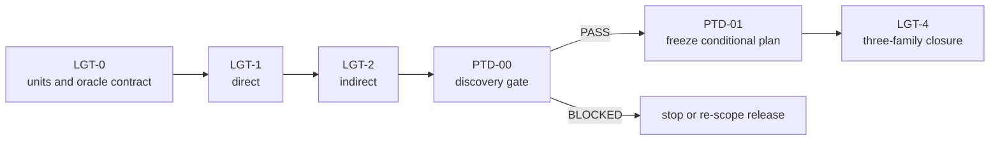

# Renderer Lighting Closure Plan

**Status:** implementation plan for direct/indirect closure and the `PTD-00` handoff; not an offline-path-tracer implementation plan or evidence

**Families:** `FCR-REN-06`, `FCR-REN-07`, `FCR-REN-08`

**Current readiness:** section projection **37/100**; direct/indirect source routes exist, the offline-reference family is **20/100**, and all three remain `Blocked`

**Responsibility:** sequence direct and indirect lighting closure and enforce the discovery gate before offline-reference implementation planning

**Parent:** [First Release Renderer Plans](README.md)

**Architecture:** [Lighting](../Features/Lighting/README.md), [Direct Lighting](../Features/Lighting/DirectLighting.md), [Indirect Lighting](../Features/Lighting/IndirectLighting.md), and [Offline Path Tracer](../Features/Lighting/OfflinePathTracer/README.md)

## Plan At A Glance



| Phase | Primary family | Current boundary |
| --- | --- | --- |
| `LGT-0` | all three | source routes exist, but shared units/material/light/reference contract must be reconciled |
| `LGT-1` | `FCR-REN-06` | direct ReSTIR/analytic-light source exists; correctness/parity/failure/cost proof absent |
| `LGT-2` | `FCR-REN-07` | indirect temporal/spatial source exists; estimator/history/quality proof absent |
| `LGT-3` | `FCR-REN-08`, discovery only | `PTD-00` is unpassed; current path cannot be called an unbiased oracle |
| `PTD-01` | `FCR-REN-08`, implementation | conditional plan exists; it cannot be accepted or advance past Stage 0 until discovery freezes its goals |
| `LGT-4` | all three | candidate comparison/adoption reports absent |

> [!CAUTION]
> `LGT-3` is a hard implementation stop. The [discovery contract](../Features/Lighting/OfflinePathTracer/Discovery.md) deliberately requires `PTD-00` to pass before the conditional `PTD-01` plan can be frozen or advance beyond Stage 0. Provisional transport choices and prompts remain non-authoritative until discovery tests and accepts them.

NVIDIA's [RTXDI integration guide](https://github.com/NVIDIA-RTX/RTXDI/blob/main/Doc/Integration.md) is a primary reference for the boundary where the application owns scene, materials, GBuffer, rays, and API integration while the SDK supplies reservoir algorithms. [RTX Path Tracing](https://github.com/NVIDIA-RTX/RTXPT) and the repository's [completion study](../Features/Lighting/OfflinePathTracer/Research.md) are precedents and research inputs, never local proof.

## `LGT-0` — Freeze Units, Estimators, And Comparison Domain

**Goal:** establish one testable material/light/sky/unit, sampling identity, raw-output, and comparison contract for all three families.

**Non-goals:** choosing an offline transport scope before discovery, tuning for release screenshots, or forcing direct/indirect/reference histories into one lifetime.

**Required work:** reconcile four light types/limits, material lobes, units/spaces, sky/environment boundary, surface/ray spawn, PDFs/weights/reservoir validity, deterministic sample identity, output lobe channels, composite, history/reset, debug separation, backends/routes, quality/cost/memory matrices, and feature `AC/FM/CHK`.

**Failure modes:** unit mismatch hidden by exposure; invalid PDF/weight; NaN/Inf clamped before evidence; direct energy double-counted; sky semantics differ; post-tonemapped image used as raw oracle; stochastic comparison lacks seed/sample identity.

**Phase exit criteria:** analytic fixtures and raw observables exist for every currently admitted direct/indirect cell; `FCR-REN-08` remains explicitly blocked on `PTD-00`; no undocumented transport claim enters implementation.

**Ready-to-use prompt:**

```text
Execute LGT-0 without transport implementation. Create ITER-REN-LGT-00 mapped to FCR-REN-06/07/08 and current AC/FM/CHK. Inspect cooked/world light and material semantics, Renderer scene/GBuffer, direct/indirect shaders and reservoirs, sky/composite, ray spawn, temporal inputs, debug outputs, selectors, RHI routes, and package membership. Record units, spaces, lobe ownership, PDFs/weights, sample identity, raw outputs, reset/invalidation, backend/content matrix, analytic fixtures, and quality/time/memory oracles. Reconcile Architecture wording only. Keep FCR-REN-08 blocked and stop if PTD-00 assumptions would be invented.
```

## `LGT-1` — Direct Lighting

**Goal:** close `FCR-REN-06` for all admitted analytic light kinds, material lobes, reservoir reuse, and visibility routes.

**Non-goals:** expanding light types, replacing the BRDF, hiding bias/leaks with post effects, or separate inline/RGS lighting implementations.

**Required work:** prove light units and limits, BRDF/lobe outputs, candidate generation/PDF/weight/reservoir validity, temporal/spatial reuse if admitted, shadow visibility/bias, alpha/two-sided/subsurface scope, inline/native parity, invalid/missing data behavior, debug separability, and cost; use analytic single-light/material/occluder fixtures before maps.

**Failure modes:** zero/negative/non-finite weight; stale reservoir after identity/reset; self-intersection/acne or light leak; unsupported traversal hidden; light beyond limit corrupts buffer; one lobe receives duplicate/missing energy.

**Phase exit criteria:** all four light kinds and limit boundaries, material/visibility routes, reservoir failures, raw lobe comparisons, backend/native checks, and performance budgets pass or produce an explicit blocker.

**Ready-to-use prompt:**

```text
Implement LGT-1 in the existing direct-light semantic owner and thin visibility traversal adapters. Start from FCR-REN-06 AC/FM/CHK and LGT-0 units/fixtures. Reconcile candidate generation, PDFs/weights/reservoir identity, light buffers and limits, BRDF/lobe outputs, shadow ray spawn/bias, alpha/two-sided/subsurface scope, history reset, debug outputs, graph resources, shaders, and RHI routes. Exercise each light type, boundary counts, known material/occluder geometry, invalid/non-finite inputs, stale history, missing capability, inline/RGS, and D3D12/Vulkan. Compare raw outputs, retain native diagnostics, and measure time/memory. Stop on unexplained energy or route divergence.
```

## `LGT-2` — Indirect Lighting

**Goal:** close `FCR-REN-07` for the explicitly admitted estimator, reuse, bounce, material, sky, temporal, and failure domain.

**Non-goals:** calling the current offline path a ground truth, increasing bounces/features without acceptance need, or tuning away bias without identifying it.

**Required work:** reconcile candidate/sample generation, PDFs/weights/reservoir math, secondary ray/material/sky evaluation, bounce scope, direct/indirect separation, temporal/spatial reuse, motion/disocclusion/reset, firefly/non-finite policy, deterministic seeds, inline/RGS/backend equivalence, raw lobe outputs, artifact gallery, and quality/time/memory frontier.

**Failure modes:** zero PDF or exploding weight; reuse crosses view/scene generation; disocclusion ghosts; sky double-counts; firefly clamp biases silently; NaN/Inf enters history; reset leaves stale energy; route/backend diverges statistically.

**Phase exit criteria:** analytic and controlled stochastic cases pass with declared tolerances/confidence; history/failure gallery is complete; raw lobe and parity artifacts plus performance frontiers are candidate-bound.

**Ready-to-use prompt:**

```text
Implement LGT-2 in the existing indirect-light estimator/reservoir owner with shared material/ray semantics. Reconcile sample/PDF/weight equations, bounce and sky scope, reservoir identity, temporal/spatial reuse, motion/disocclusion/reset, firefly/non-finite policy, lobe outputs, composite, debug routes, shaders, and graph/RHI dependencies. Use deterministic seeds and LGT-0 analytic cases, then controlled motion/disocclusion and release content. Inject zero/invalid PDFs, stale histories, cuts/resizes/mode changes, missing capability, and route failures. Compare inline/RGS and D3D12/Vulkan statistically with owned tolerances; record raw artifacts and quality/time/memory frontier. Do not use FCR-REN-08 as an oracle before PTD-00.
```

## `LGT-3` — Execute `PTD-00` Discovery

**Goal:** answer the exact research questions needed to define an honest, achievable `FCR-REN-08` implementation plan.

**Non-goals:** modifying the path tracer, asserting unbiasedness, importing RTXPT/Falcor architecture, or drafting detailed implementation phases before the decision.

**Required work:** execute every discovery item, risk, failure mode, check, and evidence package named by the [binding `PTD-00` contract](../Features/Lighting/OfflinePathTracer/Discovery.md); use the [research study](../Features/Lighting/OfflinePathTracer/Research.md) and pinned primary sources; distinguish verified local source, observed behavior, mathematical requirement, precedent, unknown, and release decision.

**Failure modes:** source inspection reported as runtime proof; external renderer result attributed locally; transport terms undefined; unsupported material/light silently excluded; numerical tolerance chosen without oracle; gate passes with missing evidence.

**Phase exit criteria:** the Architecture gate records `PASS` with all required outputs, or the release records `BLOCKED`/re-scope. Only `PASS` authorizes freezing `PTD-01`; Stage 1 still requires `REL-03`.

**Ready-to-use prompt:**

```text
Execute PTD-00 exactly as Docs/Architecture/Modules/Engine/Renderer/Features/Lighting/OfflinePathTracer/Discovery.md and Stage 0 of its Plan.md specify. Create its iteration record at the current revision and preserve source/observed/reference distinctions. Inspect the complete local transport, material, light, ray, accumulation, export, reset, backend, package, and evidence routes; run only the discovery checks the contract requires. Compare against the pinned NVIDIA, AMD, and neutral mathematical sources for explicit questions, recording revisions and transfer boundaries. Produce the required evidence package and binary gate decision. Do not change implementation, freeze the plan, or start Stage 1 on BLOCKED/incomplete results.
```

## Conditional `PTD-01` Handoff — Freeze The Offline Plan From Accepted Facts

**Goal:** after `PTD-00 PASS`, create the dedicated path-tracer plan whose phases close every included `OPT-FS-*`, `AC-OPT-*`, `FM-OPT-*`, and `CHK-OPT-*` without invented requirements.

**Non-goals:** this document serving as that plan, implementing during plan authoring, or retaining rejected discovery assumptions.

**Failure modes:** prompt runs before gate pass; plan omits an accepted transport row; vendor precedent becomes local goal; acceptance truth is duplicated; phase cannot be independently checked.

**Phase exit criteria:** `Docs/Architecture/Modules/Engine/Renderer/Features/Lighting/OfflinePathTracer/Plan.md` exists only after gate authorization, is linked from plan indexes, maps every accepted discovery output and acceptance row, and contains per-phase goals/non-goals/failures/exit criteria/prompts.

**Ready-to-use prompt:**

```text
Run this prompt only if PTD-00 has an explicit PASS and complete accepted evidence package. Reconcile the conditional PTD-01 at Docs/Architecture/Modules/Engine/Renderer/Features/Lighting/OfflinePathTracer/Plan.md to that exact revision. Replace every provisional current-state, transport, algorithm, numerical oracle/tolerance, material/light/backend/package, dependency, estimate, and stop-condition choice with accepted PTD-00 output. Verify every included OPT-FS, AC-OPT, FM-OPT, and CHK-OPT maps to the correct owner-sized vertical phase and that every prompt preserves its non-goals, controlled failures, exit checks, escalation, and reference-transfer boundary. Do not edit production code, copy acceptance authority, or add vendor architecture by analogy. Validate index links and no-orphan coverage before authorizing Stage 1.
```

## `LGT-4` — Lighting Candidate Closure

**Goal:** after `FCR-REN-08` implementation through the authorized `PTD-01`, compare direct/indirect results with the accepted offline reference and close all three families for one candidate.

**Non-goals:** treating one attractive image as convergence, allowing the reference to share the same defect without independent checks, or skipping packaged/backend routes.

**Failure modes:** reference/candidate share unverified input; accumulation not converged; exposure/tone confounds raw result; one backend/provider differs; artifact gallery is cherry-picked; path-tracer evidence predates lighting changes.

**Phase exit criteria:** direct, indirect, and offline reports satisfy their complete Architecture contracts; raw/reference, convergence, analytic/independent, failure, backend, package, quality/time/memory, and release-map evidence share one candidate identity.

**Ready-to-use prompt:**

```text
Execute LGT-4 only after PTD-01 implementation has a candidate-bound result. Freeze the candidate and reconcile FCR-REN-06/07/08 plus all OPT criteria/checks. Run missing analytic, deterministic, convergence, raw-lobe, direct/indirect/reference, failure, history/reset, inline/RGS, D3D12/Vulkan, packaged, and release-map comparisons. Keep sample identity, settings, input assets, camera, output domain, tolerances/confidence, and independent references explicit. Any lighting/material/ray/shader change invalidates affected evidence. File exact decisions, limitations, and blockers; never call the reference unbiased beyond its accepted scope.
```
