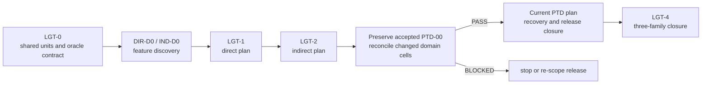

# Renderer Lighting Closure Plan

**Status:** cross-feature release sequence for direct/indirect/reference closure; feature-local implementation order lives in the linked plans and no plan is evidence

**Release requirement:** [Rendering closure](../../../../../Acceptance/FirstRelease.md#required-rendering-closure) requires Included realtime primary/secondary transport on both APIs under REL-RT-1080P, compared against an accepted progressive reference. Freeze the exact finite-depth/reuse policy and temporal quality thresholds before benchmark results; a raster GBuffer plus prototype seed reservoirs is not accepted path tracing.

**Families:** `FCR-REN-06`, `FCR-REN-07`, `FCR-REN-08`

**Current readiness:** section projection **37/100**; direct/indirect source routes exist, the Reference Path Tracer family is **20/100**, and all three remain `Blocked`

**Responsibility:** sequence lighting closure, preserve accepted reference discovery and route remaining reference recovery/release work to its feature plan

**Parent:** [First Release Renderer Plans](README.md)

**Architecture:** [Lighting](../Features/Lighting/README.md), [Direct Lighting](../Features/Lighting/DirectLighting/README.md), [Indirect Lighting](../Features/Lighting/IndirectLighting/README.md), [Volumetric Lighting](../Features/Lighting/VolumetricLighting/README.md), and [Reference Path Tracer](../Features/Lighting/ReferencePathTracer/README.md)

## Plan At A Glance


```mermaid
flowchart LR
    L0[LGT-0<br/>shared units and oracle contract] --> D0[DIR-D0 / IND-D0<br/>feature discovery]
    D0 --> L1[LGT-1<br/>direct plan]
    L1 --> L2[LGT-2<br/>indirect plan]
    L2 --> D[Preserve accepted PTD-00<br/>reconcile changed domain cells]
    D -->|PASS| P[Current PTD plan<br/>recovery and release closure]
    D -->|BLOCKED| S[stop or re-scope release]
    P --> L4[LGT-4<br/>three-family closure]
```

| Phase | Primary family | Current boundary |
| --- | --- | --- |
| `LGT-0` | all three | source routes exist, but shared units/material/light/reference contract must be reconciled |
| `LGT-1` | `FCR-REN-06` | direct source reservoir exists; `DIR-D0` and [the feature plan](../Features/Lighting/DirectLighting/Plan.md) own its correctness-led clean break |
| `LGT-2` | `FCR-REN-07` | indirect seed-replay source exists; `IND-D0` and [the feature plan](../Features/Lighting/IndirectLighting/Plan.md) own its path/shift/GRIS replacement |
| `LGT-3` | `FCR-REN-08`, discovery preservation and closure handoff | PTD-00-R1 passed development discovery; remaining recovery/Stage-10/reference proof is unclosed |
| `PTD-01` | `FCR-REN-08`, implementation | accepted development contract and source stages exist; finish the current recovery plan, with Stage 10 separately release-gated |
| `LGT-4` | all three | candidate comparison/adoption reports absent |

> [!CAUTION]
> Preserve the accepted PTD-00-R1 development contract and completed source stages; do not restart discovery. [Owner-directed release closure](../../../../../Acceptance/FirstRelease.md#required-rendering-closure) requires a reliable full admitted progressive reference and a separate realtime path-traced >=30 FPS result on both APIs. Domain changes require the exact affected discovery cells to reopen; existing recovery and Stage-10 proof remain mandatory.

NVIDIA's [RTXDI integration guide](https://github.com/NVIDIA-RTX/RTXDI/blob/main/Doc/Integration.md) is a primary reference for the boundary where the application owns scene, materials, GBuffer, rays, and API integration while the SDK supplies reservoir algorithms. [RTX Path Tracing](https://github.com/NVIDIA-RTX/RTXPT) and the repository's [completion study](../Features/Lighting/ReferencePathTracer/Research.md) are precedents and research inputs, never local proof.

## `LGT-0` — Freeze Units, Estimators, And Comparison Domain

**Goal:** establish one testable material/light/sky/unit, sampling identity, raw-output, and comparison contract for all three families.

**Non-goals:** choosing the Reference Path Tracer transport scope before discovery, tuning for release screenshots, or forcing direct/indirect/reference histories into one lifetime.

**Required work:** reconcile four light types/limits, material lobes, units/spaces, sky/environment boundary, surface/ray spawn, PDFs/weights/reservoir validity, deterministic sample identity, output lobe channels, composite, history/reset, debug separation, backends/routes, quality/cost/memory matrices, and feature `AC/FM/CHK`.

**Failure modes:** unit mismatch hidden by exposure; invalid PDF/weight; NaN/Inf clamped before evidence; direct energy double-counted; sky semantics differ; post-tonemapped image used as raw oracle; stochastic comparison lacks seed/sample identity.

**Phase exit criteria:** analytic fixtures and raw observables exist for every currently admitted direct/indirect cell; `FCR-REN-08` remains unaccepted until remaining recovery, estimator/oracle and release evidence closes; no undocumented transport claim enters implementation.

**Ready-to-use prompt:**

```text
Execute LGT-0 without transport implementation. Create ITER-REN-LGT-00 mapped to FCR-REN-06/07/08 and current AC/FM/CHK. Inspect cooked/world light and material semantics, Renderer scene/GBuffer, direct/indirect shaders and reservoirs, sky/composite, ray spawn, temporal inputs, debug outputs, selectors, RHI routes, and package membership. Record units, spaces, lobe ownership, PDFs/weights, sample identity, raw outputs, reset/invalidation, backend/content matrix, analytic fixtures, and quality/time/memory oracles. Reconcile Architecture wording only. Keep FCR-REN-08 blocked and stop if PTD-00 assumptions would be invented.
```

## `LGT-1` — Direct Lighting

**Goal:** sequence the accepted [Direct Lighting plan](../Features/Lighting/DirectLighting/Plan.md) to close `FCR-REN-06` for all admitted analytic light kinds, material lobes, reservoir reuse, visibility, reconstruction, and many-light behavior.

**Non-goals:** expanding light types, replacing the BRDF, hiding bias/leaks with post effects, or separate inline/RGS lighting implementations.

**Required work:** prove light units and limits, BRDF/lobe outputs, candidate generation/PDF/weight/reservoir validity, temporal/spatial reuse if admitted, shadow visibility/bias, alpha/two-sided/subsurface scope, inline/native parity, invalid/missing data behavior, debug separability, and cost; use analytic single-light/material/occluder fixtures before maps.

**Failure modes:** zero/negative/non-finite weight; stale reservoir after identity/reset; self-intersection/acne or light leak; unsupported traversal hidden; light beyond limit corrupts buffer; one lobe receives duplicate/missing energy.

**Phase exit criteria:** `DIR-D0` is accepted and every required stage/criterion in the feature plan passes or produces an explicit blocker in `FCR-REN-06`.

**Ready-to-use prompt:**

```text
Execute exactly one authorized stage from Docs/Architecture/Modules/Engine/Renderer/Features/Lighting/DirectLighting/Plan.md. Require accepted DIR-D0, the stage prerequisites, and the feature plan's universal execution contract. Keep LGT-0 shared units/oracles and FCR-REN-06 identity fixed; do not collapse or reorder stages, tune the current reservoir before its analytic baseline, or preserve a superseded estimator. Return the stage's exact checks, artifacts, hook/deletion ledger, unrun cells, and blocker/pass disposition before another stage begins.
```

## `LGT-2` — Indirect Lighting

**Goal:** sequence the accepted [Indirect Lighting plan](../Features/Lighting/IndirectLighting/Plan.md) to close `FCR-REN-07` for the explicitly admitted path, shift, GRIS, reuse, material, sky, temporal, reconstruction, and failure domain.

**Non-goals:** calling the current Reference Path Tracer route ground truth, increasing bounces/features without acceptance need, or tuning away bias without identifying it.

**Required work:** reconcile candidate/sample generation, PDFs/weights/reservoir math, secondary ray/material/sky evaluation, bounce scope, direct/indirect separation, temporal/spatial reuse, motion/disocclusion/reset, firefly/non-finite policy, deterministic seeds, inline/RGS/backend equivalence, raw lobe outputs, artifact gallery, and quality/time/memory frontier.

**Failure modes:** zero PDF or exploding weight; reuse crosses view/scene generation; disocclusion ghosts; sky double-counts; firefly clamp biases silently; NaN/Inf enters history; reset leaves stale energy; route/backend diverges statistically.

**Phase exit criteria:** `IND-D0` is accepted and every required stage/criterion in the feature plan passes or produces an explicit blocker in `FCR-REN-07`.

**Ready-to-use prompt:**

```text
Execute exactly one authorized stage from Docs/Architecture/Modules/Engine/Renderer/Features/Lighting/IndirectLighting/Plan.md. Require accepted IND-D0, its stage prerequisites, and the feature plan's universal execution contract. Keep LGT-0 shared units/oracles and FCR-REN-07 identity fixed; do not label the current seed replay ReSTIR GI, skip the explicit path/shift/GRIS clean break, expand path depth early, or use FCR-REN-08 before its accepted oracle gate. Return exact checks, artifacts, hook/deletion ledger, unrun cells, and blocker/pass disposition before another stage begins.
```

## `LGT-3` — Preserve Discovery And Close The Required Reference

**Goal:** finish the existing progressive Reference recovery/validation and Stage-10 delivery against the accepted PTD-00-R1 transport contract; this phase cannot substitute finite-depth/denoised output for full admitted reference truth.

**Non-goals:** replaying completed development discovery/source stages, expanding physical transport silently, calling a running viewport an oracle, or changing the realtime frame budget to the reference convergence budget.

**Required work:** preserve the accepted [discovery](../Features/Lighting/ReferencePathTracer/Discovery.md) and execute the [current recovery plan](../Features/Lighting/ReferencePathTracer/Plan.md). Reconcile release maps/materials/lights/camera/pose and supported backend/domain cells before oracle use; reopen only changed domain decisions. Prove independent analytic/minimal/external comparisons, correct PDFs/units, invalid-sample rejection, convergence/uncertainty, raw-linear export, reset/cancel/lifetime and consumer selection. Keep the realtime direct/indirect path's finite/reuse/approximation policy and performance evidence separately owned. Stage 10 still waits for named release inputs, package and its own gates.

**Phase exit criteria:** required Reference feature criteria pass on both APIs and the actual candidate; no invalid/unconverged/finite diagnostic is admitted as reference. Full reference usability and realtime >=30 FPS remain separately required in the release owner. No score is awarded by completing this plan text.

**Ready-to-use prompt:**

```text
Continue the current Reference Path Tracer recovery/validation plan at the exact candidate. Preserve accepted PTD-00-R1 and delivered source stages. Reconcile only changed transport/content/camera/backend decisions; do not replay discovery. Close invalid-sample/preflight, estimator/oracle/convergence, accumulation/reset/cancel and raw-export proof. Reconcile consumer mode, selected map/pose domain and both APIs through existing owners. Keep finite diagnostics labelled and separate from SurfaceTransportReference. Stage 10 waits for its named release prerequisites. Retain exact evidence and failures; no denoised image, progress state or source inspection can pass the reference. Realtime 30 FPS belongs to its own frozen transport/reconstruction preset and feature reports.
```

## `LGT-4` — Lighting Candidate Closure

**Goal:** after `FCR-REN-08` implementation through the authorized `PTD-01`, compare direct/indirect results with the accepted Reference Path Tracer and close all three families for one candidate.

**Non-goals:** treating one attractive image as convergence, allowing the reference to share the same defect without independent checks, or skipping packaged/backend routes.

**Failure modes:** reference/candidate share unverified input; accumulation not converged; exposure/tone confounds raw result; one backend/provider differs; artifact gallery is cherry-picked; path-tracer evidence predates lighting changes.

**Phase exit criteria:** direct, indirect, and Reference Path Tracer reports satisfy their complete Architecture contracts; raw/reference, convergence, analytic/independent, failure, backend, package, quality/time/memory, and release-map evidence share one candidate identity.

**Ready-to-use prompt:**

```text
Execute LGT-4 only after PTD-01 implementation has a candidate-bound result. Freeze the candidate and reconcile FCR-REN-06/07/08 plus all RPT criteria/checks. Run missing analytic, deterministic, convergence, raw-lobe, direct/indirect/reference, failure, history/reset, inline/RGS, D3D12/Vulkan, packaged, and release-map comparisons. Keep sample identity, settings, input assets, camera, output domain, tolerances/confidence, and independent references explicit. Any lighting/material/ray/shader change invalidates affected evidence. File exact decisions, limitations, and blockers; never call the reference unbiased beyond its accepted scope.
```
