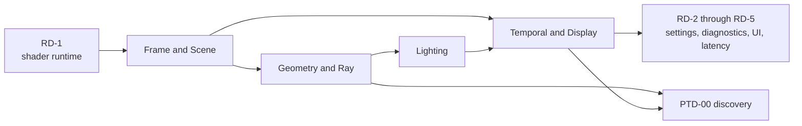

# First Release Renderer Plans

**Status:** Renderer release-plan index; routing and dependency order, not feature evidence

**Snapshot:** 2026-09-08; Renderer portfolio projection **36/100**; 26 of 26 families are `Blocked`

**Parent orchestrator:** [First Release Implementation Plan](../../../../CrossModule/FirstRelease/README.md)

**Architecture owner:** [Renderer](../README.md), [Rendering A Sparkle Frame](../RenderingASparkleFrame.md), and [Renderer Feature Dossiers](../Features/README.md)

## Choose The Plan By Result

| Plan | Primary families | Result boundary |
| --- | --- | --- |
| [Frame And Scene](FrameAndScene.md) | `FCR-REN-01`, `02`, `03` | immutable admission, Scene/View/GPU-scene preparation, graph compile/execute |
| [Geometry And Ray Tracing](GeometryAndRayTracing.md) | `FCR-REN-04`, `05`, `12`, `17`, `21`, `23` | resident visible geometry, raster/ray GBuffer, TLAS, traversal identity, and deferred decals |
| [Lighting](Lighting.md) | `FCR-REN-06`, `07`, `08` | direct/indirect lighting and discovery-gated Reference Path Tracer closure |
| [Display And Reconstruction](DisplayAndReconstruction.md) | `FCR-REN-09`, `10`, `14`, `15`, `18`, `22`, `24`–`26` | view-owned temporal/display state through grading, lens, SDR, and HDR10 output |
| [Runtime And Diagnostics](RuntimeAndDiagnostics.md) | `FCR-REN-11`, `13`, `16`, `19`, `20` | shader binding, settings, debug/capture, UI composition, latency coordination |

Every Renderer FCR appears once as a primary work owner. Cross-plan dependencies do not create a second owner.

## Dependency Order

The file boundaries group cohesive features; they do not force whole-file execution. Close `RD-1` before pipeline consumers, then Frame/Scene, Geometry/Ray, Lighting, Display, and the remaining runtime/diagnostic phases. A phase may move earlier only when its dependencies and candidate identity remain explicit.

## Common Renderer Rules

- Scene owns persistent scene truth; View owns view/camera/display/temporal truth. GPU resources mirror those authorities with generation-qualified lifetime.
- World publishes immutable render input. Renderer does not query ECS storage. RHI lowers commands and native mechanics; it does not choose scene, lighting, debug, or fallback semantics.
- Raster, inline ray query, and native ray pipeline are traversal adapters beneath shared semantic feature contracts; do not fork effect logic.
- Requested, resolved, active, unsupported, fallback, and restart-required state must be distinguishable.
- Every pass declares inputs, outputs, lifetime, queue, invalidation, failure, and observer identity. Do not hide dependencies in side effects.
- Use feature-local `AC/FM/CHK`; phase exit criteria in these plans are sequencing gates only.
- Run [architecture boundary check](../../../../../Engineering/Verification/ValidationAndEvidence.md) when Renderer/RHI responsibilities move, plus proportional native checks required by the affected claim.

## Relationship To Existing Renderer Plans

[Debug View Presentation](../Features/DebugViews/Plan.md) is a focused design migration that `RD-3` may select when its current-state reconciliation shows the release criteria require it. [Deferred GBuffer Decals](../Features/DeferredDecals/Plan.md) is the detailed subplan selected by `GR-5` for first-release `FCR-REN-23`. Plan presence alone is not scope admission; the mother plan and FCR registry provide that admission.

## Renderer-Wide Stop Conditions

Stop when scene/view ownership is ambiguous; a pass reads undeclared state; a selector lies about the active route; an RHI capability is assumed rather than queried; one traversal path implements different material/lighting semantics; history lacks identity/reset; native validation is unavailable for a required backend; or a visual result has no numerical/reference/controlled comparison required by its dossier.
