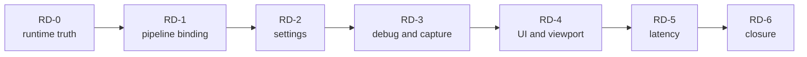

# Renderer Runtime And Diagnostics Closure Plan

**Status:** implementation plan; not shader, UX, capture, latency, performance, or release evidence

**Families:** `FCR-REN-11`, `FCR-REN-13`, `FCR-REN-16`, `FCR-REN-19`, `FCR-REN-20`

**Current readiness:** section projection **40/100**; substantial pipeline/settings/debug/UI source exists, latency is partial, and all five families are `Blocked`

**Responsibility:** sequence pipeline binding, runtime state, diagnostic presentation, viewport composition, and latency coordination closure

**Parent:** [First Release Renderer Plans](README.md)

**Architecture:** [Shader Runtime](../Features/ShaderRuntime/README.md), [Runtime Configuration](../Features/RuntimeConfiguration/README.md), [Debug Views](../Features/DebugViews/README.md), [Viewport And Diagnostics](../Features/ViewportAndDiagnostics/README.md), and [Latency Coordination](../Features/FrameExecution/LatencyCoordination.md)

## Plan At A Glance



`RD-1` is an early Renderer dependency and should execute before geometry/lighting pipeline consumers. The other phases close product-facing control and observation after the underlying frame paths are stable.

| Phase | Primary family | Result |
| --- | --- | --- |
| `RD-0` | all five | one selector/settings/pipeline/frame/capture/latency identity map |
| `RD-1` | `FCR-REN-16` | complete registered/cooked ABI and typed pipeline binding |
| `RD-2` | `FCR-REN-19` | durable requested/resolved/active settings truth |
| `RD-3` | `FCR-REN-11` | interpretable bounded debug views and capture products |
| `RD-4` | `FCR-REN-13` | immutable generation-safe UI/viewport composition |
| `RD-5` | `FCR-REN-20` | correctly scoped and measured latency coordination |
| `RD-6` | all five | candidate-bound runtime/diagnostic closure |

## `RD-0` — Freeze Runtime State And Observation Contracts

**Goal:** reconcile how a user request becomes active shader/pipeline/feature state and how that exact frame is identified in UI, debug, capture, and latency artifacts.

**Non-goals:** a new global settings registry, an internal performance-dashboard product, or making diagnostics mutable authorities.

**Required work:** trace registration/cooked shader identity, pipeline/layout/cache generation, typed bindings, settings file/CVar/command/UI precedence, requested/resolved/active/restart/fallback state, debug semantics/display mapping, capture sidecar, UI packet/product generations, frame/latency tokens, provider/backend/package matrices, and all feature criteria/checks.

**Failure modes:** state shown differs from bound pipeline; stale pipeline/cache survives ABI change; settings save lies; debug label lacks domain; capture and latency use different frame identity; UI packet holds invalid resource; unavailable provider appears enabled.

**Phase exit criteria:** one identity/state diagram and matrix covers all five families; each mutable owner and immutable observer is named; missing or conflicting acceptance blocks implementation.

**Ready-to-use prompt:**

```text
Execute RD-0 without implementation. Create ITER-REN-RD-00 mapped to the five FCRs and current AC/FM/CHK. Inspect shader registration/cook/runtime materialization, layouts/pipelines/bindings/caches, settings/config/CVars/commands/UI, RenderCoordinator transfer, debug views, capture, UI packets/viewport products, frame tokens, Streamline PCL/Reflex, selectors, CMake, package membership, and dirty work. Record mutable owners, identity/generation/lifetime, precedence, requested/resolved/active/fallback/restart state, observers, and matrices. Fix stale Architecture contracts only. Stop on duplicated state or uncorrelated frame identity.
```

## `RD-1` — Pipeline Materialization And Typed Binding

**Goal:** close `FCR-REN-16` so every admitted graphics/compute/ray pipeline validates cooked ABI, materializes correctly, binds complete current resources, and replaces generations safely.

**Non-goals:** untyped descriptor plumbing, preserving obsolete layouts, a second pipeline cache, or executing the whole Shader System plan without a failing release criterion.

**Required work:** reconcile registration/build/cook membership, code/reflection identity, every parameter/domain, graphics key completeness, capability rejection, layout/pipeline creation, typed binding, cache identity, whole-generation replacement, failed reload safe state, in-flight retirement, and retained/high-water bounds on both backends.

**Failure modes:** registered program missing; reflection/ABI mismatch accepted; cache key omits state; wrong resource domain binds; unsupported ray pipeline materializes; reload partially replaces; old generation retires while in flight; cache grows forever.

**Phase exit criteria:** complete program/parameter/domain matrix, invalid/missing/corrupt/capability/reload failures, cache key/retirement, native backend validation, and performance/memory checks pass.

**Ready-to-use prompt:**

```text
Implement RD-1 in current shader-program catalog, cooked code/reflection loader, pipeline/layout materialization, typed binding, cache, and generation-retirement owners. Reconcile FCR-REN-16 AC/FM/CHK and FCR-SHDR-01 dependencies. Ensure every registered program is built, every parameter/domain is validated, graphics/compute/ray keys are complete, and capability failure is explicit. Replace whole generations transactionally and delete obsolete layouts/caches/adapters. Exercise missing/corrupt/stale code, reflection/ABI mismatch, incomplete key/binding, unsupported feature, native create failure, reload in flight, repeated replacement, and shutdown on D3D12/Vulkan. Measure startup/cache/high-water and stop on partial replacement.
```

## `RD-2` — Settings State And Persistence

**Goal:** close `FCR-REN-19` with one aggregate requested state, deterministic precedence, durable atomic persistence, and truthful resolution/activation.

**Non-goals:** each feature parsing its own config, hiding restart requirements, writing into the package, or preserving obsolete setting aliases.

**Required work:** reconcile field/name/default/range, file location/schema, command-line/CVar/UI precedence, load/edit/save/transfer, serial/render-thread delivery, requested/CVar/resolved/active/restart state, malformed/unknown value policy, atomic save and last-good behavior, concurrent edit, queue pressure, and shutdown.

**Failure modes:** package config modified; partial save corrupts state; malformed value silently activates; unknown legacy name persists; UI/CVar/file disagree; concurrent change is lost; queue overflow applies stale state; restart-only field claims active.

**Phase exit criteria:** field/consumer coverage, valid and malformed round trip, precedence, atomic failure, concurrent/pressure/shutdown, package path, and requested-to-active state checks pass.

**Ready-to-use prompt:**

```text
Implement RD-2 in the existing renderer settings aggregate, persistence owner, CVar/command/UI adapters, RenderCoordinator transfer, and feature consumers. Inventory every field and exact consumer before edits. Establish deterministic defaults/precedence and requested/resolved/active/restart truth; use per-user paths and transactional save. Remove obsolete aliases/parallel parsers. Exercise clean first run, valid round trip, unknown/malformed/truncated/read-only save, command-line ordering, CVar/UI edits, concurrent changes, queue pressure, shutdown, unsupported provider/backend, and restart fields. Verify package immutability and report errors without false active state.
```

## `RD-3` — Debug Views, Diagnostics Products, And Capture

**Goal:** close `FCR-REN-11` with exact mode semantics, correct display treatment, explicit unavailable state, and reproducible capture metadata.

**Non-goals:** building the separate Performance Diagnostics product, exposing private development data in Shipping, or making debug output an unqualified colorimetric oracle.

**Required work:** inventory Lit/wireframe/GBuffer/lighting/GPU-scene modes and required resources; close per-view selection/show flags, labels, unavailable reasons, exposure/tone/encoding mapping, stable visualization ranges/legends, capture readback/format/sidecar/provenance, bounded observer cost, privacy and Shipping erasure; select only required phases from [Debug View Presentation](../Features/DebugViews/Plan.md).

**Failure modes:** process-global mode leaks across viewports; unavailable resource displays stale data; mode goes through wrong tone/encoding; legend/range changes without metadata; capture generation mismatches frame; private path/content leaks; observer changes timing materially.

**Phase exit criteria:** every admitted mode/resource/view/display/capture/unavailable/privacy/cost cell passes; sidecars identify candidate/frame/view/settings/domain/encoding; Shipping behavior matches scope.

**Ready-to-use prompt:**

```text
Implement RD-3 for FCR-REN-11. Reconcile current debug mode selector, per-view state, graph resources/replacement point, visualization shaders/ranges/legends, exposure/tone/encoding, RHI readback, capture writer/sidecar, Editor controls, privacy, and package selection. Compare with Docs/Architecture/Modules/Engine/Renderer/Features/DebugViews/Plan.md and execute only the phases required by current acceptance. Make unavailability explicit and remove global/duplicate state. Exercise every mode, two viewports, missing/cullable resources, resize/reload, invalid selector, capture failure, stable labels/ranges, display mappings, and Shipping erasure. Measure observer cost and bind captures to frame/candidate identity.
```

## `RD-4` — UI And Viewport Composition

**Goal:** close `FCR-REN-13` with immutable host/editor packets, generation-safe viewport products and texture handles, and correct blend/color/DPI composition.

**Non-goals:** moving UI ownership into Renderer, retaining mutable UI objects across threads, or requiring Editor UI in the Shipping runtime.

**Required work:** reconcile packet creation/copy budget/lifetime, viewport identity and generation, texture-handle validation, product publication/retirement, blend and color domain, DPI/extent, graph execution ordering, submission, resize/level switch, missing/stale products, bounds, and package behavior.

**Failure modes:** packet references mutable/freed memory; stale product sampled after resize; invalid handle indexes descriptor; UI uses wrong color/alpha convention; level switch shows old viewport; missing product crashes; Shipping includes excluded editor path.

**Phase exit criteria:** packet lifetime/copy, handle/generation/bounds, blend/color/DPI, missing/stale/failure, resize/switch/shutdown, and Shipping classification checks pass.

**Ready-to-use prompt:**

```text
Implement RD-4 in existing host/editor packet producers, Renderer replay/composition pass, viewport product registry, texture-handle resolver, RHI submission, and package targets. Record ownership/lifetime and copy budget before edits. Keep packets immutable, validate generations and bounds, make missing/stale product behavior explicit, and align blend/color/DPI/extent semantics. Exercise empty and multi-element UI, invalid/stale handles, resize/DPI/monitor changes, viewport recreation, level switch, missing render product, packet producer shutdown, and Shipping targets. Delete duplicate registries/adapters and stop on mutable cross-thread ownership.
```

## `RD-5` — Latency Coordination

**Goal:** close `FCR-REN-20` for the explicitly supported Streamline PCL/Reflex boundary, with correct six-marker frame identity and independently measured benefit.

**Non-goals:** claiming latency reduction from marker presence, supporting Vulkan Reflex when the contract excludes it, or making provider availability a runtime requirement.

**Required work:** reconcile host simulation and render submit/present frame tokens, six marker order/ownership, 64-to-32-bit conversion limits, Streamline on/off/readiness, PCL versus Reflex capability, D3D12/Vulkan boundary, sleep/marker failure, shutdown, package DLL/signature/redistribution, and measurement method separate from functional checks.

**Failure modes:** duplicate/out-of-order marker; token truncation aliases frame; marker from wrong thread/phase; provider fault stalls frame; Reflex called unsupported; missing DLL silently changes active state; shutdown uses provider after release; latency claim lacks controlled comparison.

**Phase exit criteria:** marker order/identity, misuse/provider/failure/shutdown, backend/package, requested-active state, and controlled latency measurements pass for admitted cells; unsupported cells remain explicit.

**Ready-to-use prompt:**

```text
Implement RD-5 in existing host/render frame-token and Streamline PCL/Reflex owners. Reconcile FCR-REN-20 criteria, six marker sites/order, frame conversion bounds, feature readiness, sleep/marker calls, backend/provider guards, error and shutdown paths, CMake/runtime/package payload, and settings/UI state. Exercise provider on/off/unavailable/fault, host misuse, boundary token values, D3D12 and explicit Vulkan behavior, repeated startup/shutdown, and missing/corrupt package DLL. Verify ordering independently and measure latency with a controlled protocol; do not infer benefit from successful calls. Stop on identity alias or unsupported-provider ambiguity.
```

## `RD-6` — Runtime And Diagnostics Candidate Closure

**Goal:** prove that bound pipelines, settings, debug/capture, UI composition, and latency artifacts all describe the same active frame and candidate.

**Non-goals:** one UI smoke standing in for shader/native checks or admitting the separate diagnostics product.

**Failure modes:** requested state differs from active but capture omits it; pipeline/provider DLL differs from manifest; UI/debug observe stale generation; latency token cannot join capture; evidence predates settings/shader change.

**Phase exit criteria:** all five FCR reports carry complete candidate-bound criteria/failure/check coverage, package/native/provider matrices, identity joins, performance/observer data, limitations, and explicit decisions.

**Ready-to-use prompt:**

```text
Execute RD-6 on the frozen candidate. Reconcile FCR-REN-11/13/16/19/20 evidence and run only missing joint routes: restore/edit/activate settings, materialize/bind pipelines, render/debug/capture, compose UI/viewport, mark latency, resize/reload/fail/shutdown, and package launch on admitted backends/providers. Join candidate, frame, view, resource generation, shader library, settings, provider, capture, and latency identities. Verify Shipping erasure and requested-active truth. Any implementation/config/provider/package change invalidates affected evidence. File exact decisions without promoting the separate diagnostics product.
```
