# Renderer

**Status:** module index and current-system reading route; not executable or release evidence

**Scope:** explain how Sparkle renders a frame, identify the Renderer features that contribute to it, and route exact capability, design, source, and evidence questions to one owner

**Current-state basis:** source and build configuration rechecked 2026-09-06 through committed `master` revision `c28b33bd`; executable Renderer source is unchanged from the earlier `8414b5dc` audit

**Current readiness:** **36/100** portfolio average (`I/R` present; `V/D = 0/0`); all 26 tracked Renderer families remain Blocked. See [Current Feature Readiness](../../../../Acceptance/CurrentReadiness.md#renderer).

The Renderer turns an immutable world submission into a lit, post-processed, presented frame. It owns scene/view/frame meaning; the RHI owns low-level GPU mechanisms and backend translation.

> [!IMPORTANT]
> **Current state:** Broad Renderer paths exist in source for raster and ray rendering, ReSTIR lighting, post processing, diagnostics, and serial/render-thread execution.
>
> **Readiness:** **36/100** — established families derive their score from source implementation/integration, while four admitted absent features score zero; no Renderer family has candidate verification or delivery credit.
>
> **Main limitation:** These paths are not release-proved, lighting currently depends on ray tracing, and several familiar rendering features are explicitly absent.
>
> **Evidence:** Source/build membership was rechecked through 2026-09-06. No build, GPU run, visual, performance, backend-parity, or package result is claimed here.

## At A Glance

| You have | You do not have yet |
| --- | --- |
| Persistent render-side scene plus view-local camera/display/history state | Accepted scene/view lifetime, capacity, multi-view, and reload evidence |
| CPU visibility, resource residency, frame graph, typed shader/pipeline runtime | Occlusion culling, LOD selection, GPU-driven indirect drawing, stereo, or multiview |
| Raster, inline-ray, and native-ray-pipeline GBuffer frontends | Proved parity across frontends/backends and transparent blended materials |
| ReSTIR direct/indirect lighting and an accumulating reference mode | Non-ray lighting/shadow fallback, credible accepted reference oracle, volumetric lighting |
| Exposure, Linear/DLSS reconstruction, tone mapping, debug views, UI and SDR presentation | First-release targets still missing: deferred decals, color grading, chromatic aberration, HDR10 output; excluded: frame generation |
| Requested settings, diagnostics, capture products, shader-generation replacement | Complete requested-versus-active, failure, stress, quality, and performance evidence |

## How A Frame Moves Through The Renderer

The solid path is the normal frame. Dashed paths replace or specialize part of it.

```mermaid
flowchart LR
    Submit[Immutable world submission] --> Scene[Persistent scene update]
    Scene --> View[View and temporal preparation]
    View --> Ready[Visibility and resource readiness]
    Ready --> GBuffer[Raster or ray GBuffer]
    GBuffer --> Lighting[Direct and indirect lighting]
    Lighting --> Reconstruct[Exposure and reconstruction]
    Reconstruct --> Tone[Tone mapping and output encoding]
    Tone --> UI[UI and viewport composition]
    UI --> RHI[RHI submission and presentation]

    GBuffer -. debug view .-> Tone
    Lighting -. reference accumulation .-> Reconstruct
    Ready -. BLAS/TLAS preparation .-> GBuffer
```

Start with [Rendering A Sparkle Frame](RenderingASparkleFrame.md) for the complete owner-to-retirement explanation.

## Feature Families

| Family | What it contributes | Current boundary | Read next |
| --- | --- | --- | --- |
| Frame execution | admission, serial/render-thread coordination, frame graph, history, latency markers, submission lifetime | Implemented path; equivalence, overlap, rebuild, and shutdown remain unproved | [Frame Execution](Features/FrameExecution/README.md) |
| Scene and view preparation | persistent scene identity, view-local state, GPU-scene publication | Implemented path; capacity, failure, deformation, and multi-view evidence open | [Scene And View Preparation](Features/SceneAndViewPreparation/README.md) |
| Geometry and resources | residency, visibility, batching, raster/ray GBuffer material contract | Partial; broad source path, but advanced visibility/draw features and transparent blending absent | [Geometry And Resources](Features/GeometryAndResources/README.md) |
| Ray tracing | BLAS/TLAS/PTLAS planning plus inline and native traversal | Capability-gated; effect/backend parity and lifecycle proof open | [Ray Tracing](Features/RayTracing/README.md) |
| Lighting | direct/indirect surface transport, ReSTIR/reference modes, sky/emissive composition | Implemented path but ray-dependent and unproved; volumetrics absent | [Lighting](Features/Lighting/README.md) |
| Post processing | exposure, resolution, reconstruction/upscaling, tone mapping, encoding, presentation | Mixed current/gated/absent capabilities | [Post Processing](Features/PostProcessing/README.md) |
| Viewport and diagnostics | products, timing/memory observations, capture, UI packet composition | Implemented path; truthfulness, lifetime, observer cost, and package scope unproved | [Viewport And Diagnostics](Features/ViewportAndDiagnostics/README.md) |
| Runtime configuration | selectors, requested state, persistence, active-state resolution | Partial; one known ineffective selector and package-safe persistence gaps remain | [Runtime Configuration](Features/RuntimeConfiguration/README.md) |
| Shader runtime | registered program catalog, typed binding, graphics/compute/ray pipeline materialization, generation replacement | Implemented path; ABI, backend, cache, reload, and build-member evidence open | [Shader Runtime](Features/ShaderRuntime/README.md) |
| Debug views and decals | intermediate visualization plus the admitted deferred-decal target | Debug path exists but is unproved; deferred decals are mandatory but not implemented | [Debug Views](Features/DebugViews/README.md), [Deferred Decals](Features/DeferredDecals/README.md) |

The [complete feature guide](Features/README.md) maps every `REN-*` family, source owner, local acceptance contract, and missing evidence item.

## Execution And Backend Matrix

| Path | D3D12 | Vulkan | Important limit |
| --- | --- | --- | --- |
| Raster GBuffer and deferred surface lighting inputs | Implemented source path | Implemented source path | No accepted native validation or output-equivalence result |
| Inline ray GBuffer and direct visibility | Capability-gated path | Capability-gated path | Requires ray-query/device/descriptor readiness |
| Native ray-pipeline GBuffer and direct visibility | Capability-gated path | Capability-gated path | Shader-table/backend parity remains unproved |
| ReSTIR direct/indirect | Implemented source path | Implemented source path | Secondary/reference paths do not all use both traversal frontends |
| Reference path-traced accumulation | Implemented source path | Implemented source path | Discovery blocks calling it unbiased, converged, or a ground-truth oracle |
| Linear reconstruction | Implemented source path | Implemented source path | Quality/cost range and scale limits remain unproved |
| NVIDIA DLSS SR/RR, PCL, Reflex | Capability-gated path | Not a supported active route | Vendor runtime, hardware, DLL, redistribution, and fallback constraints |
| SDR presentation | Implemented source path | Implemented source path | Candidate proof remains open |
| HDR10 presentation | Not found; first-release target | Not found; first-release target | Renderer transform, RHI activation/metadata, fallback, and HDR-hardware proof are required |

`Implemented source path` is not a backend pass. Use [Graphics Feature Coverage](../../../CrossModule/GraphicsCoverageMatrix.md) for exact cells and [Feature Execution Traces](../../../CrossModule/FeatureExecutionTraces.md) for vertical paths.

## How To Select And Observe Features

Renderer behavior is requested through startup/CVar configuration, persisted aggregate rendering settings, editor controls, and per-viewport state. The feature owner resolves that request against backend/device/provider readiness and must expose what actually became active.

- [Feature Selector Catalog](Features/RuntimeConfiguration/FeatureSelectorCatalog.md) lists current controls, defaults, consumers, and known ineffective/absent selectors.
- [Settings State And Persistence](Features/RuntimeConfiguration/SettingsStateAndPersistence.md) explains startup, editor commit, persistence, restart, and package-location behavior.
- [Diagnostics, Products, And Capture](Features/ViewportAndDiagnostics/DiagnosticsProductsAndCapture.md) explains observable frame/pass/memory/product identity.
- [Debug Views](Features/DebugViews/README.md) explains intermediate render-output selection and presentation.

Silent substitution is not support. A requested ray/provider/debug path that cannot activate must report the active path and reason or fail according to its dossier.

## Design Decisions And Tradeoffs

| Decision | Benefit | Cost or drawback |
| --- | --- | --- |
| Persistent scene data and view-local data have different owners | Prevents camera/history state from contaminating shared scene identity | Publication, invalidation, and multi-view joins require explicit generations |
| World submissions are immutable at the Renderer boundary | Safer serial/threaded execution and no direct ECS reads | Submission copying/queueing and stale-frame rejection need capacity control |
| One frame graph owns pass/resource dependencies | Central barriers, queue order, transient lifetime, culling, and parallel recording | Graph rebuild/materialization adds CPU complexity and another failure boundary |
| Raster and ray GBuffer frontends share one material-result contract | Makes semantic parity possible and keeps lighting independent of traversal API | Alpha, SBT, acceleration structures, and frontend-specific capability gaps remain complex |
| Lighting is composed from separate lobe products | Easier debugging and direct/indirect isolation | More persistent/transient products, history, bandwidth, and synchronization |
| Optional provider integrations sit behind semantic reconstruction/latency contracts | Core frame meaning does not become NVIDIA-specific | Capability checks, packaging, fallback truth, and D3D12-only restrictions remain visible costs |
| Unsupported effects have explicit negative dossiers | Readers can distinguish absence from forgotten documentation | The feature guide is larger and depends on a concise landing page like this one |

## Known Limitations

- Current surface lighting has no shadow-map or other fully non-ray fallback.
- Transparent blending and many advanced material lobes are outside the current GBuffer/material contract.
- Occlusion, LOD, mesh/task shaders, GPU-driven indirect draws, stereo, and multiview are absent.
- Deferred decals, color grading, chromatic aberration, and HDR10 display output are absent but first-release admitted; volumetric lighting and frame generation remain absent and excluded.
- NVIDIA reconstruction/latency integrations are optional and do not imply Vulkan, non-NVIDIA, package, or quality support.
- The reference path mode cannot be used as an acceptance oracle until its discovery/derivation/evidence gate passes.
- Source inspection does not establish visual quality, temporal stability, performance, memory bounds, native validation, or release readiness.

## Evidence And Reference

| Need | Document |
| --- | --- |
| Exact current capability states, limits, and non-claims | [Renderer Capability Inventory](CapabilityInventory.md) |
| Every feature dossier and local proof contract | [Renderer Feature Guide](Features/README.md) |
| Full frame lifecycle | [Rendering A Sparkle Frame](RenderingASparkleFrame.md) |
| First-release Renderer work packages | [Renderer First-Release Plans](FirstRelease/README.md) |
| External renderer ownership and implementation comparison | [Renderer Repositories Research](RendererRepositoriesResearch.md) |
| Renderer/RHI ownership invariant | [Renderer And RHI Decision](../../../Decisions/RendererRhiBoundary.md) |
| Smallest missing checks | [Renderer Evidence Plan](../../CapabilityEvidencePlan.md#renderer-capability-to-evidence-map) |
| Candidate/release status | `FCR-REN-*` families in [Feature Completion Reports](../../../../Acceptance/FeatureCompletionReports.md) and [First Release](../../../../Acceptance/FirstRelease.md) |

Primary implementation routes are `Engine/Renderer/Public`, `Engine/Renderer/Private`, `Engine/Renderer/ShaderRegistrations`, and `Engine/Renderer/CMakeLists.txt`. Verify those paths before changing a current-state claim.
