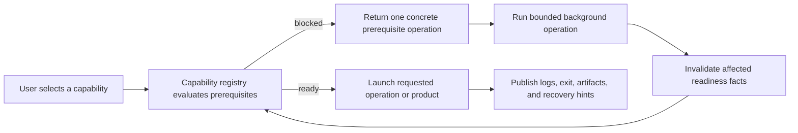

# Launcher Capability Inventory

**Status:** capability snapshot; current, but not workflow success or distribution evidence

**Snapshot:** 2026-09-08 at committed `master` revision `ffe60e3a`; Launcher public contracts, planners/executors, Qt GUI, shell path, capability graph, dependencies, level catalog, state paths, process handoff, clean containment, and CMake membership inspected; evidence `S` only

**Scope:** repository discovery, toolchain/dependency readiness, configure/build, cooking, content acquisition, running products, cleaning, quick start, operation history, cancellation, and GUI/shell access

**Owner:** `Tools/Launcher/SparkleLauncher` / `SparkleLauncherCore` and `SparkleLauncher`

**Evidence and disposition:** [Capability Evidence Plan](../../../../Plans/CapabilityEvidence.md) and [First Release Acceptance Contract](../../../../Acceptance/FirstRelease.md)

**Current readiness:** **50/100** — a broad developer workflow exists in source; clean-machine execution, cancellation/failure truth, distribution classification, and adoption evidence remain open. See [Current Feature Readiness](../../../../Acceptance/CurrentReadiness.md#product-build-and-delivery).

## At A Glance

| User intent | Launcher responsibility | Success boundary |
| --- | --- | --- |
| prepare workspace | discover repository/project, inspect toolchain/dependencies, and propose the exact missing operation | readiness is revalidated immediately before execution |
| configure/build | select generator, compiler, profile, features, and focused targets; track freshness | final target exit plus expected attributable artifacts |
| acquire/cook content | resolve catalog dependencies, download/verify/extract, and run scoped cooks | selected content products and manifests are ready, not merely downloaded |
| run product | verify executable/runtime/cooked prerequisites and launch from project context | follow the live child/handoff and product log, not only the initial process ID |
| clean/repair | preview exact contained targets, preserve declared paths, require confirmation for destructive scopes | only approved roots are changed and downstream readiness invalidates |

Launcher is a capability planner and operation host. It is not a package manager, CI service, release installer, or proof that the product it launched remained healthy.

## Frontend And Planning Model

| ID | Capability | State | Exact current coverage and limit | Evidence |
| --- | --- | --- | --- | --- |
| `LAUNCH-001` | Qt GUI | Implemented path | Windows GUI with Home/Quick Start, workflow pages, options, toolchain/dependency/content status, level cards/thumbnails, activity/output, cancellation, and persisted launcher settings. Qt 6.8 Widgets is required. | `S` |
| `LAUNCH-002` | Shell route | Implemented path | Same executable accepts root/profile/compiler/IDE/scope/target/level/API/cook/clean options plus `--dry-run` and `--run <operation-id>`. It exposes core operation planners without the GUI. | `S` |
| `LAUNCH-003` | Immutable operation plan | Implemented path | Each action records inputs, readiness, steps, display command lines, log paths, planned effects, destructive scope/confirmation, timing, exit code, status, and failure summary before/after execution. | `S` |
| `LAUNCH-004` | Quick Start dependency graph | Implemented path | Capability providers resolve host tool -> source dependencies -> workspace -> level content -> cooked products -> runnable level, returning the next unmet operation and invalidating downstream capabilities after changes. | `S` |
| `LAUNCH-005` | Background operation service | Implemented path | Each GUI run has a unique ToolInvocation task scope, streams output, retains activity, prevents duplicate active run IDs, supports cancellation, and joins scopes on teardown. | `S` |

## Workspace And Toolchain Operations

| ID | Operation/capability | State | Exact current coverage and limit | Evidence |
| --- | --- | --- | --- | --- |
| `LAUNCH-006` | Repository/content discovery | Implemented path | Resolves repository markers, `RepositoryRoot.txt`, default Showcase content, project marker, catalog, and artifact paths; reports unreadable/missing state. | `S` |
| `LAUNCH-007` | Toolchain detection | Implemented path | CMake, MSBuild/Ninja, Visual Studio/vswhere/installer, Rider, Git, MSVC or clang-cl, Qt/qmake, Windows SDK, shader SDK/runtime, Vulkan SDK, and Streamline/source state. Some entries are advisory; plan owns requiredness. | `S` |
| `LAUNCH-008` | Source dependency sync | Capability-gated | `workspace.sync-code` can populate one or all enabled FetchContent caches and refresh configure state; dependency inventory checks required files and exposes per-dependency cleanup. Network/recovery behavior is not evidenced here. | `S` |
| `LAUNCH-009` | Build-file generation | Implemented path | `workspace.generate-build-files` selects Visual Studio or Rider-oriented generator flow, x64, MSVC/clang-cl, Qt, feature set, and writes a freshness stamp. | `S` |
| `LAUNCH-010` | Freshness diagnosis | Implemented path | Detects missing build/cache/solution/stamp, generator mismatch, feature mismatch, source-list/input change, and unsupported state; build actions can configure first when stale. | `S` |
| `LAUNCH-011` | Workspace build | Implemented path | `workspace.build` builds selected Editor, Runtime, CookTools, and Launcher scopes/targets; focused operations build launcher/editor/runtime/cook tools separately. | `S` |
| `LAUNCH-012` | Launcher self-build | Implemented path | `launcher.build.self` builds the local launcher artifact. Replacing a currently running binary and relaunch handoff require runtime evidence. | `S` |
| `LAUNCH-013` | Host-tool install | Partial | `workspace.install-host-tool` delegates to a registered launcher-owned provider when a detected tool advertises install support. This is not a general package manager. | `S` |

## Content, Cook, Run, And Maintenance Operations

| ID | Operation | State | Exact current coverage and limit | Evidence |
| --- | --- | --- | --- | --- |
| `LAUNCH-014` | Level sync | Capability-gated | `levels.sync` resolves explicitly requested or selected catalog levels, includes parent asset packs, checks runtime/download support, downloads verified archives through CMake script, and extracts to declared roots. | `S` |
| `LAUNCH-015` | Cook workspace | Implemented path | `cook.workspace` runs selected shader/texture/scene scopes in one request after build/tool/runtime-bundle readiness checks. | `S` |
| `LAUNCH-016` | Focused/full cooks | Implemented path | `cook.shaders`, `cook.textures`, `cook.assets`, and `cook.all`; incremental or confirmed Force mode; shader backend/debug/optimization/warnings/strip options. | `S` |
| `LAUNCH-017` | Force recook safety | Implemented path | Force mode plans removal of the exact cooked output root and refuses execution without explicit confirmation. | `S` |
| `LAUNCH-018` | Run level | Implemented path | `levels.run` resolves editor/game target and matching profile, checks executable plus cooked mesh/texture/shader readiness, sets level/API environment, uses the project directory, and launches the real product child process. | `S` |
| `LAUNCH-019` | Build profiles | Implemented path | All six Debug/Development/Shipping x Editor/Game profiles; focused target name is `<Project>Editor` or `<Project>Runtime`. | `S` |
| `LAUNCH-020` | Graphics API choice | Implemented path | Run request carries `d3d12` or other accepted API text to product environment; actual compiled backend/device validation remains product evidence. | `S` |
| `LAUNCH-021` | Clean workspace | Implemented path | `workspace.clean` supports confirmed cooked outputs, build tree, artifacts, IDE state, dependency cache, logs, or pristine generated workspace; previews exact targets/counts/bytes and supports preserved paths. | `S` |
| `LAUNCH-022` | Logs/recovery | Implemented path | Per-step log paths, captured output, status/timing/exit code, categorized recovery hints, copy-output UI, and history records. Diagnostic usefulness still needs first-user evidence. | `S` |

## Vertical Quick-Start Trace

Launcher discovers repository/content -> loads settings/catalog -> capability registry evaluates requested `levels.run` -> if host/dependency/workspace/content/cook prerequisite is missing it returns one concrete operation -> user executes it in a scoped background task -> planner revalidates inputs/readiness immediately before each destructive/process step -> child output and exit status update activity -> downstream capability IDs are invalidated -> resolution repeats until `levels.run` launches the editor/runtime child.

## `FCR-PROD-03` Launcher Contract

Launcher is **Developer-only** and must remain an optional frontend over the source-owned operations. It is not shipped, cannot be a runtime prerequisite, and cannot become the package-policy owner.

| ID | Binary acceptance criterion |
| --- | --- |
| `AC-PROD03-01` | From a documented repository root, the GUI and shell route discover the exact source/toolchain/project state, identify Developer-only status, and produce the same typed operation request/result for equivalent sync/configure/build/cook/run/clean intent. |
| `AC-PROD03-02` | Readiness distinguishes ready, missing, stale, unsupported, unavailable, failed, cancelled, timed out, skipped, and missing-artifact states; success requires zero exit plus every operation-specific final artifact/consumer oracle. |
| `AC-PROD03-03` | Run follows the final `ShowcaseEditor`/`ShowcaseRuntime` child through requested-level activation or actionable failure; Launcher process creation/PID/exit alone is never success. |
| `AC-PROD03-04` | Cancellation and close settle the owned process tree/task scope once within budget, retain the final log/result, preserve the prior accepted products, and permit a clean retry. |
| `AC-PROD03-05` | Clean/force-recook previews canonical contained targets and byte/file counts, requires explicit confirmation, honors preserved paths, and changes no source or per-user runtime state. |

| ID | Cause/injection, safe result, and affected criterion |
| --- | --- |
| `FM-PROD03-01` | Remove each required tool/SDK or expected output. The capability graph must name the missing owner and refuse dependent work; warning text, skipped work, or an old artifact cannot satisfy `AC-PROD03-02`. |
| `FM-PROD03-02` | Start a child that exits, fails activation, or hands off to another process. Launcher follows the authoritative descendant/product log and reports failure unless the requested active identity is observed (`AC-PROD03-03`). |
| `FM-PROD03-03` | Cancel during download/build/cook/run and close during cancellation. Descendants settle, previous accepted output remains, and exactly one Cancelled/Failed result is retained (`AC-PROD03-04`). |
| `FM-PROD03-04` | Add source/sentinel/reparse/preserved/locked paths around a clean target. Path escape or source mutation is severity-critical; partial deletion must report failure (`AC-PROD03-05`). |
| `FM-PROD03-05` | Run equivalent GUI/shell requests with Unicode/spaces and stale settings. Divergent command semantics/artifacts or environment-only repair fails `AC-PROD03-01`. |

| Check | Claims falsified | Smallest route and fixed oracle |
| --- | --- | --- |
| `CHK-PROD03-01` | `AC-PROD03-01`, `AC-PROD03-02`; `FM-PROD03-01`, `FM-PROD03-05` | Use GUI and `--dry-run`/`--run` against the same disposable repository states, then compare typed plan, requiredness, command, effects, final category, and artifacts for normal, missing-tool, stale, Unicode, and missing-artifact cases. |
| `CHK-PROD03-02` | `AC-PROD03-03`, `AC-PROD03-04`; `FM-PROD03-02`, `FM-PROD03-03` | Launch one requested level, follow child/handoff/activation identity, then inject early exit and cancel each external-operation class. Process-tree, operation-result, log, artifact hashes, and settlement time are the oracle. |
| `CHK-PROD03-03` | `AC-PROD03-05`; `FM-PROD03-04` | Execute preview and confirmed clean/force recook in a disposable repository with containment fixtures. Diff the complete filesystem; only the exact approved roots may change and incomplete cleanup must fail. |

Candidate results belong in `FCR-PROD-03`; source presence does not pass these checks.

## Explicit Non-Capabilities And Risks

- No packaged product creation, installer, updater, release-channel client, account/cloud service, remote build, or artifact upload is present.
- Level synchronization is catalog/CMake-script driven and Windows-workspace oriented; large downloads, resume, proxy, disk-full, hash failure, and interrupted extraction need evidence.
- A successful initial Launcher process is not proof that a generated replacement or launched game/editor remained alive; handoff must follow the final child process and product log.
- “Install Host Tool” is provider-bound; only tools with an implemented provider and `CanInstall` are installable.
- Destructive paths are planned and confirmed, but each scope still needs path-containment and preservation evidence on a disposable workspace.
