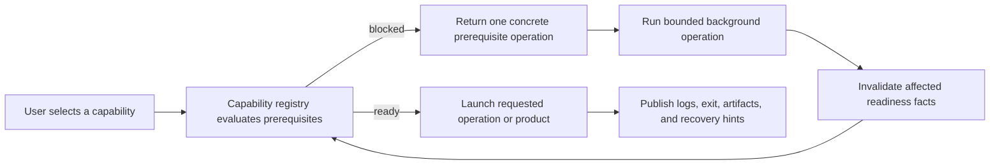

# Launcher Capability Inventory

**Status:** capability snapshot; current, but not workflow success or distribution evidence

**Snapshot:** 2026-10-04 against base revision `26803f97` with the current Launcher change applied; Launcher public contracts, planners/executors, Qt GUI, shell path, capability graph, dependencies, level catalog, state paths, process handoff/progress decoding, clean containment, and CMake membership inspected; evidence `S` only

**Scope:** repository discovery, toolchain/dependency readiness, configure/build, cooking, content acquisition, running products, cleaning, quick start, operation history, cancellation, and GUI/shell access

**Owner:** `Tools/Launcher/SparkleLauncher` / `SparkleLauncherCore` and `SparkleLauncher`

**Evidence and disposition:** [Capability Evidence Plan](../../CapabilityEvidencePlan.md) and [First Release Acceptance Contract](../../../../Acceptance/FirstRelease.md)

**Current readiness:** **50/100** — a broad developer workflow exists in source; clean-machine execution, cancellation/failure truth, distribution classification, and adoption evidence remain open. See [Current Feature Readiness](../../../../Acceptance/CurrentReadiness.md#product-build-and-delivery).

## At A Glance

| User intent | Launcher responsibility | Success boundary |
| --- | --- | --- |
| prepare workspace | discover repository/project, inspect toolchain/dependencies, and propose the exact missing operation | readiness is revalidated immediately before execution |
| configure/build | select generator, compiler, profile, features, and focused targets; track freshness | final target exit plus expected attributable artifacts |
| acquire/cook content | resolve catalog dependencies, download/verify/extract, and run scoped cooks | selected content products and manifests are ready, not merely downloaded |
| run product | verify executable/runtime/cooked prerequisites and launch from project context | follow the live child/handoff and product log, not only the initial process ID |
| clean/repair | preview exact contained targets, preserve declared paths, require confirmation for destructive scopes | only approved roots are changed and downstream readiness invalidates |

```mermaid
flowchart LR
    Intent[User selects a capability] --> Evaluate[Capability registry evaluates prerequisites]
    Evaluate -->|ready| Run[Launch requested operation or product]
    Evaluate -->|blocked| Next[Return one concrete prerequisite operation]
    Next --> Execute[Run bounded background operation]
    Execute --> Invalidate[Invalidate affected readiness facts]
    Invalidate --> Evaluate
    Run --> History[Publish logs, exit, artifacts, and recovery hints]
```

Launcher is a capability planner and operation host. It is not a package manager, CI service, release installer, or proof that the product it launched remained healthy.

## Frontend And Planning Model

| ID | Capability | State | Exact current coverage and limit | Evidence |
| --- | --- | --- | --- | --- |
| `LAUNCH-001` | Qt GUI | Implemented path | Windows GUI with Home/Quick Start, workflow pages, options, toolchain/dependency/content status, level cards/thumbnails, activity/output, cancellation, and persisted launcher settings. Qt 6.8 Widgets is required. | `S` |
| `LAUNCH-002` | Shell route | Implemented path | Same executable accepts root/profile/compiler/IDE/scope/target/level/API/cook/clean options plus `--dry-run` and `--run <operation-id>`. It exposes core operation planners without the GUI. | `S` |
| `LAUNCH-003` | Immutable operation plan | Implemented path | Each action records inputs, readiness, steps, display command lines, log paths, planned effects, destructive scope/confirmation, timing, exit code, status, and a typed terminal failure with problem kind, root summary, and expected action. | `S` |
| `LAUNCH-004` | Quick Start dependency graph | Implemented path | Capability providers resolve level content, the selected product executable, and cooked products into the next genuinely missing operation. After each operation, the planner reads current output readiness again; it carries no parallel invalidation state and does not force build or cook work for existing outputs. Existing outputs are presumed current until the user explicitly rebuilds or recooks. Cooked-shader readiness still requires the complete non-empty publication set and matching map/library hashes so an interrupted or internally inconsistent publication cannot launch. Source timestamps and build-file freshness are not automatic Quick Start invalidators. | `S` |
| `LAUNCH-005` | Background operation service | Implemented path | Each GUI run has a unique ToolInvocation task scope, streams output, retains activity, prevents duplicate active run IDs, supports cancellation, and joins scopes on teardown. Tool-owned action/item/count progress records drive the selected-run phase and progress bar without appearing in the human-readable log; producers publish semantic identities while shared progress support owns formatting and transport. A determinate percentage is shown only when the tool publishes authoritative completed and total work, while unknown totals remain indeterminate. | `S` |

## Workspace And Toolchain Operations

| ID | Operation/capability | State | Exact current coverage and limit | Evidence |
| --- | --- | --- | --- | --- |
| `LAUNCH-006` | Repository/content discovery | Implemented path | Resolves an explicit `--root`, then the working directory, then Launcher-location ancestors against repository markers; no builder-machine path is embedded in the artifact. It also resolves default Showcase content, project markers, catalogs, and artifact paths and reports unreadable/missing state. | `S` |
| `LAUNCH-007` | Toolchain detection | Implemented path | CMake, MSBuild/Ninja, Visual Studio/vswhere/installer, Rider, Git, MSVC or clang-cl, Qt/qmake, Windows SDK, shader SDK/runtime, Vulkan SDK, and Streamline/source state. Some entries are advisory; plan owns requiredness. | `S` |
| `LAUNCH-008` | Source dependency sync | Capability-gated | `workspace.sync-code` configures exact private state under `build/_dependency-sync/<Dependency>/`, populates one or all enabled entries in the shared `build/_deps` FetchContent cache, and exits before product generation. Dependency inventory checks required files and exposes per-dependency cleanup. Network/recovery behavior is not evidenced here. | `S` |
| `LAUNCH-009` | Build-file generation | Implemented path | `workspace.generate-build-files` selects Visual Studio or Rider-oriented generator flow, x64, MSVC/clang-cl, Qt, and the feature set; it always owns canonical `build/` and writes a freshness stamp. Root CMake rejects output elsewhere, while isolated validation configurations must pair `build/variants/<name>` with `artifacts/<name>/`. | `S` |
| `LAUNCH-010` | Freshness diagnosis | Implemented path | Detects missing build/cache/solution/stamp, generator mismatch, feature mismatch, source-list/input change, and unsupported state; build actions can configure first when stale. | `S` |
| `LAUNCH-011` | Workspace build | Implemented path | `workspace.build` builds selected Editor, Runtime, CookTools, and Launcher scopes/targets; focused operations build launcher/editor/runtime/cook tools separately. | `S` |
| `LAUNCH-012` | Launcher self-build | Implemented path | GUI execution and every mutating shell operation hand off to a per-user shadow generation before work. Operation metadata marks a build that replaces the Launcher artifact, so a shell caller releases the loaded artifact instead of synchronously holding it; progress and the terminal result remain in Launcher logs. `launcher.build.self` configures the Launcher-owned product entry point and builds that graph without depending on full-workspace freshness or optional engine SDKs; replacement and relaunch still require runtime evidence. | `S` |
| `LAUNCH-013` | Host-tool install | Partial | `workspace.install-host-tool` delegates to a registered launcher-owned provider when a detected tool advertises install support. This is not a general package manager. | `S` |

Launcher source construction has its own top-level `Tools/Launcher` CMake
entry point. That graph owns only Core, Tasks, ToolConsoleSupport, Launcher,
Qt, spdlog, and the embedded icon asset, and writes CMake/compiler state beneath
`build/private/tools/SparkleLauncher/`. The repository-root entry point owns
the full workspace. This separation is structural: no bootstrap/product mode
argument changes either graph, and optional SDKs or engine dependencies enrich
Launcher capabilities only after runtime detection.

Toolchain discovery separates Launcher construction requirements from full
workspace configure requirements. CMake, the selected native generator and
compiler, Git, Windows SDK, and Qt gate Launcher construction. Shader compiler
and Vulkan/Streamline SDK state remains visible and gates only workspace
operations whose selected feature set needs it.

Host-tool installation uses the installed Visual Studio Installer only for its
documented `modify` operation and component identifiers. The elevated
PowerShell host owns process waiting and exit-code capture; bootstrapper-only
arguments are not forwarded to `setup.exe`. Success is accepted only after a
fresh toolchain scan finds both the compiler and its MSBuild toolset.

## Content, Cook, Run, And Maintenance Operations

| ID | Operation | State | Exact current coverage and limit | Evidence |
| --- | --- | --- | --- | --- |
| `LAUNCH-014` | Level sync | Capability-gated | `levels.sync` resolves explicitly requested or selected catalog levels, includes parent asset packs, and acquires archive or tracked loose-file payloads into declared roots. Pinned sizes and SHA-256 digests are verified before transactional publication. Sync All requests the runtime-supported levels and selects them only after successful acquisition; individual missing supported maps show Sync, while runtime-unsupported maps show their blocker. Explicit source sync can acquire unsupported maps without making them runnable. | `S` |
| `LAUNCH-015` | Cook workspace | Implemented path | `cook.workspace` runs selected shader/texture/scene scopes in one request after build/tool/runtime-bundle readiness checks. | `S` |
| `LAUNCH-016` | Focused/full cooks | Implemented path | `cook.shaders`, `cook.textures`, `cook.assets`, and `cook.all`; incremental or confirmed Force mode; shader backend/debug/optimization/warnings/strip options. | `S` |
| `LAUNCH-017` | Force recook safety | Implemented path | Force mode plans removal of the exact cooked output root and refuses execution without explicit confirmation. | `S` |
| `LAUNCH-018` | Run level | Implemented path | `levels.run` resolves the editor/game target and matching profile, checks that the selected executable and required cooked mesh/texture/shader products exist, and launches them without an automatic incremental build or source-freshness cook. Missing outputs still select the narrow required build or cook operation. It sets level/API environment, uses the project directory, and launches the real product child process. Build and cook children complete on exit; an interactive product launch completes only when the Application host reports the exact requested level active through the Core process-readiness channel. Until that signal, cancellation retains process-tree ownership; afterward Core transfers product lifetime while its inherited output continues in the durable operation log. | `S` |
| `LAUNCH-019` | Build profiles | Implemented path | All six Debug/Development/Shipping x Editor/Game profiles; focused target name is `<Project>Editor` or `<Project>Runtime`. | `S` |
| `LAUNCH-020` | Graphics API choice | Implemented path | Run request carries `d3d12` or other accepted API text to product environment; actual compiled backend/device validation remains product evidence. | `S` |
| `LAUNCH-021` | Clean workspace | Implemented path | `workspace.clean` supports confirmed cooked outputs, build tree, artifacts, IDE state, dependency cache, typed per-user development logs/settings, legacy outputs, or pristine generated workspace; previews exact targets/counts/bytes and supports preserved paths. The GUI exposes the broad pristine scope only through an explicit All action; individually selecting every visible category retains those exact categories rather than silently broadening to pristine cleanup. Scopes containing project-local targets require a selected content project before planning. The running Launcher is preserved when artifacts are selected. | `S` |
| `LAUNCH-022` | Logs/recovery | Partial | Per-step log paths, captured output, status/timing/exit code, typed problem categories, root summaries, expected actions, copy-output UI, and history records exist. GUI and shell render the same terminal contract; GUI state color supplements explicit text and icons. Direct child-start failures receive policy/access/missing-file/OS recovery from the shared operation model instead of frontend prose matching. A nested tool rejection is still flattened into its parent tool's nonzero exit unless that tool publishes a typed child-start result, so the named log remains the authority for the exact nested child. | `S`; nested propagation remains open |

## Path API Boundary

Launcher code consumes two deliberately separate contracts:

- Core's `WorkspaceOutputPaths` owns repository-generated build and artifact
  locations, including the dependency cache and owner/profile-specific
  products. Build, cook, run, clean, capability, and GUI preview code all use
  this contract.
- The private `LauncherStatePaths` collaboration owns per-user launcher
  settings, activity, archives, live instances, and operation logs. It never
  exposes or derives workspace products.

Core privately implements workspace-output and user-state directory grammar;
`SparkleLauncherCore` privately implements Launcher leaf paths. Callers do not
own repository hashing, platform-local state selection, or literal root
segments. Product/editor mutable state is not a Launcher path variant: the
Launcher uses Core's public `ProductUserStatePaths` contract when it must
inspect or clean that state. This separation prevents a broad path utility
from becoming a second layout authority.

Launcher planners and UI orchestrators resolve these contracts at their
operation boundary, then hand concrete semantic paths to dependency checks,
process steps, cleanup mechanics, and preview models. A receiving feature may
add only its own leaf filename or owner-specific diagnostic subtree. It must
not accept a repository root merely to reproduce shared build, artifact, or
user-state grammar. Related target binary, library, and symbol directories
travel together as `WorkspaceTargetOutputPaths` so the three destinations
cannot drift through duplicated call-site logic.

Maintenance scope IDs are defined and parsed by the public maintenance
contract. The private maintenance planner expands each scope into one typed
clean-action list; both preview/counting and execution project that same list.
Cleanup mechanics receive the exact destructive and preserved paths and do not
infer special directories from filenames such as `_deps`.

Launcher UI icons are embedded Qt resources. The built launcher therefore
does not read its icon font from `build/_deps` at runtime; deleting private
build state cannot remove navigation or activity icons from a rebuilt
launcher artifact. Existing binaries retain their original resource contract
until rebuilt and relaunched.

## Vertical Quick-Start Trace

Launcher discovers repository/content -> loads settings/catalog -> capability registry evaluates requested `levels.run` -> if content or a required executable/cooked product is absent or internally incomplete it returns one concrete operation -> user executes it in a scoped background task -> planner re-observes readiness immediately before each destructive/process step -> child output, typed phase progress, typed process-start result, and exit status update activity -> resolution reads current readiness again until `levels.run` launches the editor/runtime child. An existing executable is runnable regardless of build-file/source freshness, and an existing internally consistent cooked publication is runnable regardless of source timestamps; explicit Build and Cook actions own refreshing those outputs. Progress is producer-owned evidence: the backend process boundary decodes the shared tool-console record into a typed signal, while the activity widget only renders phase/count state. Launcher never estimates work or infers percentages from elapsed time. Interactive launch completion is also producer-owned: `LevelSession` publishes its existing committed level-change event, the Application host reports that active identity through Core, and the Launcher process boundary accepts only the identity requested by its plan. No feature parses log prose or implements native synchronization. Process recovery follows the same boundary: Core classifies native launch failures once, executors retain that category in the operation record, and the frontend presents one workflow-independent recovery without parsing localized operating-system prose.

### Failure presentation contract

The operation owner must classify every non-successful terminal result and provide `What failed` plus one concrete `Next action`. Exit code and log path are evidence details, not substitutes for diagnosis. The backend transports this result without rebuilding prose; GUI Activity and shell presentation consume the same fields. Raw process output remains a separate, bounded details section so repeated footer text cannot hide the actionable summary. Cancellation is a distinct terminal state, not a red failure. GUI color reinforces running, success, cancellation, and failure, but the state name, icon, and text remain sufficient without color.

## `FCR-PROD-03` Launcher Contract

Launcher is **Developer-only** and must remain an optional frontend over the source-owned operations. It is not shipped, cannot be a runtime prerequisite, and cannot become the package-policy owner.

| ID | Binary acceptance criterion |
| --- | --- |
| `AC-PROD03-01` | From a documented repository root, the GUI and shell route discover the exact source/toolchain/project state, identify Developer-only status, and produce the same typed operation request/result for equivalent sync/configure/build/cook/run/clean intent. |
| `AC-PROD03-02` | Readiness distinguishes ready, missing, stale, unsupported, unavailable, failed, cancelled, timed out, skipped, and missing-artifact states; success requires zero exit plus every operation-specific final artifact/consumer oracle. |
| `AC-PROD03-03` | Run follows the final `ShowcaseEditor`/`ShowcaseRuntime` child through requested-level activation or actionable failure; Launcher process creation/PID/exit alone is never success. |
| `AC-PROD03-04` | Cancellation and close settle the owned process tree/task scope once within budget, retain the final log/result, preserve the prior accepted products, and permit a clean retry. |
| `AC-PROD03-05` | Clean/force-recook previews canonical contained targets and byte/file counts, requires explicit confirmation, honors preserved paths, changes no source, and touches per-user development state only when that typed scope is explicitly previewed. Packaged runtime state is outside workspace cleanup. |

| ID | Cause/injection, safe result, and affected criterion |
| --- | --- |
| `FM-PROD03-01` | Remove each required tool/SDK or expected output. The capability graph must name the missing owner and refuse dependent work; warning text, skipped work, or an old artifact cannot satisfy `AC-PROD03-02`. |
| `FM-PROD03-02` | Start a child that exits, fails activation, or hands off to another process. Launcher follows the authoritative descendant/product log and reports failure unless the requested active identity is observed (`AC-PROD03-03`). |
| `FM-PROD03-03` | Cancel during download/build/cook/run and close during cancellation. Descendants settle, previous accepted output remains, and exactly one Cancelled/Failed result is retained (`AC-PROD03-04`). |
| `FM-PROD03-04` | Add source/sentinel/reparse/preserved/locked paths around a clean target. Path escape or source mutation is severity-critical; partial deletion must report failure (`AC-PROD03-05`). |
| `FM-PROD03-05` | Run equivalent GUI/shell requests with Unicode/spaces and stale settings. Divergent command semantics/artifacts or environment-only repair fails `AC-PROD03-01`. |

| Check | Claims falsified | Smallest route and fixed oracle |
| --- | --- | --- |
| `CHK-PROD03-01` | `AC-PROD03-01`, `AC-PROD03-02`; `FM-PROD03-01`, `FM-PROD03-05` | Use GUI and `--dry-run`/`--run` against the same disposable repository states, then compare typed plan, requiredness, command, effects, final category, and artifacts for normal, missing-tool, stale, Unicode, and missing-artifact cases. |
| `CHK-PROD03-02` | `AC-PROD03-03`, `AC-PROD03-04`; `FM-PROD03-02`, `FM-PROD03-03` | Launch one requested level, follow child/handoff/activation identity, then inject early exit and cancel each external-operation class. Process-tree, operation-result, log, artifact hashes, and settlement time are the oracle. |
| `CHK-PROD03-03` | `AC-PROD03-05`; `FM-PROD03-04` | Execute preview and confirmed clean/force recook in a disposable repository with containment fixtures. Diff the complete filesystem; only the exact approved roots may change and incomplete cleanup must fail. |

Candidate results belong in `FCR-PROD-03`; source presence does not pass these checks.

## When Windows Blocks A Development Tool

If an operation says `Failed to launch child process` and the native text says application-control policy blocked the file, treat it as an **execution-trust failure**, not a cooking, shader, level, Renderer, or graphics-API failure. The executable may exist and the preceding build may have succeeded. On 2026-10-03, `cook.all` completed shader generation but stopped when Windows blocked unsigned `TextureCooker.exe`; a separate `levels.run` attempt was blocked at unsigned `ShowcaseEditor.exe`. Code Integrity enforcement events 3077/3033 named those exact files under the Smart App Control `VerifiedAndReputableDesktop` policy. This observation belongs to that machine and candidate, not to all installations.

1. Open the failed operation's log and identify the exact child executable. Check that file's signature with `Get-AuthenticodeSignature -LiteralPath '<exact path>'`; inspect **Event Viewer → Applications and Services Logs → Microsoft → Windows → CodeIntegrity → Operational** for a matching time/path and an enforcement event. A parent tool cannot classify a nested child rejection unless it publishes that typed result, so verify the named child rather than inferring it from the parent exit code.
2. Choose an authorized development route: a machine or VM that permits local builds, or a trusted code-signing identity applied after build/deployment to every executable and binary Windows must load. On a personal development machine, the owner can instead choose **Windows Security → App & browser control → Smart App Control settings → Off**. That is a machine-wide security change, not a per-app exception; check current Microsoft guidance before changing it. Do not silently change security policy from Launcher or a build script.
3. Verify that the same child now starts. Rerun the failed prerequisite and then the requested level. Rebuilding, recooking, changing D3D12/Vulkan, or choosing another shader compiler does not by itself change an unsigned binary's trust decision. If the child still fails, keep the exact event, path, signature status, and operation log; classify the new failure independently.

Microsoft identifies the [`VerifiedAndReputableDesktop` policy](https://learn.microsoft.com/en-us/windows/security/application-security/application-control/app-control-for-business/operations/inbox-appcontrol-policies), explains [Smart App Control's signed/reputable-file decision and lack of per-app exception](https://support.microsoft.com/en-us/windows/security/threat-malware-protection/smart-app-control-frequently-asked-questions), and documents [trusted code-signing options](https://learn.microsoft.com/en-us/windows/apps/develop/smart-app-control/code-signing-for-smart-app-control). The Launcher reports and plans operations; it does not own Windows security configuration or the currently absent release-signing pipeline.

## Explicit Non-Capabilities And Risks

- No packaged product creation, installer, updater, release-channel client, account/cloud service, remote build, or artifact upload is present.
- Level synchronization is catalog/CMake-script driven and Windows-workspace oriented; large downloads, resume, proxy, disk-full, hash failure, and interrupted extraction need evidence.
- A successful initial Launcher process is not proof that a generated replacement or launched game/editor remained alive; handoff must follow the final child process and product log.
- Source-built unsigned executables can be rejected by Smart App Control or another Windows application-control policy. A direct-child failure is typed by Launcher, while a nested cooker/tool failure remains limited by the parent tool's result protocol; use the [trust-failure route](#when-windows-blocks-a-development-tool) to identify the actual blocked file. Launcher cannot create a trusted signing identity; signed tool publication remains part of the absent packaging/signing capability.
- “Install Host Tool” is provider-bound; only tools with an implemented provider and `CanInstall` are installable.
- Destructive paths are planned and confirmed, but each scope still needs path-containment and preservation evidence on a disposable workspace.
