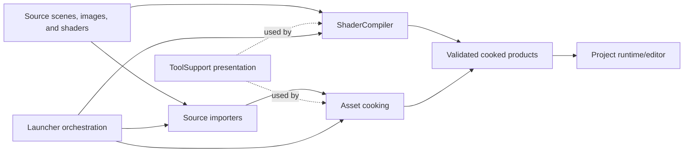

# Tools Module Architecture

**Status:** Tools module index

**Current state:** tracked Cooking, Launcher, ShaderCompiler, SourceImporter, and ToolSupport routes are each **50/100**; reusable Python automation is **10/100** and is not part of the 45-family `FCR-*` average. See [Current Feature Readiness](../../../Acceptance/CurrentReadiness.md).

This index mirrors the durable tool ownership boundaries under `Tools`.

## At A Glance

Tools transform or orchestrate offline products. They do not become runtime semantic owners: every cooked schema is validated by its owning consumer, and Launcher success requires the expected product rather than only a child-process exit.

## Module Routes

| Module | Owns | Module documentation |
| --- | --- | --- |
| Cooking | project, scene, mesh, material, texture, and animation cooking | [Cooking](Cooking/README.md) |
| Launcher | discovery, readiness, configure/build/cook/acquire/run/clean workflows, cancellation, and handoff | [Launcher](Launcher/README.md) |
| ShaderCompiler | shader compilation, validation, publication, recook, and runtime delivery contracts | [ShaderCompiler](ShaderCompiler/README.md) |
| SourceImporters | source-format ingestion, transforms, materials, animation, validation, and known losses | [SourceImporters](SourceImporters/README.md) |
| ToolSupport | shared command-line presentation and progress contracts used by tools | [ToolSupport](ToolSupport/README.md) |

**Cross-tool target capability:** [Python Automation And Analysis](PythonAutomationAndAnalysis.md) records the current narrow script boundary and the contract required before reusable Python automation, analysis, bindings, or embedded scripting can be claimed.

Tool-specific implementation rules live in [Tools Engineering](../../../Engineering/Modules/Tools.md); interactive UI rules live in [Editor Engineering](../../../Engineering/Modules/Editor.md). Product consumers remain under [Projects](../Projects/README.md).
