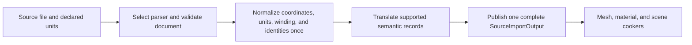

# Source Importers Capability Inventory

**Status:** capability snapshot; current, but not fidelity certification or runtime evidence

**Snapshot:** 2026-10-04 working tree at base revision `9f1eff12`; source/importer, Assimp build configuration, and Showcase cook route inspected; evidence `S` and local tool execution only

**Scope:** accepted source scene formats, geometry, instances, transforms, materials, textures, cameras, lights, skins, morphs, animation, validation, and known losses

**Owner:** `Tools/Import/SourceImporters` / `SourceImporters`

**Evidence and disposition:** [Capability Evidence Plan](../../CapabilityEvidencePlan.md) and [First Release Acceptance Contract](../../../../Acceptance/FirstRelease.md)

**Current readiness:** glTF/GLB/FBX/PLY import routes are source-integrated; fidelity, determinism, provenance, adversarial-input, visual, and product proof remain open. See [Current Feature Readiness](../../../../Acceptance/CurrentReadiness.md#foundation-world-content-shaders-and-tools) for the separately owned scored assessment.

## At A Glance

| Source family | Current coverage | Principal exclusions |
| --- | --- | --- |
| glTF 2.0 / GLB | triangle geometry, instances, transforms, metallic-roughness materials, UV0 texture transforms, cameras, punctual lights, skins, morphs, animations, variants | embedded GLB material images, nonzero UV sets, many material extensions, Draco/Meshopt/BasisU/WebP |
| FBX through Assimp | triangle scenes, units/left-handed normalization, instances, compact materials/textures, cameras/lights, skeleton and transform animation | morph targets, broad shading fidelity, node-only animation playback, every embedded image encoding |
| PLY through Assimp | triangle geometry and generic material/instance translation for the Stanford reconstruction meshes; one source unit is treated as one metre | no authored subsurface material, physical-unit metadata, or specialty shading |
| OBJ/USD/Alembic/OpenVDB | Not found in the current importer selector | catalog/research names remain future workload intent only |
| downstream rendering | imported Opaque/Mask routes align with current deferred surface support | imported Blend vocabulary exceeds current Renderer transparency support |

Import is strict at required semantic boundaries. Optional advanced glTF material lobes can be omitted only with an explicit generic metallic-roughness preview warning. That preview is not fidelity support for the omitted extensions; required glTF extensions and unsupported core geometry/texture semantics still fail.

## Format Boundary

| ID | Source format | State | Parser/dependency | Exact boundary | Evidence |
| --- | --- | --- | --- | --- | --- |
| `IMP-001` | glTF 2.0 JSON | Implemented path | `cgltf`; `.gltf` | External URI buffers/images are loaded and the document is validated before translation. | `S` |
| `IMP-002` | GLB | Implemented path | `cgltf`; `.glb` | Embedded geometry buffer data is accepted; embedded material images are explicitly rejected. | `S` |
| `IMP-003` | FBX | Implemented path | Assimp FBX path; `.fbx` | Scene is triangulated, validated, cache-optimized, globally scaled, converted left-handed, and requires a valid source-units-to-metres conversion. | `S` |
| `IMP-003a` | PLY | Implemented path | Assimp PLY path; `.ply` | Triangle reconstruction geometry uses the shared Assimp material/geometry translator and assumes one source unit equals one metre; the source does not supply a subsurface material. | `S` |
| `IMP-004` | OBJ/USD/Alembic/OpenVDB | Not found | None in `SourceSceneImporter` | Catalog entries may name these as future/source-only workloads, but they are not current importer formats. | `S` |

## Semantic Coverage

| ID | Capability | glTF/GLB coverage | FBX coverage | Important limit | Evidence |
| --- | --- | --- | --- | --- | --- |
| `IMP-005` | Triangle geometry | Positions, indices, normals, UV0, vertex color, tangents; validated accessors | Assimp triangle meshes; normals/tangents generated when needed | No line/point primitive product; unsupported/malformed attributes fail import. | `S` |
| `IMP-006` | Tangent generation | MikkTSpace, including seam remap and morph-target tangent deltas | Assimp tangent calculation | glTF rejects non-finite/irreconcilable tangent frames instead of dropping fidelity silently. | `S` |
| `IMP-007` | Coordinate normalization | Reflects source X, flips triangle winding, converts matrices/quaternions/tangents, rotates camera/light forward convention once | Assimp left-handed conversion plus declared metres-per-unit scaling | World placement happens after import; reapplying conversion downstream is a defect. | `S` |
| `IMP-008` | Mesh instances | Node instances plus shared-mesh grouping | Node/mesh instances | Instance records preserve source node identity, transform, primitive, material, skeleton, and morph weights. | `S` |
| `IMP-009` | GPU-authored instancing | `EXT_mesh_gpu_instancing` translation/count validation | Not found | Only translation/rotation/scale attribute combinations represented by the importer are accepted. | `S` |
| `IMP-010` | Metallic-roughness material | Base color/alpha, metallic, roughness, emissive and emissive strength, double-sided, alpha mode/cutoff, IOR-to-F0 | Supported Assimp shading models mapped to the same compact material | Optional clearcoat, sheen, transmission, volume, and anisotropy are explicitly omitted for generic preview. Specular extension, iridescence, dispersion, required extensions, and unsupported semantic combinations still fail. No specialty lobe reaches the cooked material or GBuffer. | `S` |
| `IMP-011` | Material textures | Base color, normal, AO red, emissive, packed roughness green/metallic blue; UV0 offset/scale/rotation/address mapping | Diffuse/base, normal, AO/light-map, roughness, metallic, emissive paths where source representation is accepted | Nonzero UV sets, BasisU, WebP, and embedded glTF images are rejected. Texture-transform translation and normal scale are represented, but their visual correctness needs runtime proof. | `S` |
| `IMP-012` | Alpha | Opaque, Mask, Blend imported | Scalar/diffuse alpha can produce Blend | Downstream Renderer does not implement true blend/transmission; imported vocabulary is broader than render support. | `S` |
| `IMP-013` | Material variants | `KHR_materials_variants` names and primitive mappings | Not found | Runtime can select imported variant mappings; authoring/editing variants is not provided. | `S` |
| `IMP-014` | Cameras | Perspective and orthographic schema from glTF | Perspective only | Invalid projection/clip data fails. Renderer/editor evidence must confirm each projection path before advertising both. | `S` |
| `IMP-015` | Lights | Directional, point, spot through punctual-light extension; physical fields mapped | Directional, point, spot, rect when Assimp source kind is supported | Unsupported/incomplete kind fails rather than degrading. | `S` |
| `IMP-016` | Skeleton/skin | Joint hierarchy, inverse binds, reference space, JOINTS/WEIGHTS pairs up to eight influences | Skeleton/bones and up to eight influences | Duplicate/invalid joints, zero weights, non-invertible transforms, or over-eight influences fail without truncation. | `S` |
| `IMP-017` | Morph targets | Position/normal/tangent deltas, names/default weights, per-instance weights | Explicitly rejected | glTF tangent-seam remap carries skin and morph data together. | `S` |
| `IMP-018` | Animation | Translation/rotation/scale/weights; Linear, Step, CubicSpline; skeleton binding | Skeleton-owned transform channels; source keys validated and represented without loss | Node-only FBX animation is not playable; cross-skeleton or lossy channels are rejected. | `S` |
| `IMP-019` | Embedded FBX textures | Not applicable | Identified compressed embedded resources can be extracted | Unknown/unsupported embedded encoding fails. Texture cook support still determines final acceptance. | `S` |

## Vertical Import Trace

`SourceSceneImporter` selects by lower-case extension -> parser validates file/document -> format-specific translators normalize coordinates and append materials/textures/geometry/instances/cameras/lights/skeletons/animations/variants -> one `SourceImportOutput` owns the complete imported scene plus diagnostics -> Mesh/Material/Scene cookers consume it in the same tool process -> no source-import object crosses into runtime.

## Explicit Non-Capabilities And Risks

- FBX support does not include FBX morph targets or every Assimp shading/texture mapping; glTF support does not include every Khronos extension. PLY support is geometry-oriented and does not imply subsurface shading.
- There is no current OBJ, USD, Alembic, OpenVDB, Draco, Meshopt, BasisU, WebP, multi-UV, or embedded-glTF-image path. Supported UV0 texture transforms do not imply a second UV set.
- Imported Blend survives into the material schema but is not a completed rendering capability.
- The optional-lobe generic preview drops authored anisotropy, clearcoat, sheen, transmission, and volume parameters. It must remain visibly labeled as incomplete until import, cooked material, GBuffer, lighting, and visual proof are implemented together.
- Source/cook execution does not establish round-trip fidelity, malformed-file hardening, deterministic asset IDs, exact parity between formats, or runtime visual correctness.
