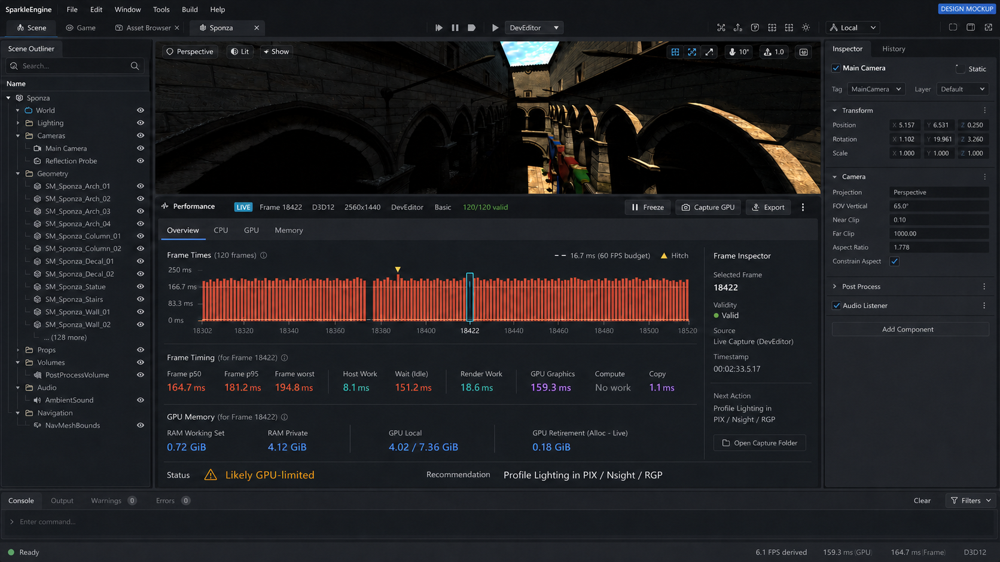
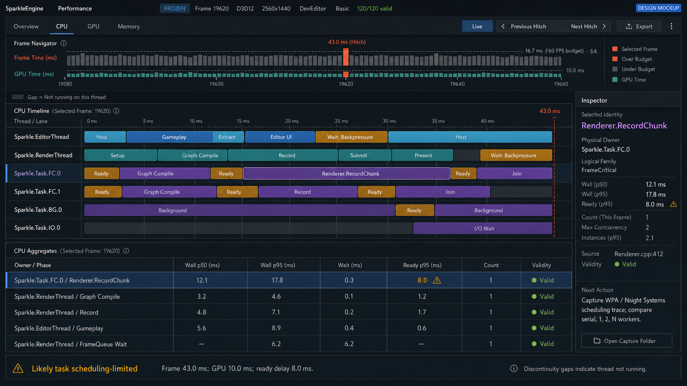
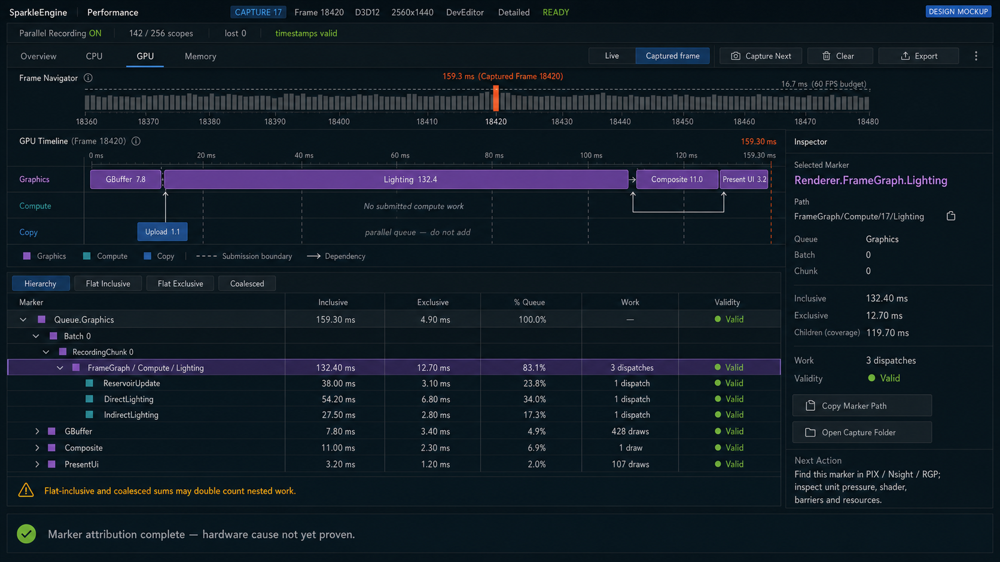
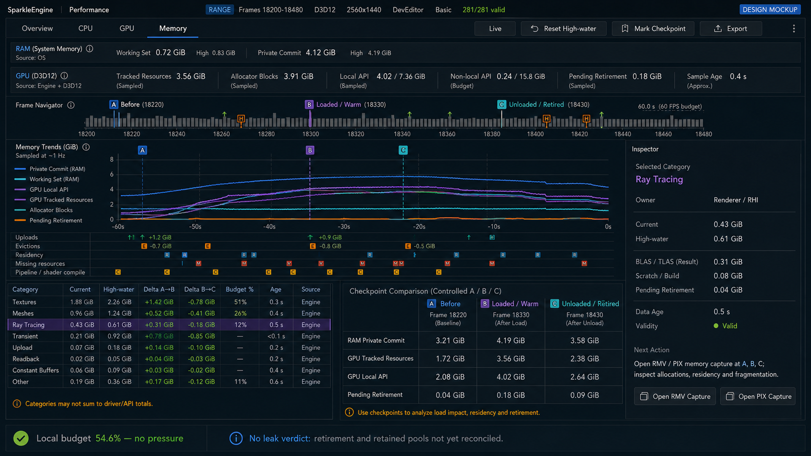
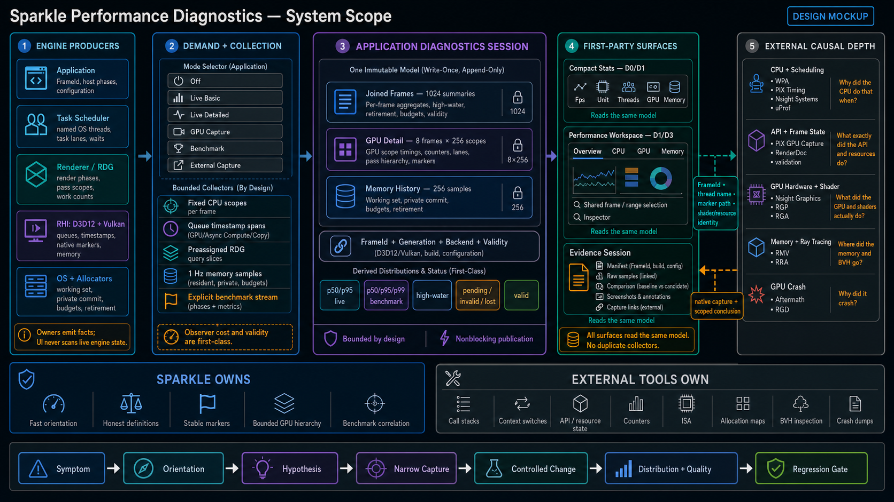

# Performance Diagnostics Visual Design And Tool Wireframes

Status: design visualization of a target proposal; not proof of current implementation or measured performance

Last reconciled with the target architecture: 2026-08-13

Scope: graphical product mockups, a system-scope map, and implementation-oriented ASCII layouts for the user-facing diagnostic tools defined by [Performance Diagnostics Architecture](PerformanceDiagnosticsArchitecture.md)

## Purpose And Authority Boundary

This document shows how each proposed Sparkle diagnostics surface could look. It is the single visual-design owner for graphical mockups, the system-scope map, and plain-text tool layouts. It is a reading aid for product review and implementation planning. The owning architecture defines metric meaning, ownership, bounds, collection modes, validity, and acceptance rules. If a mockup or wireframe conflicts with that architecture, the architecture wins.

The values below are illustrative and deliberately reused across views. They are not Sponza measurements, benchmark evidence, or proof that a surface is implemented. The source-backed starting point remains the existing viewport FPS/delta display; the layouts below describe the target product.

The graphical mockups communicate the overall experience and information hierarchy. The later boxes use plain ASCII characters so individual tools remain readable in terminals, source reviews, and plain-text exports.

## Graphical Product Mockups

Read the mockups from broad orientation to focused evidence:

1. Overview shows the normal triage surface integrated into the current Editor shape.
2. CPU shows physical thread ownership, logical phases, task lanes, waits, and ready delay.
3. GPU shows the bounded captured-frame hierarchy and inclusive/exclusive marker costs.
4. Memory shows distinct RAM/GPU definitions, event history, and controlled A/B/C checkpoints.
5. System Scope shows the implementation boundary from engine producers through first-party surfaces and external profilers.

### Integrated Performance Overview



This is the first reviewer and triage screen: fixed configuration, frame navigator, aligned CPU/GPU/memory facts, one likely-domain explanation, and one next action. It does not claim causal proof.

### CPU And Threading



Physical Sparkle threads are the rows. Gameplay and renderer phases remain logical blocks inside the thread that actually executes them. Task lanes are separate and are never summed into a fabricated CPU total.

### GPU Captured Frame Mockup



Queue lanes, frame-graph marker hierarchy, and adjacent inclusive/exclusive columns answer marker-level attribution. The selected marker carries its stable path into PIX, RenderDoc, Nsight, or RGP for API, resource, shader, and hardware evidence.

### RAM, GPU Memory, And Residency



Working set, private commit, tracked resources, allocator blocks, local/non-local API usage and budget, and retirement remain distinct. The A/B/C checkpoint workflow supports controlled load/unload analysis without prematurely declaring a leak.

### Complete System Scope



Sparkle owns bounded collection, immutable correlation, quick orientation, stable semantic identity, and benchmark linkage. External profilers continue to own call stacks, OS scheduling, API/resource state, hardware counters, ISA, allocation maps, BVH inspection, and crash dumps.

These images illustrate the target product and information hierarchy. They do not add implementation requirements beyond the canonical architecture, replace workload acceptance gates, or imply that every pictured field already has an authoritative producer.

## Product Map

```text
Quick orientation
  Viewport Stat menu
  Console Stat command
  Compact overlays: Fps, Unit, UnitGraph, Threads, Tasks, Gpu,
                    GpuPasses, Render, Scene, Rhi, Memory, Hitches
            |
            | click summary, frame, hitch, or Open Performance
            v
Focused inspection
  One Performance workspace
    Overview | CPU | GPU Live | GPU Captured frame | Memory
            |
            | selected FrameId/range/token and exact configuration
            v
Evidence and cause
  ProfileGpu | explicit benchmark export | external-profiler handoff
```

The compact overlay limit is four simultaneous groups. Every visible group shares the same joined diagnostics product; enabling more views does not create duplicate collectors.

## Shared Visual Language

```text
State labels:  Valid  Pending  Stale  Unsupported  Dropped  Filtered
Time:          milliseconds lead; FPS is derived
Memory:        binary units, current value, high-water, budget, and age
Identity:      FrameId 18420 means every correlated row describes that frame
Selection:     > marks the selected row or object
Graph gaps:    ? means invalid or pending data; it never means measured zero
Budget:        | marks the declared frame budget on compact text graphs
```

Color may reinforce categories in the real UI, but text, icons, patterns, and tooltips must carry the same meaning without color.

## Shared Controls

### Viewport Stat Menu

```text
+ Viewport ----------------------------------------------------------- [Stat v] +
|                                                                             |
|                                      + Stat ------------------------------+ |
|                                      | Presets                            | |
|                                      |   Quick       Unit                 | |
|                                      |   CPU         Unit Threads Tasks   | |
|                                      |   GPU         Unit Gpu Render      | |
|                                      |   Memory      Unit Memory Rhi      | |
|                                      |   Portfolio   Unit Threads Gpu Mem | |
|                                      +------------------------------------+ |
|                                      | [x] Unit             Basic         | |
|                                      | [ ] UnitGraph        Basic         | |
|                                      | [ ] GpuPasses        Detailed      | |
|                                      | [ ] Memory           1 Hz          | |
|                                      | ... 8 more fixed groups            | |
|                                      +------------------------------------+ |
|                                      | Open Performance...                | |
|                                      | Reset live window                  | |
|                                      | Hide all                           | |
|                                      +------------------------------------+ |
+-----------------------------------------------------------------------------+
```

The menu submits the same typed requests as the console. It does not build command strings, own collection state, or silently enable `LiveDetailed`.

### Console Interaction

```text
+ Console -------------------------------------------------------------------+
| > Stat                                                                      |
| Active: Unit, Threads, Gpu   Mode: LiveBasic   Samples: 120 valid / 0 lost |
| Usage: Stat <group> [On|Off|Toggle] | Stat Preset <name> | Stat List       |
|                                                                             |
| > Stat GpuPasses On                                                        |
| Enabled GpuPasses. Collection changes to LiveDetailed at generation 42.    |
|                                                                             |
| > Stat Dump Unit                                                           |
| FrameId 18420 | Frame p50 164.7 ms | GPU Graphics 159.3 ms | Valid         |
+-----------------------------------------------------------------------------+
```

`Stat Dump` prints one bounded snapshot to existing console output. It does not start a capture or write a file.

### Keyboard Baseline

Space toggles Live/Freeze, left/right steps frames, Shift+left/right moves between hitches, F focuses search, Home fits the active timeline, and Escape clears the object selection before closing the window. These bindings remain target UX until implemented and user-tested.

## Compact Stat Tools

Each compact tool has at most 16 rows. Overflow ends with `+N hidden; open Performance` rather than expanding over the scene.

### Fps

Question: What is the derived display rate?

```text
+ SPARKLE STAT FPS -----------------------------+
| 6.1 FPS derived                              |
| Latest frame interval              168.4 ms  |
| Frame budget                         16.7 ms  |
| Source: host clock                 Frame 18422|
+-----------------------------------------------+
```

This is the smallest orientation surface. FPS never replaces the millisecond value or claims a bottleneck.

### Unit

Question: Which top-level domain is consuming or stalling the frame budget?

```text
+ SPARKLE STAT UNIT -------- LiveBasic | 120 valid | budget 16.67 ms --------+
| Frame interval       164.7 ms p50 | 181.2 p95 | 6.1 FPS derived            |
| Host non-wait wall     8.1 ms      | wait/backpressure 151.2 ms            |
|   Gameplay wall        3.8 ms      | on Sparkle.EditorThread               |
| Render work           18.6 ms      | Sparkle.RenderThread | depth 1        |
| GPU Graphics         159.3 ms      | FrameId 18420 | resolved 2 frames late|
| Present                0.5 ms      | VSync off                             |
| Likely GPU-limited: GPU is over budget; host waits on downstream capacity. |
+-----------------------------------------------------------------------------+
```

### UnitGraph

Question: Is the limiting domain stable or spiking over time?

```text
+ SPARKLE STAT UNIT GRAPH --------------------- 120 frames ------------------+
| scale 0 ms                                                             200|
| Budget |-------------------------------------------------------------------|
| Frame  |###################^##################^############################ |
| Host   |___--____--___________--____--____________________________________ |
| Render |____---_____---___________---_____________________________________ |
| GPU    |##################^###################^###########################? |
|          older                                           latest Frame 18422|
| # over budget   _ below budget   ^ hitch   ? invalid/pending               |
+-----------------------------------------------------------------------------+
```

The real graph uses aligned numeric axes and domain styling. Gaps remain gaps; they are not connected or converted to zero.

### Threads

Question: What did Sparkle's named physical threads do?

```text
+ SPARKLE STAT THREADS -------- FrameId 18422 | LiveBasic -------------------+
| Physical owner          Phase wall   Wait       Occupied   Ready p95       |
| Sparkle.EditorThread       8.1 ms   151.2 ms       n/a        n/a           |
|   Gameplay                3.8 ms      0.0 ms       n/a        n/a           |
| Sparkle.RenderThread     18.6 ms      0.7 ms       n/a        n/a           |
| Sparkle.Task.FC.0        61.7 ms        n/a        37%      0.18 ms         |
|   longest: Renderer.RecordChunk                                               |
| Sparkle.Task.BG.0         6.7 ms        n/a         4%      0.09 ms         |
| Sparkle.Task.IO.0         0.0 ms        n/a         0%         n/a          |
| OS running/ready/preempted state requires WPA, PIX, or Nsight Systems.      |
+-----------------------------------------------------------------------------+
```

Logical gameplay appears under the physical thread that executed it. The Editor does not invent a separate `GameThread` row.

### Tasks

Question: Is task scheduling, imbalance, or a named task family material?

```text
+ SPARKLE STAT TASKS ---------- Range 18303..18422 | LiveBasic --------------+
| Lane              Count p50/p95   Occupied   Ready p95   Caller join       |
| FrameCritical         46 / 53         37%       0.18 ms       1.7 ms        |
|   longest family: Renderer.RecordChunk                    failures 0        |
| Background             7 / 12          4%       0.09 ms       0.0 ms        |
|   longest family: Asset.PreviewDecode                    cancelled 1       |
| BlockingIo             0 /  2          0%          n/a       0.0 ms        |
| This is a fixed aggregate, not a task-history browser.                     |
+-----------------------------------------------------------------------------+
```

### Gpu

Question: Which GPU queue controls the current frame budget?

```text
+ SPARKLE STAT GPU -------- FrameId 18420 | resolved 2 frames late ----------+
| Queue       Outer span     State             Context                       |
| Graphics      159.3 ms     Valid             over 16.67 ms budget          |
| Compute            n/a     No submitted work                              |
| Copy             1.1 ms     Valid             independent queue            |
| Queue clocks are not calibrated; spans are not summed or overlaid.         |
| Present: VSync off | D3D12 | normal parallel recording                    |
+-----------------------------------------------------------------------------+
```

### GpuPasses

Question: Which stable render passes consume the selected queue span?

```text
+ SPARKLE STAT GPU PASSES -------- LiveDetailed | FrameId 18420 | D3D12 -----+
| Graphics outer span                                             159.3 ms   |
| > Lighting                         132.4 ms | 83.1% | 3 dispatches          |
|   GBuffer                            7.8 ms |  4.9% | 428 draws             |
|   Composite                         11.0 ms |  6.9% | 1 draw                |
|   PresentUi                          3.2 ms |  2.0% | 107 draws             |
|   Unaccounted                        4.9 ms |  3.1%                         |
| Compute                     No submitted work                              |
| Copy                                  1.1 ms | independent; do not add     |
| 142/256 scopes | latest 8 detailed frames | [Capture selected frame]      |
+-----------------------------------------------------------------------------+
```

This is a bounded live ranking, not the frozen hierarchy navigator. `Unaccounted` is not labeled idle or waste.

### Render

Question: Is renderer CPU orchestration or submitted workload unexpectedly large?

```text
+ SPARKLE STAT RENDER -------- FrameId 18422 | LiveBasic --------------------+
| CPU stage             latest      p50      p95      max                    |
| Setup                  1.2 ms     1.1      1.5      2.0                    |
| Extract + cull         2.4 ms     2.2      3.0      4.6                    |
| Graph setup/compile    3.6 ms     3.4      4.1      6.8                    |
| Record                 8.4 ms     8.0      9.7     14.2                    |
| Submit + present       1.4 ms     1.3      1.8      2.5                    |
| Work: 37 passes | 6 lists | 428 draws | 4 dispatches | 18 barriers        |
| Upload: 12.0 MiB | pipeline creates 0 | rejected work 0                   |
+-----------------------------------------------------------------------------+
```

Counters appear only when their production owner already emits them; the tool performs no diagnostic rescan.

### Scene

Question: What scene cardinality reached each render stage?

```text
+ SPARKLE STAT SCENE -------- FrameId 18422 | LiveBasic ---------------------+
| Instances       extracted 18,420 | accepted 17,992 | visible 6,438         |
|                 submitted  6,211 | rejected    227                         |
| Assets          meshes 1,204 | materials 638 | lights 42                  |
| Geometry        triangles 9.84 M visible | indices 29.52 M                |
| Ray tracing     instances 6,211 | BLAS 1,030 | TLAS 1                     |
| Updates         dirty 14 | uploaded 14 | rejected 0                       |
| Counts are immutable owner facts; UI never queries live ECS/caches.        |
+-----------------------------------------------------------------------------+
```

The exact admitted rows remain workload-driven. An unavailable producer shows `NotInstrumented` instead of a guessed count.

### Rhi

Question: What backend work and allocator pressure did Sparkle submit?

```text
+ SPARKLE STAT RHI -------- D3D12 | NVIDIA Adapter | LiveBasic --------------+
| Queue submissions     Graphics 1 | Compute 0 | Copy 1                      |
| Recording             groups 5 | command lists 6 | rejected 0             |
| Pipelines             created 0 | cache hits 37 | cache misses 0           |
| Descriptors/barriers  2,418 descriptors | 18 transitions                  |
| Transfer              upload 12.0 MiB | readback 0 B                       |
| Timestamps            284/512 pairs | lost 0 | Detailed capacity valid     |
| Memory                tracked 3.56 GiB | blocks 3.84 GiB                   |
| API heaps             local 4.02/7.36 GiB | non-local 0.12/31.8 GiB        |
+-----------------------------------------------------------------------------+
```

Rows expose neutral cross-backend facts and never leak native handles or backend-only types into the product model.

### Memory

Question: Is RAM or GPU memory growing, near budget, or awaiting retirement?

```text
+ SPARKLE STAT MEMORY -------- sampled 0.4 s ago | 1 Hz ---------------------+
| Process RAM          current       run high      definition                |
| Working set          0.72 GiB       0.80 GiB      resident process pages   |
| Private commit       4.12 GiB       4.19 GiB      private committed pages  |
| GPU memory                                                                  |
| Tracked resources    3.56 GiB       3.61 GiB      engine-owned resources   |
| Allocator blocks     3.84 GiB       3.92 GiB      committed allocator block|
| Local API usage      4.02 GiB       4.08 GiB      budget 7.36 GiB          |
| Non-local usage      0.12 GiB       0.14 GiB      budget 31.8 GiB          |
| Retirement pending  0.18 GiB       0.24 GiB      delayed destruction      |
| Categories: Texture 2.40 | Mesh 0.51 | RT 0.43 | Transient 0.17 | Other .05|
+-----------------------------------------------------------------------------+
```

Working set, private commit, tracked resources, allocator blocks, and API heap usage remain separate even when their totals do not reconcile exactly.

### Hitches

Question: Which recent frames exceeded the declared budget?

```text
+ SPARKLE STAT HITCHES -------- budget 16.67 ms | latest 16 of 23 -----------+
| FrameId    Interval   Likely domain       Worst known token       State     |
| > 18391     194.8 ms  GPU                 Lighting                Valid     |
|   18372      71.4 ms  Render CPU          PipelineCreate         Valid     |
|   18351      63.8 ms  Host/task           Gameplay.Visibility    Valid     |
|   18320      58.1 ms  Unresolved          GPU pending             Pending   |
|   18294        n/a    Discontinuity        Resize                 Excluded  |
| [Previous hitch] [Next hitch] [Open Performance at selected FrameId]       |
+-----------------------------------------------------------------------------+
```

Hitches are selections in the shared frame navigator, not a separate unbounded history browser.

## Performance Workspace Tools

The Editor contains one fixed Performance window. Switching tabs preserves the selected frame or range. The Inspector reads the same immutable selection and never polls engine state independently.

### Workspace Shell

```text
+ Performance ----------------------------------------------------------------+
| LIVE | Frame 18422 | D3D12 | 5120x1392 | DevEditor | Basic | valid 120/120  |
| [Overview] [CPU] [GPU] [Memory]            [Freeze] [Capture GPU] [Export...]|
+ Frame navigator -------------------------------------------------------------+
| 18303 .......... ^ hitch 18391 ................. > selected 18422 | 16.7 ms |
+ Main view ------------------------------------------------+ Inspector --------+
| view-specific summary, lanes, timeline, tree, or trend    | selected identity |
|                                                           | owner + definition|
|                                                           | metrics + validity|
|                                                           | next action       |
+ Status ----------------------------------------------------------------------+
| likely GPU-limited | lost 0 | memory age 0.4 s | GPU resolved 2 frames late |
+------------------------------------------------------------------------------+
```

### Overview

```text
+ Performance / Overview -----------------------------------------------------+
| Live | Range 18303..18422 | 120 valid | budget 16.67 ms | D3D12 | Basic    |
+ Frame distribution ---------------------------------------------------------+
| latest 168.4 | p50 164.7 | p95 181.2 | p99 190.3 | worst 194.8 #18391     |
| [###########^##################^##############################] 0..200 ms    |
+ Correlated domains -------------------------------+ Inspector ---------------+
| Host non-wait       8.1 ms | wait 151.2 ms        | Range 18303..18422      |
| Render non-wait    18.6 ms | wait   0.7 ms        | Included 120            |
| GPU Graphics      159.3 ms | valid Frame 18420    | Invalid 0 | Lost 0      |
| Present             0.5 ms | VSync off            | Definition: host begin  |
| RAM private         4.12 GiB | high 4.19           | to next host begin      |
| GPU local           4.02 / 7.36 GiB                |                        |
+ Orientation ---------------------------------------+--------------------------+
| Likely GPU-limited. Host backpressure is consistent with downstream GPU work.|
| Next: open GPU Live; capture a frame if pass attribution can test the theory. |
+------------------------------------------------------------------------------+
```

Overview orients; it does not expose call stacks, API events, resource contents, or a hardware-cause verdict.

### CPU

```text
+ Performance / CPU -------- FrameId 18422 | CPU-relative timeline ----------+
| 0 ms        4          8         12         16                    168.4     |
| Editor  [Host][Gameplay][Extract][ UI ][........ WAIT CAPACITY ............]|
| Render       [Setup][Graph][--- Record ---][Submit][Present]                 |
| Task FC 0       [RecordChunk 0] [RecordChunk 3]                             |
| Task FC 1         [RecordChunk 1] [RecordChunk 4]                           |
| Task BG 0    [Preview]                                                       |
| Task IO 0                                                                    |
+ Aggregates ---------------------------------------+ Inspector ----------------+
| Owner/phase             wall   wait   ready p95   | Renderer.RecordChunk     |
| Editor.Gameplay        3.8 ms  0.0       n/a      | Physical: Task.FC.0      |
| Render.Record          8.4 ms  0.0       n/a      | Wall: 2.1 ms             |
| Task.FrameCritical    61.7 ms  n/a     0.18 ms    | Token: Renderer.Record.. |
|                                                   | [Open WPA guidance]      |
+------------------------------------------------------------------------------+
```

The lanes show wall intervals owned by Sparkle. OS scheduled/running state, stacks, callers/callees, and arbitrary threads remain external-profiler work.

### GPU Live

```text
+ Performance / GPU / Live -------- Range 18303..18422 | LiveDetailed -------+
| Queue spans (independent queue-relative axes; do not sum)                   |
| Graphics [GBuffer][-------------- Lighting --------------][Comp][UI] 159.3  |
| Compute  No submitted work                                                  |
| Copy     [Upload 1.1]                                                        |
+ Recent pass ranking ------------------------------+ Inspector ---------------+
| Pass token                    p50     p95   %queue | Lighting                |
| > Renderer.FrameGraph.Light 129.8   134.7    83.1 | FrameId 18420           |
|   Renderer.FrameGraph.Comp   10.6    12.1     6.9 | Inclusive 132.4 ms      |
|   Renderer.FrameGraph.GBuf    7.5     8.2     4.9 | Exclusive 12.7 ms       |
|   Queue.Unaccounted           4.7     5.4     3.1 | 3 dispatches            |
|                                                   | [Copy token]            |
| [Capture frame] [Open latest capture]             | [Profiler guidance]     |
+------------------------------------------------------------------------------+
```

GPU Live ranks bounded recent marker data. It does not align uncalibrated queues or provide shader/hardware counters.

### GPU Captured Frame

```text
+ Performance / GPU / Captured frame ----------------------------------------+
| Capture 17 | FrameId 18420 | D3D12 | 5120x1392 | Threaded depth 1           |
| Ready | timestamps valid | ParallelRecording ON | 142/256 scopes | lost 0   |
| Queue: Graphics 159.3 ms | [Hierarchy] [Flat Inc] [Flat Exc] [Coalesced]    |
+ Marker ------------------------------------ Inclusive  Exclusive  %Queue Work+
| Queue.Graphics                              159.30 ms     4.90 ms  100.0%    |
| `- Batch0 / RecordingChunk0                 154.40 ms     0.00 ms   96.9%    |
|    |- FrameGraph/Compute/Lighting           132.40 ms    12.70 ms   83.1% 3D |
|    |  |- ReservoirUpdate                     38.00 ms    38.00 ms   23.9% 1D |
|    |  |- DirectLighting                      54.20 ms    54.20 ms   34.0% 1D |
|    |  `- IndirectLighting                    27.50 ms    27.50 ms   17.3% 1D |
|    |- FrameGraph/Raster/GBuffer               7.80 ms     7.80 ms    4.9%428 |
|    `- FrameGraph/Raster/Composite            11.00 ms    11.00 ms    6.9%  1 |
+ Details --------------------------------------------------------------------+
| Token: Renderer.FrameGraph.Lighting | Queue Graphics | Batch 0 | Chunk 0    |
| Child coverage 119.70 ms | Valid | [Copy marker path] [Expand hot path]     |
| Next: use PIX, RenderDoc, Nsight, or RGP if marker timing is insufficient.   |
+------------------------------------------------------------------------------+
```

The hierarchy, flat-inclusive, flat-exclusive, and coalesced modes are alternate presentations of one frozen immutable capture. Flat/coalesced sums carry a double-counting warning.

### Memory

```text
+ Performance / Memory -------- Live | sampled 0.4 s ago | cadence 1 Hz -----+
| 4.5 GiB +                         private commit                         ^    |
|         |                _________/-------------------------------------|    |
| 3.0 GiB +     GPU local / tracked resources __________________________|    |
|         |______/                                                       |    |
| 1.5 GiB + working set ________________________________________________|    |
| 0.0 GiB +-------------------------------------------------------------+    |
|           120 s ago                                           now           |
+ Definitions/categories ---------------------------+ Inspector ---------------+
| Process working set        0.72 GiB | high 0.80    | Texture                |
| Process private commit     4.12 GiB | high 4.19    | Current 2.40 GiB       |
| GPU tracked resources      3.56 GiB | high 3.61    | High 2.44 GiB          |
| GPU allocator blocks       3.84 GiB | high 3.92    | Owner: Renderer assets |
| Local API usage/budget     4.02 / 7.36 GiB          | Age 0.4 s              |
| Non-local usage/budget     0.12 / 31.8 GiB          | External: RMV/PIX      |
| Retirement pending         0.18 GiB                  | for allocation detail  |
+------------------------------------------------------------------------------+
```

A future A/B/C checkpoint comparison belongs inside this view only after an accepted workload justifies it. The initial view does not claim leak detection or expose allocation call stacks.

## Explicit Capture And Evidence Workflows

### ProfileGpu

```text
 [Capture GPU]
      |
      v
+ Armed ------------------+     next valid rendered frame
| CaptureId 17            |----------------------------------+
| waiting for FrameId     |                                  |
| [Cancel]                |                                  v
+-------------------------+                     + Recorded/Submitted --------+
                                                | FrameId 18420              |
                                                | GPU completion pending     |
                                                +-------------+--------------+
                                                              |
                                                              v
                                                + Resolving -----------------+
                                                | validate hierarchy/ticks   |
                                                +--------+-------------------+
                                                         |
                                +------------------------+------------------+
                                v                                           v
                     + Ready/Frozen ------------+              + Invalid --------+
                     | [Open capture] [Clear]    |              | reason + action |
                     +---------------------------+              +-----------------+
```

Only one capture may be armed or resolving. The UI remains nonblocking and shows `Armed`, `Recorded`, `Resolving`, `Ready`, `Invalid`, or `Cancelled` with the capture ID and reason.

### Explicit Evidence Export

The exact benchmark CLI/request surface remains an open implementation decision. This wireframe shows the required explicitness, not a final dialog contract.

```text
+ Export performance evidence ------------------------------------------------+
| Selection       Range 18303..18422 (120 valid, 0 invalid, 0 lost)           |
| Workload        MAP-00 / Sponza calibration                                 |
| Configuration   DevelopmentGame | D3D12 | 2560x1440 | VSync off             |
| Identity        commit, content hash, config hash, adapter, driver          |
| Statistics      raw samples + p50/p95/p99/worst + high-water                |
| Diagnostics     LiveBasic | measured observer cost attached                 |
| Output          <explicit user-selected evidence destination>               |
|                                                                              |
| [Cancel]                                      [Validate and export]          |
+------------------------------------------------------------------------------+
```

No file is emitted during normal runs. Validation failure preserves the previous accepted evidence and returns one actionable error.

### External-Profiler Handoff

```text
+ Next investigation ---------------------------------------------------------+
| Selection       FrameId 18420 / Renderer.FrameGraph.Lighting                |
| Observation     132.4 ms inclusive; 12.7 ms exclusive on Graphics queue     |
| Configuration   D3D12 | RTX adapter | 5120x1392 | VSync off | depth 1       |
| Question        Which API, shader, synchronization, or hardware cause?       |
|                                                                              |
| D3D12 range     [PIX Timing guidance] [PIX GPU Capture guidance]             |
| Cross-API state [RenderDoc guidance]                                         |
| NVIDIA          [Nsight Graphics guidance]                                  |
| AMD             [RGP guidance]                                               |
|                                                                              |
| [Copy marker path] [Copy FrameId/configuration] [Open evidence checklist]    |
+------------------------------------------------------------------------------+
```

Sparkle carries stable identity and configuration to the handoff. External tools continue to own call stacks, scheduling causality, API/resource state, shader and hardware counters, ISA, allocation maps, residency detail, BVH inspection, and crash dumps.

## Responsive And Failure States

The layouts above show a wide Editor window. A narrow viewport overlay preserves row priority and collapses detail predictably:

```text
+ SPARKLE STAT UNIT --------------------------+
| Frame p50 164.7 | p95 181.2 ms             |
| Host 8.1 + wait 151.2 | Render 18.6        |
| GPU 159.3 Pending+2 | Present 0.5          |
| Likely GPU-limited                          |
| +4 hidden; open Performance                |
+---------------------------------------------+
```

Required failure presentations remain visible in place:

```text
GPU Graphics    Pending | FrameId 18422 | resolving 2 frames late
GPU Compute     No submitted work
GPU Copy        Unsupported | backend queue timestamps unavailable
Memory          Stale | last valid sample 4.8 s ago | expected cadence 1 Hz
GpuPasses       Dropped 19 scopes | capacity 256 | capture incomplete
Frame range     117/120 included | 2 invalid | 1 resize discontinuity
ProfileGpu      Invalid | device lost after submit | CaptureId 17 settled
```

These states must not collapse into `0`, blank cells, generic red coloring, or a silently substituted frame.

## Review Checklist

- Every compact group answers the diagnostic question in the fixed catalog and stays within 16 rows.
- Every view keeps `FrameId` or range, configuration, collection mode, validity, loss, and age visible.
- CPU rows distinguish physical threads from logical phases and task lanes.
- GPU queues remain independent; hierarchy keeps inclusive and exclusive values adjacent.
- Memory definitions remain separate and show sampling age.
- `GpuPasses` visibly requests `LiveDetailed`; `ProfileGpu` remains an explicit one-shot capture.
- The workspace remains one fixed Overview/CPU/GPU/Memory product, not a set of unrelated profiler windows.
- Escalation identifies the external tool and preserves the selected stable token and configuration.
- All example values remain labeled illustrative until replaced by accepted workload evidence.
