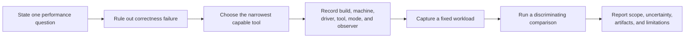

# External Performance Profiler Runbook

**Status:** runbook; version-sensitive operational guidance, not proof of current Sparkle implementation or tool support

**Last external-source reconciliation:** provider protocol and Unreal/Unity/Godot integration research refreshed 2026-10-06 in [External Capture Research](../../Architecture/CrossModule/PerformanceDiagnostics/ExternalCapture/Research.md). The version table below retains its 2026-09-29 observations unless explicitly updated; it is not an installed support matrix.

**Scope:** profiling-build preparation, current external-tool capabilities, marker interoperability, capture provenance, operational capture checks, input/display measurement options, and revalidation triggers

**Selected ExternalCapture delivery, 2026-10-09:** WPR/WPA, PresentMon, PIX Timing, Nsight GPU Trace/Systems and separate NVIDIA Aftermath guidance. The user explicitly excludes AMD RGP/RMV/RRA/RGA/uProf/RGD and associated hardware/tool investment. AMD references below remain background research, not setup, implementation or acceptance obligations for this delivery. CPU investigations use WPR/WPA. The [specialist preflight](../../Architecture/CrossModule/PerformanceDiagnostics/ExternalCapture/Discovery.md#stage-7-specialist-preflight---2026-10-09) records installed inputs and missing native evidence; it does not close EC-G7.

## Quick Route



Use [Tool Choice And Tradeoffs](#tool-choice-and-tradeoffs) for selection and [Operational Capture Checks](#operational-capture-checks) for the chosen tool. Revalidate the installed version before use; this dated runbook is not a support matrix.

## Purpose And Authority Boundary

This document answers two operational questions: which external tool can currently distinguish a performance hypothesis, and what must be preserved so the resulting capture is representative and auditable?

It does not define Sparkle's metric meanings, owners, buffers, or product UX. Those belong to [Performance Diagnostics Architecture](../../Architecture/CrossModule/PerformanceDiagnostics/README.md). It does not own benchmark gates, artifact names, or claim acceptance; [I. Acceptance Workloads](../../Acceptance/GraphicsWorkloads.md) and [Validation, Performance, and Evidence](ValidationAndEvidence.md) remain authoritative. [Diagnostics Product And UX Research](../../Architecture/CrossModule/PerformanceDiagnostics/ProductAndUxResearch.md) records precedent and adopted/rejected product ideas.

External tools, drivers, SDKs, and operating-system providers change independently of Sparkle. Every capture therefore records the installed tool version, driver, API/runtime/SDK, hardware, OS, build, observer mode, and relevant capability result. This runbook is revalidated before use; its date is not a support promise.

## Source Record And Revalidation Rule

Every external claim retained in this runbook has five parts:

1. **Claim supported** - the narrow capability or limitation used by the workflow.
2. **Source and section** - a primary manual, API specification, release page, or repository release.
3. **Version/date observed** - the tool/spec state reconciled above.
4. **Adopted / not inferred** - what Sparkle uses and what the source does not prove.
5. **Revalidation trigger** - tool, driver, SDK, API, hardware, OS, or marker-runtime change.

Release pages and current manuals establish current capability. Older blogs, tutorials, and product pages may establish a useful method, but they do not override a newer support matrix. Search snippets, screenshots, successful replay, and another engine's integration are never capability proof by themselves.

## Source And Version Reconciliation

| Product/source state observed on 2026-09-29 | Claim supported and adopted | Not inferred / revalidation trigger |
| --- | --- | --- |
| PIX [2603.25 main and 2606.18-preview download record](https://devblogs.microsoft.com/pix/download/) plus current Windows Performance Toolkit documentation | PIX Timing/GPU Capture are the primary D3D12 timing/frame paths; `PIXGpuCaptureNextFrames`, `PIXSetTargetWindow`, attachment query, and capture-open APIs support an editor-owned next-frame button when the GPU capturer was loaded/injected before D3D12 device creation. WPR/WPA provides Windows sampled/precise CPU and TraceLogging analysis. | WinPixEventRuntime markers alone do not mean GPU capture is attached. Use the main PIX release unless a required preview D3D feature justifies the preview, and record installed versions. A replay is not native timing; a collector can perturb the workload. Revalidate on PIX/WPT, Agility SDK, Windows, or capture-setting change. |
| RenderDoc [v1.46 release](https://github.com/baldurk/renderdoc/releases/tag/v1.46), 2026-08-31, and current in-application API | Current D3D12/Vulkan frame-debugging baseline; its dynamically queried API supports application-controlled capture without statically linking the injected module. | API/header versions must match and target device/window behavior must be smoke-tested. RenderDoc validation/replay does not establish CPU scheduling or hardware cause. Revalidate version, driver, API feature, attachment path, and replay result. |
| Nsight Graphics [2026.3 current release](https://developer.nvidia.com/nsight-graphics/get-started), 2026-07-23, and current SDK documentation | GPU Trace and Graphics Capture cover supported NVIDIA D3D12/Vulkan work; the beta SDK supports programmatic Graphics Capture and GPU Trace control. | The SDK is explicitly beta. Sparkle provider `nsight-graphics` means Graphics Capture, not Systems or GPU Trace. Keep the button experimental and record the installed tool/SDK versions, supported activity matrix, GPU/driver, artifact finalization, and observer effect. |
| Nsight Systems [2026.4.1](https://developer.nvidia.com/nsight-systems/get-started) current release and user guide | Current NVIDIA whole-system CPU scheduling, API, and GPU timeline path for supported Windows/Linux targets; current release notes include D3D12 and Vulkan graphics coverage. | Platform, API, trace-provider, driver, privilege, and collection overhead vary. Record exact collection settings and do not treat a system trace as shader or frame-replay proof. |
| Epic Unreal Engine 5.8 PIX and RenderDoc integration documentation | `-AttachPix`/`-AttachRenderDoc` request attachment; each successful integration adds its provider capture icon in the upper-right Level Viewport and the icon performs a single-frame capture. Sparkle adopts conditional provider-specific placement and selects one provider per process. | This proves the individual Unreal UX precedents, not Sparkle implementation, identical flags, multi-provider compatibility, or successful replay. Revalidate when Epic integration guidance changes. |
| Radeon GPU Profiler [v2.7.1](https://gpuopen.com/rgp/), page rechecked 2026-10-06 | Current AMD queue/barrier/wave/event profiling baseline for supported D3D12/Vulkan platforms and RDNA hardware. | Counter conclusions are architecture/capture specific. Its extended/native PIX marker path currently calls for the Agility SDK 1.721 preview path and matching AMD developer-preview driver; this is not baseline support. Revalidate RGP/RDP, driver, OS, GPU, API, and marker path. |
| Radeon GPU Detective [v1.6.3](https://gpuopen.com/radeon-gpu-detective/), June 2026 | Current Windows 11 AMD D3D12/Vulkan crash-dump and marker-breadcrumb baseline on listed hardware/drivers. | A breadcrumb narrows location, not root cause. Point markers are ignored and cross-command-list/buffer scopes are not reliable in this version. Revalidate tool/driver/API and known issues. |
| AMD uProf [v5.3](https://www.amd.com/en/developer/uprof.html), 2026-06-17 | Current AMD x86 hotspot, call-stack, IBS/PMC, cache, power, and supported system-analysis baseline. | Sampling skid, counter availability, multiplexing, OS, and CPU-family limitations remain capture metadata. Revalidate version, OS, CPU, selected profile type, and counter set. |
| Radeon Memory Visualizer [v1.15](https://gpuopen.com/rmv/) and Radeon Raytracing Analyzer [v1.11](https://gpuopen.com/manuals/rra_manual/) current pages | RMV separates trace/current snapshot/comparison views for AMD memory investigation; RRA analyzes acceleration-structure layout/quality and traversal-oriented evidence. | A point snapshot is not an allocation event trace. RRA simulation/structure metrics are not interchangeable with RGP captured counters. Record installed tool/driver/GPU and revalidate before capture. |
| PresentMon [v2.4.1](https://github.com/GameTechDev/PresentMon/releases/tag/v2.4.1), 2026-01-16, and current repository documentation | Current Windows cross-API presentation, pacing, latency, and supported GPU-execution observations. | Vulkan/OpenGL commonly appear as `Other` with reduced presentation instrumentation, and HWS reduces GPU execution-metric accuracy. Record runtime, HWS, version, and affected fields. |
| Epic documentation wrapper current; realtime GPU page contains historical UE4-era guidance; ProfileVisualizer page is primarily an API index | The durable precedent is the progressive diagnostic ladder and graph-owned semantic scopes. | Do not infer current engine internals, performance, or tool support from historical/product pages. Revalidate when citing a specific Unreal feature; prefer current task/timing/memory/RDG documentation. |
| AMD RGP/RDP overhead article from 2022 | Retain the method: measure capture overhead and minimize unnecessary collection. | Do not use its tool versions or support claims as current capability. Revalidate against current manuals/releases. |

## External-Capture Build Contract

Representative performance captures use a fully optimized profiling build. It preserves production code generation and renderer topology while retaining correlation material:

- CPU symbols and exact binary/PDB or platform-symbol hashes;
- shader type, virtual source, entry point, compiler options, active map/code-library records, source/debug artifacts, intermediate/binary, and hashes needed by the selected tool;
- stable Windows thread descriptions and task/phase identities;
- stable D3D12 object names, Vulkan debug object names, queue names, and semantic duration markers;
- engine/content/configuration/marker-schema/compiler/shader-compiler hashes;
- the same task-worker policy, threaded/serial renderer choice, pipeline depth, command-recording policy, queue topology, presentation policy, and render settings as the declared experiment.

The profile-build switch does **not** silently enable assertions, D3D12 debug layer, Vulkan validation, detailed Sparkle timestamps, hardware counters, serial command recording, extra queue waits, capture files, an external capture provider, or a different allocator. Those are explicit observer/configuration dimensions. A correctness-validation run may use them separately; it cannot be presented as the representative performance run without a measured equivalence argument.

Keep three modes distinct:

| Mode | Purpose | Claim boundary |
| --- | --- | --- |
| Representative external capture | Optimized build, normal topology, stable markers/symbols; only the selected native collector is added. | May support a scoped performance cause after overhead and replay/provenance are declared. |
| Debug/replay investigation | Validation, shader replacement/debug compilation, replay, serialization, or force-barrier controls may be enabled. | Correctness and hypothesis isolation only; `NonRepresentative` for final timing. |
| Crash reproduction | Crash SDK/driver mode, breadcrumbs, dumps, validation where compatible, minimal reproducer. | Narrows the faulting interval and mechanism; does not by itself prove root cause or normal performance. |

## Marker Interoperability Contract

The stable Sparkle contract is a canonical `ScopeToken` and one current semantic display path with private backend fanout. The frame graph/owning subsystem declares the scope once; feature code does not call PIX, RGP, Nsight, RenderDoc, Aftermath, or RGD directly.

Implementation and capture rules:

- generated or `constexpr` registry verification rejects token/hash collisions, duplicate paths, and transient identity; captures store exact candidate/marker provenance; no internal marker-schema version, migration reader or dual vocabulary is introduced;
- duration scopes are balanced RAII and remain inside one task plus one command-list/command-buffer recording lifetime;
- task-local and recording-local stacks prevent push/pop pairs from crossing CPU threads, command lists, or Vulkan command buffers;
- `FrameId`, pointers, graph indices, resource paths, and runtime formatting are metadata, never aggregation identity;
- D3D12 PIX strings use backend-approved static/aligned storage; no temporary format buffer outlives the call contract;
- Vulkan prefers `VK_EXT_debug_utils`; the older debug-marker extension is a capability fallback, not a second semantic vocabulary;
- duration scopes, point annotations, and resource/object names are separate operations because tools preserve them differently;
- the same semantic token may resolve to a tool-safe display string, but tool-specific truncation/encoding never changes the token.

| Backend marker path | Intended consumers | Current caveat |
| --- | --- | --- |
| D3D12 native PIX3 duration events | PIX; RGP/RGD only when their current Agility SDK and driver requirements pass; Nsight/RenderDoc where supported | RGP v2.7's extended-marker route currently requires the 1.721 preview Agility path and matching AMD developer-preview driver. Capture the installed SDK/driver smoke-test result; do not infer ordinary 721+ support or add an engine-wide AGS path merely to bypass an unsupported setup. |
| Vulkan `VK_EXT_debug_utils` begin/end labels | RenderDoc, Nsight, RGP, RGD where supported | Keep the pair within one command buffer. Record extension availability. |
| Point marker | Bookmarks in tools that retain them | RGD v1.6.3 ignores D3D12 AGS/Vulkan point markers; a point never substitutes for a duration scope. |
| API resource/object name | State/resource/crash correlation | Separate from performance range identity; dynamic resource names stay bounded and off the live timing aggregation path. |

RGD v1.6.3 does not reliably handle a duration marker begun on one command list/buffer and ended on another. This reinforces the Sparkle command-recording-local scope rule even if another tool appears tolerant.

## Tool Choice And Tradeoffs

| Tool | Strongest evidence | Main limitation / anti-pattern |
| --- | --- | --- |
| WPR/WPA | Windows CPU sampled stacks plus precise running, ready, wait, preemption, wakeup, image/symbol, and `SparkleTasks` ETW correlation across D3D12/Vulkan. | Wall scopes and CPU samples answer different questions. Do not call the busiest thread the critical path without scheduling/dependency evidence. |
| PIX Timing Capture | Multi-frame D3D12 CPU/API/GPU/pacing/residency correlation and statistical range comparison. | Collector overhead and event volume matter. The Comparison layout's `N`, histograms, p-values, and low-sample warning are useful precedent, not Sparkle's regression policy. |
| PIX GPU Capture | One D3D12 frame's events, state, resources, descriptors, pipelines, shaders, and replay analysis. | Replay timing and queue behavior may differ from native execution. A successful replay does not replace the D3D12 debug layer/GPU validation. |
| RenderDoc | Cross-API D3D12/Vulkan event/state/resource/descriptor/draw/dispatch/output debugging. | It is a frame debugger, not CPU scheduler or vendor hardware-cause authority. Start with validation for correctness. |
| Nsight Graphics | NVIDIA GPU Trace, queue/hardware/shader/RT analysis; Shader Profiler on D3D12/Vulkan. | Results apply to captured NVIDIA architecture/driver. Live Shader Debugger is currently Vulkan-only and deliberately changes shader/debug execution. |
| RGP | AMD queue, barrier, event, wave, occupancy, and hardware-limit evidence. | Hardware/counter semantics and marker support depend on GPU, driver, API, SDK, and capture mode. Do not generalize to another architecture. |
| RMV | AMD allocation/residency event trace, point snapshots, and snapshot comparison. | Trace, snapshot, engine tracked total, and API budget cover different populations; reconcile instead of forcing equality. |
| RRA | BLAS/TLAS structure, geometry, instance, build-policy, and traversal-quality investigation. | Structure simulations/quality metrics are not RGP timing/counters and do not prove whole-route improvement. |
| AMD uProf | CPU sampled call stacks, IBS/PMCs, cache/branch/data-access and supported topology analysis. | Sampling skid and multiplexing can move/scale samples. Enable only counters that distinguish a declared mechanism. |
| Nsight Aftermath / RGD | GPU crash dump, page-fault/breadcrumb, in-flight marker/shader/resource context. | Last/in-flight marker is a search boundary, not proof that the named pass caused the crash. Require validation, minimal repro, and discriminating experiment. |
| PresentMon/ETW | Windows cross-API display/pacing/latency evidence. | PresentMon documents reduced instrumentation for Vulkan/"Other" runtimes and HWS-related GPU metric inaccuracy; record runtime/HWS and confidence. |

### Question-To-Tool Map

This map selects the narrowest likely evidence source. The capability record and smoke capture still decide whether the installed tool/version supports the current adapter, API feature, marker encoding, and operating system.

| Question | Primary tool | API/hardware | Sparkle correlation |
| --- | --- | --- | --- |
| Which CPU thread/function runs, waits, is ready but unscheduled, or wakes another thread? | Windows Performance Recorder + Windows Performance Analyzer | Windows, both graphics APIs | OS thread descriptions, symbols, `SparkleTasks` ETW provider, `FrameId` bookmarks. |
| How do CPU scheduling, API calls, and GPU queues interact across the system? | Nsight Systems on NVIDIA; PIX Timing/WPA on Windows | Supported platform/GPU/API | Thread descriptions, CPU/API/GPU markers, queue names, `FrameId` range. |
| Which CPU source path or microarchitectural behavior limits a selected workload? | AMD uProf on supported CPUs; platform PMC/IBS-equivalent profiler | CPU/platform-specific | Stable thread/phase/task identity, symbols, fixed range, serial/1/2/N policy, exact CPU topology. |
| How do CPU and GPU work overlap across many D3D12 frames? | PIX Timing Capture | D3D12 | CPU/GPU event hierarchy, thread names, frame markers, queue submits. |
| What D3D12 API state/resource/pipeline/event produced one frame? | PIX GPU Capture | D3D12 | Existing D3D12 GPU event scopes and frame-graph pass names. |
| What D3D12/Vulkan API state, resources, descriptors, draws, and dispatches produced one frame? | RenderDoc | D3D12 or Vulkan | Backend debug labels/object names and frame-graph pass names. |
| Which NVIDIA GPU units, shaders, barriers, queues, or RT work limit the frame? | Nsight Graphics GPU Trace; graphics capture/debugger where supported | NVIDIA D3D12/Vulkan | Frame/pass markers, queue names, shader debug data, exact driver/hardware. |
| Which AMD GPU waves, barriers, queues, or synchronization limit the frame? | Radeon GPU Profiler | AMD D3D12/Vulkan | PIX/Vulkan user markers, queue submits, exact driver/hardware. |
| Which shader instruction/resource pressure supports the selected GPU hypothesis? | Nsight Shader Profiler on NVIDIA; Radeon GPU Analyzer/RGP on AMD | Vendor/target-architecture specific | Pass -> pipeline -> shader type -> active map/code record -> entry point -> source/binary hash. |
| Which GPU allocation, heap, residency, fragmentation, or lifetime changed? | Radeon Memory Visualizer on AMD; PIX memory/residency or supported vendor equivalent | Tool/API/hardware specific | Named resource/category, A/B/C route bookmarks, local/non-local definitions, build/configuration. |
| Which BLAS/TLAS structure or traversal behavior explains RT cost? | Radeon Raytracing Analyzer on AMD; PIX/Nsight/RGP RT views where supported | Vendor/API specific | Route, TLAS/BLAS semantic token, geometry/instance/build policy, selected dispatch. |
| What evidence accompanies a GPU crash/page fault/device loss? | Nsight Aftermath on NVIDIA; Radeon GPU Detective on AMD; API diagnostics/validation | Vendor/API specific | Last completed/in-flight marker path, shader/resource/build identity, device/driver, reproducer. |
| Which CPU allocation call stack or lifetime grows RAM? | PIX Timing/Memory capture or a focused native heap tool | Windows process | Frame/phase events, symbols, explicit load/unload window. |

RenderDoc is a frame debugger, not the CPU profiler for this design. Nsight Graphics/RGP/uProf counter conclusions apply only to the captured architecture and conditions. PIX GPU evidence is D3D12-specific. WPA remains the cross-backend Windows CPU scheduling truth. Nsight Perf SDK is deliberately not a required runtime dependency; external Nsight captures answer the planned studies first.

## Attached Frame-Capture Provider Operations

The implemented DebugEditor/DevelopmentEditor route selects one provider: None, Nsight Graphics, PIX or RenderDoc. Launcher GPU Capture and direct `--capture-provider <id>` share the selection; attachment aliases remain supported. Explicit CLI intent overrides the saved enum. One viewport overlay submits captures through the same authority. This runbook separates current mechanics from remaining native/lifecycle/matrix acceptance; [the feature dossier](../../Architecture/CrossModule/PerformanceDiagnostics/ExternalCapture/README.md) owns those dispositions.

### Common Bootstrap And Capture Sequence

1. Resolve one selection before graphics creation; reject duplicate/invalid intent and incompatible backend/profile choices. None performs no injection.
2. Inspect existing injected activities and bootstrap only the selected compatible activity before intercepted graphics work. Unaccepted additional hooks reject rather than coexist. Retain process-lifetime hooks; do not recover by unsafe live unload.
3. Verify the exact native activity/API. Marker emission, installation discovery and a connected tool UI alone do not prove readiness.
4. Project the authority's single-provider observation into the overlay. SDK work remains outside UI and the observation lock.
5. On click, reserve one request identity and admit it through the existing nonblocking ordered queue. Renderer validates the requested scene generation; private RHI binds the API root and host window. Capture covers the containing host interval, including Editor UI.
6. Pending work disables another request. Native finalization determines Completed; timeout without native quiescence quarantines the lease and requires clean relaunch.
7. Retain the native artifact/handoff and actual request/host/context identity. Current adapters open the native tool after finalization; richer result/open-folder presentation remains target work. Shell-launch success alone is not a completion oracle.
8. Execute the retained failure and shutdown controls for the exact candidate before claiming lifecycle acceptance. Source-present guards do not substitute for native stress evidence.

### Provider Matrix

| Sparkle intent | Pre-device readiness | Viewport trigger | Target/artifact behavior | Primary limitation |
| --- | --- | --- | --- | --- |
| `pix` | Windows D3D12; load/inject `WinPixGpuCapturer.dll` before any D3D12 device/API creation; confirm GPU-capture attachment rather than marker runtime presence. | Set the clicked viewport's target window, then enqueue one frame with `PIXGpuCaptureNextFrames`. | `.wpix`; use the documented open-in-PIX API only after successful finalization. | D3D12/Windows only; capture/replay timing differs from native execution and the capture layer can perturb the workload. |
| `renderdoc` | D3D12 or Vulkan; discover the injected module and dynamically negotiate `RENDERDOC_GetAPI` with the matching header version. Do not statically link or invent a DLL search path outside configured/official locations. | Use the validated next-frame trigger or balanced start/end API with the selected device/window; smoke-test multi-window targeting on both backends. | RenderDoc owns the capture file/list and replay UI; retrieve/open only through supported API behavior. | Injection, API version, device/window selection, unsupported API features, and replay success vary by version/driver. |
| `nsight-graphics` | NVIDIA D3D12 in the current engine route; Vulkan remains delivery work. Initialize the NGFX **Graphics Capture** activity and version every parameter struct. | Request one capture at the next Present or validated frame delimiter with the current SDK's supported request API. | Query finalized capture paths through supported NGFX artifact APIs; host/remote filesystem namespaces may differ. | The SDK remains beta. Keep Sparkle support `Experimental`; do not reinterpret this intent as Nsight Systems or GPU Trace. |

Provider-native launches may inject hooks before Sparkle starts, but the current engine control still requires a single matching startup selection. Bootstrap detects conflicting injected providers/activities and refuses unaccepted combinations. It does not synthesize several icons or choose an automatic fallback. Use the separate tool-managed workflows below when no engine provider is selected.

### Required Smoke Matrix

- explicit None (or no flag with saved None) and no injection: no provider library load and no viewport icon;
- each requested provider missing, wrong version, wrong backend, and successfully ready;
- native-UI launch with a matching single Sparkle selection, plus no-selection and mismatched-hook rejection controls;
- every pair/triple explicit selection rejects before graphics; externally injected unaccepted combinations reject before additional loading;
- D3D12 multi-window target capture for PIX and RenderDoc, plus Vulkan target capture for RenderDoc;
- supported NVIDIA D3D12/Vulkan Nsight Graphics Capture with the exact SDK/driver/tool versions, while visibly `Experimental`;
- capture of the clicked viewport rather than the first unrelated Editor present;
- stable marker hierarchy and requested/captured `FrameId` correlation where the provider permits it;
- repeated single captures, second-request Busy, injected conflict, resize/minimize, timeout, device loss, finalization, native opening, and shutdown/relaunch cleanup;
- internal detailed timing off versus provider capture on, then the explicitly declared combined mode only if later measured safe;
- Empty and Sponza observer-cost comparison against the same build/configuration without the provider.

## Capture Preparation And Provenance

Before any native capture:

1. Write the falsifiable hypothesis, competing cause, smallest discriminating tool/activity, expected signal, and failure interpretation.
2. Build the representative profiling configuration and archive CPU symbols plus shader source/debug/code artifacts and hashes.
3. Fix route, readiness, resolution, render settings, backend, validation state, worker/topology, VSync/presentation, power/thermal condition, background compilation policy, provider launch intent/activity, and target viewport.
4. Confirm stable thread, queue, pass, shader, resource, and `FrameId`/range identities in a short smoke capture.
5. Run API validation separately. Resolve correctness errors before performance attribution.
6. Disable overlapping Sparkle detailed timestamps/counters unless the experiment explicitly measures their interaction with the external collector.
7. Record tool, activity, version, driver/runtime/SDK, capture settings, privileges, replay mode, dropped/lost events, and measured observer effect.
8. Capture the narrowest representative interval. Preserve a wider system trace only when scheduling/pacing/context requires it.
9. Link the native artifact and selected range/marker/resource/shader identity into the workload-owned manifest.

Every imported measurement uses the architecture provenance vocabulary:

- native tool timeline over the live workload: `NativeLiveTimestamp` or `SystemTraceDerived` as appropriate;
- frame replay timing: `ReplayTimestamp`;
- sampled PMCs/GPU counters: `SampledHardwareMetric`;
- model-derived value: `Estimated`, never upgraded by presentation rounding.

## Common Investigation Loop

1. Reproduce the issue on a fixed route and configuration after the published readiness signal.
2. Use `LiveBasic` to choose the likely domain; use `Stat GpuPasses` only when a recent pass ranking would discriminate the next question.
3. Write a falsifiable hypothesis before taking the detailed capture.
4. Use `ProfileGpu` when marker hierarchy and inclusive/exclusive cost can distinguish the hypotheses; otherwise capture the narrowest external-tool artifact that can.
5. Confirm symbols, stable thread/pass markers, API validation status, and capture overhead.
6. Record the critical path, not merely the busiest unit or largest duration.
7. Make one scoped change or one controlled configuration experiment.
8. Re-run the complete warm-up/sample protocol and correctness/quality checks.
9. Compare distributions and memory high-water; explain regressions and rejected alternatives.
10. Preserve only the small reviewed evidence package and tool-native capture needed for reproduction.

## Operational Capture Checks

### WPA / ETW

- Start with the installed built-in CPU profile for sampled/precise scheduling and process/thread/image data. No checked-in `.wprp` currently exists. A future narrow custom profile must explicitly enable `SparkleTasks`; a built-in CPU trace does not imply those events were collected. Application/Renderer frame-provider coverage remains unimplemented/unproved.
- Confirm symbols resolve before interpreting source hotspots.
- Filter to the editor process and exact route interval, then group sampled CPU by `Sparkle.EditorThread`, `Sparkle.RenderThread`, and named task lanes.
- Inspect `CPU Usage (Precise)` for running, ready, and waiting intervals on the critical thread. Join task begin/end/dependency events by run/task identity and `FrameId` where present.
- Determine whether frame-queue backpressure, task join, present, file I/O, lock contention, preemption, or active call stacks own the delay.
- Save the ETL, WPA profile/view, selected range identity, and one annotated screenshot. Report lost buffers/events.

A high RenderThread wall duration with low sampled CPU can be a wait. A worker at 100% does not prove it is on the frame critical path. Ready time may expose oversubscription even when task bodies are individually fast.

### Direct Launch Versus Late Attachment

PIX, RenderDoc and the experimental Nsight Graphics SDK support application-side early capture hooks; opening their GUI to launch the Editor is optional once the engine implements that route. Unreal's `-AttachPix` / `-AttachRenderDoc` plus viewport button is the intended precedent. An already instrumented Editor can keep running while the user triggers captures or connects the viewer. An ordinary Editor that initialized graphics without hooks needs a fresh instrumented launch; late viewer attachment is not equivalent to early instrumentation.

### Editor Icon Capture

DebugEditor/DevelopmentEditor supports direct launch with one attachment flag. Launch from your IDE, shortcut or command line:

```powershell
# Working directory: Projects/Showcase
../../artifacts/dev/projects/Showcase/editor/DevelopmentEditor/ShowcaseEditor.exe --graphics-api d3d12 -AttachPix
../../artifacts/dev/projects/Showcase/editor/DevelopmentEditor/ShowcaseEditor.exe --graphics-api d3d12 -AttachNSight
../../artifacts/dev/projects/Showcase/editor/DevelopmentEditor/ShowcaseEditor.exe --graphics-api d3d12 -AttachRenderDoc
../../artifacts/dev/projects/Showcase/editor/DevelopmentEditor/ShowcaseEditor.exe --graphics-api vulkan -AttachRenderDoc
```

Wait for the desired scene, then click the tool icon at the viewport's upper right. Hooks initialize before graphics; no tool GUI or external launcher is required. Each click captures the host interval containing that scene viewport, including Editor UI, and hands the finalized artifact to the native tool. The icon disables while queued/capturing; tooltips describe capture and relevant pending/failure status. Captures use canonical product user-state `Captures/ExternalCapture`; Nsight uses a process subdirectory. Viewer handoff is not replay/analysis proof.

Select **GPU Capture** in the Sparkle Launcher footer beside **Graphics API**. Values are **None, Nsight Graphics, PIX, RenderDoc**. Launcher detects standard installed tool files itself, reuses its existing NVIDIA adapter observation and shows known unavailable tools with reasons. Only Debug/Development Editor is eligible; PIX/Nsight are currently D3D12 routes. Nsight remains Experimental SDK. Detection uses standard Program Files locations; custom installation directories are not searched. This is launch preflight, not native capture readiness. The engine confirms readiness after early bootstrap.

For direct IDE/shortcut launches, **Window > Settings > GPU Capture > Capture tool on startup** persists the same enum as `r.ExternalCapture.StartupProvider` (0=None, 1=Nsight, 2=PIX, 3=RenderDoc); restart after changing it. An explicit attachment flag overrides this preference. Launcher passes its selected enum explicitly, including None for eligible Editor, without rewriting the engine preference. Shipping/Game emits no capture-enabling argument. There is one provider per process, with no automatic selection or simultaneous injection. All six triple-hook orders failed with installed versions; those results explain the one-provider contract.

`--capture-provider pix|nsight-graphics|renderdoc|none` is the canonical equivalent. Duplicate/multiple/unknown intent rejects before graphics. Nsight Graphics Capture remains experimental and currently D3D12 only. RenderDoc uses its standard installed location and negotiated 1.6 application API. PIX uses the installed capturer's matching CLI to confirm native opening: retail 2603.25 works, Preview is unnecessary. Missing headers/tools leave a disabled action with a reason. Shipping/Game has no enabled capture route in this iteration.

The validated Sponza experiment explicitly used `--cvar=r.Upscaler.Provider=0 --cvar=r.RayReconstruction.Mode=0 --cvar=r.RayTracing.PreferPartitionedTlas=false`. These are choices for the tested feature cell, never automatic provider fallbacks; default/vendor-feature combinations remain separate unverified cells. An arm deadline before native scheduling permits retry once current scene output exists. A native finalization deadline or target change quarantines the activity: restart the Editor, because timeout does not cancel hooks or permit overlap. An ordinary running Editor without early hooks needs a fresh instrumented launch.

Nsight viewer handoff uses the desktop shell, outside inherited capture injection. The deleted child-launch route injected ngfx-capture-interception.dll into ngfx-ui.exe and produced a D3D9 Device Creation incompatibility. Do not suppress that warning or disable renderer features as recovery. If desktop-shell handoff fails, open the confirmed artifact from an independently launched Nsight Graphics instance.

See [implementation results](../../Architecture/CrossModule/PerformanceDiagnostics/ExternalCapture/Discovery.md#direct-launch-implementation-handoff---2026-10-10) for exact candidate artifacts and remaining acceptance limits.

### Current Installed Workflow Readiness

**Local delivery, 2026-10-10:** use installed tools and the NVIDIA hardware already present; skip unavailable collection lanes without installations, purchases or privilege changes. These earlier tool-managed workflows are independent of the now-implemented direct Editor button route above. The [native results](../../Architecture/CrossModule/PerformanceDiagnostics/ExternalCapture/Discovery.md#installed-tool-workflow-results) bind commands and artifacts to the candidate. They do not close engine lifecycle, Shipping, observer or adoption gates.

| Operation | Current observed result | Limits |
| --- | --- | --- |
| Retail PIX GPU Capture | Correct native CLI quoting plus F11 after warm-up saved/opened a full Sponza GPU capture and screenshot. | Explicit tested D3D12 tuple; immediate startup capture lacked viewport output and was superseded. No engine request/controller acceptance. |
| Retail PIX Timing | Native capture saved; retail WinPix opened it for ShowcaseEditor. | Separate timing activity; no PIX events in this build. Source correlation and observer acceptance remain unproved. |
| Nsight Graphics D3D12 | F11 workflow saved a capture; matched replay succeeded and embedded screenshot shows Sponza. | Explicit linear/RR-off/classic-TLAS tuple only. Timed routes did not produce artifacts. |
| Nsight Graphics Vulkan | Timed, hotkey and standalone frame-index attempts did not finalize a capture. | Skip current workflow; this is not a hardware/API-unsupported disposition. RenderDoc Vulkan remains usable independently. |
| RenderDoc D3D12 / Vulkan | Finalized native captures replayed; full 5120x1392 Sponza Editor outputs exported. Vulkan includes named frame-graph passes. | Tool-selected containing present, not engine viewport/generation/FrameId authority. No Game or combination acceptance. |
| WPR/WPA | CPU start failed with profiling-policy error `0xc5585011`; no ETL. | Skip current collection; does not invalidate PIX Timing. |
| Bundled PresentMon | Both FrameView and FrameViewSDK collectors exited 1 without diagnostics or CSV. | Skip current collection; exact cause is unknown. |
| Nsight GPU Trace / Systems | Earlier metrics-permission prerequisite remains open; Systems is absent from bounded inventory. | Skip these current lanes; neither becomes Graphics Capture evidence. |
| Aftermath | Separate setup guidance; monitor/control/formatter installed. | No named crash reproducer or dump; no SDK/handler or crash acceptance. |
| AMD specialist tools | Excluded by explicit user scope. | No investment or artifact obligation. |

Use these inputs from the repository root. Set child environment `SPARKLE_STARTUP_LEVEL=Sponza` for launch; when using an interactive shell, preserve and restore its previous value afterwards. The renderer arguments select the tested experiment and do not change normal defaults. Keep the Editor maximized and Sponza visible. A validation focus helper restored it to 320x240 and captured the Details panel; those results were superseded by native control requests that left window size unchanged.

```powershell
$profilingRepo = (Get-Location).Path
$profilingEditor = Join-Path $profilingRepo 'artifacts/dev/projects/Showcase/editor/DevelopmentEditor/ShowcaseEditor.exe'
$profilingWorkingDirectory = Join-Path $profilingRepo 'Projects/Showcase'
$profilingArguments = '--graphics-api d3d12 --cvar=r.Upscaler.Provider=0 --cvar=r.RayReconstruction.Mode=0 --cvar=r.RayTracing.PreferPartitionedTlas=false'
$profilingCaptureRoot = Join-Path $env:LOCALAPPDATA 'SparkleEngine/Development/SparkleEngine-736b042528ba48b3/Showcase/Captures/ExternalCaptureReady-20261009'
```

The last path is this local workspace's **observed** canonical capture root; another workspace/product must resolve its own user-state capture root. Create the selected destination before collection. Launch one provider/process at a time.

**Retail PIX GPU Capture:** the installed CLI's custom parser requires quoting option **values**, rather than quoting the complete `--option=value` argument. This tested native command-line form preserves that grammar without invoking a shell:

```powershell
$profilingPixStart = New-Object System.Diagnostics.ProcessStartInfo
$profilingPixStart.FileName = 'C:/Program Files/Microsoft PIX/2603.25/pixtool.exe'
$profilingPixStart.UseShellExecute = $false
$profilingPixStart.CreateNoWindow = $true
$profilingPixStart.Arguments = 'launch "{0}" --working-directory="{1}" --command-line="{2}" --setenv="SPARKLE_STARTUP_LEVEL=Sponza" set-gpu-capture-parameters --frames=1 --capture-key=F11 programmatic-capture --open save-capture "{3}" save-screenshot "{4}"' -f $profilingEditor, $profilingWorkingDirectory, $profilingArguments, (Join-Path $profilingCaptureRoot 'pix-warm-sponza.wpix'), (Join-Path $profilingCaptureRoot 'pix-warm-sponza.png')
$profilingPixProcess = [System.Diagnostics.Process]::Start($profilingPixStart)
```

Keep the maximized Editor in the foreground. Wait until Sponza is visibly rendered (the retained run waited ten seconds), then press **F11**. Wait for native open/save completion and process exit 0; inspect the screenshot before claiming scene contribution. The retained warm file/screenshot shows the full Sponza Editor output. Immediate `take-capture` after launch instead captured `Waiting for viewport output`; do not use that startup result as a Sponza pass. Do not start another injected provider while this request is pending. Open GPU `.wpix` files in retail WinPix, or use the tested CLI inspection:

```powershell
& 'C:/Program Files/Microsoft PIX/2603.25/pixtool.exe' open-capture (Join-Path $profilingCaptureRoot 'pix-warm-sponza.wpix') save-event-list (Join-Path $profilingCaptureRoot 'pix-warm-sponza-events.csv')
```

**PIX Timing:** launch a fresh ordinary Editor using those inputs, preserving the shell's startup environment:

```powershell
$profilingPreviousStartupLevel = $env:SPARKLE_STARTUP_LEVEL
try {
    $env:SPARKLE_STARTUP_LEVEL = 'Sponza'
    $profilingEditorProcess = Start-Process -FilePath $profilingEditor -WorkingDirectory $profilingWorkingDirectory -ArgumentList $profilingArguments -PassThru
} finally {
    $env:SPARKLE_STARTUP_LEVEL = $profilingPreviousStartupLevel
}
$profilingEditorPid = $profilingEditorProcess.Id
```

Wait for Sponza to load, then run:

```powershell
& 'C:/Program Files/Microsoft PIX/2603.25/pixtool.exe' attach $profilingEditorPid take-new-timing-capture (Join-Path $profilingCaptureRoot 'pix-timing.wpix') --duration=1000
& 'C:/Program Files/Microsoft PIX/2603.25/WinPix.exe' (Join-Path $profilingCaptureRoot 'pix-timing.wpix')
```

This run used CLI defaults: requested CPU sampling 1000 Hz, context-switch callstacks and GPU timings, without elevation. WinPix displayed target PID 30636, duration 1046.39 ms, Sparkle thread rows and named GPU resources, but no PIX events. Check actual collector/symbol availability before interpreting costs. `pixtool open-capture` accepts GPU captures only and rejected this timing file with PIXTOOL6; use **WinPix** for timing. Retail PIX suffices for this operation; Preview is not required.

**Nsight Graphics D3D12:** use the installed Graphics Capture activity:

```powershell
& 'C:/Program Files/NVIDIA Corporation/Nsight Graphics 2026.3.1/host/windows-desktop-nomad-x64/ngfx.exe' --activity 'Graphics Capture' --exe $profilingEditor --dir $profilingWorkingDirectory --args $profilingArguments --env 'SPARKLE_STARTUP_LEVEL=Sponza' --frame-count 1 --hotkey-capture --verbose
```

Wait for native session/activity startup, bring the maximized Editor to the foreground, confirm Sponza, and press **F11**. Wait for `Capture saved to:`; use that exact returned path. The tested host saved under `Documents/NVIDIA Nsight Graphics/GraphicsCaptures` despite `--output-dir`, then terminated its target. Set `$profilingNsightCapture` to the returned `.ngfx-capture` file:

```powershell
& 'C:/Program Files/NVIDIA Corporation/Nsight Graphics 2026.3.1/host/windows-desktop-nomad-x64/ngfx-replay.exe' --loop-count 1 $profilingNsightCapture
& 'C:/Program Files/NVIDIA Corporation/Nsight Graphics 2026.3.1/host/windows-desktop-nomad-x64/ngfx-replay.exe' --metadata-screenshot (Join-Path $profilingCaptureRoot 'nsight-d3d12.png') $profilingNsightCapture
```

Replay succeeded with nonfatal NvAPI profile-registration/application-driver-state warnings. Replay cost is not native performance evidence. Do not apply incompatibility bypasses or recommend failed timed routes as verified equivalents.

**RenderDoc:** use qrenderdoc **File -> Launch Application** with the same executable, working directory, arguments and temporary Sponza environment. For Vulkan replace only `--graphics-api d3d12` with `--graphics-api vulkan`. Request capture from the tool's connected-process controls while leaving the maximized viewport visible. The tested CLI launch equivalent is:

```powershell
& 'C:/Program Files/RenderDoc/renderdoccmd.exe' capture --working-dir $profilingWorkingDirectory --capture-file (Join-Path $profilingCaptureRoot 'renderdoc-d3d12') $profilingEditor --graphics-api d3d12 --cvar=r.Upscaler.Provider=0 --cvar=r.RayReconstruction.Mode=0 --cvar=r.RayTracing.PreferPartitionedTlas=false
```

Set the Sponza environment before this CLI call too. `renderdoccmd capture` returned positive connection identifier **38920**, not conventional exit-zero success. Connect to the exact launched process in RenderDoc. The retained native control experiment checked PID before `TriggerCapture`, waited for `NewCapture`, then opened/replayed each artifact and exported its final Present resource. A request alone is not completion. [RenderDoc's quick start](https://github.com/baldurk/renderdoc/blob/v1.46/docs/getting_started/quick_start.rst) describes its separate launch/capture/inspection workflow. Open finalized `.rdc` files in qrenderdoc; `renderdoccmd replay --loops 1 <file.rdc>` is the verified D3D12 CLI replay alternative. Native tool frame numbers are not Sparkle FrameIds.

### Selected Specialist Collection Procedures

For every lane, preserve the actual Launcher `LevelRunOperationPlan`/`ProcessRequest` executable, working directory, arguments and environment, or their direct-launch equivalents. The current Launcher producer passes `--graphics-api` and the selected API plus an explicit `--capture-provider` token for eligible Editor; attachment flags are also available on direct launches. Record level, camera, render settings, renderer/thread/recording topology, validation and interposer settings, tool/driver/device identities, executable/PDB and actual cooked shader hashes. Launch the product rather than the Launcher under a collector. Warm the declared scene; distinguish a startup experiment from a settled interval. Keep the no-collector comparison and selected collector settings in the same experiment card.

The collector host owns its output path; the target is the exact process/device/window/swapchain. On a remote session these are different machines and namespaces. Retain finalized outputs under the existing product user-state Captures root; do not assume a host path is a target path or introduce an output-root override. In the examples below, set `$specialistCaptureRoot` from that existing root, `$targetProcessId` to the launched product PID, and `$captureSeconds` from the predeclared bounded experiment interval. These are collection procedures, not commands executed by the current preflight.

**WPR/WPA — is the critical thread running, ready or blocked?** Use an elevated collection shell. First inspect `wpr -status`; if another recording exists, do not stop or overwrite it. Confirm the selected profile with `wpr -profiles` and `wpr -profiledetails CPU`. The currently installed WPR is `10.0.26100.9444`; WPA is `11.7.395.48728`.

```powershell
wpr -start CPU -filemode
# Exercise only the predeclared interval in the already launched product.
wpr -stop (Join-Path $specialistCaptureRoot 'cpu-scheduling.etl')
& 'C:/Program Files (x86)/Windows Kits/10/Windows Performance Toolkit/wpa.exe' (Join-Path $specialistCaptureRoot 'cpu-scheduling.etl')
```

Retain start/stop exit codes, actual range timestamps and ETL hash. In WPA select that PID/range, inspect CPU Usage (Sampled) and CPU Usage (Precise), image loading, stacks, ready/wait intervals and event-loss diagnostics; save the analysis view and one annotated result. Resolve the candidate's exact PDBs before source conclusions. Only a recording started by this workflow may be cancelled on failure. Custom task collection must enable `SparkleTasks` GUID `{109d07d6-b67d-4e26-9fa2-4796eae81483}` and prove TaskBegin/TaskEnd/TaskDependency events. Their Run/Task/Worker/Lane fields are existing identities; Run is not implicitly FrameId. Follow the [WPR command reference](https://learn.microsoft.com/en-us/windows-hardware/test/wpt/wpr-command-line-options) and [TraceLogging collection guide](https://learn.microsoft.com/en-us/windows-hardware/drivers/devtest/capture-and-view-tracelogging-data) when adding the narrow profile in its own authorized slice.

**PresentMon — is the host presenting evenly?** Pin the executable actually used and its `--help`, not the upstream version label. Two local NVIDIA bundles were found: FrameViewSDK `1.7.12119.0` and FrameView `1.8.12325.0`; both help commands print options and exit 1. That is help behavior, not native collection success. The following flags are present in the inspected FrameView help:

```powershell
& 'C:/Program Files/NVIDIA Corporation/FrameView/bin/PresentMon_x64.exe' --process_id $targetProcessId --session_name SparkleSpecialistPacing --output_file (Join-Path $specialistCaptureRoot 'present-pacing.csv') --timed $captureSeconds --terminate_after_timed --no_console_stats
```

If ETW permissions or that session name are unavailable, record the native error; do not stop another session or silently relaunch elevated. Retain stdout/stderr, exit code, CSV header/hash and nonempty rows for the selected PID and exact native swapchain; keep dropped presents visible. Inspect Runtime, presentation mode, display and GPU fields actually supplied by this build. Record HWS, VSync, refresh rate, fullscreen/window mode and frame-generation settings. PresentMon observes the containing host present, not a scene-view FrameId or optical input-to-display identity. Bundled columns must be revalidated against their own binary; the [upstream console guide](https://github.com/GameTechDev/PresentMon/blob/main/README-ConsoleApplication.md) is reference, not proof that these older bundles implement all current metrics.

**Aftermath — what native context accompanies a reproducible GPU fault?** First verify the installed NVIDIA Crash Dump Monitor's hardware/driver/API support and settings in its [official guide](https://docs.nvidia.com/nsight-graphics/UserGuide/gpu-crash-dump-monitor.html). Use a fresh crash-reproduction process; record selected applications and dump/debug-information destinations on the collector host, then reproduce only the named defect. Retain the native dump, paired shader-debug information, exact candidate symbols, settings and opened native analysis. A monitor-enabled run does not prove Sparkle SDK callbacks or stable engine breadcrumb correlation. No deliberate fault is injected by this frame-delivery preflight.

If the investigation requires embedded [Aftermath SDK callbacks](https://docs.nvidia.com/nsight-aftermath/), stop this lane and open separate discovery for device/API initialization order, callback concurrency, device-loss/shutdown drain, handler ownership, shader-debug lookup and bounded artifact storage. Declare local retention, sensitive shader/resource/path content, access, redaction and any upload consent explicitly; no telemetry/upload is implied. This stage introduces no crash SDK or handler. A last/in-flight marker is context, not a root-cause verdict.

PIX Timing and Nsight GPU Trace/Systems keep separate procedures; neither uses the Graphics Capture frame action. Native ETL, pacing CSV, timing report, GPU trace, system trace and GPU crash dump are separate products. Require an opened native artifact, symbol availability and observer comparison before acceptance. The earlier preflight collected help/status/source evidence only; current results above additionally retain PIX Timing and frame-debugger artifacts. Other specialist lanes remain separate.

### CPU Scheduling, Source, And Microarchitecture

Do not begin with every hardware counter enabled. Use the narrowest depth that can separate the hypotheses:

1. `Stat Unit`/CPU view identifies the physical owner, logical phase, wait versus active work, task imbalance, and representative fixed interval.
2. WPA, PIX Timing, Nsight Systems, or uProf thread timelines decide whether the critical delay is running, ready/preempted, blocked, sleeping, I/O, driver/API work, or a dependency/join.
3. Sampled call stacks rank source hotspots only inside the selected critical interval. Inclusive CPU samples and wall spans remain different measurements.
4. PMCs or IBS are enabled for a predeclared mechanism: cache/TLB/data-access locality, branch behavior, CPI/IPC, memory bandwidth, lock/atomic traffic, or false sharing. Report multiplexing/sampling limitations and the exact CPU topology.
5. Run serial, 1, 2, and `N` workers plus the declared renderer depth. Record physical/logical cores, SMT, P/E-core or chiplet/cache topology where applicable, context switches, ready time, task grain, memory high-water, and p50/p95/p99. Choose the smallest policy that wins the complete route reliably.
6. Change one cause—data layout, grain size, partition, affinity/QoS policy, lock/atomic design, or worker count—and remeasure the full route and correctness stress.

The conclusion is architecture-scoped. A result on one CPU topology does not justify a universal worker formula. A faster serial control does not automatically mean "remove threading"; it may expose task overhead, contention, oversubscription, or a tiny-work crossover.

### PIX

Implement integration using the [external capture package](../../Architecture/CrossModule/PerformanceDiagnostics/ExternalCapture/README.md), not this runbook alone. The PIX frame action and PIX Timing are separate activities. Revalidate installed official headers for readiness, native-busy, target, completion and opening. An enqueued next-frame request or file existence is not a finalized artifact; retain a verified completion/native-handoff signal. Follow the declared containing-present scope and target identity, and never use a timeout as proof of native cancellation.

- Use Timing Capture first for multi-frame D3D12 CPU/GPU overlap, scheduling, pacing, queue, or residency questions.
- Use GPU Capture for one representative frame's API events, resources, descriptors, pipeline state, barriers, shaders, and outputs.
- Record whether a value is native or replay-derived. Correlate the same semantic marker and compare Sparkle top-level timestamps only within a declared tolerance.
- Use PIX Comparison as investigative assistance: preserve selected point count, ranges, histograms, and warnings. Sparkle still applies its workload-owned per-run, effect-band, and correlation-aware inference contract.

Record where the GPU becomes idle or work queues up; graphics/compute/copy submissions and synchronization; the expensive frame-graph pass and child events; draw/dispatch/RT build cardinality and pipeline changes; resource state and descriptor correctness; timing/counter meaning and replay limitations; and whether the profiler reproduces the engine's top-level timestamp within declared tolerance. Native D3D12 debug layer/GPU validation proves API correctness separately. A successful PIX replay is not a substitute for validation.

### RenderDoc And Cross-API Comparison

- Validate D3D12/Vulkan first; then verify launch/injection, frame boundary, marker hierarchy, object names, and representative output.
- Inspect events, state, descriptors, resources, barriers, draws/dispatches, and render result. Do not use replay milliseconds as the native benchmark distribution.
- Record RenderDoc version, driver, API feature use, replay success/fallback, and any unsupported state.

For Vulkan, start with validation and synchronization validation. Use RenderDoc for API evidence, Nsight Graphics GPU Trace on NVIDIA for hardware limiter and shader/queue evidence, and RGP on AMD for queue, barrier, wave, and hardware evidence. Compare D3D12 and Vulkan by semantic pass and route, not raw API call count alone. Record intentional differences in descriptor model, queue topology, allocator reporting, shader binary, barrier encoding, and provider capability.

### Nsight Graphics / RGP Top-Down Analysis

- Preserve exact GPU/driver/tool/API and counter/metric set. Report unavailable counters, sampling/multipass behavior, and other-process interference.
- Nsight Shader Profiler supports D3D12/Vulkan; the live Shader Debugger is a Vulkan-only debug activity in the reconciled version and is nonrepresentative for timing.
- For RGP, verify the current PIX3 or Vulkan marker path before capture. Do not assume a marker visible in PIX is visible under an older Agility SDK/AMD driver.

Use the same reasoning order on both vendors even though counter names and hardware differ:

1. Capture a stable representative range with fixed route/settings, warmed pipelines, declared validation, diagnostic mode, power/clock condition where available, and no unrelated background compilation.
2. Check GPU active, queue gaps, dependencies, and CPU submission. Low activity or starvation sends the investigation to the system timeline before shader analysis.
3. For a busy GPU, rank top-level unit/throughput pressure. A high metric is a hypothesis tied to that hardware, not a portable bottleneck label.
4. Select the stable Sparkle marker and correlate queue, barrier, workload count, pipeline, shader, and resource identities. Compare inclusive and exclusive cost without summing nested or overlapping work.
5. Inspect occupancy/waves, registers, divergence, bandwidth/cache, stalls, source/ISA, or RT traversal only when they can distinguish the competing mechanisms.
6. Predict what should improve if the suspected unit loses work, apply one scoped change, and confirm the selected range and whole-frame/route distributions. Record a transfer check on the other API and, when available, another GPU architecture.

Debug-only experiments may serialize queues, force full barriers, disable async/copy work, reduce render-path complexity, or pause background compilation to isolate a cause. They must be labeled `NonRepresentative`, cannot satisfy the final benchmark, and must never become the default renderer configuration merely because they simplify a capture.

### Nsight GPU Trace And Systems Separate Sessions

These tool-managed lanes use fresh processes, not the `nsight-graphics` frame-button activity. Pin the actual installed tool/help, binary/cooked shader hashes, selected Vulkan/NVIDIA device, validation/interposer tuple, scene/camera/settings and existing FrameId/pass range before collection. Store native reports under the canonical user capture root; record the host/target namespace and returned path rather than guessing a filename.

For GPU Trace, open the installed Nsight Graphics host and select **GPU Trace Profiler**. Verify NVIDIA performance-metrics permission independently of Windows Developer Mode. Launch the declared optimized candidate with its existing Vulkan arguments, choose Manual Trigger and bounded Max Duration / Limited To from the selected experiment card, warm Sponza and wait for background shader compilation to settle. Record clock-lock policy, VSync, power state, PM/sample/collector options, shader-pipeline/external-debug collection and other GPU processes. Trigger the selected range; retain the finalized host report, open it and locate the expected engine markers/queues/pipelines. A CLI alternative must use flags verified by that installed `ngfx.exe --help-all`; do not use `--start-with-ngfx-sdk` for a product without a trace-control implementation. Missing metrics access or unproved target/collector tuple is an explicit unavailable prerequisite, not a substitute Graphics Capture result. The [GPU Trace guide](https://docs.nvidia.com/nsight-graphics/UserGuide/gpu-trace-overview.html) owns version-sensitive collection controls.

For Systems, identify the separate installed Nsight Systems version and supported Windows Vulkan collectors first. Use its GUI to launch a fresh ordinary Vulkan process, enable Vulkan API/GPU trace and supported CPU scheduling/source-symbol collectors, record sampling/stack/privilege settings, and collect the selected warmed range. Stop normally and wait for a finalized `.nsys-rep`; open it to correlate existing debug-utils labels, queue work, API submissions and CPU threads. A `.qdstrm` intermediate is not the accepted native report; conversion requires the matching collector version. Record report location in the collecting host's namespace. Do not infer a Systems installation from NGFX SystemProfiling headers. The [Systems guide](https://docs.nvidia.com/nsight-systems/UserGuide/index.html) owns supported collectors and report behavior.

For each lane retain the exact launch/collection/stop/open transcript, range identity, source availability or explicit absence, report SHA-256, actual collector/observer settings and matched no-tool comparison required by the experiment card. Tool defaults, clock changes and serialization must be visible; a captured trace is not a performance pass without its comparison. An unavailable specialist prerequisite remains separate from an accepted Graphics Capture cell. Current local preflight and missing-artifact dispositions are in [Stage 4 discovery](../../Architecture/CrossModule/PerformanceDiagnostics/ExternalCapture/Discovery.md#stage-4-vulkan-discovery-and-specialist-preflight---2026-10-09); that record does not claim either native trace ran.

### Memory / RMV

Use the live memory view to choose a controlled interval such as cold load, settled scene, camera route, scene switch, unload, and post-retirement. Record process working set/private commit, engine-tracked GPU used/block bytes, local/non-local API usage/budget, high-water frame identity, upload/eviction/residency events, and retirement return-to-steady-state behavior.

| Checkpoint | Required state | Primary question |
| --- | --- | --- |
| `A Before` | Process started or prior scene settled; captures/readiness recorded. | What is the retained baseline? |
| `B Loaded/Warm` | Target route fully resident, pipelines warm, retirement settled. | What did the workload add and where is pressure concentrated? |
| `C Unloaded/Retired` | Scene switched/unloaded and all declared GPU completion/retirement conditions passed. | What returned, what is intentionally pooled, and what appears leaked or fragmented? |

If process private commit grows, take an allocation call-stack capture. If local GPU usage grows but tracked allocation does not, investigate driver/external-provider allocations and backend reporting. If tracked used shrinks but allocator blocks do not, investigate pooling/fragmentation before calling it a leak. If retirement backlog grows, correlate it with completion tokens and frames in flight.

An event trace explains when allocations, uploads, residency changes, and frees occurred. A point snapshot explains current heap/resource structure. A sampled engine total shows trend. These products may disagree because they cover different providers and semantics; reconcile the difference instead of coercing them to the same number. Use RMV A/B comparison or an equivalent allocation/residency tool for suspected GPU leaks/fragmentation, and allocation call stacks for CPU private-commit growth.

### Ray Tracing / RRA And Crash Tools

- For a ray-tracing study, join route/pass/shader with BLAS/TLAS semantic identity, geometry/instance/build policy, compaction, scratch/result memory, build/update time, and the selected dispatch. Use RRA or supported PIX/Nsight/RGP RT views for structure quality/traversal behavior. Confirm a controlled change against both full-route timing and lighting quality; build time alone does not prove traversal improvement.
- For a fault, preserve exact build/backend/GPU/driver, validation state, last completed/in-flight stable markers, shader/resource identity, native dump, and minimal reproducer. Use Aftermath on supported NVIDIA paths, RGD on supported AMD paths, and API diagnostics/validation as applicable. Breadcrumb location narrows the search; it does not prove root cause.

## Input-To-Display Options

The architecture keeps latency `NotInstrumented` until Sparkle owns `InputSampleId -> simulation FrameId -> PresentId -> displayed result`. This runbook records the current measurement options; none may fabricate the missing identity chain.

| Option | Operational use | Tradeoff / required record |
| --- | --- | --- |
| PresentMon/ETW | Initial Windows cross-API displayed/pacing trace and external correlation. | Its documentation notes less presentation instrumentation and slightly reduced CPU-frame-derived latency accuracy for Vulkan/"Other" runtimes, plus HWS-related GPU metric limitations. Record runtime, HWS, provider/version, and affected columns. |
| DXGI latency/presentation path | Initial D3D12 Windows platform path for present identity and frame-latency behavior. | DXGI-specific and not optical display truth. Join to Sparkle input/simulation identity and record swapchain/presentation configuration. |
| `VK_EXT_present_timing` | Future capability-gated Vulkan path for supported present stages/time domains and past-present feedback. | Surface/device capability varies; internal result queues are explicitly sized and can return not-ready/full conditions. Record stages, time domains, queue size/loss, calibration deviation, and observer mode. |
| Vendor latency SDK | Later accepted-workload adapter when it supplies a missing supported identity/stage. | Vendor/runtime coupling, extra integration/validation, and cross-vendor gaps. Keep backend/private and optional. |
| Optical/high-speed measurement | Validate the final displayed response and systemic bias of software paths. | Requires equipment, automated stimulus, camera/display calibration, and many trials; limited internal attribution. Archive setup and synchronization evidence. |

## Embedded Vendor SDK Decision

Native external captures remain the production evidence path. A capture-control API is admitted only as an optional RHI-private adapter with a named user action, capability matrix, bounded request lifetime, observer-cost evidence, clean absence/fallback behavior, and no vendor types in Core, Application, Renderer public contracts, or Editor.

PIX and RenderDoc capture-control APIs satisfy a concrete consumer: the conditional viewport `Capture next frame` action. The NGFX Graphics Capture SDK addresses the same consumer but remains `Experimental` while its public documentation labels the SDK beta. This narrow admission does not admit counters, recommendations, or an always-on vendor collector.

Nsight **Perf SDK** remains deferred and is distinct from the NGFX Graphics Capture control API. Its current documentation describes one profiling session per GPU across the system, variable counter availability, system-global clock controls, D3D12 debug-layer incompatibility for range profiling, and Vulkan range limitations for secondary/simultaneous-use command buffers (including required behavior changes in some profiling paths). Those constraints conflict with a transparent cross-backend always-on collector and Sparkle's representative parallel-recording requirement. Reconsider only when external Nsight Graphics captures cannot answer an accepted study and a private adapter can preserve normal topology or label the experiment `NonRepresentative`.

## Primary Sources

### Microsoft And Windows

- [Epic: using PIX on Windows with Unreal Engine](https://dev.epicgames.com/documentation/en-us/unreal-engine/using-pix-on-windows-with-unreal-engine)
- [PIX current main and preview downloads](https://devblogs.microsoft.com/pix/download/)
- [PIX overview and capture selection](https://learn.microsoft.com/en-us/windows/win32/direct3dtools/pix/articles/general/pix-overview)
- [PIX GPU captures](https://learn.microsoft.com/en-us/windows/win32/direct3dtools/pix/articles/gpu-captures/pix-gpu-captures)
- [PIX programmatic capture APIs](https://devblogs.microsoft.com/pix/programmatic-capture/)
- [PIX Timing Comparison layout](https://learn.microsoft.com/en-us/windows/win32/direct3dtools/pix/articles/timing-captures/layouts/pix-timing-captures-comparison-layout)
- [Windows Performance Toolkit CPU analysis](https://learn.microsoft.com/en-us/windows-hardware/test/wpt/cpu-analysis)
- [TraceLogging capture with WPR/WPA](https://learn.microsoft.com/en-us/windows-hardware/drivers/devtest/capture-and-view-tracelogging-data)
- [WinPixEventRuntime](https://devblogs.microsoft.com/pix/winpixeventruntime/)

### RenderDoc

- [Epic: using RenderDoc with Unreal Engine](https://dev.epicgames.com/documentation/en-us/unreal-engine/using-renderdoc-with-unreal-engine)
- [RenderDoc project](https://github.com/baldurk/renderdoc)
- [RenderDoc releases](https://github.com/baldurk/renderdoc/releases)
- [RenderDoc in-application API](https://github.com/baldurk/renderdoc/blob/v1.x/docs/in_application_api.rst)
- [RenderDoc application API header](https://github.com/baldurk/renderdoc/blob/v1.x/renderdoc/api/app/renderdoc_app.h)
- [RenderDoc Vulkan wiki workflow](https://github.com/baldurk/renderdoc/wiki/Vulkan) - historical workflow aid; revalidate against the current release.

### NVIDIA

- [Nsight Graphics current release and system requirements](https://developer.nvidia.com/nsight-graphics/get-started)
- [Nsight Systems current release and system requirements](https://developer.nvidia.com/nsight-systems/get-started)
- [Nsight Graphics feature matrix](https://docs.nvidia.com/nsight-graphics/UserGuide/appendix.html)
- [GPU Trace overview](https://docs.nvidia.com/nsight-graphics/UserGuide/gpu-trace-overview.html)
- [Shader Profiler](https://docs.nvidia.com/nsight-graphics/UserGuide/shader-profiler.html)
- [Shader Debugger overview](https://docs.nvidia.com/nsight-graphics/UserGuide/shader-debugger-overview.html)
- [Application correlation configuration](https://docs.nvidia.com/nsight-graphics/UserGuide/configure-application.html)
- [Nsight Graphics SDK user guide and programmatic capture](https://docs.nvidia.com/nsight-graphics/UserGuide/sdk.html)
- [NGFX Graphics Capture API](https://docs.nvidia.com/nsight-graphics/NsightGraphicsSdk/group___n_g_f_x___a_p_i___c_o_r_e.html)
- [Nsight Systems User Guide](https://docs.nvidia.com/nsight-systems/UserGuide/index.html)
- [Nsight Perf SDK 2025.5 limitations](https://developer.nvidia.com/nsight-perfsdk/getting-started/release-note-v2025.5)
- [Nsight Aftermath](https://developer.nvidia.com/nsight-aftermath)

### AMD

- [Radeon GPU Profiler current release](https://gpuopen.com/rgp/)
- [RGP manual](https://gpuopen.com/manuals/rgp_manual/)
- [RGP user markers](https://gpuopen.com/manuals/rgp_manual/user_debug_markers/)
- [Radeon Memory Visualizer manual](https://gpuopen.com/manuals/rmv_manual/)
- [Radeon Raytracing Analyzer manual](https://gpuopen.com/manuals/rra_manual/)
- [Radeon GPU Detective current release](https://gpuopen.com/radeon-gpu-detective/)
- [RGD v1.6.3 help and known marker limitations](https://gpuopen.com/manuals/rgd_manual/help_manual/)
- [AMD uProf current release](https://www.amd.com/en/developer/uprof.html)
- [Historical RGP/RDP overhead method](https://gpuopen.com/learn/rgp-1-13-rdp-2-6/) - method only, not current capability.

### Presentation

- [PresentMon project and documented limitations](https://github.com/GameTechDev/PresentMon)
- [DXGI 1.4 frame-latency and presentation improvements](https://learn.microsoft.com/en-us/windows/win32/direct3ddxgi/dxgi-1-4-improvements/)
- [`VK_EXT_present_timing`](https://docs.vulkan.org/features/latest/features/proposals/VK_EXT_present_timing.html)
