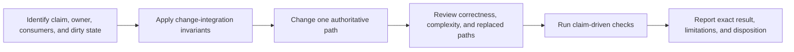

# Engineering Workflow

**Status:** workflow index

Use this folder for procedures that govern how work moves through the repository. These documents apply because of the activity being performed, not because of a source module.

## Workflow Sequence

Documentation organization and capability review join this sequence when claims, boundaries, selectors, evidence contracts, or document placement change.

## Procedure Routes

| Document | Read it when... |
| --- | --- |
| [Change Integration](ChangeIntegration.md) | making any owned repository change; it defines the invariants and clean-break contract |
| [Change Lifecycle](ChangeLifecycle.md) | preparing, implementing, validating, or handing off a material change |
| [Code Review](CodeReview.md) | reviewing a changelist without changing it |
| [Capability Documentation Review](CapabilityReview.md) | hardening a capability inventory, tracing horizontal/vertical coverage, or preparing missing evidence |
| [Documentation Organization](DocumentationOrganization.md) | adding, splitting, moving, naming, linking, or retiring documentation |
| [Documentation Page Template](DocumentationPageTemplate.md) | writing or restructuring an overview, feature dossier, concept page, or task guide for quick human comprehension |

Return to the [Engineering task map](../README.md#choose-by-task) to select conditional module and verification rules.
