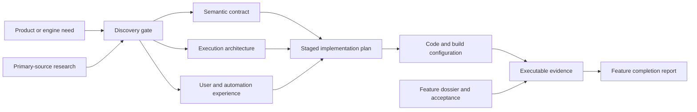
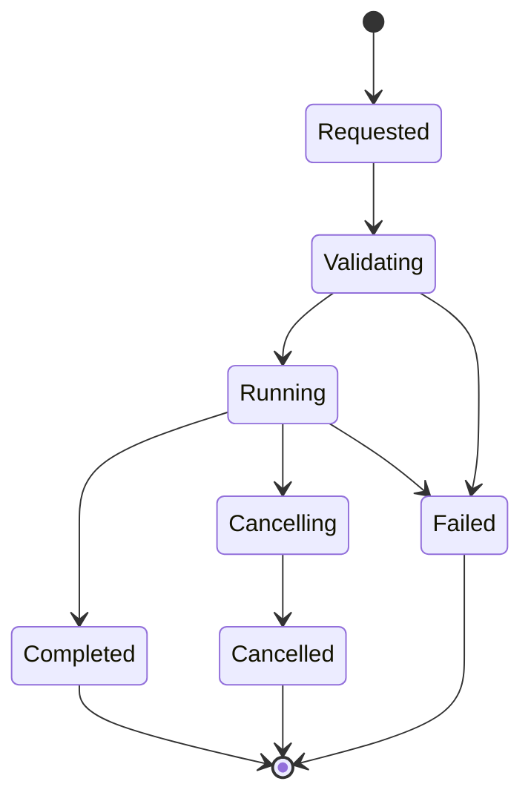
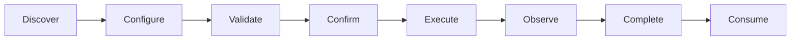

# Feature Delivery Documentation Package Template

**Status:** writing template; this page is workflow scaffolding, not feature authority or implementation evidence

**Scope:** provide a reusable, copy-ready documentation package for researching, deciding, architecting, implementing, validating, and introducing a substantial SparkleEngine feature

**Authority boundary:** [Documentation Organization](../DocumentationOrganization.md) owns placement, naming, granularity, and navigation; [Change Lifecycle](../ChangeLifecycle.md) owns iteration, risk, acceptance, failure, check, and decision requirements; [Change Integration](../ChangeIntegration.md) owns production-path and clean-break rules; [Validation And Evidence](../../Verification/ValidationAndEvidence.md) owns check design and evidence meaning; this template owns only the reusable document shape and population sequence

Use this package when a feature crosses several durable knowledge roles, introduces a new public or selectable result, changes ownership/lifetime, needs external precedent, contains algorithmic or protocol correctness, creates a user/tool workflow, or will support a feature-completion claim. The worked example is the Renderer [Reference Path Tracer dossier](../../../Architecture/Modules/Engine/Renderer/Features/Lighting/ReferencePathTracer/README.md).

> [!IMPORTANT]
> Copying this template does not advance readiness or authorize implementation. Replace every `{{PLACEHOLDER}}`, verify current-state statements against code and executable build configuration, keep unresolved decisions visibly blocked, and retain actual results only in their candidate-bound evidence or completion report.

## What The Package Produces

The package separates facts that change for different reasons while keeping them one navigable feature unit:



Notice the direction of authority: research informs decisions, discovery freezes them, architecture and semantics define the target, the plan orders work, code proves what exists, and retained evidence supports a completion verdict. None substitutes for the next.

## Select The Smallest Honest Package

| Feature shape | Recommended documents | Do not do |
| --- | --- | --- |
| Small, one-owner behavior with no independent research or rollout | One dossier using the [page template](Page.md), with compact design and acceptance sections. | Create empty companion documents for appearance. |
| Moderate feature with a known algorithm and one user route | `README.md`, `ExecutionArchitecture.md`, `Plan.md`; add `Research.md` or `UserExperience.md` only when independently maintained. | Mix current state, future stages, and executed results into one diary. |
| Algorithmically sensitive feature | Add `Semantics.md` for equations, protocol, state-machine, data-format, or deterministic-behavior authority. | Leave correctness-defining choices to implementation prompts. |
| Product/tool workflow | Add `UserExperience.md` for discovery, setup, progress, interruption, results, accessibility, and automation equivalence. | Treat a debug panel, CVar, or happy-path screenshot as product completion. |
| High-assurance reference, infrastructure, release, security, or evidence feature | Use all seven feature-local roles below unless a documented combination preserves one owner and one lifecycle. | Reduce rigor because the feature is internal or technically impressive. |

The full package has seven direct Markdown files, matching the active-folder sibling budget in [Documentation Organization](../DocumentationOrganization.md#granularity). If an eighth independently maintained role is necessary, form a durable subfolder with its own index instead of flattening or merging authority.

## Package Roles And Single Truth

| Feature-local file | Owns | Must not own |
| --- | --- | --- |
| `README.md` | Feature identity, reader route, bounded promise, current disposition, feature matrix, binary acceptance, controlled failures, check coverage, and conjunctive definition of done. | Detailed precedent, implementation order, or candidate results. |
| `Discovery.md` | The blocking questions, decision records, experiments, risks, evidence package, and exact gate that authorize planning or implementation. | Production implementation or a silent assumption disguised as a default. |
| `Research.md` | Revision-pinned current-source findings, primary external precedent, comparison, permitted transfer, non-inference, and rights/provenance notes. | Local design authority, implementation claims, or acceptance verdicts. |
| `Semantics.md` | Exact algorithm, equations, protocol, format, units, invariants, edge cases, reference procedure, and rule-to-code ledger when these deserve an independent lifecycle. | System ownership, delivery order, or proof that code conforms. |
| `ExecutionArchitecture.md` | Current and target owners, producer/consumer boundaries, identity, lifetime, state, execution, capacity, failure, backend/mode, package, and clean-break shape. | Equation details already owned by `Semantics.md`, UI behavior, or completion results. |
| `UserExperience.md` | Intended people, discoverability, setup, preflight, state/action truth, progress, interruption, errors, results, accessibility, support, and UI/CLI/API equivalence. | Renderer/runtime mutable truth or duplicated architecture. |
| `Plan.md` | Dependency order, stage scope, prerequisites, estimates, deletions, non-goals, prompts, exit gates, and handoff shape. | Enduring design decisions, research claims, or feature acceptance. |

When a role is omitted, put its necessary facts in the nearest coherent owner and state that no independent document is needed. Do not leave a broken link to a document that does not exist.

## Placeholder Contract

Use a consistent replacement vocabulary while drafting:

| Placeholder | Replace with |
| --- | --- |
| `{{FEATURE_NAME}}` | Human-readable feature name. |
| `{{FEATURE_PATH}}` | Repository-relative owning feature folder. |
| `{{OWNER_MODULE}}` | Primary module or cross-module subject that owns the result. |
| `{{PREFIX}}` | Short stable uppercase identifier prefix for local `FS`, `AC`, `FM`, `CHK`, `RISK`, and semantic rows. |
| `{{DISCOVERY_GATE}}` | Stable gate that must pass before implementation-shaping decisions become authoritative. |
| `{{PLAN_ID}}` | Stable plan identity when another document needs to cite a revision. |
| `{{FCR_ID}}` | Feature completion report identity or `Not assigned` with owner. |
| `{{REL_GATE}}` | Applicable release prerequisite or `Not applicable` with reason. |
| `{{DATE}}` | ISO date of the current inspection or decision. |
| `{{REVISION}}` | Exact commit/revision inspected; separately describe dirty work. |
| `{{READINESS}}` | Projection of the central readiness row, never an acceptance percentage. |
| `{{PERSONA}}` | Intended developer, author, operator, player, service, or downstream system. |
| `{{PRODUCT}}` | Exact semantic output or observable outcome. |

The scaffolds also use self-describing uppercase tokens such as `{{SAFE_STATE}}` and `{{MINIMUM_FALSIFIER}}`; these are author prompts, not a closed data schema. Replace them with concrete prose, identifiers, values, and relative links rather than preserving the token names as feature vocabulary.

Before handoff, a repository search for `{{`, `}}`, `TBD`, `TODO`, `should work`, and unowned `Unknown` must either return zero or identify an explicit blocked decision with an owner and gate.

## Instantiate In This Order

1. Create the iteration control record required by [Change Lifecycle](../ChangeLifecycle.md#create-the-iteration-control-record). Record start revision, dirty state, scope, North Star, applicable requirements, risks, acceptance, failure modes, checks, and intended decision.
2. Locate the durable owner through the Architecture map. Search code, build membership, generated products, selectors, configurations, tests, documentation, producers, consumers, and replaced names before creating the folder.
3. Record current source truth first. Separate source-present, configured, built, executed, visually reviewed, performance-measured, packaged, adopted, and release-accepted states.
4. Write the feature dossier's bounded promise and non-promise. If the user or downstream consumer cannot identify the result, the feature is not ready to plan.
5. Select only the package roles with independent responsibility, audience, lifecycle, or review needs. Keep the folder at seven direct Markdown files or fewer.
6. Reserve one local ID prefix and define feature statements, criteria, failures, checks, risks, and semantic rules without renumbering existing repository IDs.
7. Research current local sources and primary external sources. Pin mutable repositories to commits and distinguish observed fact, proposed transfer, and forbidden inference.
8. Close discovery decisions or keep the implementation gate blocked. Do not let the plan or prompt choose unresolved algorithms, units, ownership, scope, user behavior, thresholds, or budgets.
9. Populate semantics, architecture, and experience from the accepted discovery revision. Give each fact one owner and cross-link rather than restating it.
10. Build a dependency-ordered plan whose stages produce reviewable vertical slices. Every stage names prerequisites, deletions, non-goals, risks, exit evidence, stop conditions, and a copy-ready prompt.
11. Map every included feature statement and failure to an acceptance criterion and a check capable of exposing the defect. Predeclare thresholds, samples, matrices, and stop rules before candidate results exist.
12. Add the nearest-index route, run link/anchor/placeholder/UTF-8/whitespace checks, inspect the scoped diff, and report precisely which executable checks were not run.

## Ready-To-Use Package Authoring Prompt

Use this prompt to populate a new feature package. Replace its placeholders before execution.

```text
Create or materially refresh the feature documentation package for {{FEATURE_NAME}} at {{FEATURE_PATH}}. This is a research, discovery, architecture, acceptance, UX, and staged-planning task; do not change production code unless the request separately authorizes implementation.

Apply AGENTS.md, Docs/README.md, Docs/Engineering/Workflow/ChangeIntegration.md, Docs/Engineering/Workflow/ChangeLifecycle.md, Docs/Engineering/Workflow/DocumentationOrganization.md, Docs/Engineering/Workflow/CapabilityReview.md, and Docs/Engineering/Workflow/Templates/FeatureDeliveryPackage.md. Select every additional applicable foundation, module, and verification document from the Engineering task map.

Inspect first: git status and revision; the nearest Architecture owner and indexes; every current selector/caller, producer, consumer, mutable owner, lifetime, build/generated membership, backend/mode/profile/content path, result, failure, test/evidence route, and stale or competing name. Preserve unrelated dirty work. Distinguish committed baseline from concurrent changes.

Research current local implementation before external precedent. Use original papers/specifications, official vendor documentation, and revision-pinned primary source repositories. For every source record the observed fact, permitted transfer, forbidden inference, exact revision/date, and license/provenance action. Research is not local implementation or acceptance proof.

Choose the smallest honest set of feature-local documents from README.md, Discovery.md, Research.md, Semantics.md, ExecutionArchitecture.md, UserExperience.md, and Plan.md. Keep one owner per current fact, decision, semantic rule, architecture contract, UX behavior, plan item, and result; link instead of copying. Do not exceed seven direct Markdown siblings.

Populate the package end to end: plain-language product and non-promises; revision-pinned current route; complete feature/support matrix; blocking discovery questions and risks; exact semantics, units, edge/invalid behavior, and reference procedure where applicable; ownership, identity, lifetime, state, execution, capacity, backend/mode, failure/recovery, security/package, and clean-break architecture; intended first-use and automation experience; binary AC/FM/CHK coverage; dependency-ordered stages, estimates, deletions, non-goals, stop conditions, and copy-ready implementation prompts.

NON-NEGOTIABLE: no unresolved choice that can change product scope, correctness, units, identity, ownership, lifetime, failure behavior, public UX, thresholds, budgets, evidence validity, package reachability, or architecture may be deferred into an implementation prompt. Every included surface maps to an owner, semantic disposition, stage, acceptance criterion, failure coverage, defect-detecting check, and completion-result owner. Every prompt must contain an explicit non-negotiable exit paragraph and must block rather than improvise when prerequisites are absent or contradicted.

Validate local links and anchors, placeholder disposition, IDs and no-orphan traceability, direct-sibling budget, strict UTF-8, whitespace, stale paths/names, scoped diff, and git diff --check. Run no build/runtime/GPU/visual/performance/package check unless a specific documentation claim requires it. Report exact checks and limitations, and keep the first production stage BLOCKED until the accepted discovery and release prerequisites pass.
```

## Evidence Language Used By Every File

| State | Meaning |
| --- | --- |
| `Observed source` | The named source/build path was inspected at a revision; compilation or execution is not implied. |
| `Proposed` | A target or candidate decision awaits its named gate. |
| `Accepted contract` | The responsible reviewer approved the exact revision; implementation is not implied. |
| `Implemented path` | Source and executable build membership contain the path; runtime evidence is separate. |
| `Verified` | The named command/workflow, configuration, oracle, observation, and artifact passed for the stated candidate. |
| `Blocked` | A named prerequisite or unresolved decision prevents the next claimed step. |
| `Excluded` | The behavior is intentionally outside the bounded scope and unreachable or clearly rejected. |
| `Superseded` | A newer authority replaced this one and all active references were reconciled. |

Avoid bare “supported,” “complete,” “production ready,” “reference,” “ground truth,” “deterministic,” “safe,” or “fast.” Each needs a domain, claimant, matrix, threshold, and evidence state.

## Scaffold: `README.md` — Feature Dossier And Acceptance

Copy this structure into the feature folder's `README.md`. Delete instructions and inapplicable sections only after their absence is justified.

````markdown
# {{FEATURE_NAME}} Feature Dossier

**Status:** feature dossier; {{BLOCKED_OR_CURRENT_DISPOSITION}}

**Responsibility:** define {{PRODUCT}}, its bounded feature surface, current state, acceptance criteria, failure modes, checks, and definition of done

**Authority boundary:** Research owns precedent; Discovery owns {{DISCOVERY_GATE}}; Semantics owns correctness-defining rules; Execution Architecture owns system shape; User Experience owns human/automation behavior; Plan owns delivery order; code/build configuration owns implementation; {{FCR_ID}} owns candidate results

**Verified:** {{DATE}} against {{REVISION}}; {{DIRTY_STATE_AND_EVIDENCE_BOUNDARY}}

**Current readiness:** {{READINESS}} — central readiness link and reason

Explain in plain language what the feature does, who needs it, and why its output matters.

> [!IMPORTANT]
> **Current state:** {{IMPLEMENTED_PARTIAL_GATED_NOT_FOUND}}
>
> **Main limitation:** {{MOST_IMPORTANT_GAP}}
>
> **Evidence:** {{SOURCE_BUILD_RUNTIME_PERFORMANCE_PACKAGE_RELEASE_BOUNDARY}}

## Outcome And Bounded Claim

Define the exact actor, input, preconditions, authoritative production route, observable result, and deliberate non-claims. Define overloaded terms before using them.

## At A Glance

| Area | Current | Target | Evidence or blocker |
| --- | --- | --- | --- |
| User/developer reachability | {{STATE}} | {{RESULT}} | {{LINK_OR_GATE}} |
| Core semantics | {{STATE}} | {{RESULT}} | {{LINK_OR_GATE}} |
| Platform/mode coverage | {{STATE}} | {{RESULT}} | {{LINK_OR_GATE}} |
| Failure/recovery | {{STATE}} | {{RESULT}} | {{LINK_OR_GATE}} |
| Delivery/adoption | {{STATE}} | {{RESULT}} | {{LINK_OR_GATE}} |

## How It Fits

```mermaid
flowchart LR
    Intent[{{ACTOR_AND_INTENT}}] --> Owner[{{OWNER_MODULE}} feature owner]
    Owner --> Mechanism[{{LOWER_LEVEL_MECHANISM}}]
    Mechanism --> Product[{{PRODUCT}}]
    Product --> Consumer[{{CONSUMER_OR_EVIDENCE}}]
```

State what the reader should notice about ownership and the result.

## Start Here

| Question | Owning document |
| --- | --- |
| What must the feature provide and prove? | This dossier |
| What is still undecided? | Discovery |
| Which local/external precedents informed it? | Research |
| What exactly defines semantic correctness? | Semantics, or this dossier when no separate semantic contract exists |
| Who owns state, execution, lifetime, and failure? | Execution Architecture |
| How does a person or automation use it? | User Experience, or the owning architecture when no separate experience exists |
| In what order is it delivered? | Plan |
| What did a candidate actually prove? | {{FCR_ID}} and retained evidence |

## Current Implemented Route

Trace the live selector/caller through producers, owners, boundaries, consumers, result, failure, and build membership. Label every statement as source-only or link exact executable evidence.

## Feature Set

| ID | Domain | Required result | Included, excluded, or pending | Boundary and reason |
| --- | --- | --- | --- | --- |
| `{{PREFIX}}-FS-01` | {{DOMAIN}} | {{OBSERVABLE_SEMANTIC_RESULT}} | {{STATE}} | {{LIMIT_OR_EXCLUSION}} |

Cover every reachable selector, mode, backend, content/input class, product profile, and output that can change semantics. An exclusion is a product decision and must remain visibly unreachable or rejected.

## Support Matrix

| Product/profile | Platform/backend/mode | Input/content class | State | Requested versus active behavior | Evidence |
| --- | --- | --- | --- | --- | --- |
| {{CELL}} | {{CELL}} | {{CELL}} | {{STATE}} | {{STRICT_REJECT_OR_VISIBLE_SELECTION}} | {{LINK_OR_MISSING}} |

Split cells only when behavior, capability gates, failure, quality, cost, or proof differs.

## Acceptance Criteria

Every row is binary. Include actor/input, preconditions, authoritative route, observable result, matrix, threshold/tolerance, and retained evidence.

| ID | Pass criterion | Required evidence | Failure condition |
| --- | --- | --- | --- |
| `AC-{{PREFIX}}-01` | Given {{INPUT_AND_PRECONDITION}}, {{ACTOR}} obtains {{EXACT_RESULT}} through {{ROUTE}} for {{MATRIX}} within {{PREDECLARED_THRESHOLD}}. | {{COMMAND_WORKFLOW_ORACLE_ARTIFACT}} | {{ONE_OBSERVABLE_FAIL_VERDICT}} |

## Runtime And Operational Failure Modes

| ID | Cause or injected fault | Detection boundary | Safe state and user-visible result | Recovery/cleanup | Severity | Criteria/risks |
| --- | --- | --- | --- | --- | --- | --- |
| `FM-{{PREFIX}}-01` | {{CAUSE}} | {{EARLIEST_OWNER}} | {{SAFE_STATE_AND_MESSAGE}} | {{BOUNDED_RECOVERY}} | {{SEVERITY}} | {{AC_AND_RISK_IDS}} |

Include invalid input, unsupported capability/domain, capacity/overflow, timeout, cancellation, shutdown, device/process loss, publication failure, stale identity, corrupted artifacts, and invariant violations when applicable.

## Verification Checks

| ID | Claim or defect | Initial state | Action or injection | Oracle and matrix | Retained artifacts | Cleanup | Escalation |
| --- | --- | --- | --- | --- | --- | --- | --- |
| `CHK-{{PREFIX}}-01` | {{AC_OR_FM}} | {{CONTROL}} | {{SMALLEST_FALSIFIER}} | {{INDEPENDENT_EXPECTATION}} | {{LOG_DATA_IMAGE_REPORT}} | {{RESTORE}} | {{WHEN_TO_RUN_BROADER_CHECK}} |

Source inspection, compilation, one successful run, one screenshot, one backend, and one average metric cannot share a verdict unless they truly test the same claim.

## Traceability

| Feature statement | Semantic rule | Architecture owner | Plan stage | Acceptance | Failure modes | Checks | Result owner |
| --- | --- | --- | --- | --- | --- | --- | --- |
| `{{PREFIX}}-FS-01` | `{{PREFIX}}-SEM-01` | {{OWNER}} | {{STAGE}} | `AC-{{PREFIX}}-01` | `FM-{{PREFIX}}-01` | `CHK-{{PREFIX}}-01` | {{FCR_ID}} |

No included row, material risk, failure mode, or acceptance criterion may be orphaned.

## Definition Of Done

The feature is complete only when all applicable criteria pass conjunctively for one candidate revision and configuration family, all required failures have been exercised, every replacement is deleted, current architecture and package membership agree, the intended user/automation route succeeds, and {{FCR_ID}} records `PASS` with exact evidence and limitations.

List feature-specific closure conditions that are not already owned by a linked repository standard. Do not repeat stage exit criteria here.

## References

Link current source/build owners, neighboring architecture, the central capability/readiness row, applicable release/workload gates, the completion-report route, and this feature's companion documents.
````

## Scaffold: `Discovery.md` — Decision And Authorization Gate

Discovery exists to prevent implementation from deciding the product by accident.

````markdown
# {{FEATURE_NAME}} Discovery And Plan-Readiness Gate

**Status:** discovery contract; `{{DISCOVERY_GATE}} BLOCKED` until every criterion passes at one revision

**Responsibility:** resolve the decisions and evidence required to freeze {{PRODUCT}} and authorize the first production implementation stage

**Authority boundary:** the dossier owns feature acceptance; Research owns precedent; Semantics/Architecture/Experience contain proposed contracts; Plan owns only conditional delivery; this page owns decision closure and authorization

**Prepared:** {{DATE}} against {{REVISION}}; no implementation or executable proof is implied

## Decision To Make

State the exact yes/no or option-selection decision, who decides it, what `PASS` authorizes, and what it explicitly does not authorize.

## Known Current State

List confirmed source/build facts, current user route, useful existing mechanisms, missing owners, and evidence gaps. Separate observations from hypotheses.

## Decision Register

| ID | Decision or question | Options considered | Evidence required | Owner | Status | Consequence if unresolved |
| --- | --- | --- | --- | --- | --- | --- |
| `{{PREFIX}}-Q-01` | {{QUESTION}} | {{OPTIONS}} | {{SOURCE_EXPERIMENT_REVIEW}} | {{OWNER}} | Open | Blocks {{SCOPE_ARCHITECTURE_SEMANTICS_OR_EVIDENCE}} |

Include scope/claims, semantics, ownership, identity/lifetime, user workflow, platform/mode matrix, failure/recovery, security/rights, performance/capacity, artifacts, thresholds, and adoption.

## Gate Acceptance Criteria

| ID | Pass criterion | Required retained evidence | Blocks exit when |
| --- | --- | --- | --- |
| `AC-{{DISCOVERY_GATE}}-01` | {{BINARY_DECISION_COMPLETENESS}} | {{SIGNED_OR_REVIEWED_ARTIFACT}} | {{WHAT_A_REVIEWER_WOULD_STILL_HAVE_TO_INFER}} |

Require exact terms, current-route audit, feature disposition, semantic derivation, architecture/lifetime, oracle independence, check design, thresholds, budgets, experience, security/rights, clean break, estimates, and independent review as applicable.

## Risk Register

| ID | Cause, event, consequence | Likelihood rationale and impact | Prevention | Detection trigger/check | Contingency | Owner | Retirement evidence |
| --- | --- | --- | --- | --- | --- | --- | --- |
| `RISK-{{PREFIX}}-01` | {{CAUSE_EVENT_CONSEQUENCE}} | {{RATIONALE_AND_IMPACT}} | {{PREVENTION}} | {{TRIGGER_OR_CHECK}} | {{SAFE_RESPONSE}} | {{OWNER}} | {{OBSERVABLE_CLOSURE}} |

## Required Probes And Experiments

| Probe | Claim it can falsify | Smallest surface | Input/control | Observation | Retained output | Escalation |
| --- | --- | --- | --- | --- | --- | --- | --- |
| {{PROBE}} | {{CLAIM}} | {{FOCUSED_OWNER}} | {{KNOWN_CONTROL}} | {{PASS_FAIL_SIGNAL}} | {{ARTIFACT}} | {{ONLY_IF_NEEDED}} |

## Evidence Package

List the exact linked artifacts required for the decision: terminology, current trace, research ledger, feature matrix, semantic contract and hand cases, ownership/lifetime graph, UX dry run, risk/failure/check coverage, budgets, rights/security, estimates, clean-break ledger, and independent review.

## Exit Rule

`{{DISCOVERY_GATE}} PASS` requires every criterion to pass at one immutable report revision and every question capable of changing scope, semantics, architecture, experience, evidence, or delivery to be closed. Otherwise the verdict is `BLOCKED`, with the next permitted discovery action. Document volume, agreement in principle, and a plausible prototype are not pass evidence.
````

## Scaffold: `Research.md` — Current Source And Primary Precedent

Research should make future decisions better and overclaiming harder. It is not a feature wish list.

````markdown
# {{FEATURE_NAME}} Research

**Status:** research snapshot; precedent and findings only

**Responsibility:** compare the live Sparkle implementation and primary external precedents to identify decisions, failure modes, architecture options, evidence needs, and rejected transfers for {{FEATURE_NAME}}

**Authority boundary:** code/build configuration owns current implementation; Discovery owns decisions; Semantics/Architecture/Experience own accepted targets; the dossier owns acceptance; this page owns only dated findings and source provenance

**Research snapshot:** {{DATE}} against local {{REVISION}} and the external revisions listed below

**Non-claims:** state every build, runtime, visual, performance, package, security, compatibility, and acceptance claim not produced by this study

## Questions And Method

- List concrete research questions tied to open discovery decisions.
- Inspect current local owner, producers, consumers, lifetime, selectors, build membership, tests, failures, and user route before external comparison.
- Prefer original papers/specifications, official documentation, and source repositories. Pin mutable source references to commits/tags.
- Record observation separately from interpretation and proposed transfer.

## Current Sparkle Route

| Layer | Current owner/path | Observed behavior | Evidence state | Gap or risk |
| --- | --- | --- | --- | --- |
| Selection to result | {{SOURCE_AND_BUILD_PATH}} | {{OBSERVATION}} | Source inspection | {{GAP}} |

## External Source Ledger

| ID | Primary source and exact revision | Observed mechanism or behavior | Permitted Sparkle use | What it does not prove or justify | Rights/provenance action |
| --- | --- | --- | --- | --- | --- |
| `{{VENDOR_OR_REF_ID}}` | {{PAPER_SPEC_OFFICIAL_DOC_OR_PINNED_SOURCE}} | {{SOURCE_BACKED_FACT}} | {{CHECKLIST_ALGORITHM_CANDIDATE_ARCHITECTURE_OR_TEST_SHAPE}} | {{NON_INFERENCE}} | {{LICENSE_ASSET_BINARY_REVIEW}} |

Never cite a vendor product name, marketing feature list, or “reference” label as proof of local correctness. Do not copy source merely because it is public.

## Cross-Reference Comparison

| Concern | Sparkle current state | Source A | Source B | Decision pressure, not decision |
| --- | --- | --- | --- | --- |
| Ownership/architecture | {{FACT}} | {{FACT}} | {{FACT}} | {{QUESTION_FOR_DISCOVERY}} |
| Core semantics | {{FACT}} | {{FACT}} | {{FACT}} | {{QUESTION_FOR_DISCOVERY}} |
| Failure/recovery | {{FACT}} | {{FACT}} | {{FACT}} | {{QUESTION_FOR_DISCOVERY}} |
| UX/automation | {{FACT}} | {{FACT}} | {{FACT}} | {{QUESTION_FOR_DISCOVERY}} |
| Evidence/testing | {{FACT}} | {{FACT}} | {{FACT}} | {{QUESTION_FOR_DISCOVERY}} |

## Failure Lessons

| Failure or misleading success | Source evidence | Prevention candidate | Required falsifier |
| --- | --- | --- | --- |
| {{FAILURE}} | {{PRIMARY_SOURCE}} | {{CANDIDATE}} | {{CHECK_THAT_WOULD_EXPOSE_IT}} |

## Adopt, Adapt, Reject, Or Defer

| Candidate | Disposition | Reason and cost | Owning decision/gate |
| --- | --- | --- | --- |
| {{MECHANISM_OR_PRODUCT_SHAPE}} | Adopt / Adapt / Reject / Defer | {{EVIDENCE_BACKED_TRADEOFF}} | {{QUESTION_OR_GATE}} |

These are research recommendations until the owning decision accepts them.

## Remaining Unknowns

List only unknowns with an owner, consequence, smallest next probe, and destination gate. An unbounded “future research” item is not actionable.
````

## Scaffold: `Semantics.md` — Algorithm, Protocol, Or Correctness Contract

Create this file when correctness depends on formulas, units, coordinate conventions, data formats, protocol transitions, deterministic ordering, or another normative algorithm deserving independent review. Otherwise keep the small semantic contract in `ExecutionArchitecture.md`.

````markdown
# {{FEATURE_NAME}} Semantic Contract

**Status:** proposed semantic contract; not accepted until {{DISCOVERY_GATE}} ratifies this exact revision

**Responsibility:** define the exact domain, notation, units, rules, reference procedure, edge behavior, and rule-to-code correspondence for {{PRODUCT}}

**Authority boundary:** Discovery owns ratification; Execution Architecture owns system placement; User Experience owns interaction; the dossier owns acceptance; Plan owns delivery order

**Prepared:** {{DATE}} against {{REVISION}}; no conformance or executable proof is implied

> [!IMPORTANT]
> An implementer may not select a missing constant, convention, policy, ordering rule, approximation, invalid-input disposition, or threshold while writing code. Unresolved choices keep {{DISCOVERY_GATE}} blocked.

## Claim And Domain

Define the exact target, included inputs/events/states, excluded domain, claimant, equivalence notion, and whether finite/approximate/diagnostic products are separate products.

## Notation, Units, Coordinates, And Identity

| Symbol or term | Exact meaning | Type/domain | Units/space/order | Invalid or boundary behavior |
| --- | --- | --- | --- | --- |
| `{{TERM}}` | {{MEANING}} | {{DOMAIN}} | {{UNIT_CONVENTION}} | {{ZERO_LIMIT_INVALID}} |

Every symbol, probability measure, coordinate/normal/frame, color/encoding, timestamp/order, ID/generation, byte layout, and tolerance used later must be defined once.

## Inputs And Outputs

| Item | Producer and frozen identity | Semantic meaning | Valid domain | Consumer/result |
| --- | --- | --- | --- | --- |
| {{INPUT_OR_OUTPUT}} | {{OWNER_AND_IDENTITY}} | {{MEANING}} | {{PRECONDITION}} | {{CONSUMER}} |

## Normative Rules

### `{{PREFIX}}-SEM-01` — {{RULE_NAME}}

**Purpose:** {{WHAT_CORRECTNESS_PROPERTY_THIS_DEFINES}}

**Preconditions:** {{VALID_INPUT_AND_STATE}}

**Rule, equation, transition, or layout:**

```text
{{EXACT_FORMULA_PSEUDOCODE_STATE_TRANSITION_OR_BINARY_LAYOUT}}
```

**Boundary cases:** define zero, empty, minimum/maximum, equal, overflow, underflow, discontinuity/delta, stale, duplicate, partial, cancelled, unsupported, malformed, and non-finite cases where applicable.

**Forbidden repair:** name clamps, retries, coercions, fallbacks, reordering, approximation, dropped errors, or fabricated output that would make a violation look successful.

**Minimum falsifier:** {{HAND_CASE_KNOWN_VALUE_PROPERTY_FAULT_INJECTION_OR_INDEPENDENT_ORACLE}}

Repeat one section per independently implemented semantic rule.

## Reference Procedure

```text
Evaluate{{FEATURE_NAME}}(frozenRequest):
  validate the entire declared domain before irreversible work
  derive stable identity and immutable inputs
  execute {{PREFIX}}-SEM-* rules in the accepted order
  reject invalid, unsupported, stale, partial, or non-finite state
  publish the exact semantic result only after completion
```

The reference procedure is deliberately reviewable. Optimized, parallel, backend-specific, cached, incremental, or approximate implementations may replace its execution shape only after proving the accepted equivalence relation and preserving diagnostics.

## Rule-To-Code And Evidence Ledger

| Rule | Required implementation owner/correspondence | Minimum defect injection | Retained evidence |
| --- | --- | --- | --- |
| `{{PREFIX}}-SEM-01` | {{TYPE_FUNCTION_SHADER_FORMAT_OR_STATE}} | {{WRONG_TERM_ORDER_UNIT_STATE_OR_BOUNDARY}} | {{ARTIFACT}} |

No semantic term may exist only in code, and no accepted rule may lack one implementation owner and a check capable of detecting its violation.

## Common Semantic Failure Points

| Symptom or plausible output | Likely defect | First discriminating check | Forbidden first response |
| --- | --- | --- | --- |
| {{SYMPTOM}} | {{CAUSE}} | {{CHECK}} | {{CLAMP_RETRY_TOLERANCE_OR_VISUAL_TUNING}} |

## Ratification Checklist

Before implementation:

1. every rule is Accepted, Replaced, or Excluded at one revision;
2. every symbol, unit, convention, ordering, limit, error case, and approximation is explicit;
3. known-value, zero/limit, invalid, adversarial, and merge/restart cases are hand-derived where applicable;
4. every rule has one code owner and one defect-detecting check;
5. independent domain review records corrections and remaining limits;
6. public labels, feature scope, architecture, UX, artifacts, and checks use the same semantics;
7. any remaining inference keeps {{DISCOVERY_GATE}} blocked.

## Primary Sources

List original papers, specifications, standards, or pinned source used to derive and challenge this contract. State which local rule each source informs and what it does not prove.
````

## Scaffold: `ExecutionArchitecture.md` — Ownership And Delivery Shape

````markdown
# {{FEATURE_NAME}} Execution Architecture

**Status:** proposed target architecture; implementation requires {{DISCOVERY_GATE}} and {{REL_GATE}}

**Scope:** define owners, request/result contracts, inputs, identity, lifetime, execution, capacity, failure, platform/mode boundaries, publication, and clean-break shape for {{PRODUCT}}

**Authority boundary:** Semantics owns correctness rules; User Experience owns interaction; Discovery owns ratification; the dossier owns acceptance; Plan owns delivery order; code/build configuration owns implemented behavior

**Verified:** {{DATE}} against {{REVISION}}; current statements are {{SOURCE_OR_EXECUTABLE_EVIDENCE}}

**Current readiness:** {{READINESS}} — central readiness link

## Current Route And Gaps

Trace the current selector/request to result and failure. Identify real owners, useful mechanisms, missing products, duplicated authority, hidden fallbacks, mutable aliases, fixed limits, build membership, and evidence gaps.

## Target Ownership

```mermaid
flowchart LR
    Intent[{{ACTOR_OR_CALLER}} intent] --> Policy[{{POLICY_OWNER}}]
    Policy --> Snapshot[Immutable request/input identity]
    Snapshot --> Work[{{WORK_OWNER}}]
    Work --> Mechanism[{{LOW_LEVEL_MECHANISM_OWNER}}]
    Work --> Result[Transactional result]
    Result --> Consumer[{{CONSUMER}}]
```

Explain why policy remains with the feature owner and lower layers expose mechanism rather than choosing product behavior.

## Feature Enclosure And Integration-Hook Budget

Name one implementation home and the one-sentence responsibility it owns. Draw the shortest host-frame or operation route into it, then freeze the allowed hooks before implementation.

| Surface | Permitted role | Existing or new | Exact semantic payload | Why it cannot remain feature-local | Removal proof | Per-stage check |
| --- | --- | --- | --- | --- | --- | --- |
| {{COMPOSITION_POINT}} | select and invoke only | {{STATE}} | {{INTENT_OR_RESULT}} | {{NECESSITY}} | {{ZERO_RESIDUE_SEARCH}} | `CHK-{{PREFIX}}-ARCH` |

Default to zero new public types, zero feature-specific fields on generic owners, and zero feature policy in Scene, View, RHI, settings, history, UI, or application orchestration. List every accepted exception. The feature owner contains algorithms, mutable state, validation, resource declarations, shader bindings, diagnostics, and feature-specific failure handling. Generic owners may retain only existing semantic truth and narrow composition/publication.

Define `AC-{{PREFIX}}-ARCH` for enclosure/change locality, `FM-{{PREFIX}}-ARCH` for feature diffusion or duplicate authority, and `CHK-{{PREFIX}}-ARCH` as a mandatory per-stage architecture-fitness audit. The check inventories every touched file outside the feature home, searches feature symbols and repeated selectors, inspects public/shared surface growth and dependency direction, verifies the orchestrator contains no mechanics, and proves bounded deletion. A build or formatter result is never this evidence.

## Owner, Producer, Consumer, And Lifetime

| Data, state, or operation | Mutable owner | Producer | Consumers | Identity/generation | Lifetime/publication | Capacity/retirement |
| --- | --- | --- | --- | --- | --- | --- |
| {{ITEM}} | {{ONE_OWNER}} | {{PRODUCER}} | {{CONSUMERS}} | {{STABLE_ID}} | {{BOUNDARY}} | {{LIMIT_AND_RETIREMENT}} |

Apply the single-truth and copy budget. Name the real lifetime/publication boundary for every copy or snapshot.

## Request, Active State, Progress, And Result Contracts

| Contract | Required semantic fields | Owner | Invalid/stale behavior |
| --- | --- | --- | --- |
| Request | {{INTENT_AND_BUDGETS}} | {{POLICY_OWNER}} | Reject before scheduling |
| Active | {{REQUESTED_AND_RESOLVED_VALUES}} | {{WORK_OWNER}} | Never silently substitute |
| Progress | {{COMMITTED_FACTS_AND_ESTIMATES}} | {{WORK_OWNER}} | Cannot imply completion |
| Result | {{TERMINAL_CATEGORY_OUTPUTS_COUNTERS}} | {{WORK_OWNER_OR_PUBLISHER}} | Partial is not complete |

## State Machine



Replace this example with exact valid transitions, transition owner, cancellation/timeout/shutdown behavior, late-result rejection, and resource settlement.

## End-To-End Dataflow

For every arrow, state representation, mutability, owner, thread/process/queue, synchronization or completion edge, error propagation, and observability.

```text
user/config/caller
  -> validation and requested-versus-active selection
  -> immutable input snapshot and identity
  -> scheduling and bounded execution
  -> lower-level mechanism
  -> completion and transactional publication
  -> consumer, diagnostics, recovery, and retirement
```

## Platform, Backend, Mode, And Content Matrix

| Product/profile | Platform/backend | Execution mode | Input/content class | Requested behavior | Active behavior | Failure/fallback | Evidence |
| --- | --- | --- | --- | --- | --- | --- | --- |
| {{CELL}} | {{CELL}} | {{CELL}} | {{CELL}} | {{REQUEST}} | {{RESULT}} | {{STRICT_REJECT_OR_EXPLICIT_ALTERNATE}} | {{STATE}} |

An alternate route is valid only when it implements the same semantic product and has proportional evidence. Unsupported work rejects visibly before partial publication.

## Failure, Recovery, And Safe State

| Failure | Detecting owner | Earliest boundary | State/resources that remain valid | User/consumer result | Recovery and cleanup bound |
| --- | --- | --- | --- | --- | --- |
| {{FAILURE}} | {{OWNER}} | {{BOUNDARY}} | {{SAFE_STATE}} | {{VISIBLE_RESULT}} | {{ACTION_AND_TIME_BOUND}} |

## Capacity, Performance, Security, And Delivery

Define fixed capacities, memory/disk/descriptor/queue limits, latency/time budgets, overflow, cancellation, backpressure, input/path trust, sensitive diagnostics, privileges, dependency/license provenance, target/build membership, generated artifacts, and Shipping/package inclusion or exclusion.

## Design Decisions And Tradeoffs

| Decision | Constraint/evidence | Benefit | Cost | Rejected alternative and why | Revisit trigger |
| --- | --- | --- | --- | --- | --- |
| {{DECISION}} | {{WHY}} | {{BENEFIT}} | {{REAL_COST}} | {{ALTERNATIVE}} | {{MEASURABLE_TRIGGER}} |

## Clean-Break Ledger

| Current path/name/representation | Use, extend, refactor, replace, or delete | Producers/consumers to update | Disposable artifacts to regenerate | Proof old authority is gone |
| --- | --- | --- | --- | --- |
| {{CURRENT}} | {{DISPOSITION}} | {{USES}} | {{ARTIFACTS}} | {{SEARCH_BUILD_RUNTIME_CHECK}} |

No internal compatibility alias, old/new dispatcher, migration reader/writer, fallback, or dual representation is planned unless a separately accepted external compatibility contract requires it.

## Source And Build Change Map

List proposed files by owner and purpose only after the architecture is stable. Do not invent public types or folders merely to make the plan appear concrete.

## Non-Claims And Open Gates

State what remains proposed, which evidence has not run, what could invalidate this target, and the exact gate required before implementation.
````

## Scaffold: `UserExperience.md` — Human And Automation Contract

Use this file when a person, script, tool, downstream developer, or support operator must discover, configure, observe, interrupt, diagnose, or consume the feature.

````markdown
# {{FEATURE_NAME}} User Experience Contract

**Status:** proposed experience; implementation and acceptance remain gated by {{DISCOVERY_GATE}}

**Responsibility:** define how {{PERSONA}} discovers, configures, validates, executes, observes, interrupts, diagnoses, and consumes {{PRODUCT}}

**Authority boundary:** the dossier owns acceptance; Semantics owns result meaning; Execution Architecture owns job/state/data truth; Discovery owns ratification; Plan owns delivery order

**Prepared:** {{DATE}} against {{REVISION}}; no UI, CLI, API, accessibility, package, or first-use workflow is implied

## Product Promise And Non-Promise

State what a first-time intended user can accomplish without source edits, private knowledge, hidden console commands, or ambiguous outputs. Separate expert controls from the recommended path and state where the feature must not appear.

## People And Jobs

| Persona | Job to be done | Required input | Completion signal | Failure/support need |
| --- | --- | --- | --- | --- |
| {{PERSONA}} | {{JOB}} | {{INPUT}} | {{OBSERVABLE_RESULT}} | {{RECOVERY}} |

## Information Architecture

Define the smallest sequence such as Setup -> Validate/Preflight -> Execute -> Observe -> Result -> Expert Details. Name one dominant action at each point.

## Happy Path



Write the minimum clean first-use path and prove it does not require reading architecture documentation.

## Setup And Preflight

| Group | Primary fields or intent | Recommended default | Validation and explanation |
| --- | --- | --- | --- |
| {{GROUP}} | {{USER_INTENT}} | {{SAFE_DEFAULT}} | {{EARLY_ACTIONABLE_VALIDATION}} |

Preflight shows exact scope, requested and resolved behavior, identity, resource/cost estimate, outputs, excluded inputs, and blockers before irreversible or expensive work.

## State, Dominant Action, And Visible Truth

| State | User sees | Dominant valid action | Secondary action | Forbidden impression |
| --- | --- | --- | --- | --- |
| {{STATE}} | {{FACTS}} | {{ACTION}} | {{OPTIONAL_ACTION}} | {{MISLEADING_SUCCESS_OR_AUTHORITY}} |

Cover queued/requested, validating, active, checkpointing/suspending when applicable, publishing, completed, failed, cancelled, timed out, and unavailable states.

## Progress And Result Truth

Separate committed facts from estimates. Define what progress means, what remains valid during failure/cancellation, whether ETA is available, and which output is authoritative. A responsive process, smooth animation, preview, partial file, or clean log cannot imply completion.

## Pause, Cancel, Retry, Close, And Shutdown

Define the action, settlement bound, retained state, discarded work, late-result rejection, resource release, retry identity, panel/window lifetime, application shutdown, and active-capacity behavior.

## Result, Artifact, And Support Experience

Lead with terminal category, identity, active configuration, warnings/counters, authoritative product, and next actions. Keep preview, staging, checkpoint, diagnostic, failed partial, and final artifacts visibly distinct. Preserve prior successful output during retries or publication failures.

## UI, CLI, API, And Automation Equivalence

Define one serializable intent and canonical request. Interactive and noninteractive surfaces may differ in presentation, but equivalent intent resolves to equivalent active semantics, identity inputs, terminal categories, and artifacts. Assign stable exit/result categories for automation.

## Error Contract

Every failure states:

```text
What failed: one root cause in user language
Where: the object, input, setting, capability, state, or path identity
Why it matters: the invariant or result that cannot be guaranteed
Next action: one safe and specific recovery step
Details: stable category, support identity, and bounded technical record
```

## Accessibility, Locale, Scale, And Input

Define keyboard/focus order, non-color status, accessible names/announcements, high contrast, supported scale/narrow layout, explicit units, locale-independent serialization, locale-aware editing, long names, spaces, Unicode paths/content, and bounded update frequency.

## Common Experience Failure Points

| Failure | Why it is unacceptable | Required design response | Check |
| --- | --- | --- | --- |
| {{FAILURE}} | {{USER_OR_EVIDENCE_HARM}} | {{PREVENTION_AND_RECOVERY}} | {{FIRST_USE_OR_NEGATIVE_CHECK}} |

## UX Acceptance Handoff

Require a clean first-use transcript, invalid-input and failure/recovery matrix, automation equivalence, accessibility matrix, output discovery, support-record quality, package/profile reachability, and proof that UI owns no duplicated runtime truth.
````

## Scaffold: `Plan.md` — Staged Delivery And Copy-Ready Prompts

The plan begins with decisions and ends with adoption. It is not a chronological wish list.

````markdown
# {{FEATURE_NAME}} Staged Implementation Plan

**Status:** conditional {{PLAN_ID}} plan; only Stage 0 is authorized until {{DISCOVERY_GATE}} and {{REL_GATE}} pass

**Scope:** deliver {{PRODUCT}} end to end through its accepted semantic, architecture, experience, evidence, packaging, adoption, and clean-break contracts

**Prepared:** {{DATE}} against {{REVISION}}; estimates are ranges with assumptions, not commitments

**Authority boundary:** Semantics owns rules; Execution Architecture owns system shape; User Experience owns interaction; the dossier owns feature acceptance; Discovery owns authorization; Research owns precedent; this page owns order, dependencies, stage scope, deletion, estimates, prompts, and exit gates

**Current readiness:** {{READINESS}} — plan presence adds no readiness credit

> [!IMPORTANT]
> Do not start production implementation because this plan exists. Verify the exact prerequisite report revisions. A missing or contradicted prerequisite means `BLOCKED`, not permission to improvise.

## Delivery Sequence

Use only stage families required by this feature and split them when reviewability, ownership, risk, or evidence requires it:

| Family | Outcome | Typical prerequisite | Key proof |
| --- | --- | --- | --- |
| 0. Discovery/freeze | Close decisions, risks, semantic slots, architecture, UX, evidence design, budgets, estimates, and independent review. | None | {{DISCOVERY_GATE}} report |
| 1. Contracts/authority | Introduce the smallest request/result/identity boundary and remove or relabel false authority. | Discovery and release prerequisite | Invalid/ownership/clean-break checks |
| 2. Minimal vertical slice | One real input reaches one real observable result through the intended production path. | Contracts | Known-value end-to-end case |
| 3. Semantic completeness | Complete included algorithms, formats, events, modes, or data rules. | Minimal slice | Rule-to-code and fault-injection evidence |
| 4. Lifecycle/robustness | Close state, cancellation, reset, capacity, invalid data, recovery, publication, and numeric/concurrency hazards. | Semantic core | Adversarial and controlled-failure matrix |
| 5. Platform/content parity | Close every accepted backend, platform, mode, profile, and content cell without semantic forks or silent fallback. | Stable core | Paired/independent matrix evidence |
| 6. UX/automation | Deliver discoverable recommended and expert routes over the same authoritative operation. | Stable service | First-use, failure, accessibility, automation parity |
| 7. Evidence/nonfunctional | Execute predeclared correctness, performance, security, package, provenance, and resilience protocols. | Product-complete candidate | Retained candidate-bound evidence |
| 8. Adoption/cleanup | Adopt consumers, delete superseded paths and temporary probes, verify package/release reachability, and file {{FCR_ID}}. | Accepted evidence | Conjunctive feature-completion report |

Do not force these exact numbers. Preserve dependency direction and make each stage a coherent owner/invariant-sized vertical slice.

## Estimate And Capacity Envelope

| Stage | Engineering range | Review/evidence range | Dependencies | Largest uncertainty |
| --- | --- | --- | --- | --- |
| {{STAGE}} | {{LOW_HIGH_HOURS}} | {{LOW_HIGH_HOURS}} | {{GATES}} | {{UNCERTAINTY}} |

State assumptions, available hardware/tooling/content, reviewer roles, contingency, critical path, and how discovery may revise the range.

## Universal Execution Contract

Every stage executor must:

1. read repository guidance, this feature's owning documents, applicable Engineering standards, and exact prerequisite artifacts;
2. inspect current status, owners, producers, consumers, lifetime, selectors, build membership, generated products, and unrelated dirty work before editing;
3. stop on absent, stale, or contradicted prerequisites rather than inventing a decision;
4. implement only the selected stage and directly required defects;
5. maintain one semantic product and one mutable authority, with thin lower-level/backend/UI adapters;
6. apply the clean-break policy: update all owned producers/consumers and delete replaced paths without compatibility aliases or dual representations;
7. preserve explicit requested-versus-active state, strict unsupported behavior, safe failure, bounded cancellation, and transactional publication;
8. map every changed semantic to its accepted rule and every claim/failure to a defect-detecting check;
9. inspect the scoped diff and run the cheapest applicable checks before escalating;
10. run the feature's architecture-fitness check and retain its integration-hook ledger; a new unjustified hook, feature-specific generic state, scattered policy switch, or public implementation vocabulary blocks the stage;
11. report exact commands, configurations, outputs, retained artifacts, unavailable checks, limitations, blockers, deletions, and next permitted stage.

Every prompt's `NON-NEGOTIABLE` paragraph is an exit gate. The handoff quotes each requirement with proof or reports `BLOCKED`.

## Cross-Stage Invariants

- No stage silently changes accepted scope, semantics, units, identity, ownership, UX labels, thresholds, budgets, or evidence rules.
- Current source, target architecture, research precedent, plan status, candidate evidence, and release disposition remain distinct.
- Unsupported capability rejects visibly before partial scheduling/publication; no no-op, clear, copy, fallback, or swallowed failure manufactures success.
- Backend/mode/platform adapters cannot fork semantic behavior without a separately accepted product identity.
- Preview/diagnostic/partial output cannot become authoritative result.
- Thresholds, seeds, matrices, budgets, and stop rules are frozen before candidate results are observed.
- Temporary probes remain local-only and are removed before final adoption unless accepted as durable product checks.
- Every stage passes `CHK-{{PREFIX}}-ARCH`; implementation remains predominantly inside the frozen feature home and each outside edit is an accepted composition, consumer, build/generated, documentation/evidence, or clean-break hook.

## Stage {{N}} — {{OUTCOME_NAME}}

### Objective

State one observable vertical-slice outcome, not a list of files or mechanisms.

### Prerequisites

- Exact gate/report revisions.
- Required prior-stage artifacts and unchanged assumptions.
- Tool, platform, content, reviewer, or environment prerequisites.

### Work

1. Inspect/reconcile {{CURRENT_OWNER_AND_ROUTE}}.
2. Implement {{ONE_AUTHORITATIVE_PRODUCT_SLICE}}.
3. Update every producer, consumer, build/generated entry, diagnostic, and document in scope.
4. Delete {{SUPERSEDED_PATH_OR_STATE}}.
5. Retain {{EVIDENCE_ARTIFACTS}}.

### Non-Goals

- Name tempting later-stage, generic-framework, optimization, compatibility, adjacent-feature, and unrelated-cleanup work.

### Exit Gate

- Binary observable outcomes tied to accepted criteria/failures/checks.
- Exact matrix and thresholds.
- Required deletion and no-stale-reference proof.
- Required review and evidence artifacts.
- Explicit `BLOCKED` triggers.
- `CHK-{{PREFIX}}-ARCH` passes for this stage with an exact outside-feature hook ledger, public-surface delta, dependency audit, feature-symbol/repeated-switch searches, and bounded-removal result.

### Ready-To-Use Implementation Prompt

```text
Implement only Stage {{N}} of {{FEATURE_PATH}}/Plan.md after verifying {{EXACT_PREREQUISITES}}. Apply the plan's Universal Execution Contract and all selected repository standards.

Outcome: {{ONE_OBSERVABLE_VERTICAL_SLICE}}.

Inspect first: {{OWNERS_PRODUCERS_CONSUMERS_LIFETIME_SELECTORS_BUILD_AND_CURRENT_EVIDENCE}}.

Change: {{EXACT_SEMANTIC_ARCHITECTURE_UX_AND_PRODUCTION_BOUNDARY}}. Update every owned producer/consumer/build/generated/document surface and delete {{REPLACED_AUTHORITY}} as one clean break.

NON-NEGOTIABLE: {{THE_FEW_CORRECTNESS_OWNERSHIP_LIFETIME_FAILURE_OR_UX_FACTS_WHOSE_VIOLATION_COULD_PRODUCE_PLAUSIBLE_BUT_WRONG_SUCCESS}}. Keep the implementation inside {{FEATURE_HOME}} behind the frozen integration hooks. Generic orchestrators select, invoke, and publish only; they do not acquire feature state, algorithms, validation, resource policy, shader bindings, or feature-specific failure logic. Quote each item at handoff with its retained proof or report BLOCKED.

Do not implement: {{LATER_STAGES_GENERIC_FRAMEWORKS_COMPATIBILITY_PATHS_OPTIMIZATIONS_OR_EXCLUDED_FEATURES}}.

Validate: run {{PREDECLARED_SMALLEST_FALSIFIERS_FAULT_INJECTIONS_MATRIX_AND_REQUIRED_REPOSITORY_CHECKS}} and `CHK-{{PREFIX}}-ARCH`. Retain every outside-feature touched file and feature-symbol occurrence with its accepted hook role. A build, launch, screenshot, responsive process, plausible output, or formatter result alone is not an exit result. Do not change thresholds or controls after observing the candidate.

Stop if: {{MISSING_DECISION_DUPLICATE_AUTHORITY_SEMANTIC_DIVERGENCE_UNOWNED_LIFETIME_SILENT_FALLBACK_UNBOUNDED_FAILURE_OR_EVIDENCE_INVALIDITY}}.

Handoff: report changed/deleted files by responsibility, exact commands/configurations/results, artifact links, failed/unavailable checks, remaining risks and limitations, prerequisite validity, and whether Stage {{N_PLUS_1}} is authorized.
```

Repeat the stage section for each dependency-ready slice. Never make the final stage's prompt responsible for discovering missing work that earlier stages were meant to close.

## Final Closure

The plan closes only when the dossier's definition of done and {{FCR_ID}} pass. Remove completed transitional instructions or supersede the plan according to Documentation Organization; do not turn it into a permanent status diary.
````

## Cross-Document Traceability Gate

Before implementation, build one complete mapping. It may live in the dossier or be generated from the owning rows, but it must have one authoritative source:

| Feature surface | Discovery decision | Research basis | Semantic rule | Architecture owner | UX behavior | Plan stage | Acceptance | Failures | Checks | Result owner |
| --- | --- | --- | --- | --- | --- | --- | --- | --- | --- | --- | --- |
| Included result | Closed gate row | Source ID | Rule ID | Owner/type | State/action | Stage | `AC-*` | `FM-*` | `CHK-*` | `FCR-*` |

The gate fails when:

- an included or reachable surface lacks a semantic disposition, owner, stage, criterion, or check;
- a material risk lacks prevention, detection, contingency, owner, or retirement evidence;
- a failure mode lacks a controlled negative exercise and safe-state expectation;
- a check cannot expose its named defect or relies only on the implementation under test;
- research precedent is the only oracle;
- a user-visible state or artifact has no authoritative owner;
- one result is assigned conflicting labels or evidence grades across documents.

## Common Package Failure Modes

| Failure | Why the package can still look convincing | Required correction |
| --- | --- | --- |
| Current state and target design share present tense | Readers infer implementation from architecture prose. | Revision-pin current facts and label every target/proposal and non-claim. |
| Research becomes local authority | A respected vendor or paper makes an unverified transfer look settled. | Record permitted use/non-inference and close the choice in Discovery/Semantics. |
| The dossier repeats every companion table | Navigation exists but several documents own the same fact. | Keep one owner and use direct links with only local context. |
| Discovery passes because documentation is lengthy | Open constants, units, budgets, or ownership decisions survive into coding. | Require binary decision rows, artifacts, independent review, and no inferred slot. |
| The plan chooses architecture | Later stages silently rewrite the durable design. | Resolve design in its owner before freezing the stage prompt. |
| A stage is horizontal plumbing only | Many abstractions exist without a real end-to-end result. | Deliver the smallest real vertical slice and expand from proven semantics. |
| A feature diffuses through generic owners | Each individual edit looks small, but understanding or removing the feature requires tracing the entire engine. | Freeze one feature home and hook budget; run `CHK-{{PREFIX}}-ARCH` at every stage and block every unledgered outside edit. |
| Prompt says “implement correctly” | The executor can satisfy prose with a plausible but wrong route. | Add explicit non-negotiable invariants, falsifiers, exclusions, and stop conditions. |
| Acceptance covers only the happy path | Partial, failed, stale, or unsupported states can masquerade as success. | Pair each material failure with safe state, recovery, cleanup, and negative check. |
| Thresholds are chosen after output | Evidence becomes tuning rather than evaluation. | Freeze matrix, oracle, samples, thresholds, and escalation before the candidate. |
| Shared code is its own oracle | Subject and reference preserve the same bug. | Add analytic, metamorphic, known-value, fault-injection, or independent implementation evidence. |
| A silent fallback preserves availability | Requested and active semantics diverge while the UI/API reports success. | Reject or expose a separately accepted alternate with exact active state. |
| Preview or diagnostic output is convenient | Users compare the easiest file instead of the authoritative result. | Make artifact identity and authority explicit in UX, manifest, and tooling. |
| Compatibility machinery postpones cleanup | Old and new authorities survive indefinitely. | Apply the current clean-break policy and prove stale names/paths are gone. |
| Backend, package, security, or accessibility comes last | The chosen contracts cannot survive real delivery. | Include these dimensions during discovery and architecture, then stage their proof. |
| Every possible document is instantiated | Empty headings and copied tables create bloat rather than confidence. | Keep only independently owned roles and delete generic filler. |

## Package Quality Gate

Before handing the package to an implementation agent, verify:

1. the feature has one plain-language product/result and explicit non-promises;
2. current state is revision-pinned and evidence-graded against live code/build configuration;
3. every reachable selector, mode, backend, content class, product profile, output, and exclusion has a disposition;
4. every mutable state, snapshot/copy, identity/generation, producer, consumer, lifetime, publication, capacity, cancellation, and retirement edge has one owner;
5. every semantic rule defines its units/conventions, valid domain, zero/limit/invalid cases, forbidden repairs, and minimum falsifier;
6. every user or automation journey covers discovery, validation, action, progress, interruption, result, failure, recovery, support, accessibility, and package reachability where applicable;
7. every external source is primary where possible, revision-pinned when mutable, license-classified, and paired with a non-inference;
8. every included feature statement maps to accepted semantics, architecture, a stage, binary acceptance, failures, checks, and a result owner;
9. every check names initial state, action/injection, independent oracle, matrix, threshold, artifacts, cleanup, and escalation;
10. every stage is dependency-ordered, vertically observable, bounded by non-goals, reductive where replacing a path, and equipped with an exact stop condition;
11. every ready-to-use prompt carries prerequisites, owner inspection, outcome, clean break, non-negotiables, exclusions, falsifiers, stop conditions, and handoff evidence;
12. the final route includes adoption, package/profile isolation, removal of temporary/replaced paths, documentation reconciliation, and feature-completion reporting;
13. all placeholders are resolved or are explicit blocked rows with owners;
14. the nearest indexes route the package and direct siblings remain within the navigation budget;
15. one feature home and an explicit integration-hook budget are frozen; every stage requires architecture-fitness acceptance and a bounded-removal proof;
16. local links/anchors, IDs, UTF-8, whitespace, and `git diff --check` pass;
17. the handoff explicitly lists every build, runtime, visual, native-validation, performance, security, package, accessibility, or clean-machine check not run.

## Worked Example

The [Reference Path Tracer package](../../../Architecture/Modules/Engine/Renderer/Features/Lighting/ReferencePathTracer/README.md) demonstrates the full shape:

- [Discovery](../../../Architecture/Modules/Engine/Renderer/Features/Lighting/ReferencePathTracer/Discovery.md) keeps implementation blocked until the mathematical, architectural, evidence, budget, and experience decisions are accepted;
- [Research](../../../Architecture/Modules/Engine/Renderer/Features/Lighting/ReferencePathTracer/Research.md) separates pinned NVIDIA/AMD/Epic/neutral precedent from local proof;
- [Transport And Estimator](../../../Architecture/Modules/Engine/Renderer/Features/Lighting/ReferencePathTracer/TransportAndEstimator.md) is the feature-specific `Semantics.md` equivalent;
- [Execution Architecture](../../../Architecture/Modules/Engine/Renderer/Features/Lighting/ReferencePathTracer/ExecutionArchitecture.md) owns the per-view reference session, immutable inputs, invalidation, execution, artifact, and clean-break target;
- [User Experience](../../../Architecture/Modules/Engine/Renderer/Features/Lighting/ReferencePathTracer/UserExperience.md) owns the viewport-first Lit comparison, Editor/Game camera behavior, raw-save/offscreen journey, and presentation truth;
- [Staged Plan](../../../Architecture/Modules/Engine/Renderer/Features/Lighting/ReferencePathTracer/Plan.md) carries dependency-ordered prompts whose non-negotiable paragraphs are exit gates.

Use the example for depth and separation of authority, not for renderer-specific vocabulary, stage count, formulas, estimates, IDs, or feature scope.
