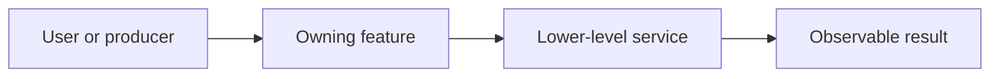

# Documentation Page Template

**Status:** writing template; remove instructional placeholders when creating a real page

**Scope:** reader-first structure for module overviews, feature dossiers, system concepts, and task-oriented guides

Use only the sections that answer a real reader question. A compact feature may combine sections; an exact generated/reference ledger may skip the overview pattern when its index already provides it.

````markdown
# Descriptive Feature Or System Name

**Status:** one primary type and its current authority state

**Scope:** one sentence naming the responsibility and its boundary

**Verified:** date and revision when the page records a current-state snapshot

**Current readiness:** **NN/100** (`I/R/V/D = NN/NN/NN/NN`) — plain-language current state; score-basis link

One or two plain-language sentences explain what result this system produces and why a reader should care.

> [!IMPORTANT]
> **Current state:** Implemented path / Partial / Capability-gated / Not found.
>
> **Readiness:** **NN/100** — explain which component is holding the score down.
>
> **Main limitation:** The most important missing or restricted behavior.
>
> **Evidence:** Source inspection only, or the exact retained executable evidence.

## At A Glance

| You have | You do not have yet |
| --- | --- |
| Concrete current result | Concrete missing result |
| Supported route | Unsupported or unproved route |

## How It Fits

This diagram shows the one relationship the reader needs to understand.



## Use Or Select It

Name the executable, API, editor control, setting, CVar, or CLI route. If none exists, say that the feature is not user-reachable.

## How It Works

Explain one concrete producer-to-result route. Name request, owner, transformation, publication, consumer, result, and the completion or invalidation edge. Introduce source types only after their purpose is clear.

## State And Lifetime

Describe requested versus active state, stable identity/generation, mutable owner, cross-thread or CPU/GPU publication, reset/cancellation, capacity, and retirement where they matter. Omit this section only when none of those concepts exists for the subject.

## Support Matrix

| Mode or backend | State | What works | Important limit |
| --- | --- | --- | --- |
| Example A | Implemented path | Exact result | Unproved or unsupported boundary |
| Example B | Not found | None | No selector or implementation |

## Design Decisions And Tradeoffs

| Decision | Why | Benefit | Cost or drawback |
| --- | --- | --- | --- |
| Chosen design | Constraint it addresses | What becomes simpler or safer | Complexity, performance, flexibility, or coverage given up |

## Limitations And Failure Behavior

- State the most likely misunderstanding first.
- Explain visible failure and recovery.
- Link detailed controlled failures when they live in an adjacent acceptance file.

## Evidence And Current Status

Separate implemented source shape from build, runtime, visual, native-validation, performance, and release evidence.

## Reference

- Capability IDs and exact inventory.
- Primary source/build routes.
- Feature-local acceptance and evidence-plan links.
- Related concepts and next/previous reading.
````

Before using the structure, apply the [feature depth test](../DocumentationOrganization.md#feature-depth-test). Do not retain a heading with generic filler, and do not duplicate family-wide flow in every leaf; show the leaf's distinct decision, state, failure, and evidence boundary.

## Index-Page Variant

An index should contain a one-sentence purpose, a “start here” route, a small topic map when useful, and a table whose descriptions tell readers why to open each child. Keep exact capability rows in their owning ledger rather than copying them into the index.
