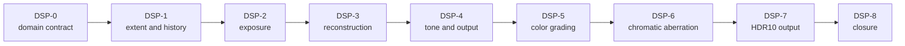

# Renderer Display And Reconstruction Closure Plan

**Status:** implementation plan; not colorimetric, provider, visual-quality, performance, or release evidence

**Families:** `FCR-REN-09`, `FCR-REN-10`, `FCR-REN-14`, `FCR-REN-15`, `FCR-REN-18`, `FCR-REN-22`, `FCR-REN-24`, `FCR-REN-25`, `FCR-REN-26`

**Current readiness:** section projection **29/100**; six source routes are present or provider-gated while grading, chromatic aberration, and HDR10 output are absent; all nine families are `Blocked`

**Responsibility:** sequence view-owned temporal/display state from sampling and exposure through reconstruction, tone mapping, and output

**Parent:** [First Release Renderer Plans](README.md)

**Architecture:** [Post Processing](../../../Architecture/Modules/Engine/Renderer/Features/PostProcessing/README.md), [Display Pipeline](../../../Architecture/Modules/Engine/Renderer/Features/PostProcessing/DisplayPipeline/README.md), [Reconstruction And Generation](../../../Architecture/Modules/Engine/Renderer/Features/PostProcessing/ReconstructionAndGeneration/README.md), and [Temporal Sampling And History](../../../Architecture/Modules/Engine/Renderer/Features/FrameExecution/TemporalSamplingAndHistory.md)

## Plan At A Glance



| Phase | Primary families | Result |
| --- | --- | --- |
| `DSP-0` | all nine | one scene/display domain, extent, jitter, history, selector, and output matrix |
| `DSP-1` | `FCR-REN-18`, `FCR-REN-22` | view-owned temporal identity and truthful render/output resolution |
| `DSP-2` | `FCR-REN-09` | finite, correctly reset manual/automatic exposure |
| `DSP-3` | `FCR-REN-10` | linear/DLSS SR/Ray Reconstruction requested-active-fallback closure |
| `DSP-4` | `FCR-REN-14`, `FCR-REN-15` | one tone operator and one encoded output without double transforms |
| `DSP-5` | `FCR-REN-24` | scene-referred grading controls and LUT look |
| `DSP-6` | `FCR-REN-25` | bounded output-space lens aberration |
| `DSP-7` | `FCR-REN-26` | truthful paired-backend HDR10 presentation and SDR fallback |
| `DSP-8` | all nine | candidate-bound temporal/display/provider closure |

## `DSP-0` — Freeze Domains, Extents, And Active-State Truth

**Goal:** define the exact order and meaning of HDR scene color, exposure, temporal inputs, reconstruction, tone mapping, debug replacement, encoding, UI, back buffer, viewport product, and capture.

**Non-goals:** frame generation, new AA methods, scRGB/HLG/dynamic-HDR profiles, or assuming provider documentation proves local integration.

**Required work:** trace input/output color domains, formats/alpha, render/output/viewport extents, jitter sign/sequence, motion/depth/exposure/guides, history identity/reset, requested/resolved/active/fallback/provider state, grading and LUT placement, tone operators, chromatic placement, SDR/HDR output transforms, UI/capture boundaries, backend/package matrices, and all feature `AC/FM/CHK`.

**Failure modes:** double exposure/grading/tone/encoding; provider receives wrong jitter/motion; viewport and dispatch extents differ; fallback is silent; history crosses view/generation; debug output is transformed unexpectedly; HDR active state or an absent AA/frame-generation feature is implied.

**Phase exit criteria:** a stage/resource/domain diagram and binary matrices exist; every selector and negative capability has an observable disposition; analytic ramps/motion/resize/provider fixtures and checks are selected.

**Ready-to-use prompt:**

```text
Execute DSP-0 without implementation. Create ITER-REN-DSP-00 mapped to the nine FCRs and their AC/FM/CHK. Inspect View state, settings/selectors, frame graph passes/resources, exposure, jitter/motion/history, resolution policy, reconstruction providers, grading/LUT assets, tone mapping, chromatic aberration, SDR/HDR presentation, debug replacement, viewport products, UI, capture, RHI formats/color spaces/metadata/present, shaders, CMake, and packaging. Record every stage's domain, format, extent, identity, lifetime, active state, reset, backend/provider, and output oracle. Preserve explicit negative frame-generation/AA boundaries and the current absence of the three admitted target stages. Stop on an ambiguous transform or active route.
```

## `DSP-1` — Temporal Sampling, History, Resolution, And AA Truth

**Goal:** close `FCR-REN-18` and `FCR-REN-22` with one View-owned jitter/history contract and exact render-to-output geometry.

**Non-goals:** implementing TAA/FXAA/SMAA/MSAA/dynamic resolution, provider-owned hidden jitter, or sharing history between views.

**Required work:** close Halton sequence/sign/index and camera matrices; common validity and every invalidation reason; static/camera/rigid/skin/morph/sky motion; two-view isolation; output/render extents, viewport/scissor/dispatch/product agreement; provider quality/ratio and actual attachment sample count; resize/mode/provider/scene generation reset; explicit single-sample and absent-AA truth.

**Failure modes:** one-frame jitter mismatch; history survives cut/resize/provider switch; motion uses current transform twice; two views alias; dispatch writes wrong extent; requested ratio differs from active; implicit resolve is assumed.

**Phase exit criteria:** analytic sequence/motion/extent cases, reset matrix, two-view isolation, serial/threaded and backend parity, provider handoff inputs, and explicit negative AA checks pass.

**Ready-to-use prompt:**

```text
Implement DSP-1 through the current View temporal state, sampling/extent resolver, camera/motion producers, frame graph attachments/dispatches, provider handoff, and output product owners. Start from FCR-REN-18/22 criteria. Make one view-owned sample identity and common validity contract; align matrices, shader convention, viewport/scissor/dispatch/product extents, quality ratio, and active sample count. Exercise known Halton points, static/camera/rigid/skin/morph/sky motion, two views, cut/resize/level/mode/provider changes, invalid ratios/extents, serial/threaded, D3D12/Vulkan, and negative AA claims. Stop on shared history or implicit resolve.
```

## `DSP-2` — Exposure

**Goal:** close `FCR-REN-09` with finite manual and metered exposure, bounded View-owned adaptation history, correct scheduling, and explicit reset.

**Non-goals:** a cinematography system, hiding lighting-unit errors with exposure, or accepting visually plausible adaptation without a step-response oracle.

**Required work:** reconcile luminance input/domain, manual value, metering/reduction, min/max, adaptation direction/speeds/delta time, history identity, async dependency/overlap, downstream multiplier, and UI/settings state; exercise uniform ramps, dark/bright extremes, step up/down, cuts/resizes/mode/view changes, non-finite/empty input, and serial/backend comparisons.

**Failure modes:** non-finite luminance poisons history; adaptation reverses; clamp masks wrong domain; reset uses stale value; async read races producer; two views share exposure; manual/auto state lies.

**Phase exit criteria:** metering and step-response numerical checks, finite bounds, reset/isolation, scheduling/native validation, downstream interaction, and cost criteria pass.

**Ready-to-use prompt:**

```text
Implement DSP-2 in the existing exposure pass and View history owner. Map FCR-REN-09 AC/FM/CHK to luminance input, metering reduction, manual/auto settings, bounds, adaptation equation/timing, async graph edge, history generation, downstream consumers, and debug output. Use known uniform luminance ramps and timed step cases; inject empty/non-finite/extreme input and cut/resize/mode/view changes. Compare serial/async and D3D12/Vulkan results, inspect native validation, and measure pass/overlap cost. Do not compensate for upstream unit defects. Stop on domain ambiguity or shared history.
```

## `DSP-3` — Image Reconstruction And Provider Integration

**Goal:** close `FCR-REN-10` for the Linear baseline and every admitted NVIDIA DLSS Super Resolution or Ray Reconstruction route.

**Non-goals:** frame generation, claiming unsupported backend/hardware, vendor-specific semantics leaking into unrelated passes, or requiring a provider for the package baseline unless scope says so.

**Required work:** preserve one requested/resolved/active/fallback model; validate provider version/signature/redistribution and build/package membership; reconcile color/depth/motion/jitter/exposure/reactive/guide semantics, render/output extents, reset and feature lifetime; keep Linear as deterministic baseline; handle unsupported API/GPU, missing/corrupt DLL, initialization/evaluation/shutdown failure visibly; measure quality, latency, CPU/GPU time, and memory.

**Failure modes:** provider selected but baseline active silently; wrong motion/jitter sign; missing input tolerated as stale data; provider feature outlives device/view; fallback changes output extent; DLL absent only in package; token/latency identity crosses frame.

**Phase exit criteria:** baseline and every included provider cell pass requested/active/failure/reset/input/package checks; quality/time/memory comparisons and redistribution evidence are candidate-bound; excluded cells are not selectable/advertised.

**Ready-to-use prompt:**

```text
Implement DSP-3 through the current reconstruction selector, Linear path, Streamline/provider integration, View/history state, frame graph resources, latency hooks, CMake, and package allowlist. Reconcile exact provider SDK/runtime versions and license/redistribution. Make requested/resolved/active/fallback and reasons observable. Validate every input semantic from DSP-0/1/2, extent, reset, lifecycle, and shutdown. Exercise unsupported backend/GPU, provider off, missing/corrupt DLL, init/evaluate failure, resize/cut/mode change, and package-relative load. Compare Linear/provider quality, time, latency, and memory. Stop on silent fallback or unverifiable redistribution.
```

## `DSP-4` — Tone Mapping, Encoding, And Presentation

**Goal:** close `FCR-REN-14` and `FCR-REN-15` with exactly one selected tone operator, exactly one output encoding, and generation-safe back-buffer/viewport publication.

**Non-goals:** HDR output, full color management, color grading, exact debug bypass beyond the current contract, or using UI to repair scene/display transforms.

**Required work:** close Reinhard/ACES approximation/ACES fitted selection, known ramps/extremes, finite/alpha behavior, exposure interaction, scene/display-linear boundary, encoding/format pairs, clipping/banding disposition, debug replacement limitation, output/viewport identity, resize/DPI, capture interpretation, backend present, and UI composition boundary.

**Failure modes:** double tone/encode; NaN/Inf reaches output; wrong alpha; unsupported operator value selects arbitrary code; viewport product generation is stale; capture mislabeled; resize format/state mismatch; UI is encoded twice.

**Phase exit criteria:** numerical ramp/extreme/operator, encoding/format, finite/alpha, debug/capture, back-buffer/viewport, resize/DPI, UI boundary, and both-backend present checks pass within owned tolerances.

**Ready-to-use prompt:**

```text
Implement DSP-4 in existing tone-map, debug replacement, presentation/output, viewport product, capture, UI composition, and RHI present owners. Start from FCR-REN-14/15 criteria and the DSP-0 domain map. Ensure exactly one operator and encoding, truthful invalid selection, finite output, explicit alpha, one generation-qualified product, and unambiguous capture metadata. Exercise known ramps/extremes/NaN/Inf, every operator and admitted encoding/format, exposure interaction, debug modes, resize/DPI, viewport generation mismatch, UI composition, and D3D12/Vulkan present/capture. Retain the explicit SDR/HDR and exact-debug limitations.
```

## `DSP-5` — Color Grading

**Goal:** close `FCR-REN-24` with one View-owned scene-referred grading stack after reconstruction and before tone mapping.

**Non-goals:** local grading volumes, multiple blended LUTs, display-referred legacy looks, OCIO, curves, masks, or timeline animation.

**Required work:** implement finite slope/offset/power plus saturation controls, neutral identity, one optional `.cube`-derived 3D LUT asset with declared size/domain/color-space metadata and trilinear sampling, cook/package validation, per-view/settings/editor selection, deterministic order, debug/capture labeling, and SDR/HDR-consistent placement. Use the [Color Grading contract](../../../Architecture/Modules/Engine/Renderer/Features/PostProcessing/DisplayPipeline/ColorGrading.md); external precedent is not local proof.

**Failure modes:** neutral settings alter pixels; CDL order changes; invalid values create NaN/Inf; LUT metadata or indexing is wrong; missing/corrupt asset silently chooses another look; grading is applied after tone/PQ or twice; two views share mutable look state; package omits the LUT.

**Phase exit criteria:** `AC-CGR-01` through `AC-CGR-08`, controlled failures, analytic ramps/patches, LUT identity/interpolation, two-view/reset, SDR/HDR-domain, backend, package, cost, and candidate checks pass; `FCR-REN-24` records the evidence.

**Ready-to-use prompt:**

```text
Implement DSP-5 from the ColorGrading Architecture dossier and AC-CGR/FM-CGR/CHK-CGR. Extend existing View settings, asset import/cook, frame-graph post-processing, shader binding, editor control, capture metadata, and package owners. Add one scene-referred grading stage after reconstruction and before tone mapping with neutral-safe slope/offset/power and saturation plus one optional validated .cube-derived 3D LUT using declared domain/color metadata and trilinear sampling. Keep state generation-qualified per view and preserve exact debug-view policy. Exercise neutral, analytic patches, primary/secondary ramps, invalid/non-finite controls, valid/invalid LUT dimensions and domains, missing/corrupt/package-absent asset, view isolation, resize/mode/look changes, SDR/HDR domain, D3D12/Vulkan, and cost. Stop on double application, ambiguous color domain, silent asset substitution, or shared mutable state.
```

## `DSP-6` — Chromatic Aberration

**Goal:** close `FCR-REN-25` with one optional View-owned output-resolution lens pass after grading/tone mapping and before output-device encoding and UI.

**Non-goals:** physical lens calibration, spectral or anamorphic simulation, per-channel curves, guard-band expansion, temporal history, local volumes, or multiple quality tiers.

**Required work:** implement normalized center and start offset, strength expressed in pixels at a 1080-line reference height and scaled by actual output height, bounded radial RGB separation, bilinear sampling, explicit edge clamp, preserved alpha, selector/settings/editor/capture state, correct debug bypass, and no history ownership. Use the [Chromatic Aberration contract](../../../Architecture/Modules/Engine/Renderer/Features/PostProcessing/DisplayPipeline/ChromaticAberration.md).

**Failure modes:** zero strength changes pixels; resolution changes apparent authored strength; UVs sample out of bounds; alpha changes; effect runs before reconstruction or after encoding/UI; exact debug views are distorted; invalid controls produce non-finite output; views share state.

**Phase exit criteria:** `AC-CHR-01` through `AC-CHR-08`, zero/known-pattern/edge/alpha/resolution/view/debug/backend/package/cost and controlled-negative checks pass; `FCR-REN-25` records candidate evidence.

**Ready-to-use prompt:**

```text
Implement DSP-6 from the ChromaticAberration Architecture dossier and AC-CHR/FM-CHR/CHK-CHR. Extend the existing View settings, display-pipeline frame graph, shader binding, editor control, capture metadata, and package owners. Add one optional output-resolution pass after grading/tone mapping and before output encoding/UI, using normalized center/start offset, strength in 1080-line reference pixels scaled by output height, bounded radial RGB separation, bilinear sampling, edge clamp, and unchanged alpha. Do not add history or a second post stack. Exercise zero and known strengths, center/radial patterns, edge pixels, alpha, multiple output extents, invalid/non-finite controls, view isolation, exact debug bypass, resize/mode changes, D3D12/Vulkan, package, and cost. Stop on domain/order ambiguity, resolution-dependent authored behavior, out-of-bounds sampling, or altered UI/debug data.
```

## `DSP-7` — HDR10 Display Output

**Goal:** close `FCR-REN-26` with a truthful Windows HDR10 route on D3D12 and Vulkan plus mandatory automatic SDR fallback.

**Non-goals:** scRGB, HLG, Dolby Vision, dynamic metadata, display calibration, multiple mastering profiles, or claiming that a 10-bit/float surface alone is HDR.

**Required work:** implement the [HDR Display Output contract](../../../Architecture/Modules/Engine/Renderer/Features/PostProcessing/DisplayPipeline/HDRDisplayOutput.md): Renderer-owned 1000-nit Rec.2020/D65 ST2084 output-device transform and 200-nit SDR-UI mapping; RHI-owned display capability, compatible 10-bit swapchain/color-space activation, static metadata, recreation/present; observable requested/supported/active/fallback state; monitor/OS/resize/fullscreen/device transitions; deterministic ramps and candidate artifacts.

**Failure modes:** incompatible format/color-space tuple; PQ omitted or doubled; metadata disagrees with mastering policy; UI is dim/double encoded; monitor or OS-state change leaves stale active state; backend diverges; activation failure produces black/washed output instead of SDR fallback.

**Phase exit criteria:** `AC-HDR-01` through `AC-HDR-08`, native state inspection, PQ/gamut/luminance/UI fixtures, transition/failure matrix, paired-backend comparison, SDR fallback, package, performance, and candidate checks pass on admitted HDR hardware; `FCR-REN-26` records limitations.

**Ready-to-use prompt:**

```text
Implement DSP-7 from HDRDisplayOutput.md and AC-HDR/FM-HDR/CHK-HDR. Keep scene/display policy in Renderer and native output capability, swapchain format/color space, metadata, recreation, and present mechanics in RHI. Add one HDR10 route using Rec.2020/D65, ST2084/PQ, compatible 10-bit output, fixed 1000-nit mastering target, static metadata, and 200-nit SDR UI mapping. Expose requested, supported, active, and fallback state; retain the proven SDR route on every failure. Exercise SDR/HDR displays, unsupported/remote state, OS HDR toggle, monitor move, resize, fullscreen/window, suspend/resume, device recovery, format/color-space/metadata failure, PQ ramps, gamut/peak/black patches, UI, capture interpretation, D3D12/Vulkan, package, and cost. Stop on false active state, black/washed fallback, double transform, stale transition state, or backend semantic divergence.
```

## `DSP-8` — Display Candidate Closure

**Goal:** prove the complete temporal-to-display chain for one candidate without one stage hiding another's defect.

**Non-goals:** accepting screenshots alone, merging provider and baseline verdicts, or promoting excluded display features.

**Failure modes:** result compared after an unknown transform; histories/settings differ between runs; provider package differs; capture metadata lacks domain/encoding; one backend or viewport route omitted; evidence predates a shader change.

**Phase exit criteria:** all nine FCR reports link exact raw/intermediate/final artifacts, analytical and visual oracles, reset/failure matrices, provider/package/native evidence, performance/latency/memory, limitations, and candidate decisions.

**Ready-to-use prompt:**

```text
Execute DSP-8 on the frozen candidate. Reconcile FCR-REN-09/10/14/15/18/22/24/25/26 evidence and run only missing end-to-end cases from view jitter/motion/extents through exposure, Linear/provider reconstruction, color grading, tone mapping, chromatic aberration, SDR/HDR output transforms, UI, back buffer/viewport product, and capture. Record every intermediate domain/format/extent, settings, history generation, provider binary, backend, display state, and candidate hash. Include reset/failure/transition and package routes plus raw and final oracles. Any shader/config/provider/code change invalidates affected evidence. File exact decisions and preserve all remaining negative capability boundaries.
```
