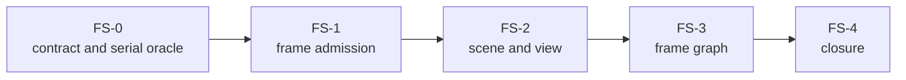

# Renderer Frame And Scene Closure Plan

**Status:** implementation plan; not frame, threading, graph, or release evidence

**Families:** `FCR-REN-01`, `FCR-REN-02`, `FCR-REN-03`

**Current readiness:** section projection **50/100**; substantial source routes, but all three families are `Blocked` with no candidate verification or delivery evidence

**Responsibility:** sequence immutable frame admission, Scene/View/GPU-scene preparation, and frame-graph closure

**Parent:** [First Release Renderer Plans](README.md)

**Architecture:** [Frame Execution](../../../Architecture/Modules/Engine/Renderer/Features/FrameExecution/README.md), [Scene And View Preparation](../../../Architecture/Modules/Engine/Renderer/Features/SceneAndViewPreparation/README.md), [feature acceptance](../../../Architecture/Modules/Engine/Renderer/Features/SceneAndViewPreparation/Acceptance.md), and [Frame Graph And Scheduling](../../../Architecture/Modules/Engine/Renderer/Features/FrameExecution/FrameGraphAndScheduling.md)

## Plan At A Glance



| Phase | Goal | Principal failures |
| --- | --- | --- |
| `FS-0` | reconcile identity, ownership, matrices, and feature checks | stale assumption, missing criterion, conflicting owners |
| `FS-1` | monotonic bounded serial/threaded admission | stale frame, partial control, deadlock, unbounded queue |
| `FS-2` | deterministic Scene/View/GPU-scene preparation | generation alias, copy explosion, premature retirement |
| `FS-3` | explicit graph dependencies and safe lowering | hidden dependency, wrong barrier/lifetime, swallowed failure |
| `FS-4` | candidate-bound end-to-end closure | mismatched candidate, one mode/backend unproved |

Unreal's [parallel-rendering overview](https://dev.epicgames.com/documentation/en-us/unreal-engine/parallel-rendering-overview) and [Render Dependency Graph](https://dev.epicgames.com/documentation/unreal-engine/render-dependency-graph-in-unreal-engine?lang=en-US) are precedent for ownership/thread and declarative-graph questions. They do not define Sparkle classes or prove local behavior.

## `FS-0` — Contract, Identity, And Serial Oracle

**Goal:** freeze the world-submission → coordinator → host → Scene/View → graph identity and the serial reference result.

**Non-goals:** changing concurrency, adding graph features, or restoring historical packet/scene designs.

**Required work:** trace frame/control/settings identity, queue/lifetime ownership, Scene versus View state, GPU mirrors, graph/pass/resource ownership, RHI lowering, and all direct consumers. Reconcile feature `AC/FM/CHK`, supported serial/threaded/backend/view/content matrix, invalidation reasons, copy budget, performance budgets, and candidate artifacts.

**Failure modes:** a criterion names an obsolete design; frame and settings epochs can cross; Scene/View state is duplicated; serial result is undefined; graph output has no consumer/lifetime.

**Phase exit criteria:** all three families have current owner/producer/consumer/lifetime and checks; serial oracle and matrices are explicit; contradictions block implementation.

**Ready-to-use prompt:**

```text
Execute FS-0 without code changes. Create ITER-REN-FS-00 and map FCR-REN-01/02/03 to current feature AC/FM/CHK, REL-04, workloads, and risks. Inspect world submission, RenderCoordinator, RendererHost, FramePipeline, Scene/View/GPU-scene preparation, BuildRenderFrameGraph, graph compile/execute, RHI submission, selectors, CMake, tests, and dirty work. Record identities, queues, mutable owners, publication/lifetime, copies, invalidation, serial oracle, backend/mode/content matrix, and candidate checks. Fix only stale Architecture contract language. Stop on any duplicate owner or undefined reference result.
```

## `FS-1` — Frame Admission And Coordination

**Goal:** close `FCR-REN-01` with monotonic, bounded, failure-aware admission and equivalent serial/threaded results.

**Non-goals:** a generic message bus, multiple pending-frame semantics, or retries that hide a failed producer/consumer edge.

**Required work:** preserve one immutable world input; define admission/drop/backpressure policy, control/settings epoch ordering, requested/active publication, wake/sleep, shutdown/cancel, in-flight invalidation, and error propagation; bound frame/control queues; keep serial mode an actual control path; measure admission/coordinator CPU, waits, queue high-water, and latency.

**Failure modes:** older frame overwrites newer; settings apply to wrong frame; queue grows; blocked producer deadlocks shutdown; thread fails silently; canceled frame publishes; serial/threaded visible output differs.

**Phase exit criteria:** monotonic and bounded behavior, serial/threaded parity, queue pressure, failure, cancellation, invalidation, and shutdown checks pass; CPU/latency evidence meets the dossier budgets or blocks.

**Ready-to-use prompt:**

```text
Implement FS-1 in the current RenderCoordinator/RendererHost/FramePipeline admission path. Start with its ownership and transition ledger and exact FCR-REN-01 AC/FM/CHK. Preserve immutable input and one production route. Make frame/control/settings identities monotonic, queues bounded, pressure behavior explicit, failures observable, and shutdown settled; remove replaced queue/state paths. Exercise serial and threaded modes, stale/out-of-order submissions, pressure, settings changes in flight, injected render failure, cancellation, wake/sleep, and shutdown. Compare deterministic outputs and measure CPU, waits, queue high-water, and latency. Stop on partial publication or ambiguous ordering.
```

## `FS-2` — Scene, View, And GPU-Scene Preparation

**Goal:** close `FCR-REN-02` with Scene-owned persistent truth, View-owned view/temporal truth, and generation-safe GPU mirrors.

**Non-goals:** Renderer ECS access, per-view copies of scene truth, or a second material/geometry/light registry.

**Required work:** reconcile structural deltas, dynamic data, resource tables, camera/display/temporal inputs, mesh/material/light/ray bindings, allocation/reuse, upload, replacement, deletion/reload, and completion-safe retirement; resolve input snapshot once per epoch; prove two-view isolation and deterministic identity; measure copies/uploads/memory high-water.

**Failure modes:** deleted handle aliases reused slot; View mutates Scene; stale dynamic deformation; reload retains old binding; resource freed on one queue while used on another; two views share history; unbounded mirror growth.

**Phase exit criteria:** every scene/view acceptance criterion and controlled failure passes across create/update/delete/reuse/reload/dynamic/two-view cases; identity/copy/upload/memory ledgers reconcile.

**Ready-to-use prompt:**

```text
Implement FS-2 through the existing RenderScene, View preparation, persistent GPU scene, mesh/material/light/ray binding, and retirement owners. Map each mutable fact to Scene or View before edits. Use generation-qualified handles and completion tokens at real publication/lifetime boundaries; avoid duplicate snapshots and registries. Exercise structural create/update/delete/reuse, level reload, camera and two-view isolation, rigid/skin/morph dynamics, material/light changes, upload failure, stale generation, and all-queue retirement. Measure resolved copies, uploads, CPU, and memory high-water. Run Architecture boundary checks if World/Renderer/RHI ownership changes.
```

## `FS-3` — Frame Graph Compile And Execution

**Goal:** close `FCR-REN-03` with declared pass/resource dependencies, valid scheduling/lifetimes, observable execution, and faithful RHI lowering.

**Non-goals:** moving native state policy into Renderer, adding async queues without measured benefit, or using graph order as an undocumented dependency.

**Required work:** inventory every release pass and resource; declare reads/writes, lifetime, history/external/transient classification, queue, culling/side effect, markers, and failure result; close dependency/barrier/alias/invalidation/rebuild logic; preserve serial schedule oracle; make missing/failed pass inputs block or choose an explicit safe result; measure build/compile/record/submit costs.

**Failure modes:** undeclared read; write/write ambiguity; transient alias overlaps lifetime; history culled; pass failure ignored; marker lacks frame/view; rebuild misses selector/extent/format; backend produces different dependency result.

**Phase exit criteria:** graph structural checks, resource lifetime/barrier/native validation, pass failure/invalidation, serial/parallel recording, culling/aliasing where admitted, markers, and backend-equivalent results pass.

**Ready-to-use prompt:**

```text
Implement FS-3 in BuildRenderFrameGraph and current graph compile/execute/RHI lowering owners. Build an inventory of each included pass/resource with read/write, lifetime, queue, cull/side-effect, invalidation, marker, and failure policy. Reconcile it to FCR-REN-03 AC/FM/CHK and the serial schedule. Fix hidden dependencies and lifetime/barrier ownership without creating a second graph. Inject missing inputs, pass/record/submit failure, selector/extent/format changes, and history invalidation; inspect culling/aliasing and native D3D12/Vulkan validation. Measure graph build/compile/record costs. Stop on undeclared state or swallowed failure.
```

## `FS-4` — Frame And Scene Candidate Closure

**Goal:** bind admission, preparation, and graph execution to one candidate and prove their joint failure and lifetime behavior.

**Non-goals:** replacing focused checks with a smoke or accepting one view/backend/mode for the full matrix.

**Failure modes:** evidence from different code/content/settings; serial oracle not captured; debug observer changes ordering; shutdown leak appears only after level switch; one backend validation absent.

**Phase exit criteria:** `FCR-REN-01`–`03` reports contain full criteria/failure/check coverage, exact candidate identity, matrices, performance data, limitations, invalidation triggers, and decisions.

**Ready-to-use prompt:**

```text
Execute FS-4 against the frozen candidate. Reconcile every FCR-REN-01/02/03 AC/FM/CHK artifact and run only missing joint routes: serial/threaded frame admission, create/update/delete/reload, two-view preparation, graph execute/present, pressure/failure/invalidation, and shutdown on D3D12/Vulkan. Verify frame/view/resource/generation identity across logs, captures, timings, and outputs. Any code/config/content change invalidates affected evidence. File exact decisions and blockers; do not infer correctness from a responsive process or one image.
```
