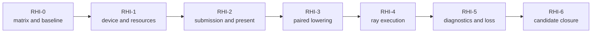

# First Release RHI And GPU Execution Plan

**Status:** implementation plan; ordered backend closure, not native-validation or release evidence

**Snapshot:** 2026-09-08; portfolio projection **45/100**; all six `FCR-RHI-*` families are `Blocked`

**Responsibility:** sequence the neutral RHI contract, both native lowerings, GPU execution, diagnostics, and device-failure closure

**Orchestrator:** [First Release Implementation Plan](README.md)

**Architecture owner:** [Render Hardware Interface](../../Architecture/Modules/Engine/RHI/README.md) and its [feature dossiers](../../Architecture/Modules/Engine/RHI/Features/README.md)

## Outcome And Sequence

Deliver one narrow Renderer-facing RHI whose D3D12 and Vulkan implementations truthfully lower the admitted resource, execution, presentation, ray-tracing, diagnostics, and failure contracts.



| Phase | Primary families | Required Architecture route |
| --- | --- | --- |
| `RHI-0` | all six | [Capability Inventory](../../Architecture/Modules/Engine/RHI/CapabilityInventory.md), feature acceptance sections, Renderer consumers |
| `RHI-1` | `FCR-RHI-01`, resource portion of `06` | [Device And Resources](../../Architecture/Modules/Engine/RHI/Features/DeviceAndResources/README.md) |
| `RHI-2` | `FCR-RHI-02` | [Command Submission](../../Architecture/Modules/Engine/RHI/Features/PipelineAndExecution/CommandSubmissionAndSynchronization.md), [Presentation](../../Architecture/Modules/Engine/RHI/Features/PresentationAndInterop/Presentation.md) |
| `RHI-3` | `FCR-RHI-03` | [Backend Selection And Capabilities](../../Architecture/Modules/Engine/RHI/Features/DeviceAndResources/BackendSelectionAndDeviceCapabilities.md) plus all admitted contracts |
| `RHI-4` | `FCR-RHI-04` | [Ray Tracing](../../Architecture/Modules/Engine/RHI/Features/PipelineAndExecution/RayTracing.md) |
| `RHI-5` | `FCR-RHI-05`, `FCR-RHI-06` | [Diagnostics And Capture](../../Architecture/Modules/Engine/RHI/Features/DiagnosticsAndCapture/README.md), [Device Lifecycle](../../Architecture/Modules/Engine/RHI/Features/DeviceAndResources/DeviceLifecycleAndFailureRecovery.md) |
| `RHI-6` | all six | candidate reports and package matrix |

Use the [common phase contract](README.md#phase-card-contract). The [NVRHI Programming Guide](https://github.com/NVIDIA-RTX/NVRHI/blob/8e8c36e37558acec333204619b95d9d2fcdc4a79/doc/ProgrammingGuide.md), [DirectX Graphics Samples](https://github.com/microsoft/DirectX-Graphics-Samples), and [Khronos Vulkan Samples](https://github.com/KhronosGroup/Vulkan-Samples) provide reference questions and native oracles. They do not authorize a wrapper migration, API imitation, or claim of local parity.

## `RHI-0` — Freeze The Service And Backend Matrix

**Goal:** reconcile every public RHI service and every Renderer consumer into an admitted D3D12/Vulkan/capability matrix before changing implementation.

**Non-goals:** making both backends textually identical, exposing native vocabulary to Renderer, or filling matrix cells with assumed support.

**Required work:**

- inventory public services, resource and handle types, descriptors, pipelines, command operations, queues, present, interop, capture, timing, ray tracing, and diagnostics;
- trace owner, lifetime, creation/destruction, producer/consumer, CMake membership, selector, requested/active state, unsupported route, and native lowering;
- map each service to feature-local `AC-RHI*`, `FM-RHI*`, and `CHK-RHI*`; repair the Architecture contract first if any admitted cell lacks one;
- freeze hardware/driver/toolchain/provider and feature-level prerequisites for the release candidate;
- classify divergence as shared invariant, intentionally backend-specific mechanism, unsupported, or defect.

**Failure modes to control:** public service has one backend only but reports support; implementation method has no consumer; Renderer branches on native API; invalid handle behavior is undefined; capability query differs from actual creation.

**Phase exit criteria:** every admitted service has a current source route, both-backend disposition, capability/failure behavior, and mapped check; unknown cells block later phases.

**Ready-to-use prompt:**

```text
Execute RHI-0 without feature implementation. Create ITER-RHI-00-01 mapped to FCR-RHI-01 through 06 and the owning AC/FM/CHK. Search all RHI public headers, D3D12/Vulkan implementations, CMake membership, Renderer/Application/Editor consumers, selectors, tests, and diagnostics. Produce a service-by-backend-by-capability matrix with owner/lifetime and requested/active/unsupported behavior. Reconcile it against the Capability Inventory and feature dossiers; fix missing acceptance language only in Architecture. Record exact hardware/driver/tool versions and native reference questions. Stop on an unowned service or semantic divergence.
```

## `RHI-1` — Device, Resources, Descriptors, And Lifetime

**Goal:** close `FCR-RHI-01` and the resource/lifecycle base of `FCR-RHI-06` with one published backend aggregate and completion-safe ownership.

**Non-goals:** Renderer resource policy in RHI, a generic lifetime framework without consumers, or relying on process exit for cleanup.

**Required work:**

- preserve owner-thread aggregate creation/publication and reverse-order teardown; make partial-create cleanup explicit;
- close buffer/texture/view/sampler/descriptor/upload/readback/pipeline resource creation and invalid-input/allocation behavior for admitted uses;
- define handle/generation, native ownership, mapped memory, descriptor range, state initialization, debug naming, and queue-use retirement;
- make capability queries and creation failure agree; keep unsupported behavior explicit and safe;
- measure retained/high-water memory and descriptor usage for release workloads.

**Failure modes to control:** partial device publishes; descriptor out of bounds; freed resource remains in flight; mapped range misuse; allocation failure corrupts prior state; dependent outlives device; native object leaks.

**Phase exit criteria:** all admitted resource/descriptor/lifetime criteria pass on both backends; partial creation and allocation/invalid-handle failures settle cleanly; memory and live-object records are retained.

**Ready-to-use prompt:**

```text
Implement RHI-1 using the current RenderHardwareInterface/backend aggregate and resource owners. Audit construction, publication, dependencies, handles/generations, descriptors, uploads/readbacks, queue usage, retirement, and teardown. Keep Renderer policy above RHI and native lifetime below its backend. Fix one admitted resource path at a time and delete superseded wrappers. Exercise partial create, unsupported capability, invalid sizes/formats/ranges/handles, descriptor exhaustion, allocation failure, in-flight destruction, and shutdown. Run the smallest native validation needed for each slice on D3D12 and Vulkan; record memory high-water and live objects. Stop on ambiguous ownership or completion identity.
```

## `RHI-2` — Command Recording, Synchronization, Resize, And Present

**Goal:** close `FCR-RHI-02` from frame begin through recording leases, submission tokens, completion, resize, present, and retirement.

**Non-goals:** Renderer pass scheduling in RHI, unconditional queue waits, or treating a responsive process as a correct frame loop.

**Required work:**

- define frame/submission/completion identities, legal owner/thread states, command-list lease lifetime, batch ordering, queue dependencies, and serial control;
- close resource state/barrier lowering, signal/wait error propagation, completion-driven recycling, frames-in-flight bounds, and cancellation/shutdown settlement;
- handle zero-size/minimized window, swapchain out-of-date/suboptimal, resize generation, acquire/present failure, and device-loss separation;
- expose the native capability, compatible format/color-space activation, static metadata, recreation, and fallback mechanics consumed by Renderer `DSP-7`; `FCR-REN-26` retains HDR feature ownership;
- ensure Renderer graph order lowers without hidden RHI policy and native markers preserve causality;
- measure CPU submit/present, waits, pacing, and resource high-water without changing the production route.

**Failure modes to control:** token reused across generation; wait cycle; allocator/list reset before completion; resize destroys in-flight back buffer; present failure loops; incompatible HDR format/color-space or failed metadata leaves false active state; cancellation partially submits; shutdown hangs.

**Phase exit criteria:** serial and normal frame paths, resize/minimize/restore, queue ordering, failure, shutdown, and pacing checks pass on both backends with clean native validation.

**Ready-to-use prompt:**

```text
Implement RHI-2 for FCR-RHI-02 and its FCR-REN-26 HDR collaboration boundary. Reconcile RenderDeviceServices, frame state machine, recording leases, queue batches/tokens/fences, resource barriers, swapchain generations, present, retirement, resize, output capability, format/color space, metadata, and Renderer callers. Write the legal transition and dependency ledger before edits. Extend current owners and remove duplicate waits/state tracking. Exercise serial and normal submission, multi-batch dependencies, injected signal/wait/submit/present/color-space/metadata failures, cancellation, SDR/HDR supported and unsupported states, zero-size/minimize, monitor and OS HDR transitions, repeated resize/restore, out-of-date swapchain, and shutdown in flight. Use native API guidance only as backend oracle, not shared Renderer policy. Capture native validation and causal timing; stop on an unprovable cycle, lifetime, or false active state.
```

## `RHI-3` — Paired Backend Lowering

**Goal:** close `FCR-RHI-03` by proving that common contracts produce equivalent declared results while backend-specific mechanics remain contained.

**Non-goals:** identical native command streams, hiding a real backend limitation, or branching feature semantics in backend code.

**Required work:**

- compare every admitted resource, descriptor, pipeline, command, state/barrier, presentation, interop, and diagnostic operation cell-by-cell;
- close missing lowering and normalize error/capability truth at the shared boundary without lowest-common-denominator leakage;
- validate descriptor lifetime, format/state mapping, queue family/ownership, swapchain differences, compiler failures, and debug naming;
- retain backend-specific algorithms only behind the common invariant and document why they differ;
- execute matching deterministic micro-oracles plus representative Renderer paths with D3D12 debug layer/DRED and Vulkan validation.

**Failure modes to control:** one backend silently no-ops; format/state maps differently; validation suppression hides defect; capability advertised before dependency; fallback changes feature result; backend fix changes shared semantics.

**Phase exit criteria:** every included matrix cell is `PASS` or explicitly excluded before scope freeze; deterministic outputs and failures agree within owned tolerances; native validation is clean or has an accepted, scoped disposition.

**Ready-to-use prompt:**

```text
Implement RHI-3 from the frozen RHI-0 matrix. For each admitted common operation, inspect D3D12 and Vulkan lowering, native state/format/descriptor/pipeline semantics, capability declaration, and direct Renderer expectation. Fix the common owner when semantics are wrong and only the backend owner when lowering is wrong. Do not add backend checks to Renderer. Exercise paired deterministic oracles and representative frame paths with exact driver/tool versions, debug layer/DRED, and Vulkan validation. Record intentional divergence and tolerances. Stop on silent no-op, unowned fallback, suppressed validation, or a matrix cell that cannot be proven.
```

## `RHI-4` — Ray-Tracing And Acceleration-Structure Execution

**Goal:** close `FCR-RHI-04` for admitted BLAS/TLAS, update/refit/partitioned policy, inline query, native pipeline, shader table, and trace commands.

**Non-goals:** moving scene/TLAS selection policy out of Renderer, duplicating effect semantics for inline and RGS, or claiming unsupported hardware paths.

**Required work:**

- freeze geometry/instance/generation/SBT contribution identity and ownership across build, update, replacement, and completion;
- close scratch/result/operation-buffer sizing, bounds, state/synchronization, compaction/retirement as applicable, and allocation failure;
- keep one semantic Renderer effect contract with thin inline/native-pipeline traversal adapters;
- make requested/active capability and classic/refit/partitioned choices observable, including safe unsupported behavior;
- compare deterministic hit/miss/instance/material results and native validation across backends/routes; measure build/update/traversal and memory.

**Failure modes to control:** stale BLAS address; SBT index aliases instance; update used after topology change; operation buffer overrun; scratch freed early; unsupported path silently falls back; inline/RGS result diverges.

**Phase exit criteria:** all admitted ray criteria/failures pass for both APIs and traversal routes; identity and lifetime ledgers reconcile; costs and capability boundaries are recorded.

**Ready-to-use prompt:**

```text
Implement RHI-4 for FCR-RHI-04 with the Renderer ray/TLAS owners as consumers. Audit BLAS/TLAS resources, classic/refit/partitioned operations, geometry and instance descriptors, contribution/SBT mapping, scratch/result/operation buffers, barriers, queues, retirement, inline query, pipeline/state object, shader tables, and TraceRays. Preserve semantic policy in Renderer and native mechanics in RHI. Exercise create/build/update/topology change/move/delete/reload, invalid bounds/identity, allocation/submit failure, unsupported hardware, and inline-versus-RGS deterministic cases on D3D12/Vulkan. Capture native validation, time, and memory. Stop on identity ambiguity or premature lifetime.
```

## `RHI-5` — Diagnostics, Capture, Device Loss, And Recovery

**Goal:** close `FCR-RHI-05` and `FCR-RHI-06` with bounded observation, truthful recoverable swapchain events, and terminal device-loss handling.

**Non-goals:** an internal performance-dashboard product, automatic device resurrection, unbounded logging, or collecting private content without intent.

**Required work:**

- close timing validity, message/drop state, memory/live objects, object naming, texture capture/readback/encoding, privacy, and external-tool correlation;
- ensure observers are bounded and selectable, report unavailable/invalid data, and are erased or disabled as the Shipping contract requires;
- distinguish resize/out-of-date recovery from terminal device loss; settle queues/dependents and prevent post-loss use;
- collect DRED or Vulkan fault/context data with candidate/frame/object identity and safe user-facing export;
- exercise partial create, queue wait failure, capture failure, device removal/loss, teardown, and repeated recoverable swapchain events.

**Failure modes to control:** invalid timestamp presented as zero; diagnostic ring silently overwrites; capture reads wrong generation; observer stalls frame; device loss retried forever; post-loss native call; diagnostics leak private path/data.

**Phase exit criteria:** feature checks pass on both APIs; recoverable versus terminal paths are unmistakable; native objects settle; diagnostic artifacts identify candidate/frame without privacy breach; external profiler handoff is demonstrated where applicable.

**Ready-to-use prompt:**

```text
Implement RHI-5 for FCR-RHI-05/06. Reconcile timing/messages/memory/naming/live objects, texture capture, readback/encoding, DRED/Vulkan diagnostics, device lifecycle state machine, queue settlement, swapchain recovery, device-loss terminal state, and Editor/Renderer consumers. Bound every observer and expose validity/drop/unsupported state. Inject capture/readback/timestamp/queue/device failures through safe harnesses, exercise repeated resize/out-of-date and teardown, and verify no post-loss use or leaks. Measure observer cost and record privacy/redaction. Do not build the separate Performance Diagnostics product unless a release criterion explicitly selects its plan.
```

## `RHI-6` — Candidate Closure

**Goal:** bind all RHI claims to one package candidate, hardware/driver matrix, and paired-backend evidence index.

**Non-goals:** rerunning broad work without a missing claim or accepting one backend on behalf of the other.

**Required work:** audit all six FCR reports, run only missing cross-boundary and package-relative checks, verify native validation artifacts, confirm capability/selectors and exclusions, and check invalidation after any code/provider/driver/config change.

**Failure modes to control:** evidence uses different binary or shader/content; driver/tool version missing; backend failure hidden by auto-selection; unavailable hardware marked pass; debug-only route differs from Shipping package.

**Phase exit criteria:** each RHI FCR has a complete candidate-bound decision, paired matrices and limitations are explicit, and all Renderer dependencies have a stable accepted contract.

**Ready-to-use prompt:**

```text
Execute RHI-6 against the frozen candidate. Reconcile FCR-RHI-01 through 06 with their Architecture AC/FM/CHK, candidate hash, backend, hardware, driver, validation configuration, content, and artifacts. Run only missing package-relative cross-boundary checks for device/resources, submission/present, backend lowering, ray execution, diagnostics, loss, and teardown. Verify selectors report active state and exclusions. Treat any implementation/config/provider change as evidence invalidation. File exact PASS/BLOCKED/EXCLUDED decisions; never substitute D3D12 evidence for Vulkan or vice versa.
```
