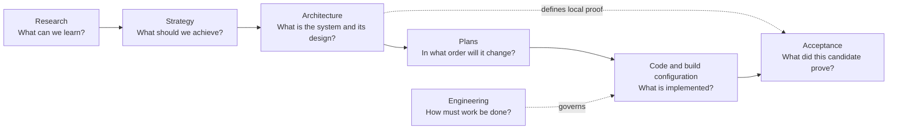

# SparkleEngine Documentation

**Status:** documentation entry point and authority map

Use this documentation to understand what SparkleEngine currently contains, how its systems fit together, what is missing, and what still needs evidence.

> [!IMPORTANT]
> Start with [SparkleEngine At A Glance](Architecture/EngineAtAGlance.md). It summarizes the engine, Renderer, RHI, major strengths, missing capabilities, tradeoffs, and first-release blockers without requiring you to read the detailed ledgers.

## Start Here

| Your goal | First page | Then |
| --- | --- | --- |
| Understand the whole engine | [Engine At A Glance](Architecture/EngineAtAGlance.md) | [Whole Repository Map](Architecture/WholeRepositoryMap.md) |
| Understand how a frame is rendered | [Renderer](Architecture/Modules/Engine/Renderer/README.md) | [Rendering A Sparkle Frame](Architecture/Modules/Engine/Renderer/RenderingASparkleFrame.md) |
| Understand D3D12/Vulkan and GPU services | [RHI](Architecture/Modules/Engine/RHI/README.md) | [RHI Feature Guide](Architecture/Modules/Engine/RHI/Features/README.md) |
| See exactly what exists or is missing | [Module Capability Inventory](Architecture/Modules/README.md) | [Capability Evidence Plan](Plans/CapabilityEvidence.md) |
| Build, cook, or launch Showcase | [Launcher Architecture](Architecture/Modules/Tools/Launcher/README.md) | [Build And Packaging](Architecture/Modules/BuildAndPackaging/README.md) |
| Make an implementation change | [Change Integration](Engineering/Workflow/ChangeIntegration.md) | [Engineering Task Map](Engineering/README.md#choose-by-task) |
| Open or close a release iteration | [Change Lifecycle control record](Engineering/Workflow/ChangeLifecycle.md#create-the-iteration-control-record) | [Roadmap traceability](Strategy/Roadmap.md#stage-target-and-evidence-traceability) |
| See release progress and blockers | [Acceptance](Acceptance/README.md) | [First Release](Acceptance/FirstRelease.md) |

## How The Documentation Fits Together

The areas answer different questions. Follow the arrows instead of reading `Docs` as one large manual.

Code and executable build configuration are the authority for implemented behavior. Documentation explains intent, design, limits, procedures, and required evidence; it does not turn source presence into a successful build or runtime result.

## Browse By Question

| Question | Documentation area |
| --- | --- |
| What is Sparkle trying to become, and what is most important? | [Strategy](Strategy/README.md) |
| What do I have now, what is missing, and how is it designed? | [Architecture](Architecture/README.md) |
| What rules apply while I change or review it? | [Engineering](Engineering/README.md) |
| What work is sequenced but not yet completed? | [Plans](Plans/README.md) |
| What workloads, feature reports, and release gates track progress? | [Acceptance](Acceptance/README.md) |
| What external precedent or option study informed a design? | [Research](Research/README.md) |

## Authority Boundaries

| Area | Owns | Does not own |
| --- | --- | --- |
| [Strategy](Strategy/README.md) | desired capabilities, priorities, roadmap, operating model, dated assessments | implementation rules or system internals |
| [Architecture](Architecture/README.md) | current maps, module and feature design, decisions, capability snapshots, feature-local proof contracts | phase sequencing, release results, or external precedent |
| [Engineering](Engineering/README.md) | workflow, implementation standards, module rules, verification, engineering decisions | release scope, system design, or product research |
| [Acceptance](Acceptance/README.md) | shared completion language, candidate reports, workload/release gates, high-level progress | duplicate feature architecture or local feature criteria |
| [Plans](Plans/README.md) | ordered delivery, dependencies, stop conditions, migration and validation sequence | enduring architecture or completion claims |
| [Research](Research/README.md) | external precedent, option studies, visual exploration, dated baselines | local decisions, implementation state, or evidence grades |

## Status Language

| Label | Meaning |
| --- | --- |
| `Implemented path` | Source and build membership contain the named route. It may still be unbuilt and untested. |
| `Partial` | A useful route exists, but important cases or product boundaries are missing. |
| `Capability-gated` | SDK, build option, API, device, vendor, content, or configuration controls availability. |
| `Not found` | The targeted source/build audit found no current implementation owner. |
| `Unproved` | The architecture is documented, but its required executable evidence has not been accepted. |
| `Blocked` | A named prerequisite prevents the next acceptance or delivery decision. |

## Short Reviewer Routes

### Understand The Product

1. [Engine At A Glance](Architecture/EngineAtAGlance.md)
2. [Renderer](Architecture/Modules/Engine/Renderer/README.md)
3. [RHI](Architecture/Modules/Engine/RHI/README.md)
4. [First Release Progress](Acceptance/FirstRelease.md)

### External Technical Review

1. [Advanced Graphics Engine Executive Summary](Strategy/ExecutiveSummary.md)
2. [Whole Repository Architecture Map](Architecture/WholeRepositoryMap.md)
3. [Current Capability Inventory](Architecture/Modules/README.md)
4. [Engineering Task Map](Engineering/README.md#choose-by-task)
5. [Acceptance](Acceptance/README.md)

### Review A Change

1. [Change Integration](Engineering/Workflow/ChangeIntegration.md)
2. [Change Lifecycle](Engineering/Workflow/ChangeLifecycle.md)
3. The affected [module or feature dossier](Architecture/Modules/README.md)
4. [Code Review](Engineering/Workflow/CodeReview.md)

### Write Or Restructure Documentation

1. [Documentation Organization](Engineering/Workflow/DocumentationOrganization.md)
2. [Documentation Page Template](Engineering/Workflow/DocumentationPageTemplate.md)
3. [Capability Documentation Review](Engineering/Workflow/CapabilityReview.md) when describing a feature or selectable mode
