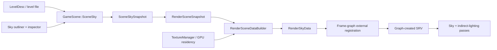

# Sky Actor and Lighting System Design

Status: implemented. Decisions D1-D7 are resolved for version one; rotation is intentionally deferred.

## Purpose

Add one level-authored sky with:

- an HDR sky texture;
- a non-negative intensity multiplier;
- a non-negative RGB color multiplier.

The authoring object must belong to the game framework and be editable per level. GPU resources, shader data, temporal invalidation, and pass bindings must remain renderer-owned. The design should also leave a clean route to rotation, procedural atmosphere, and importance sampling without introducing those features now.

## Recommended direction

Use a single `SceneSky` domain object owned by `GameScene`, and present it as the level's **Sky actor** in the editor. Do not make renderer code depend on `SceneSky`, `Entity`, editor types, or the level parser.

This naming is deliberate. Sparkle currently owns cameras, lights, meshes, materials, and textures through explicit `GameScene` domains. Although a generic `Entity`/`Component` type exists, `GameScene` does not own or snapshot an entity graph, and its existing camera, lighting, and mesh systems do not use that graph as their scene boundary. Making the sky the only entity-backed object would establish a second scene model without solving actor ownership generally.

If Sparkle later adopts a real actor graph, `SceneSky` can become a `SkyComponent` on a `SkyActor` without changing the snapshot or renderer contracts implemented here. Until then, "actor" describes the editor-facing level object without creating misleading inheritance.

The intended data flow is:



Only plain values and an asset reference cross from the game framework to the renderer. The renderer resolves that reference to a GPU texture; the frame graph owns view creation and descriptor lifetime.

## Replaced architecture

Before this implementation, the sky was renderer-global rather than level-owned:

- `TextureManager::LoadDefaults()` loads `TextureId::SkyCubemap`.
- a legacy `TextureManager` lookup returns that texture or the checkerboard fallback.
- the deferred sky pass and every indirect-lighting pass independently ask `TextureManager` for the sky binding;
- `FramePipelineLightingHistory` separately asks for the same texture to build the lighting state hash;
- `SampleSkyRadiance()` samples a lat-long `Texture2D` at mip zero.

This has three architectural problems:

1. Level data cannot select or tune the sky.
2. Texture choice, shader parameters, and history identity have no single per-frame source of truth.
3. A type named `SkyCubemap` is actually sampled as a 2D equirectangular texture, which obscures the resource contract.

The existing framework/renderer transfer is otherwise a good foundation:

1. `GameScene::CaptureSnapshot()` produces value snapshots.
2. `RenderSceneSnapshot` receives those values at the renderer boundary.
3. `RenderSceneDataBuilder` converts framework descriptions into renderer-owned data.
4. `FrameContext` owns immutable render data consumed during the frame.

The implementation follows this path; render passes have no `GameScene` lookup.

## External architecture evidence

### NVIDIA RTXPT

RTXPT keeps author-facing environment parameters separate from the sampled texture. Its runtime settings contain tint, intensity, rotation, and enabled state. Those values are converted into `EnvMapSceneParams`, where tint and intensity become one radiance multiplier, and the shader-side environment object combines the texture, sampler, and scene parameters. Evaluation multiplies sampled radiance by that multiplier. See [RTXPT `EnvironmentMapRuntimeParameters`](https://github.com/NVIDIA-RTX/RTXPT/blob/f08d1c739071e0faad0c7c274d861124c511abab/Rtxpt/SampleUI.h#L69-L75), [CPU parameter preparation](https://github.com/NVIDIA-RTX/RTXPT/blob/f08d1c739071e0faad0c7c274d861124c511abab/Rtxpt/Sample.cpp#L1936-L1952), and [shader environment representation](https://github.com/NVIDIA-RTX/RTXPT/blob/f08d1c739071e0faad0c7c274d861124c511abab/Rtxpt/Shaders/PathTracer/Lighting/EnvMap.hlsli#L23-L91).

Relevant lesson for Sparkle: texture ownership and scene controls are distinct, but consumers receive one coherent render contract. Rotation is common enough that the initial data layout should not prevent adding it, even if Sparkle initially exposes only texture, color, and intensity.

### NVIDIA Falcor

Falcor represents the environment as a scene-owned `EnvMap` radiance probe. The object owns a loaded texture and sampler plus transform, intensity, and tint; it also reports per-frame changes. `Scene` owns the environment map, updates it once per frame, and binds its shader data when it changes. See [Falcor `EnvMap`](https://github.com/NVIDIAGameWorks/Falcor/blob/eb540f6748774680ce0039aaf3ac9279266ec521/Source/Falcor/Scene/Lights/EnvMap.h#L43-L143), [parameter and binding implementation](https://github.com/NVIDIAGameWorks/Falcor/blob/eb540f6748774680ce0039aaf3ac9279266ec521/Source/Falcor/Scene/Lights/EnvMap.cpp#L41-L113), and [`Scene` ownership/update](https://github.com/NVIDIAGameWorks/Falcor/blob/eb540f6748774680ce0039aaf3ac9279266ec521/Source/Falcor/Scene/Scene.cpp#L1725-L1739).

Relevant lesson for Sparkle: the sky is singular scene state, not a special texture rediscovered by every pass. Change tracking is part of the scene-to-render contract because sky edits invalidate accumulated lighting.

Falcor uses a lat-long texture and explicitly wraps U while clamping V. That matches Sparkle's existing `Texture2D` projection more closely than an immediate cubemap conversion.

### AMD Capsaicin

Capsaicin stores the selected environment path and generated GPU environment buffer in its central scene/framework state. Scene YAML supplies `ibl_path`; `setEnvironmentMap()` validates and rebuilds the resource, then resets render state. Its `LightBuilder` consumes the environment as one light and rebuilds lighting data when the environment changes. See [environment API and ownership](https://github.com/GPUOpen-LibrariesAndSDKs/Capsaicin/blob/914b91596cd119eda85fbc1d3c7ee6ac391b1452/src/core/src/capsaicin/capsaicin_internal.h#L448-L459), [scene loading and invalidation](https://github.com/GPUOpen-LibrariesAndSDKs/Capsaicin/blob/914b91596cd119eda85fbc1d3c7ee6ac391b1452/src/core/src/capsaicin/capsaicin_internal_scene.cpp#L236-L269), [YAML ownership](https://github.com/GPUOpen-LibrariesAndSDKs/Capsaicin/blob/914b91596cd119eda85fbc1d3c7ee6ac391b1452/src/core/src/capsaicin/capsaicin_internal_scene.cpp#L409-L423), and [`LightBuilder` consumption](https://github.com/GPUOpen-LibrariesAndSDKs/Capsaicin/blob/914b91596cd119eda85fbc1d3c7ee6ac391b1452/src/core/src/components/light_builder/light_builder.cpp#L158-L206).

Relevant lesson for Sparkle: an environment can participate in generalized light preparation while remaining a singleton scene resource. Capsaicin is a research framework rather than a game-framework actor model, so its central ownership is evidence for the render-data split, not a template for editor architecture.

### Epic Games Unreal Engine

Unreal exposes `ASkyLight` as a placeable actor containing a `USkyLightComponent`. The component owns authoring controls such as source mode, specified cubemap, intensity, and light color. The renderer does not render through the actor: it constructs an `FSkyLightSceneProxy` from the component and stores renderer-facing state there. See the official [`ASkyLight` API](https://dev.epicgames.com/documentation/en-us/unreal-engine/API/Runtime/Engine/ASkyLight), [`USkyLightComponent` API](https://dev.epicgames.com/documentation/en-us/unreal-engine/API/Runtime/Engine/USkyLightComponent), and [`FSkyLightSceneProxy` API](https://dev.epicgames.com/documentation/en-us/unreal-engine/API/Runtime/Engine/FSkyLightSceneProxy).

Unreal also distinguishes a captured scene from a specified cubemap and documents that a Sky Light supplies scene lighting and reflections. Visible atmosphere, clouds, or a sky dome can be separate inputs that the Sky Light captures. See Epic's [Sky Lights documentation](https://dev.epicgames.com/documentation/en-us/unreal-engine/sky-lights-in-unreal-engine).

Relevant lesson for Sparkle: actor/component ownership is an authoring concern; renderer proxy data is a separate lifetime and type system. A future version may distinguish the visible background from sampled sky lighting, but version one deliberately uses one source.

## Implemented game-framework contract

### Authoring description

`SceneSkyDesc` is the plain level-serializable description and contains no RHI or renderer types:

```cpp
struct SceneSkyDesc
{
    bool enabled = true;
    DirectX::XMFLOAT3 color = {1.0f, 1.0f, 1.0f};
    float intensity = 1.0f;
    Assets::CookedTextureReference skyTexture = {
        .textureGroup = TextureGroup::HdrColor};
};
```

The contract is:

- `color` is a linear RGB radiance tint, not an sRGB shader value;
- `intensity` is a unitless multiplier, not exposure compensation in stops;
- `skyTexture` is an asset reference, never a `Texture*`, SRV, descriptor, or renderer enum;
- the texture group is explicitly `HdrColor`.

`LevelDesc` stores `std::optional<SceneSkyDesc> sky`. Absence remains distinguishable from a disabled sky:

- absent: use the engine default sky for backward compatibility;
- present and disabled: contribute zero sky radiance;
- present and enabled: use the authored asset and multipliers.

### Scene owner

`SceneSky` owns the optional level `SceneSkyDesc` and exposes the same narrow operations used by other scene domains:

- apply/reset from a level description;
- read or edit the current description;
- capture a value-only snapshot;
- report the referenced texture for scene texture residency.

`GameScene` owns exactly one `SceneSky`. Multiple active skies are out of scope; they require blending volumes, priority, and spatial evaluation that the renderer does not currently support.

### Snapshot

`SceneSkySnapshot` contains only the optional authoring values and asset reference. `GameSceneSnapshot` and `RenderSceneSnapshot` each carry one `sky` field, following the camera and lighting transfer.

The sky texture path participates in the generalized scene texture snapshot before `RenderSceneDataBuilder` runs; no sky-specific loading entry point exists.

## Implemented renderer contract

### Renderer-owned scene data

`RenderSceneDataBuilder` resolves `SceneSkySnapshot` into renderer-owned `RenderSkyData`:

```cpp
struct RenderSkyData
{
    const Texture* skyTexture = nullptr;
    DirectX::XMFLOAT3 color = {1.0f, 1.0f, 1.0f};
    float intensity = 1.0f;
    bool enabled = true;
};
```

The `Texture*` is non-owning renderer resource identity resolved by `TextureManager`. It is not an RHI resource, descriptor, or frame-graph reference. `RenderSkyData` stores no `RhiDescriptorTableBinding`.

Texture selection happens once while building renderer scene data, not independently in each pass. Registration with the frame graph happens later because a frame-graph reference belongs to one graph lifetime and must not be retained as persistent scene state.

Do not add a feature-specific `SkyBinding`, `SkyPassBinding`, macro-expanded parameter list, or sky service. Each consuming pass should declare and assign the texture, sampler, and sky constants explicitly. The common abstraction belongs at the data and radiance-evaluation level, not around hidden binding calls.

### Frame-graph resource registration

The sky texture and uploaded scene buffers use graph-tracked `FrameGraphTextureHandle` and `FrameGraphBufferHandle` values. The former `ShaderBufferSRV` bypass has been removed, and sky has no untracked descriptor parameter. See [FrameGraphResourceReferenceDesign.md](FrameGraphResourceReferenceDesign.md).

The intended lifetime split is:

```text
RenderSkyData.skyTexture               persistent renderer texture identity
    -> frame assembly registration     bind external resource to this graph
    -> FrameGraphTextureHandle         graph-owned resource identity
    -> ShaderTexture2D field           declared sampled access
    -> RHI-created SRV                 execution detail owned below the pass
```

For Sparkle's persistent graph structure, `FrameAssemblyResourceLayout` owns an external sky texture handle reserved when the graph is built. Before `FrameGraph::Setup()`, frame assembly binds the selected renderer texture and its metadata to that handle. A changed backing texture or view-relevant description retires previously materialized graph views before new ones are created.

Sky passes then bind the graph-created view explicitly:

```cpp
parameters->SkyTexture = builder.CreateSRV(frameResources.External.Sky);
```

This is equivalent in responsibility to Unreal's registration of an external texture followed by graph-tracked SRV/UAV creation. It keeps resource state transitions, view creation, and descriptor lifetime inside the frame graph while keeping asset ownership outside it. Epic documents that RDG resources are graph-owned, external resources are registered into the graph, and views are created by the graph builder in the [RDG programming guide](https://dev.epicgames.com/documentation/en-us/unreal-engine/render-dependency-graph-in-unreal-engine).

### Shader data

Add one small, explicitly bound constant buffer:

```hlsl
cbuffer SkyUniformData
{
    float3 SkyColor;
    float SkyIntensity;
    uint SkyEnabled;
    uint3 SkyPadding;
};
```

All sky consumers call the shared radiance function with the same texture, sampler, direction, and parameters:

```hlsl
float3 SampleSkyRadiance(
    Texture2D skyTexture,
    SamplerState skySampler,
    float3 worldDirection)
{
    float3 radiance = skyTexture.SampleLevel(
        skySampler,
        ComputeSkyUv(worldDirection),
        0.0f).rgb;
    return SkyEnabled != 0 ? radiance * SkyColor * SkyIntensity : 0.0f.xxx;
}
```

This expression defines the initial physical contract: sampled HDR radiance multiplied by a linear color filter and scalar intensity. The actual implementation should preserve existing projection conventions and sampler behavior.

Validation should occur once when authoring/loading the sky and once in debug CPU upload assertions. Do not scatter `isfinite`, clamps, or replacement colors through every shader. Invalid color, intensity, or texture data should fail visibly and close to its owning boundary rather than being silently sanitized by all consumers.

### Consumers

The implementation updates every current sky consumer together:

- deferred visible sky;
- path-traced indirect lighting;
- ReSTIR indirect temporal, spatial, and resolve passes;
- path-lighting miss radiance;
- lighting/reference history state.

No pass may retain a separate global sky-texture lookup after `RenderSkyData` becomes authoritative.

## PBR and color-space rules

1. The source texture represents scene-linear HDR radiance. It must not receive sRGB decoding intended for albedo.
2. The editor may display an sRGB color picker, but it must store or snapshot a linear RGB value.
3. `color = (1,1,1)` and `intensity = 1` preserve the imported radiance.
4. `intensity = 0` yields no sky contribution. Disabling the sky must have the same lighting result while retaining authored values.
5. Color and intensity affect visible background and indirect diffuse/specular identically in the first version. This prevents a mismatch between what the camera sees and what rays sample.
6. Do not normalize color. It is a radiance multiplier, so values above one may be meaningful if the authoring UI permits them.
7. Do not fold exposure into sky intensity. Exposure is a camera/display transform; sky intensity changes scene lighting.

## Projection and resource naming

Keep Sparkle's current equirectangular `Texture2D` representation for the first change. Converting to a cubemap, prefiltered mip chain, or importance distribution is a separate rendering feature.

Sparkle APIs use **sky texture** or **sky radiance**, not environment or cubemap. The old `TextureId::SkyCubemap` name is removed; the fallback resource is `TextureId::DefaultSky`. The word "environment" remains only when describing external APIs that use it.

Sampler addressing should be wrap in U and clamp in V. Sparkle currently computes `frac(u)`, which handles the seam in coordinates, but an explicit matching sampler contract is clearer and agrees with Falcor's lat-long implementation.

## Level and editor behavior

Add a `[Sky]` level section with stable, explicit fields, for example:

```ini
[Sky]
Enabled = true
Texture = Assets/Textures/Sky/Sponza.exr
Color = 1.0, 1.0, 1.0
Intensity = 1.0
```

The level parser owns text conversion and validation. `LevelManager::CaptureSceneToLevel()` must copy the current sky back into `LevelDesc`, just as it captures camera and lights.

The editor adds one `SceneObjectType::Sky`, one outliner entry, and one inspector. The inspector edits game-framework values only. It does not call `TextureManager`, rebuild descriptors, or know which passes use the sky; normal snapshot propagation makes edits visible to the renderer.

Suggested inspector groups:

- Sky: enabled, sky texture;
- Radiance: color, intensity;
- Advanced: reserved for future rotation/projection controls, initially omitted.

## Change tracking and temporal history

The lighting state key must include:

- enabled state;
- exact float bit patterns for linear color and intensity;
- sky asset identity;
- resolved texture runtime identity needed to detect reload/recreation.

A change to any of these values invalidates ReSTIR indirect and reference-lighting accumulation before the changed sky is sampled. Texture residency or descriptor recreation must also invalidate history when it changes the sampled resource.

This is a renderer responsibility. `SceneSky` should not know which histories exist.

## Ownership matrix

| Concern | Owner | Must not own |
|---|---|---|
| Level fields and defaults | `LevelDesc` / level parser | GPU texture or descriptor |
| Editable sky state | `SceneSky` in `GameScene` | render passes or history |
| Cross-module values | `SceneSkySnapshot` | RHI types |
| Texture import identity | asset/cooking system | per-pass bindings |
| Texture resource residency | `TextureManager` | editor state or graph views |
| Resolved sky identity and constants | `RenderSkyData` in `FrameContext::sceneData` | descriptors or graph references |
| External resource registration | frame assembly / frame graph | asset authoring state |
| SRV creation and transitions | frame graph | persistent scene ownership |
| Shader declarations and assignment | each consuming pass | gameplay objects |
| Radiance evaluation | shared sky HLSL helper | resource ownership |
| Accumulation invalidation | renderer lighting state | authoring UI |

## Resolved design decisions

### D1: Actor model

Status: approved.

Recommended: one `SceneSky` domain object displayed as a Sky actor. Do not adopt the unused generic `Entity`/`Component` graph for sky alone.

Alternative: make a literal `SkyActor` plus `SkyComponent`. Choose this only if the same change also defines how `GameScene` owns, updates, snapshots, selects, and destroys all actors. Otherwise it creates an isolated second scene architecture.

### D2: Cardinality

Status: approved.

Recommended: exactly zero or one authored sky per level, with zero selecting the engine default. Multiple skies are rejected rather than resolved by "first" or "last" order.

### D3: Visible sky versus sampled sky lighting

Status: approved.

Recommended for version one: one source controls both. Reserve future flags such as `affectsBackground` and `affectsLighting`, but do not add them until a real use case requires divergence.

### D4: Texture projection

Status: approved.

Recommended: retain equirectangular `Texture2D`. Do not call it a cubemap. Add projection metadata only when a second projection is supported.

### D5: Missing texture behavior

Status: approved.

Recommended: an absent sky uses the engine default; an authored but missing/failed texture reports an asset error and uses an obvious diagnostic fallback. Do not silently substitute the default for a broken authored reference, because that hides level defects.

### D6: Rotation

Status: resolved for version one: omitted.

Recommended: reserve it in the design but omit it from the first public contract requested here. NVIDIA RTXPT and Falcor both demonstrate its value, so adding a single yaw or full orientation later should not require changing ownership.

### D7: GPU resource representation

Status: approved and implemented through the persistent frame-graph external-resource path.

Recommended: `RenderSkyData` stores a backend-neutral persistent texture identity, frame assembly registers it as a `FrameGraphTextureHandle`, and the pass declares graph-tracked sampled access. Reject raw RHI descriptor bindings in scene data and untracked `ShaderTexture2DSRV` use for sky.

## Implemented sequence

1. Add `SkyDesc`, `[Sky]` parsing/writing, and level round-trip tests.
2. Add `SceneSky`, editor selection/outliner/inspector, and `LevelManager` capture.
3. Add `SceneSkySnapshot` to the game and renderer snapshot boundary, including texture residency.
4. Complete the generalized external texture registration and graph-view path described in `FrameGraphResourceReferenceDesign.md`.
5. Add `RenderSkyData`, reserve/bind the external sky graph reference, and remove per-pass global sky resolution.
6. Add explicit sky constants and graph-created SRVs to every sky consumer, then update the shared HLSL evaluation.
7. Include all sky state in temporal/reference invalidation.
8. Rename the fallback to `TextureId::DefaultSky` and remove the global sky lookup after all consumers use scene data.

The old global lookup and temporary descriptor cache were removed only after all raster and ray-traced consumers were migrated. A final cleanup moved GPU-safe view retirement into the RHI descriptor owner, removed unused graph import/pass-through APIs, and retained `SceneSkySnapshot` as the intentional mutable-game-state to immutable-render-state boundary. Validation includes C++ builds, registration validation, DXIL/SPIR-V shader cooking, architecture checks, and editor runtime startup.

## Acceptance criteria

- Two levels can select different sky textures, colors, and intensities without engine configuration changes.
- Saving and reloading a level preserves the sky exactly.
- Editor changes propagate through snapshots; no render pass reads `GameScene` or editor state.
- Raster sky, ray miss radiance, indirect diffuse, and indirect specular use the same evaluated radiance.
- Changing texture, color, intensity, or enabled state invalidates accumulated indirect/reference lighting on the same frame.
- A broken authored texture is visible as an error rather than being hidden by a normal-looking fallback.
- No new feature-specific binding wrapper or parameter macro is introduced.
- Sky scene data and pass code contain no RHI descriptor handles or descriptor-table bindings.
- The sky texture is registered with the frame graph, and its SRV and transitions are graph-tracked.
- The old global sky lookup has no pass consumers once migration is complete.

## Source scope

NVIDIA and AMD findings above are from fixed repository commits, so line links remain stable. Epic's Unreal Engine source repository requires an Epic-linked GitHub account; the Epic comparison therefore uses Epic's official API and feature documentation, including the documented actor, component, and renderer proxy types, rather than an unauthenticated mirror.
