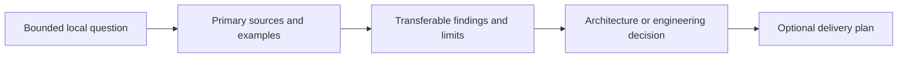

# Research

**Status:** research and historical-reference index

**Current-state rule:** research never earns implementation readiness. Feature-specific studies show the linked local feature score only to prevent precedent or a detailed target from looking implemented; the authoritative values remain in [Current Feature Readiness](../Acceptance/CurrentReadiness.md).

Research preserves external precedent, option analysis, visual exploration, and dated migration evidence. It informs decisions but is never local architecture, implementation, or acceptance authority.

## At A Glance

Research remains precedent until the owning local decision explicitly adopts it. An external feature, screenshot, or source path never proves Sparkle implements the same behavior.

| Research family | Use |
| --- | --- |
| [Graphics Architecture](GraphicsArchitecture/README.md) | renderer/RHI documentation precedent, external renderer comparison, and focused path-tracing, debug-view, and decal studies |
| [Performance Diagnostics](PerformanceDiagnostics/README.md) | product/UX precedent, visual interaction design, and dashboard promotion gates |
| [Shader System](ShaderSystem/README.md) | external shader/pipeline design precedent and the frozen pre-migration baseline |

Images used by the diagnostics visual study live under [`Images/PerformanceDiagnostics`](Images/PerformanceDiagnostics/).
