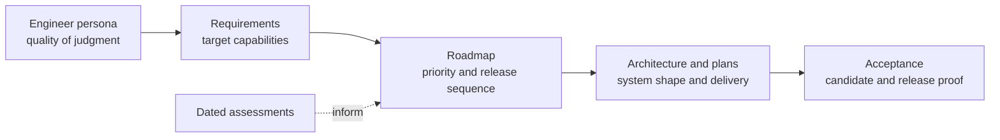

# Principal Graphics Strategy

**Status:** strategy index and responsibility map

**Current implementation snapshot:** **43/100** across 45 tracked feature families; all remain Blocked because candidate verification and delivery/adoption are zero. Strategy targets do not earn readiness. See [Current Feature Readiness](../Acceptance/CurrentReadiness.md).

Strategy owns desired capabilities, priority, release-wide sequencing, dated executive assessments, and the target professional operating model. It does not own implementation rules, subsystem design, or completion proof.

## At A Glance

The active direction is release-first: close, classify, prove, package, and publish the existing product surface before admitting broad new feature work. Strategy says what matters and in what order; Architecture and code say how the system works.

## Current Direction

- [G. Advanced Graphics Engine Executive Summary](ExecutiveSummary.md) — compact orientation and product identity.
- [A. Principal Graphics Engineering Requirements](Requirements.md) — canonical `PGE-*` capability and evidence target.
- [F. Release-First Principal Graphics Roadmap](Roadmap.md) — current release sequence, work-in-progress limits, and stop rules.
- [H. Advanced Graphics Engineer Persona](EngineerPersona.md) — target operating model and judgment standard.
- [Capability Coverage Crosswalk](../Architecture/CrossModule/StrategyCoverage.md) — dated source-backed mapping from current module capabilities to the persona, `PGE-*` requirements, roadmap release surfaces, and refreshed gap observations.
- [Feature Documentation Coverage](../Architecture/CrossModule/FeatureDocumentation/README.md) — exact document and identifier routing from strategy/acceptance/plans/research to each owning Architecture dossier, including explicit absent targets.

## Dated Assessments

- [Strategy Assessments](Assessments/README.md) routes the candidate/repository gap assessment and repository quality/complexity assessment by their snapshot-bound purpose.

Assessments must be revalidated before acting; they do not silently become current architecture or implementation status.

## Archive

- [B. Role Sources](RoleSources.md) — normalized source trace for the canonical requirements; retained for audit, not a default reviewer path.

## Neighboring Authorities

- [Architecture](../Architecture/README.md) owns current maps, decisions, and system shape.
- [Architecture](../Architecture/README.md) owns feature-local proof contracts; [Acceptance](../Acceptance/README.md) owns candidate reports, workload/release gates, and high-level progress.
- [Engineering guidance](../Engineering/README.md#choose-by-task) owns implementation rules and routes them by task.
- [Plans](../Plans/README.md) own subsystem delivery sequences; the release-wide roadmap remains here because it sets product priority and ordering.
