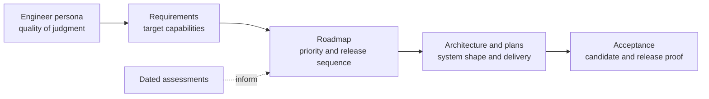

# Principal Graphics Strategy

**Status:** strategy index and responsibility map

Use this section to decide what kind of graphics engineer you want to become and what Sparkle should deliver to demonstrate it.

**Choose work at [Roadmap](Roadmap.md#where-we-are-and-what-is-next).** It owns the current task and global order. [Current Feature Readiness](../Acceptance/CurrentReadiness.md) records the implementation and evidence position.

Strategy owns desired outcomes and priorities. The catalog gives output examples; Architecture owns the system design and local plans; Acceptance records proof.

## At A Glance

```mermaid
flowchart LR
    Persona[Engineer persona<br/>quality of judgment] --> Requirements[Requirements<br/>target capabilities]
    Requirements --> Roadmap[Roadmap<br/>priority and release sequence]
    Roadmap --> Architecture[Architecture and plans<br/>system shape and delivery]
    Architecture --> Acceptance[Acceptance<br/>candidate and release proof]
    Assessments[Dated assessments] -. inform .-> Roadmap
```

The active direction is release-first: close, classify, prove, package, and publish the existing product surface before admitting broad new feature work. Strategy says what matters and in what order; Architecture and code say how the system works.

## Current Direction

| Your question | Open |
| --- | --- |
| What should I work on next? | [Roadmap](Roadmap.md) ? current task, dependencies and global order |
| What is the product vision? | [Executive Summary](ExecutiveSummary.md) ? focused engine and evidence platform |
| What should I be able to demonstrate? | [Requirements](Requirements.md) ? the canonical capability/evidence targets |
| How should I think and work? | [Engineer Persona](EngineerPersona.md) ? judgment, implementation, review and communication |
| What does a concrete delivery look like? | [Feature Delivery Catalog](FeatureDeliveryCatalog.md) ? nine outputs and three headline cases |

### Research And Coverage

- [Role research](Research/README.md) explains the professional expectations and source limits.
- [Rendering examples](Research/RenderingReferenceExamples.md) provides reusable source cards and affiliation-qualified engineer profiles.
- [Strategy coverage](../Architecture/CrossModule/StrategyCoverage.md) maps current source capabilities to the targets; it is a dated assessment.
- [Feature documentation coverage](../Architecture/CrossModule/FeatureDocumentation/README.md) locates the exact Architecture owners and identifiers.

## Dated Assessments

- [Strategy Assessments](Assessments/README.md) routes the candidate/repository gap assessment and repository quality/complexity assessment by their snapshot-bound purpose.

Assessments must be revalidated before acting; they do not silently become current architecture or implementation status.

## Archive

- [B. Role Sources](RoleSources.md) — normalized source trace for the canonical requirements; retained for audit, not a default reviewer path.

## Neighboring Authorities

- [Architecture](../Architecture/README.md) owns current maps, decisions, and system shape.
- [Architecture](../Architecture/README.md) owns feature-local proof contracts; [Acceptance](../Acceptance/README.md) owns candidate reports, workload/release gates, and high-level progress.
- [Engineering guidance](../Engineering/README.md#choose-by-task) owns implementation rules and routes them by task.
- Plans colocated with their owning [Architecture](../Architecture/README.md) subject own local stages and prompts. Roadmap owns global order across those plans; a local plan cannot select a competing program priority.
