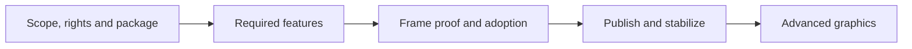

# F. Principal Graphics Delivery Roadmap

**Status:** master roadmap; planning priorities, not completion results

**Scope:** the order to follow from the current release work through advanced graphics and portfolio delivery

**Reconciled:** 2026-10-10 at `acf530742fc0f2a9e6cdcd9d27e1f88d9abccfff`; documentation inspection only

Start here to choose your next task. Open its linked plan for the exact stages, prerequisites and execution prompt. Work is ordered by dependencies, with no delivery dates or hour estimates.

## Where We Are And What Is Next

**We are defining the first release and recovering the reference renderer.** Your laptop is the selected performance machine. Reliable progressive reference tracing, realtime path tracing at least 30 FPS, complete DLSS/Ray Reconstruction, exposure/tone mapping, basic lens effects, backend parity and frame-graph reliability are required outcomes.

**Next technical task: restore correct Lit and Reference lighting.** The remaining tracer plan records a dated black-lighting failure. Check whether it still occurs with the current source and cooked inputs, find the first incorrect rendering product, then fix the responsible code. Continue from the [recovery plan's execution order](../Architecture/Modules/Engine/Renderer/Features/Lighting/ReferencePathTracer/Plan.md#required-execution-order); preserve the accepted design and delivered source stages.

**Supporting task: finish the release definition.** Settle the remaining product/map choices, reference-domain compatibility, exact native/realtime presets and rights receipts using the [scope decisions](../Acceptance/ReleaseScope/README.md#approval-and-next-work) and [scope-stage prompt](../Architecture/CrossModule/FirstRelease/README.md#fr-00--scope-and-discovery).

**Progress:** [Current Readiness](../Acceptance/CurrentReadiness.md) records what exists and what is unproved. [Release Acceptance](../Acceptance/FirstRelease.md#release-gates) records which release gates pass. This page chooses work; it does not award completion.

For everyday use: read this section, choose one task, and open its plan. Use the release order below for the larger picture, the feature order for rendering work, and the later sections when the release is accepted.

## Ordered Delivery

The first release comes first. Existing reference recovery can proceed while its scope is completed; release/package claims still wait for their prerequisites.

| Step | What you deliver | Open the detailed plan |
| --- | --- | --- |
| 0. Define | A finite product, map set, feature scope and supported presets. | [Scope and discovery](../Architecture/CrossModule/FirstRelease/README.md#fr-00--scope-and-discovery) — `REL-00` |
| 1. Establish trust | Clear asset/dependency rights, product identity and a reproducible source build. | [Identity and baseline](../Architecture/CrossModule/FirstRelease/README.md#fr-01--identity-rights-and-baseline) — `REL-01/02` |
| 2. Package | One manifest-owned build, cook, stage and package route. | [Package spine](../Architecture/CrossModule/FirstRelease/README.md#fr-02--package-spine) — `REL-03` |
| 3. Finish features | Required rendering and product behavior, including failures and resource lifetime. Follow the feature order below. | [Feature closure](../Architecture/CrossModule/FirstRelease/README.md#fr-03--feature-closure) — `REL-04` |
| 4. Prove map quality | Correct content, trustworthy references and stable images on the selected maps. | [Release maps](../Architecture/CrossModule/FirstRelease/README.md#fr-04--release-maps) — `REL-05` |
| 5. Prove the whole frame | Realtime >=30 FPS, bounded memory, stability, D3D12/Vulkan parity and principal-level frame review. | [Performance and native proof](../Architecture/CrossModule/FirstRelease/README.md#fr-05--performance-stability-and-native-proof) — `REL-06/07` |
| 6. Obtain independent approval | Frozen package bytes and successful consumer/source journeys without private help. | [Candidate and adoption](../Architecture/CrossModule/FirstRelease/README.md#fr-06--candidate-freeze-and-independent-adoption) — `REL-08/09` |
| 7. Publish | The approved release, verified after download. | [Publication](../Architecture/CrossModule/FirstRelease/README.md#fr-07--publish-and-verify) — `REL-10` |
| 8. Stabilize | Operated support, resolved release blockers and approval to start the next program. | [Release closeout](../Architecture/CrossModule/FirstRelease/README.md#fr-08--stabilize-and-close) — `REL-11` |
| 9. Build advanced evidence | Measured classical studies, an owned neural shader path and reproducible case studies. | [Advanced graphics below](#retained-advanced-graphics-roadmap) |
| 10. Expand selectively | A justified contribution or deeper transfer activity. | [Conditional work below](#conditional-and-excluded-work) |

Each plan states when its work may start and how it exits. The [release contract](../Acceptance/FirstRelease.md) owns the actual criteria, including the [required rendering and frame-review package](../Acceptance/FirstRelease.md#required-rendering-closure).

## Required Feature Closure Priority

Use this order within release step 3. A demonstrated dependency defect comes before the feature it blocks. Reuse completed work and valid proof; do not replay entire implementations.

| Order | Focus and intended result | Detailed stages |
| --- | --- | --- |
| 1 | **Reference correctness.** Restore usable lighting, reject invalid samples and qualify raw reference output before relying on it. | [Reference recovery](../Architecture/Modules/Engine/Renderer/Features/Lighting/ReferencePathTracer/Plan.md#required-execution-order), [reference closure](../Architecture/Modules/Engine/Renderer/FirstRelease/Lighting.md#lgt-3--preserve-discovery-and-close-the-required-reference) |
| 2 | **Blocking dependencies.** Fix proven content, shader, foundation or native-lifetime defects needed by the selected frame. | [Foundation/content](../Architecture/CrossModule/FirstRelease/FoundationWorldAndContent.md), [RHI](../Architecture/Modules/Engine/RHI/FirstReleasePlan.md), [Shader System](../Architecture/CrossModule/ShaderSystem/Plan.md) |
| 3 | **Frame execution.** Reliable frame admission, scene/view publication, graph dependencies, barriers, aliasing and retirement. | [Frame and scene](../Architecture/Modules/Engine/Renderer/FirstRelease/FrameAndScene.md) — `FS-0–4` |
| 4 | **Geometry and materials.** Correct residency, raster/ray inputs, TLAS and material correspondence. | [Geometry and ray tracing](../Architecture/Modules/Engine/Renderer/FirstRelease/GeometryAndRayTracing.md) — `GR-0–4` |
| 5 | **Realtime transport.** Correct primary/secondary paths, direct/indirect lighting, temporal reuse and disocclusion behavior. | [Temporal/history](../Architecture/Modules/Engine/Renderer/FirstRelease/DisplayAndReconstruction.md#dsp-1--temporal-sampling-history-resolution-and-aa-truth), [lighting](../Architecture/Modules/Engine/Renderer/FirstRelease/Lighting.md) — `DSP-1`, `LGT-0–2` |
| 6 | **Exposure and reconstruction.** Finish exposure, DLSS SR/RR inputs, resets and native lifetime on both APIs. | [Exposure](../Architecture/Modules/Engine/Renderer/FirstRelease/DisplayAndReconstruction.md#dsp-2--exposure), [DLSS/RR](../Architecture/Modules/Engine/Renderer/FirstRelease/DisplayAndReconstruction.md#dsp-3--image-reconstruction-and-provider-integration) — `DSP-2/3` |
| 7 | **Tone and output.** One correct color/tone/output transform; display adjustments must not conceal bad transport. | [Tone mapping and presentation](../Architecture/Modules/Engine/Renderer/FirstRelease/DisplayAndReconstruction.md#dsp-4--tone-mapping-encoding-and-presentation) — `DSP-4` |
| 8 | **Decals and grading.** Complete the required material/display features with raw, temporal and backend checks. | [Decals](../Architecture/Modules/Engine/Renderer/FirstRelease/GeometryAndRayTracing.md#gr-5--deferred-gbuffer-decals), [grading](../Architecture/Modules/Engine/Renderer/FirstRelease/DisplayAndReconstruction.md#dsp-5--color-grading) — `GR-5`, `DSP-5` |
| 9 | **Basic lens effects.** Independently prove chromatic aberration and vignette, including no work at neutral settings. | [Lens effects](../Architecture/Modules/Engine/Renderer/FirstRelease/DisplayAndReconstruction.md#dsp-6--chromatic-aberration-and-vignette), [vignette plan](../Architecture/Modules/Engine/Renderer/Features/PostProcessing/DisplayPipeline/Vignette/Plan.md) — `DSP-6` |
| 10 | **HDR and SDR recovery.** Finish output behavior; HDR proof requires a qualified display/OS tuple. | [HDR output](../Architecture/Modules/Engine/Renderer/FirstRelease/DisplayAndReconstruction.md#dsp-7--hdr10-display-output) — `DSP-7` |
| 11 | **Product controls and capture.** Responsive settings/UI/debug/capture/latency consumers with one state authority and honest tool support. | [Runtime/diagnostics](../Architecture/Modules/Engine/Renderer/FirstRelease/RuntimeAndDiagnostics.md), [product controls](../Architecture/CrossModule/FirstRelease/ProductAndDelivery.md), [external capture](../Architecture/CrossModule/PerformanceDiagnostics/ExternalCapture/Plan.md) |
| 12 | **Whole-frame closure.** Complete integration, failure checks, review findings and the remaining feature reports. | `FS-4`, `LGT-4`, `DSP-8`, `RD-6` in their plans; [aggregate closure](../Architecture/CrossModule/FirstRelease/README.md#fr-03--feature-closure) |

Check D3D12 and Vulkan throughout these stages. Measure cost as each feature changes; release step 5 closes the fixed whole-product performance protocol. Reference Stage 10 still waits for its release inputs and package prerequisites.

## Retained Advanced Graphics Roadmap

Start this program after release stabilization (`REL-11`). Each milestone depends on the one before it. Reuse valid release evidence rather than repeat it; these milestones remain unaccepted at this planning snapshot.

| Milestone | What you build or demonstrate | Detailed work |
| --- | --- | --- |
| **M0 — Reproducible entry** | A reviewer can obtain the product/source and reproduce the supported result. | Reuse product build/adoption proof; [portfolio preparation](../Architecture/CrossModule/GraphicsPortfolio/Plan.md) |
| **M1 — Traceable evidence** | Frozen scene/camera/settings identities, content losses and original capture joins. | Revalidate `MAP-00`; [workload sequence](../Acceptance/GraphicsWorkloads.md#workload-gate-sequence) |
| **M2 — Correct content and references** | Bistro/San Miguel results with a qualified raw reference and stated uncertainty. | Reference, material/light and map checks in their existing owners |
| **M3 — Causal classical studies** | One analyzer, three matched-API studies and one difficult incident. Retain a rejected or inconclusive alternative. | [Workload Studies](../Architecture/CrossModule/PerformanceDiagnostics/WorkloadStudies/Plan.md#remaining-stages) — `WS-S0–3`; freeze discovery and real producer inputs first |
| **M4 — Owned data and model** | One diffuse-indirect dataset/model and a repeatable training recipe. | [Neural plan](../Architecture/CrossModule/NeuralGraphics/Plan.md#remaining-stages) — `NG-S0–2`; accepted neural discovery first |
| **M5 — Model to shader** | Correct exported operators and FP32 shaders, one runtime, then measured optimization. | [Neural plan](../Architecture/CrossModule/NeuralGraphics/Plan.md#remaining-stages) — `NG-S3–5`; conformance precedes optimization |
| **M6 — Evaluation and transfer** | Held-out results, three headline cases and independent reproduction/review. | Neural `NG-S6`, study `WS-S3`, [portfolio assembly](../Architecture/CrossModule/GraphicsPortfolio/Plan.md) |

The [delivery catalog](FeatureDeliveryCatalog.md) gives concrete artifact examples for each professional output. Original workload and feature reports retain the measurements and conclusions.

## Conditional And Excluded Work

After M6, select additional work only for a demonstrated need:

- **Upstream contribution or technical submission:** a real issue/recipient and bounded output. Use the [contribution card](../Architecture/CrossModule/GraphicsPortfolio/UpstreamContribution.md).
- **Teaching, a second adopter or maintenance transfer:** actual audience, exercise and feedback. Use the [knowledge-transfer card](../Architecture/CrossModule/GraphicsPortfolio/KnowledgeTransfer.md). M6's first independent review remains required.

**Not selected:** native Linux support; AMD hardware acquisition or AMD specialist profiling; new physics/networking/audio/scripting systems; installer/updater; stable plugin SDK; broad Editor or ML frameworks. Additional hardware needs its own admitted question; [profiling guidance](../Engineering/Verification/ExternalProfiling.md) records available routes.

Geometry-cache animation, volumetrics, frame generation and meshlets/DGC/SER remain outside the selected release. Their [geometry-cache](../Architecture/CrossModule/GeometryCacheAnimation/Plan.md), [volumetric](../Architecture/Modules/Engine/Renderer/Features/Lighting/VolumetricLighting/Plan.md) and [research](Research/RenderingReferenceExamples.md) documents preserve future context.

## Dependency And Work-In-Progress Rule

Work on **one implementation task and one independent decision/discovery item**. Choose the first unfinished dependency; within it, prefer the fix that unlocks the most required downstream proof. Use the [risk register](#release-risk-register) to break ties.

If a prerequisite is missing, identify its owner and the next concrete action. Continue independent work that can proceed. A necessary shared repair comes before its consumer, with an existing owner and reviewed change/deletion/copy bounds. Missing HDR hardware or an independent reviewer delays the affected proof, not all source work.

Keep required rendering outcomes required. Any scope change needs an explicit owner decision and invalidates the affected evidence. New neural, tool and platform features wait for their admission gates.

## Reference Path Tracer Truth First

Preserve accepted `PTD-00-R1` and delivered source stages. The [remaining plan](../Architecture/Modules/Engine/Renderer/Features/Lighting/ReferencePathTracer/Plan.md) owns recovery; [Discovery](../Architecture/Modules/Engine/Renderer/Features/Lighting/ReferencePathTracer/Discovery.md) owns the accepted design. Reopen only changed decisions. Remaining implementation/proof uses `PTD-02`; release-map reference adoption uses `PTD-03`.

A finite-depth diagnostic, accumulation count or post-processed image does not qualify reference truth. Dependent quality checks need the accepted raw result and uncertainty.

## One Authority Per Question

| To understand… | Open… |
| --- | --- |
| What to do next | This Roadmap |
| What the professional output should demonstrate | [Feature Delivery Catalog](FeatureDeliveryCatalog.md) |
| What the release promises | [Release scope](../Acceptance/ReleaseScope/README.md), [capability dispositions](../Acceptance/ReleaseScope/CapabilityDispositions.md) |
| Exact implementation steps | The feature plan linked from the chosen task |
| Correct behavior and passed proof | The owning feature contract and [Release Acceptance](../Acceptance/FirstRelease.md) |
| How to perform and submit the change | [Change Lifecycle](../Engineering/Workflow/ChangeLifecycle.md), [Change Integration](../Engineering/Workflow/ChangeIntegration.md) and selected standards |

Update the result in its owner, then update this page's current/next pointer. Local plans detail the chosen work; this Roadmap retains the global order.

## Planning Coverage And Fillable Files

All 49 feature families retain their [existing phase assignments](../Architecture/CrossModule/FirstRelease/README.md#feature-work-package-registry). Reuse these plans. The remaining small scaffolds are [Vignette](../Architecture/Modules/Engine/Renderer/Features/PostProcessing/DisplayPipeline/Vignette/Plan.md), [Graphics Portfolio](../Architecture/CrossModule/GraphicsPortfolio/Plan.md) and the contribution/transfer cards above.

To fill a missing plan, use the [remaining-work template](../Engineering/Workflow/Templates/RemainingWorkPlan.md). Resolve its decision owners and check cards before calling it implementation-ready. Retire completed instructions after preserving useful design and evidence.

## Stage Target And Evidence Traceability

Use this section when opening or closing an iteration. The everyday task order is above.

Expand milestone IDs and reporting links

| Milestone | Existing workload/output identities |
| --- | --- |
| M0 | `PGD-01` |
| M1 | `WL-01`, `PGD-02` |
| M2 | `WL-02/03`, `PGD-02` |
| M3 | `WL-04`, `PGD-03/04/05` |
| M4 | `WL-05`, `PGD-06` |
| M5 | `WL-06`, `PGD-07` |
| M6 | `WL-07/08`, `CASE-*`, `PGD-08` |
| Conditional ecosystem work | `PGD-09` |

The [catalog](FeatureDeliveryCatalog.md) maps outputs to `PGE-*`; the [phase registry](../Architecture/CrossModule/FirstRelease/README.md#feature-work-package-registry) maps `FCR-*`; [Graphics Workloads](../Acceptance/GraphicsWorkloads.md) owns `MAP/WL/CASE` proof. Join these in the [iteration record](../Engineering/Workflow/ChangeLifecycle.md#create-the-iteration-control-record) with the selected objective, risk, `AC/FM/CHK`, candidate and artifact.

At handoff, record results/invalidation in their owner, retire delivered instructions, apply [Code Style](../Engineering/Foundations/CodeStyle.md) and update the next task here. Documentation checks do not pass runtime, GPU, performance, package or adoption criteria.

## Release Risk Register

Consult this when competing fixes need a priority decision. The retained assessment keeps all 13 risks open; revalidate its source indicators before choosing treatment.

Expand the full risk assessment and retirement requirements

This register owns release-wide risk priority and treatment. Stable feature-specific technical risks live with the owning Architecture feature dossier, while the applicable [`FCR-*` report](../Acceptance/FeatureCompletionReports.md#iteration-traceability-and-coverage) records candidate exposure and disposition; the [release acceptance contract](../Acceptance/FirstRelease.md#failure-mode-acceptance-matrix) owns controlled release-wide failure behavior.

Likelihood is qualitative and justified by current evidence: **High** means the unsafe condition is observed or expected on the unproven route, **Medium** means a plausible untested interaction, and **Low** requires evidence that controls are already effective. Impact is **Critical** when trust, security, data, or release integrity can be lost; **High** when a required release gate or primary promise fails; **Medium** only when a bounded workaround can preserve the advertised product. These ratings prioritize work; they never weaken acceptance.

Current state at the roadmap's source snapshot: all `RISK-REL-*` rows below are **Open**. No risk was retired by documentation or source inspection.

| ID | Risk and current indicator | Likelihood | Impact | Accountable owner and gate | Required treatment and retirement evidence |
| --- | --- | --- | --- | --- | --- |
| `RISK-REL-01` | Scope or audience remains ambiguous; user-reachable features can escape classification. | High: scope and complete inventory are not approved. | High | Release owner; `REL-00` | Freeze audiences, promises, non-goals, budgets, selectors, and every feature disposition; retire only with approved inventory and zero unmatched public selector. |
| `RISK-REL-02` | Identity, rights, dependency provenance, signing, or redistributable payload is invalid or mutable. | High: placeholder identity, moving inputs, and unapproved signing/content routes are observed. | Critical | Product, build, and content/provenance owners; `REL-01` | Pin/hash inputs, clear rights, produce notices/SBOM/threat model, allowlist and sign expected payload; retire with independent inventory/signature review. |
| `RISK-REL-03` | A dirty, cached, private, or machine-specific source route creates non-reproducible bytes. | High: no accepted cold/warm source-adopter record exists. | High | Build owner; `REL-02` | Prove empty-cache and warm/offline tagged-source routes on the declared toolchain; retire with raw provenance and non-author reproduction. |
| `RISK-REL-04` | Stage/package omits dependencies, includes private/debug files, mutates install bytes, or relies on repository paths. | High: no owned release package exists and package-mode mutable paths are observed. | Critical | Package owner; `REL-03`, `REL-08` | Implement one manifest-owned Build-Cook-Stage-Sign-Verify-Package path and per-user state; retire with package diff, signatures, read-only/offline clean-machine proof. |
| `RISK-REL-05` | Source-present or selectable behavior is mistaken for a complete feature; silent fallback manufactures plausible success. | High: features are unclassified and required-content fallback to `Empty` is observed. | Critical | Feature owners; `REL-04` | Complete every `FCR-*` trace/AC/FM/check ledger, expose requested-versus-active state, fix or make the route unreachable; retire with zero orphan or silent-fallback path. |
| `RISK-REL-06` | Shipped examples contain material, transform, lighting, temporal, encoding, or backend-specific artifacts. | Medium: broad source paths exist but staged-package map/reference evidence does not. | High | Content and graphics-quality owners; `REL-05` | Freeze cameras/references/thresholds, inspect debug outputs and motion on each backend, resolve `S0`/`S1`; retire with approved per-map packages. |
| `RISK-REL-07` | The 30 FPS promise hides CPU/GPU stalls, load cost, memory growth, thermal effects, or lifecycle instability. | Medium: timing primitives exist but candidate-bound measurements do not. | High | Performance and feature owners; `REL-06` | Measure frozen routes with p50/p95/p99/worst, timelines, memory high-water, repeat/soak and causal controls; retire only when every supported row passes. |
| `RISK-REL-08` | D3D12/Vulkan capability, synchronization, lifetime, shader ABI, or device-loss behavior diverges. | Medium: both source backends exist without paired native-validation evidence. | Critical | RHI/Renderer owners; `REL-07` | Execute focused paired backend and native validation, capability rejection, delayed completion/retirement, and incident diagnostics; retire with zero uncategorized findings. |
| `RISK-REL-09` | Runtime consumers or source adopters require author knowledge, elevated privileges, private caches, unstable contracts, or undocumented repair. | High: neither independent journey has passed. | High | Product, documentation, and source-adoption owners; `REL-08`, `REL-09` | Run both journeys from public instructions in clean states, record confusion/interventions, freeze compatibility/support boundary; retire with independent acceptance. |
| `RISK-REL-10` | Published bytes, policy, support, security intake, patch/withdrawal, or stabilization response fails after delivery. | High: public operations and response evidence do not exist. | Critical | Release and support/security owners; `REL-10`, `REL-11` | Verify immutable remote bytes and live routes, operate severity clocks and patch/withdraw/advisory paths through the stabilization window; retire at approved closeout. |
| `RISK-REL-11` | Evidence is stale, non-detecting, cherry-picked, generated without review, or bound to different bytes/configuration. | High: current evidence is source-only and candidate artifacts do not exist. | Critical | Evidence reviewer; all gates | Map every AC/FM to a defect-detecting `CHK-*`, hash artifacts, record invalidation triggers and unavailable checks; retire per claim only after independent review. |
| `RISK-REL-12` | Scope creep or parallel feature work consumes capacity before the current gate closes. | High: the repository has many source-present unfinished surfaces. | High | Release owner; all gates | Enforce one primary gate, key-check-first iteration, explicit exclusion/deletion, and WIP review; retire only when `REL-11` unlocks new features. |
| `RISK-REL-13` | A shared, truncated, biased, unconverged, or post-processed reference is treated as ground truth and approves wrong PBR/lighting/map results. | High: source stages are delivered, but recovery, invalid-sample/preflight and oracle evidence remain open. | Critical | Renderer and evidence owners; `PTD-00`, `REL-04`, `REL-05` | Preserve accepted `PTD-00`; close the remaining `FCR-REN-08` recovery and raw analytic/minimal/independent/backend evidence; retire only when every dependent claim names a defect-detecting oracle and uncertainty. |

Default contingency for every open release risk is to hold the affected gate and either repair the same candidate or reduce advertised scope through its owning acceptance decision. Integrity/security failure requires candidate quarantine or withdrawal. No contingency may relabel missing evidence, silent fallback, or a different configuration as a pass.

A risk stays **Open** until its retirement evidence is linked from the current iteration and accepted at the named gate. Mitigation work without proof changes activity, not risk state. A realized risk also receives an `FM-*`/defect identity and invalidates every dependent result.

## Scope Protection

Correctness, lifetime safety, paired APIs and required rendering are release work. Extra presentation polish, second hardware and generalized tooling can wait. Preserve qualified reference truth, held-out evaluation, the classical fallback and honest limitations.

When a candidate fails, repair its owner or explicitly revise scope and rerun affected proof. Publish only approved bytes; begin the advanced program only after `REL-11`.
