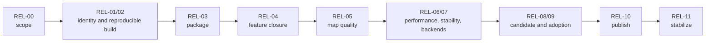
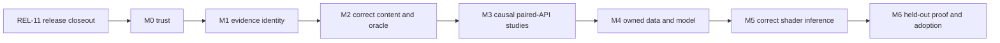

# F. Release-First Principal Graphics Roadmap

**Status:** roadmap; release-wide execution sequence whose gates are targets, not completion claims

**Responsibility:** release-wide priority, dependency order, and gate sequencing for the first public release

**Planning method:** gate-based delivery with no calendar targets or time estimates. Each next action names an output, measurable exit, prerequisite, owner and evidence. [Feature Delivery Catalog](FeatureDeliveryCatalog.md) owns the selected professional outputs; [current role research](Research/PrincipalGraphicsRoles.md) supplies precedent.

**Planning reconciliation:** 2026-10-10 at source revision `83c6228e6138bd0de88303c99f7a309a1ab97ca8`. Tracer status is reconciled to its current recovery plan; the remaining historical baseline below has not been rebuilt or runtime-revalidated. No release, feature or personal evidence level is upgraded.

**Planning baseline:** repository and release surfaces statically reconciled on 2026-09-06 at committed `master` revision `8414b5dc`; a concurrent documentation relocation is present in the worktree and is not implementation evidence; no build, cook, package, launch, capture, clean-machine, or performance result was added by this reconciliation

**Reference Path Tracer target reconciliation:** viewport-first Reference Path Tracer wording reconciled on 2026-09-09 against committed `master` revision `20c7bb11`; this changed no gate verdict and added no implementation or runtime evidence

**First-release acceptance authority:** [First Release Acceptance Contract](../Acceptance/FirstRelease.md)

**Governing graphics requirements:** [A. Principal Graphics Engineering Requirements](Requirements.md)

**Dated graphics assessment:** [C. Candidate and Repository Gap Assessment](Assessments/GapAssessment.md)

**Canonical graphics workload:** [I. Bistro and San Miguel Acceptance Workloads](../Acceptance/GraphicsWorkloads.md)

**Per-feature polish and how-it-works contract:** [First Release Feature Completion Reports](../Acceptance/FeatureCompletionReports.md)

**Executable implementation orchestration:** [First Release Implementation Plan](../Architecture/CrossModule/FirstRelease/README.md), with every current `FCR-*` family routed to one owner-scoped staged plan and ready-to-run prompts

**Reference Path Tracer discovery:** [completion study](../Architecture/Modules/Engine/Renderer/Features/Lighting/ReferencePathTracer/Research.md) and [`PTD-00` acceptance](../Architecture/Modules/Engine/Renderer/Features/Lighting/ReferencePathTracer/Discovery.md)

**Concurrency architecture and execution contract:** [J. Multithreaded Engine Architecture](../Architecture/CrossModule/MultithreadedEngine.md)

**Current implementation snapshot:** **40/100** across 49 tracked feature families, but **0/100 release acceptance** because no candidate has closed the conjunctive release gates. Roadmap milestones add no readiness until source, evidence, or delivery actually changes. See [Current Feature Readiness](../Acceptance/CurrentReadiness.md).

## Roadmap At A Glance

> [!IMPORTANT]
> **Current direction:** release-first until `REL-11` closes the `v0.1.0` stabilization window.
>
> **First technical closure:** the accepted `PTD-00-R1` contract is established. Close the current Reference Path Tracer recovery and unproved oracle checks before using its output as correctness truth; do not restart delivered source stages.
>
> **Current evidence state:** the planning baseline is source/document inspection. All release risks remain open and no release gate passed through documentation alone.



The detailed stage sections are strategic execution targets. The [First Release Implementation Plan](../Architecture/CrossModule/FirstRelease/README.md) owns phase ordering, dependencies, stop conditions, and implementation prompts. The [First Release Acceptance Contract](../Acceptance/FirstRelease.md) owns whether a gate actually passes.

## Roadmap Decision

SparkleEngine is release-first until `REL-11` closes the `v0.1.0` stabilization window.

No new engine feature, render effect, backend, content family, general framework, or platform enters implementation while an earlier first-release gate is red. Existing capability work is not discarded: it is classified, completed with evidence, exposed as experimental with an honest boundary, or removed/excluded from the public product. The existing Reference Path Tracer is the first technical feature-closure case: its development-only Stages 1 through 9 may proceed after an immutable `PTD-00-R1 PASS`, while Stage 10 adoption, package/Shipping claims, `FCR-REN-08` release closure, and release-map use remain ordered behind the applicable release gates. The broader Bistro/San Miguel analysis, neural, and research-publication work remains after the first release gate.

This is a sequencing change, not a change to the long-term graphics plan. It closes the current product before expanding it.

## Reference Path Tracer Truth First

The current Reference Path Tracer objective is recovery and completion of the [remaining plan](../Architecture/Modules/Engine/Renderer/Features/Lighting/ReferencePathTracer/Plan.md). The former GBuffer-seeded branch was removed; the replacement's per-view mode, transport, traversal, accumulation, UI and manual publication route are source-delivered. The owning plan retains the black-lighting observation, invalid-sample/preflight gaps and deferred analytic, native-backend, lifecycle, artifact and adoption checks. This is source delivery, not an accepted independent oracle. Reuse valid evidence and repair the earliest falsified boundary before tuning output or generating training targets.

| Work identity | When it may run | Required output | Stop rule |
| --- | --- | --- | --- |
| `PTD-00` completion discovery | `PTD-00-R1 PASS` at immutable dossier revision `d3152ec28f74cc1987f1d58fb52fa7ede10fd300`. | Accepted development contract: exact transport/unbiasedness claim, `RPTConformanceSet`, feature and dependency matrix, precedent/current-source study, derivation, risks, failure modes, oracle/fixture/statistical design, target-shape decision, and plan-ready backlog. | Any later change to the accepted development scope, architecture, estimator math, evidence design, or ownership invalidates the gate and requires explicit re-review. |
| `PTD-01` implementation-plan freeze | Development contract accepted through immutable `PTD-00-R1 PASS`; the [current plan](../Architecture/Modules/Engine/Renderer/Features/Lighting/ReferencePathTracer/Plan.md) now orders remaining recovery and proof. | One Renderer-owned sequence, prerequisite/evidence/deletion ledgers and separate release-adoption gate. Completed implementation prompts remain retired; preserve valuable source and decision evidence. | A changed transport domain or new subsystem returns affected cells to `PTD-00`; plan presence alone does not authorize an unreviewed contract change. |
| `PTD-02` development implementation and `FCR-REN-08` candidate closure | Continue authorized recovery against the accepted development domain; delivered Stages 1–9 are not restarted. Stage 10/release closure waits for accepted `ReleaseMapSet`, support machines and `REL-03`. | Pass the [feature acceptance contract](../Architecture/Modules/Engine/Renderer/Features/Lighting/ReferencePathTracer/README.md) through remaining viewport, estimator, traversal/backend, lifecycle and raw-publication checks. Repair invalid-result/preflight gaps and prove uncertainty before oracle use; Stage 10 adds package/Shipping/adoption evidence. | The required mode remains blocked if its frozen claim needs redesign; it cannot be accepted as experimental or excluded without an explicit new owner scope decision. Progress/artifact plumbing cannot prove usable output, and no weaker result inherits “unbiased.” |
| `PTD-03` release-map adoption | After `PTD-02`; consumed by `REL-05`. | Frozen high-sample references and uncertainty/provenance for each applicable release-map camera, plus evidence that reference and subject do not share the defect under test. | A reference-dependent map/PBR verdict is blocked when its oracle is absent, shared, non-equivalent, unconverged, or post-processed. |

`PTD-00` is first because a false oracle contaminates every later PBR, direct-lighting, ReSTIR, map, denoising, and neural comparison. Release identity, rights, reproducible build, package work, named support hardware, and release-map reconciliation remain prerequisites for Stage 10 and every shipped or release-dependent claim; they are not inputs to development-only Stages 1 through 9. Reference accumulation is not held to the 30 FPS convergence target, but the selected view mode must remain responsive, present the newest accepted camera identity within its frozen budget, and refine automatically when motion stops. Durable manual export follows that usable loop and remains bounded, exact, and required wherever final evidence depends on it.

## First-Release Outcome

Release North Star: apply `NS-REAL`, `NS-MATH-DATA`, `NS-EVIDENCE`, `NS-OWNERSHIP`, `NS-ADOPTION`, and `NS-SIMPLIFY` to one immutable delivery until an independent standard-user runtime consumer and a separate source adopter can reproduce the supported result and the stabilization owner can sustain it. A smaller evidenced product satisfies this North Star; a broader source tree does not.

The first release is complete only when both required audiences pass without private guidance. A runtime consumer can:

1. download a versioned Windows x64 archive and verify its checksum;
2. extract it outside the repository on a clean standard-user machine;
3. launch the `ShippingGame` Showcase runtime without build tools or network access;
4. run every shipped example map and advertised graphics/backend option end to end;
5. see PBR-correct, temporally stable images with no unresolved release-blocking artifacts;
6. receive at least 30 FPS on the declared minimum machine under the frozen measurement contract;
7. switch maps, resize/minimize/restore, repeat runs, and exit without crash, hang, device removal, stale content, or unbounded memory growth;
8. locate controls, requirements, licenses/notices, known issues, support, and crash-report instructions;
9. reproduce the recorded result from the release instructions and exact artifact hashes.

A source adopter can verify the tag and dependencies, configure the documented supported toolchain from an empty cache, build, cook, and run a shipped example, then identify the API/ABI stability, compatibility, security, and support boundaries. A public runtime demo without this source journey is not accepted as an engine release; a source build without the consumer package is not accepted as the delivery.

Only linked evidence can move a row to `Verified`, `Release candidate`, `Shippable`, or `Published`. Source presence, a successful compile, historical logs, a responsive process, an attractive screenshot, or average FPS cannot.

## Current Planning Baseline

The repository has substantial engine breadth. The release problem is closure and delivery evidence, not lack of features.

| Area | Current source-inspected state | Release-first consequence |
| --- | --- | --- |
| Engine foundation | Core, platform, tasks, application, world, editor, renderer, RHI, import, cooking, shader compiler, launcher, Showcase, build, and package surfaces now have a dated source inventory. | Reconcile that snapshot against the live public selectors at scope freeze, assign every disposition, then close or exclude each path. Do not start replacement frameworks. |
| Graphics | D3D12/Vulkan and the previously inventoried rendering paths form the baseline; the replacement Reference Path Tracer now has delivered source stages and a remaining recovery/validation plan. The September inventory of other present/absent modes is historical, not a fresh complete scan. | Source presence is not acceptance. `FCR-REN-23` through `26` retain their mandatory target decisions; refresh each owning dossier before action. Volumetric lighting and frame generation remain excluded. Tracer recovery and estimator/oracle evidence must close before dependent claims; every included mode still needs feature, map, backend, failure, quality and performance evidence. |
| Build | Six Debug/Development/Shipping editor/game profiles exist; Showcase editor/runtime and launcher targets exist. | Freeze `ShippingGame` as the runtime release product and prove a clean reproducible build. |
| Package | Runtime source recognizes a package manifest, and development dependency/artifact staging exists. | Add one owned Build-Cook-Stage-Package route. No repository `install()`/CPack contract or release archive is currently proven. |
| Content | The live Stage 0 catalog scan at `93e86b81` finds 20 level records and 17 asset packs; the older 16-entry/13-runtime-supported workload count is historical. Catalog presence does not prove readiness, runtime support or rights. | [Release Scope](../Acceptance/ReleaseScope/README.md#releasemapset) proposes Cornell Box and Cesium Man; verify their exact rights/cook dependency closure before packaging. |
| Visual acceptance | Detailed map/PBR/reference/performance gates exist in the Bistro/San Miguel workload, but no accepted Reference Path Tracer currently owns their high-sample truth. | Reuse `MAP-A` through `MAP-H`, qualify current high-sample output as candidate comparison until `PTD-02`, and add release-package acceptance; do not create a second map-quality vocabulary. |
| Evidence | Level-selected launch, manual capture, native validation switches, and timing primitives exist. | Finish `MAP-00`: fixed resolution, authoritative settled identity, named sidecars, timing export, and unified manifest. |
| Verification | No active CTest registration, root CI workflow, or complete release matrix was found. | Record the validation policy and obtain explicit authorization before adding permanent submitted tests; automate approved build/static/package gates first. |
| Identity/trust | No root README, no declared CMake project version, placeholder license identity, and no Windows version resource were found. | Freeze identity, license, notices, version metadata, system requirements, support, and known issues before a candidate. |
| Consumer experience | Runtime defaults to `Empty`, startup selection is environment-driven, the launcher owns discoverable level actions, and the runtime console defaults enabled. | Add or select one intentional consumer first run, public example-selection/help/settings/quit path, and Shipping-only surface. Environment variables remain evidence plumbing. |
| Writable state | Package-mode build/log/cooked roots, captures, and persisted rendering settings currently resolve beneath the workspace/package tree. | Separate immutable shipped bytes from a declared per-user mutable root and prove standard-user, read-only-install, reset, and removal behavior. |
| Failure truth | Required catalog or level failures may fall back to built-in `Empty`. | Required package/content failures must be visible and actionable; they may not manufacture plausible success through silent fallback. |
| Supply chain | Most dependencies are versioned, but `stb` follows `master` and the sparse Compressonator clone follows its default branch; generic staging includes debug-suffixed Streamline DLLs. | Pin all inputs, inventory/SBOM them, clear redistribution, and allowlist exact signed Shipping payload. |
| Source adoption | Source/build machinery exists, but no root quick start, frozen public toolchain matrix, independent cold source build/cook/run record, or binary SDK contract was found. | Prove source adoption and explicitly exclude a stable binary SDK/plugin ABI unless install headers/libraries/samples and compatibility rules are added. |
| Compatibility/support | The clean-break standard assumes no installed consumers; DRED exists, but no complete public crash/security/support and patch/withdrawal policy was found. | Freeze the first durable external contract before publication and prove support, symbols/dumps, security intake, patch, withdrawal, and stabilization ownership. |
| Worktree | The live audit observed this release-documentation work plus a separate staged documentation relocation. | Reconcile intended documentation changes without dropping or conflating concurrent work, then produce release evidence only from the eventual clean candidate commit. |

Any row may be superseded only by current code, executable configuration, and recorded evidence. Update this roadmap's tracker when a gate changes; do not rewrite historical assessments to imply completion.

## Release Risk Register

This register owns release-wide risk priority and treatment. Stable feature-specific technical risks live with the owning Architecture feature dossier, while the applicable [`FCR-*` report](../Acceptance/FeatureCompletionReports.md#iteration-traceability-and-coverage) records candidate exposure and disposition; the [release acceptance contract](../Acceptance/FirstRelease.md#failure-mode-acceptance-matrix) owns controlled release-wide failure behavior.

Likelihood is qualitative and justified by current evidence: **High** means the unsafe condition is observed or expected on the unproven route, **Medium** means a plausible untested interaction, and **Low** requires evidence that controls are already effective. Impact is **Critical** when trust, security, data, or release integrity can be lost; **High** when a required release gate or primary promise fails; **Medium** only when a bounded workaround can preserve the advertised product. These ratings prioritize work; they never weaken acceptance.

Current state at the roadmap's source snapshot: all `RISK-REL-*` rows below are **Open**. No risk was retired by documentation or source inspection.

| ID | Risk and current indicator | Likelihood | Impact | Accountable owner and gate | Required treatment and retirement evidence |
| --- | --- | --- | --- | --- | --- |
| `RISK-REL-01` | Scope or audience remains ambiguous; user-reachable features can escape classification. | High: scope and complete inventory are not approved. | High | Release owner; `REL-00` | Freeze audiences, promises, non-goals, budgets, selectors, and every feature disposition; retire only with approved inventory and zero unmatched public selector. |
| `RISK-REL-02` | Identity, rights, dependency provenance, signing, or redistributable payload is invalid or mutable. | High: placeholder identity, moving inputs, and unapproved signing/content routes are observed. | Critical | Product, build, and content/provenance owners; `REL-01` | Pin/hash inputs, clear rights, produce notices/SBOM/threat model, allowlist and sign expected payload; retire with independent inventory/signature review. |
| `RISK-REL-03` | A dirty, cached, private, or machine-specific source route creates non-reproducible bytes. | High: no accepted cold/warm source-adopter record exists. | High | Build owner; `REL-02` | Prove empty-cache and warm/offline tagged-source routes on the declared toolchain; retire with raw provenance and non-author reproduction. |
| `RISK-REL-04` | Stage/package omits dependencies, includes private/debug files, mutates install bytes, or relies on repository paths. | High: no owned release package exists and package-mode mutable paths are observed. | Critical | Package owner; `REL-03`, `REL-08` | Implement one manifest-owned Build-Cook-Stage-Sign-Verify-Package path and per-user state; retire with package diff, signatures, read-only/offline clean-machine proof. |
| `RISK-REL-05` | Source-present or selectable behavior is mistaken for a complete feature; silent fallback manufactures plausible success. | High: features are unclassified and required-content fallback to `Empty` is observed. | Critical | Feature owners; `REL-04` | Complete every `FCR-*` trace/AC/FM/check ledger, expose requested-versus-active state, fix or make the route unreachable; retire with zero orphan or silent-fallback path. |
| `RISK-REL-06` | Shipped examples contain material, transform, lighting, temporal, encoding, or backend-specific artifacts. | Medium: broad source paths exist but staged-package map/reference evidence does not. | High | Content and graphics-quality owners; `REL-05` | Freeze cameras/references/thresholds, inspect debug outputs and motion on each backend, resolve `S0`/`S1`; retire with approved per-map packages. |
| `RISK-REL-07` | The 30 FPS promise hides CPU/GPU stalls, load cost, memory growth, thermal effects, or lifecycle instability. | Medium: timing primitives exist but candidate-bound measurements do not. | High | Performance and feature owners; `REL-06` | Measure frozen routes with p50/p95/p99/worst, timelines, memory high-water, repeat/soak and causal controls; retire only when every supported row passes. |
| `RISK-REL-08` | D3D12/Vulkan capability, synchronization, lifetime, shader ABI, or device-loss behavior diverges. | Medium: both source backends exist without paired native-validation evidence. | Critical | RHI/Renderer owners; `REL-07` | Execute focused paired backend and native validation, capability rejection, delayed completion/retirement, and incident diagnostics; retire with zero uncategorized findings. |
| `RISK-REL-09` | Runtime consumers or source adopters require author knowledge, elevated privileges, private caches, unstable contracts, or undocumented repair. | High: neither independent journey has passed. | High | Product, documentation, and source-adoption owners; `REL-08`, `REL-09` | Run both journeys from public instructions in clean states, record confusion/interventions, freeze compatibility/support boundary; retire with independent acceptance. |
| `RISK-REL-10` | Published bytes, policy, support, security intake, patch/withdrawal, or stabilization response fails after delivery. | High: public operations and response evidence do not exist. | Critical | Release and support/security owners; `REL-10`, `REL-11` | Verify immutable remote bytes and live routes, operate severity clocks and patch/withdraw/advisory paths through the stabilization window; retire at approved closeout. |
| `RISK-REL-11` | Evidence is stale, non-detecting, cherry-picked, generated without review, or bound to different bytes/configuration. | High: current evidence is source-only and candidate artifacts do not exist. | Critical | Evidence reviewer; all gates | Map every AC/FM to a defect-detecting `CHK-*`, hash artifacts, record invalidation triggers and unavailable checks; retire per claim only after independent review. |
| `RISK-REL-12` | Scope creep or parallel feature work consumes capacity before the current gate closes. | High: the repository has many source-present unfinished surfaces. | High | Release owner; all gates | Enforce one primary gate, key-check-first iteration, explicit exclusion/deletion, and WIP review; retire only when `REL-11` unlocks new features. |
| `RISK-REL-13` | A shared, truncated, biased, unconverged, or post-processed reference is treated as ground truth and approves wrong PBR/lighting/map results. | High: source stages are delivered, but recovery, invalid-sample/preflight and oracle evidence remain open. | Critical | Renderer and evidence owners; `PTD-00`, `REL-04`, `REL-05` | Preserve accepted `PTD-00`; close the remaining `FCR-REN-08` recovery and raw analytic/minimal/independent/backend evidence; retire only when every dependent claim names a defect-detecting oracle and uncertainty. |

Default contingency for every open release risk is to hold the affected gate and either repair the same candidate or reduce advertised scope through its owning acceptance decision. Integrity/security failure requires candidate quarantine or withdrawal. No contingency may relabel missing evidence, silent fallback, or a different configuration as a pass.

A risk stays **Open** until its retirement evidence is linked from the current iteration and accepted at the named gate. Mitigation work without proof changes activity, not risk state. A realized risk also receives an `FM-*`/defect identity and invalidates every dependent result.

## Dependency And Work-In-Progress Rule

```text
PTD-00 Reference Path Tracer completion discovery
    -> PTD-01 implementation-plan authorization
    -> PTD-02 development Stages 1-9

REL-00 scope and freeze
    -> REL-01 identity, rights, and release maps
    -> REL-02 clean reproducible baseline
    -> REL-03 Build-Cook-Stage-Package spine
    -> PTD-02 Stage 10 / FCR-REN-08 release closure
    -> REL-04 close or exclude every remaining current feature
    -> REL-05 artifact-free PBR map acceptance
    -> REL-06 30 FPS and stability acceptance
    -> REL-07 native backend diagnostics
    -> REL-08 clean-machine candidate
    -> REL-09 independent approval
    -> REL-10 publish and verify
    -> REL-11 stabilize and close
    -> retained advanced graphics roadmap
```

Only one gate is the primary implementation objective. The accepted development contract permits the existing tracer recovery route; delivered source stages are not replayed. A contract change reopens affected discovery cells. Stage 10, `FCR-REN-08` release closure, `PTD-03`, and every package/Shipping/release-map claim remain ordered behind the applicable release gates.

Scope may shrink when a feature or map cannot meet the frozen bar within its bounded design. The evidence threshold does not shrink. The next deliverable is chosen from failed or unproved gates, without a release-date forecast.

## Release Phase Structure

Each phase has one irreversible product decision and one stop condition. The detailed acceptance criteria and injected-failure responses live in the [release gate](../Acceptance/FirstRelease.md#release-gates) and [gate failure and recovery](../Acceptance/FirstRelease.md#gate-failure-and-recovery-matrix) matrices; stages below own execution order and outputs.

| Phase | Stages and gates | Decision/output | Phase stop condition |
| --- | --- | --- | --- |
| I. Discover, define, and trust | Discovery through Stage 1; `PTD-00`–`PTD-01`, `REL-00`–`REL-02` | Exact Reference Path Tracer development claim and plan decision; finite release audiences/scope/compatibility; real identity/rights; pinned inputs; clean source route. | An oracle-shaping development unknown stops path-tracer implementation; a consumer promise, right, dependency identity, signing route, source prerequisite, or baseline failure stops packaging and release adoption. |
| II. Productize and close | Stages 2-3; `REL-03`–`REL-04`, `PTD-02` | Signed, manifest-owned package and source delivery; Reference Path Tracer closed first; every remaining current feature included, experimental, excluded, or removed. | A development-tree substitute, false oracle, mutable-install dependency, silent fallback, unclassified option, unexpected file/network action, or broken first run stops map proof. |
| III. Prove product | Stages 4-5; `PTD-03`, `REL-05`–`REL-07` | Accepted reference-backed artifact-free PBR maps, 30 FPS floor, bounded resources, stable lifecycle, native diagnostics, and controlled-failure evidence. | Any invalid/unconverged/shared oracle, `S0`/`S1`, threshold failure, unexplained validation message, crash/hang/device removal, or undetected injected fault stops candidacy. |
| IV. Accept and publish | Stages 6-7; `REL-08`-`REL-10` | Independent consumer and source-adopter acceptance, immutable signed upload, and fresh-download verification. | Private help, untrusted signature, hash/tag mismatch, unavailable support/security route, or a change to candidate bytes is a no-go. |
| V. Stabilize and close | Stage 8; `REL-11` | Reports triaged, required patches/withdrawals verified, policies current, lessons recorded, and feature work explicitly unlocked. | Any open `S0`/`S1`, unowned security/support report, repeat escape, or unverified replacement extends the freeze. |

## Stage Target And Evidence Traceability

Every stage iteration uses the [iteration control record](../Engineering/Workflow/ChangeLifecycle.md#create-the-iteration-control-record). The table marks the minimum North Star/persona, feature, risk, acceptance/failure, and key-check coverage; feature reports add stricter targets when their implementation requires them.

| Stage and gate | North Star and persona emphasis | Feature/report scope | Primary risks | Acceptance, failure, and key check |
| --- | --- | --- | --- | --- |
| Discovery + 0; `PTD-00`, `REL-00` | `NS-REAL`, `NS-MATH-DATA`, `NS-EVIDENCE`, `NS-OWNERSHIP`, `NS-ADOPTION`, `NS-SIMPLIFY`; `PGE-01`, `PGE-02`, `PGE-05`–`PGE-10`, `PGE-13`, `PGE-15` | Reference Path Tracer discovery, whole capability inventory, every `FCR-*` family; first technical target is `FCR-REN-08`. | `RISK-REL-01`, `RISK-REL-05`, `RISK-REL-09`, `RISK-REL-11`–`RISK-REL-13` | `AC-PTD-01`–`17`, `REL-00`, applicable `FM-PTD-*`, `FM-REL-01`, `FM-REL-08`; key check is `CHK-PTD-03` estimator review until it passes, then public-selector/configuration inventory versus feature dispositions. |
| 1; `REL-01`–`REL-02` | `NS-EVIDENCE`, `NS-OWNERSHIP`, `NS-ADOPTION`; `PGE-01`, `PGE-06`, `PGE-07`, `PGE-13`, `PGE-14`, `PGE-15` | Product/source/package/content reports, especially `FCR-PROD-02`, `FCR-PROD-05`, `FCR-PROD-06`, `FCR-CONT-03`. | `RISK-REL-02`, `RISK-REL-03`, `RISK-REL-11` | `REL-01`, `REL-02`; `FM-REL-02`–`FM-REL-04`, `FM-REL-14`; key check is independent immutable-input audit followed by cold source reproduction. |
| 2; `REL-03` | `NS-REAL`, `NS-EVIDENCE`, `NS-OWNERSHIP`; `PGE-01`, `PGE-05`, `PGE-07`, `PGE-10`, `PGE-14`, `PGE-15` | `FCR-PROD-05`, `FCR-CORE-01`, `FCR-CONT-02`, `FCR-CONT-03`, `FCR-SHDR-01`. | `RISK-REL-04`, `RISK-REL-11` | `REL-03`; `FM-REL-02`–`FM-REL-07`, `FM-REL-12`; key check is generate, inventory, verify, extract read-only/offline, launch/map/exit, then corrupt a copy. |
| 3; `PTD-02`, `REL-04` | All applicable `NS-*`; every `PGE-*` named by the feature report. | `FCR-REN-08` is first; then every remaining included/experimental `FCR-*`, including mandatory absent targets `FCR-REN-23` through `26`, and each capability-evidence plan item. | `RISK-REL-05`, `RISK-REL-11`–`RISK-REL-13` | `REL-04`; accepted path-tracer and applicable common/feature `FM-*`; key check is the highest-impact open risk and cheapest criterion-falsifying `CHK-*` in each report. Reference-dependent work waits for `FCR-REN-08`. |
| 4; `PTD-03`, `REL-05` | `NS-REAL`, `NS-MATH-DATA`, `NS-EVIDENCE`; `PGE-02`, `PGE-05`, `PGE-06`, `PGE-08`, `PGE-09`, `PGE-13` | Map reports plus world/content/GBuffer/lighting/display feature reports, consuming the accepted Reference Path Tracer only within its domain. | `RISK-REL-06`, `RISK-REL-11`, `RISK-REL-13` | `REL-05`, `MAP-A`–`MAP-H`; `FM-REL-05`, `FM-REL-10`, `FM-REL-11`; key check is raw reference/debug/temporal evidence for the most failure-prone frozen view with oracle independence and uncertainty. |
| 5; `REL-06`–`REL-07` | `NS-MATH-DATA`, `NS-EVIDENCE`, `NS-OWNERSHIP`; `PGE-02`, `PGE-05`, `PGE-06`, `PGE-08`, `PGE-09`, `PGE-10`, `PGE-14` | Tasks, RHI, Renderer, shader, provider, diagnostics, and every performance-sensitive map report. | `RISK-REL-07`, `RISK-REL-08`, `RISK-REL-11` | `REL-06`, `REL-07`; `FM-REL-09`–`FM-REL-11`, `FM-REL-13`; key check is focused native validation/correctness before the frozen three-run performance protocol. |
| 6; `REL-08`–`REL-09` | `NS-REAL`, `NS-EVIDENCE`, `NS-ADOPTION`; `PGE-01`, `PGE-06`, `PGE-07`, `PGE-13`, `PGE-14`, `PGE-15` | All shipped reports and both consumer/source-adopter journeys. | `RISK-REL-04`, `RISK-REL-09`, `RISK-REL-11` | `REL-08`, `REL-09`; every applicable `FM-REL-01`–`FM-REL-14` and `FM-REL-16`; key check is the clean non-author journey without private repair. |
| 7; `REL-10` | `NS-REAL`, `NS-EVIDENCE`, `NS-ADOPTION`; `PGE-01`, `PGE-07`, `PGE-13`, `PGE-14`, `PGE-15` | Publication, compatibility, support, security, and final product reports. | `RISK-REL-02`, `RISK-REL-09`, `RISK-REL-10`, `RISK-REL-11` | `REL-10`; `FM-REL-02`, `FM-REL-12`, `FM-REL-15`; key check is fresh remote retrieval plus hash/signature/tag/claim and shortest-journey verification. |
| 8; `REL-11` | `NS-EVIDENCE`, `NS-ADOPTION`, `NS-SIMPLIFY`; `PGE-01`, `PGE-06`, `PGE-13`, `PGE-15` | Support/incident histories and every affected feature report. | `RISK-REL-10`, `RISK-REL-11`, `RISK-REL-12` | `REL-11`; `FM-REL-13`, `FM-REL-15`, `FM-REL-16`; key check is real report triage and any patch/withdraw/advisory retrieval verification. |

At iteration start, mark these rows `advance`, `preserve`, `not applicable`, or `blocked` and select one key `CHK-*`. At handoff, update the same record with results and invalidations. Missing traceability is a stop condition and must be resolved before handoff.

## Release Plan At A Glance

| Stage | Primary outcome | Exit artifact | Stop rule |
| --- | --- | --- | --- |
| D. Discover reference truth | Exact Reference Path Tracer/unbiasedness claim, dependency boundary, estimator, oracle ladder, failure/evidence design, and smallest target shape. | Accepted `PTD-00` report and authorization/freeze decision for the conditional `PTD-01`. | No production implementation and no frozen plan choice while an oracle-shaping question is open. |
| 0. Define | Exact product, platform, support matrix, feature disposition, and non-goals. | Approved scope and inventory. | No implementation before the surface is finite. |
| 1. Trust | Real identity/license/notices, clean baseline, reviewer route, and executable checks. | Reproducible clean build record. | Do not package ambiguous ownership or rights. |
| 2. Package | One repeatable Build-Cook-Stage-Package route. | Install/stage manifest and first archive. | Do not validate a development-tree substitute. |
| 3. Close features | Every current capability is included, experimental, excluded, or removed. | Feature-closure matrix. | No unclassified selectable feature. |
| 4. Prove maps | Cleared examples are complete, PBR-correct, and artifact-free. | Per-map evidence packages. | One release-blocking visual/content defect stops the next map. |
| 5. Prove delivery | 30 FPS floor, stability, memory, both advertised APIs, and actionable failures. | Performance/native-validation/stability records. | No averaging away stalls, warnings, or backend failures. |
| 6. Candidate | Frozen package works on a clean minimum machine and for a non-author. | Signed go/no-go record. | Any package fix creates new bytes and invalidates affected gates. |
| 7. Publish | Immutable tag/assets/checksums, fresh-download smoke, and support ownership. | `v0.1.0` release record. | Do not announce before uploaded bytes are retrieved and verified. |
| 8. Stabilize | Operate support/security/patch paths against real consumer reports, then close the release. | `REL-11` closeout and retrospective. | Do not reopen feature work while a release-blocking escape or response obligation remains. |

## Stage 0 - Define The Release

**Current delivery:** [REL-00 scope proposal](../Acceptance/ReleaseScope/README.md), [512 capability dispositions](../Acceptance/ReleaseScope/CapabilityDispositions.md) and live map/mode/settings reconciliation are reviewable. The owner approved the existing laptop as minimum/reference and requested revision of the remaining scope before freezing. The owner-directed [rendering amendment](../Acceptance/FirstRelease.md#required-rendering-closure) is incorporated; remaining product/map/preset/domain approval and rights receipts remain open; no runtime, feature or release acceptance was produced. The record supplies concrete policies and next owners rather than restarting inventory or tracer discovery.

### Outcome

The first release is a bounded product rather than “everything currently in the repository.”

### Work

1. Create the `REL-00` scope record from the [acceptance contract](../Acceptance/FirstRelease.md#release-scope-freeze): runtime-consumer and source-adopter promises, version, Windows/GPU/API and source-toolchain support, minimum/reference machines, executable, default configuration, features, maps, tools, support, and non-goals.
2. Complete the [Current Capability Inventory](../Architecture/Modules/README.md) from current public UI/options, runtime configuration, map catalog, modules, executables, and documentation. The RHI, Renderer, and shader-compilation source inventories are the first detailed slice; expand the remaining-module ledger, then assign one owner and one release classification to every row.
3. Select `ShippingGame` Showcase runtime as the required public binary. Decide separately whether a developer archive containing launcher/editor/tools is worth delaying for; default to source-build documentation until its own gates pass.
4. Freeze the initial renderer surface. Every selectable raster/ray/path, Direct/Indirect/Volumetric Lighting, Exposure, Reconstruction/Upscaling, Tone Mapping, Color Grading, Chromatic Aberration, Frame Generation, Presentation/Output, debug, and backend capability is included, experimental, or excluded. The progressive Reference and realtime path tracer, complete DLSS SR/RR, exposure/tone mapping, basic chromatic aberration/vignette, frame graph and D3D12/Vulkan parity are required Included outcomes under the owner amendment. PTD-00 transport/material/light domain and oracle limits are part of the freeze; complete the principal-level whole-frame review packet and separately frozen native/realtime performance presets.
5. Write explicit first-release non-goals. Candidate defaults are Linux/macOS, installer/updater, marketplace/plugin ecosystem, new scene families, new render effects, and neural inference unless already release-ready by evidence.
6. Freeze the intentional first-run example/menu, public map/mode selection, controls/help/settings/reset/quit behavior, mutable per-user locations, package-size/startup/load/shutdown/memory budgets, network/privacy scope, and unsupported-hardware behavior.
7. Define the compatibility boundary created by publication: which config, cache, save, map/package identity, command-line/environment contract, source API, and binary ABI are durable, resettable, unstable, or excluded; define patch, rollback, side-by-side install, support, and security-response policy.

### Exit Gate - `REL-00`

- The release scope and feature inventory are approved and version controlled.
- Every user-reachable current capability has an owner and classification.
- Minimum/reference machines and the 30 FPS profile are named.
- Runtime-consumer and source-adopter journeys, first-run UX, mutable-data ownership, compatibility, security, update/rollback, and support promises are finite and approved.
- No feature is accepted from source inspection alone.

## Stage 1 - Identity, Rights, And Trustworthy Baseline

### Outcome

A clean checkout has a real product identity, legally reviewable content scope, and a reproducible Shipping build route.

### Work

1. Replace placeholder publisher/license data; declare project version; add executable/file version metadata; create root quick start, system requirements, support, third-party notices, privacy/crash-data disposition, and known-issues entry points.
2. Audit every candidate release map and dependency for source, archive hash, license text, attribution, modification, and redistribution permission. Freeze only the cleared `ReleaseMapSet`; keep uncleared large scenes as download recipes.
3. Replace every branch/default-branch dependency with an immutable commit or hash, verify archives, inventory transitive runtime files, generate the release SBOM/provenance input, and freeze optional-provider redistribution/fallback policy.
4. Select the distribution/signing route early enough for identity verification and certificate procurement. Define protected key access, timestamping, expected signer, per-PE verification, malware/secret scanning, artifact attestation where supported, release threat model/security reporting, Shipping PE mitigations, and trusted DLL/process resolution.
5. Reconcile the current worktree. From a clean source acquisition and empty dependency/build/cook caches, record commit, compiler, CMake/generator, Windows/SDK, dependency revisions, GPU, driver, commands, download identities, and failures; repeat the documented warm route.
6. Run the smallest current credibility gates applicable to the release baseline: configure, Shipping target build, code-style/static checks, documentation/link checks, and architecture boundary checks. Record exact outcomes and unavailable checks.
7. Record whether the user explicitly authorizes a minimal permanent automated regression suite. The binding [submitted-test policy](../Engineering/Verification/ValidationAndEvidence.md#submitted-test-code) remains in force; absence of authorization is not permission to add test scaffolding.
8. Add fresh-checkout automation only for approved deterministic gates. GPU/map/package evidence remains hardware-labelled and must not be represented by a compile-only job.

### Exit Gates - `REL-01` And `REL-02`

- Product/version/publisher/license/notices and `ReleaseMapSet` are real and reviewed.
- A clean checkout reproduces the named Shipping build and approved credibility checks.
- Cold and warm source-adopter routes resolve the same immutable inputs; threat model, SBOM/provenance, signing, vulnerability, and security/support routes have owners.
- Every command, environment identity, raw result, failure, and limitation is retained.
- No package or map depends on unreviewed redistribution rights.

## Stage 2 - Build, Cook, Stage, Package

### Outcome

One command transforms the clean tagged source inputs into a self-contained, versioned, checksummed runtime archive.

### Work

1. Define the install/stage tree as a build-owned contract: executable, allowlisted Shipping DLLs/runtime redistributables, cooked assets, cooked shaders, immutable configuration, package manifest, notices, README, licenses, version metadata, and no debug-suffixed/provider payload by implication.
2. Make Build, Cook, Stage, Sign, Verify, and Package explicit steps with raw logs and failure propagation. The package MUST be generated from the stage/install manifest, not from an ad-hoc copy of development outputs; signing precedes final hashing and archiving.
3. Prohibit source assets, repository-relative paths, build caches, temporary files, authoring/training dependencies, private diagnostics, credentials, or unrelated executables from the runtime archive.
4. Generate the authoritative `manifests/sparkle-package-manifest.json`, per-file SHA-256, archive checksum, build identity, content identity, dependency/SBOM references, expected signer, mutable-root contract, and package/installed/free-space sizes.
5. Route logs, settings, cache, captures, and crash evidence to the declared per-user root; prove the staged installation tree is not mutated and reset/removal affect only owned files.
6. Extract the first archive into a non-repository path and prove offline intentional first launch/map/exit before feature acceptance begins. Corrupt one disposable copy and prove integrity/load failure cannot become a successful `Empty` scene.

### Exit Gate - `REL-03`

- A clean run produces identical logical package membership; byte nondeterminism is explained.
- The archive starts without the repository, source tree, compiler, CMake, or network.
- Every runtime dependency and notice is present; every unexpected file is absent.
- Package discovery uses the staged manifest, every PE has the expected trusted signature, and immutable versus writable locations are enforced.

## Stage 3 - Close Every Current Feature

### Outcome

There is no ambiguous gap between source-present capability and the product that users can select.

### Work

1. Complete Stage 10 of the accepted `PTD-01` plan as the first release-bound technical closure slice; development Stages 1 through 9 may already have executed under the immutable `PTD-00-R1 PASS`. Close or honestly exclude `FCR-REN-08`; retain raw estimator output and prevent the current/reference name from implying oracle authority before evidence passes.
2. Reconcile the source-audited [initial completion-report registry](../Acceptance/FeatureCompletionReports.md#initial-completion-report-registry), split every independently selectable or materially different route, and populate the [subsystem feature-closure matrix](../Acceptance/FirstRelease.md#subsystem-feature-closure-matrix) for Core/Platform, Tasks, Application/World, source import/cooking, shader delivery, D3D12, Vulkan, Renderer, Editor/Launcher if distributed, packaging, and documentation/support.
3. Trace each feature's owner, producers, consumers, lifetime, build membership, configuration/UI reachability, compatible maps, and failure path.
4. For every included or experimental feature, create its candidate-bound [completion report](../Acceptance/FeatureCompletionReports.md#required-completion-report), trace how it works from request through owners/data/shaders/backends/completion/output/failure, and capture the smallest evidence that proves the feature and then its interaction in the staged product. Include negative/capability rejection, not only a happy path.
5. Fix release-blocking behavior within existing ownership. If closure would require a new subsystem or open-ended redesign, exclude the feature cleanly and document the limitation.
6. Remove or disable stale UI/configuration/documentation routes for excluded features. Do not leave a selectable path that silently falls back or fails later.
7. Finish `MAP-00` through the existing evidence owner before claiming any broad map or performance result.
8. Close the consumer shell: meaningful default/menu, example and advertised-mode selection, controls/help, settings/reset, quit, capability errors, and Shipping erasure of console/editor/maintenance operations.
9. Distinguish requested from active backend/provider/mode in UI, logs, and evidence. Missing required catalog/map/shader/content is a visible failure; `Empty` fallback is available only as an explicit recovery action.

### Exit Gate - `REL-04`

- Every current surface has one classification and linked evidence/disposition.
- Every included or experimental row has an owned completion report with the full execution trace, applicable polish dimensions, target crosswalk, open blockers, and no unsupported evidence-level movement.
- Every included or experimental feature builds, runs, fails safely, and has a named supported matrix.
- Excluded features are unreachable from the release package and are not advertised.
- `FCR-REN-08` is accepted or the reference route and every dependent claim are explicitly excluded; no candidate comparison is mislabeled ground truth.
- The shortest consumer journey is discoverable without environment variables or development tools, and every controlled unavailable/corrupt input fails visibly and actionably.
- `MAP-00` provides fixed resolution, settled identity, named capture sidecars, timing export, and unified manifests.

## Stage 4 - Ship PBR-Correct, Artifact-Free Example Maps

### Outcome

The shipped examples are curated demonstrations a user can trust, not a menu of partially working test assets.

### Work

1. Run every `ReleaseMapSet` member through `MAP-A` to `MAP-H` from the staged package, one map at a time. Stop and classify each defect before advancing.
2. Add each map's correctness, PBR, reference, temporal, fallback, and artifact results to every feature completion report exercised by that map; do not isolate a feature beauty view from its end-to-end map behavior.
3. Capture frozen lit views and applicable albedo, normal, roughness, metallic, depth, motion, direct, indirect, and output views on every advertised backend.
4. Verify source-to-cooked material/texture semantics, geometry/transforms, tangent/normal orientation, UVs, alpha/double-sided behavior, skinning/animation, lights/shadows, exposure/tone/output, and temporal stability.
5. Compare against `PTD-03` high-sample references or publisher/reference views with identical camera, scene, material/light, transport, exposure, and encoding assumptions. Keep raw captures, convergence/uncertainty, dependency-independence statement, thresholds, observation sheets, and failure gallery. A mismatched or unconverged comparison is `Inconclusive`, not a pass or fail.
6. Resolve every `S0`/`S1` artifact. An `S2` requires an explicit owner/impact/workaround/target waiver; a pleasant final screenshot does not erase a failed debug view or temporal route.
7. Repeat acquire/cook/stage/offline launch/load/settle/map switch/exit to prove the result is part of the delivered product.

### Exit Gate - `REL-05`

- Every release map has complete provenance, cook, package, visual/PBR, reference, temporal, and backend evidence.
- Zero unresolved `S0`/`S1` content or visual defects remain.
- No missing asset/shader, uncategorized warning, silent fallback, NaN/Inf output, stale history, or backend-only corruption remains.
- Review decisions and known limitations are public and map-specific.

## Stage 5 - Performance, Stability, And Native Backend Proof

### Outcome

The candidate sustains the promised experience and produces actionable evidence when it fails.

### Work

1. Measure every release map on the minimum and reference machines using the [30 FPS contract](../Acceptance/FirstRelease.md#thirty-fps-performance-floor): 1920x1080, `ShippingGame`, fixed quality, VSync off, fixed route, 300 warm-up plus 300 measured frames, three runs, per backend.
2. Require presented/application frame-time p95 at or below 33.33 ms, record CPU and GPU p95 separately, and require neither to exceed 33.33 ms. Report p50/p95/p99, worst frame, one-percent low, load/warm-up, memory high-water, excluded samples, variance, and limitations.
3. Profile failures before optimizing. Remove unnecessary work and ownership/lifetime defects before adding parallelism or backend-specific complexity.
4. Run the [candidate stability matrix](../Acceptance/FirstRelease.md#candidate-stability-matrix): repeat launch/load/exit, map-switch loop, soak, resize/minimize/restore/alt-tab, cold/warm caches, standard user, unusual paths, offline operation, and controlled corrupt/missing-file failures.
5. Run focused D3D12 debug/GPU validation and Vulkan core/synchronization/GPU-assisted/best-practices validation where supported. Resolve or classify every message; keep validation out of performance numbers.
6. Verify crash/device-removal evidence includes build ID, backend, adapter/driver, active map/mode, logs, and DRED or Vulkan diagnostic context as applicable.
7. Execute every controlled case in the [failure-mode acceptance matrix](../Acceptance/FirstRelease.md#failure-mode-acceptance-matrix): unsupported platform/capability, signature/hash, path traversal/DLL side-load, missing/corrupt input, denied/full writes, corrupt settings/cache, optional provider, device removal, memory pressure, display/input, blocked network, crash/hang, source dependency, publication mismatch, and patch/rollback.
8. Run applicable Microsoft Application Verifier diagnostics and minimum-resource/locale/DPI/GPU-selection cases separately from performance. Prove support-bundle, dump/symbol, consent/privacy, security-intake, and user recovery instructions against a real injected failure.
9. Complete each affected feature report's cost, lifetime, native-backend, diagnostics, failure, simplification, and limitation sections. Performance evidence without the corresponding quality/memory result cannot close the report.

### Exit Gates - `REL-06` And `REL-07`

- Every release map/backend meets the presented/application, CPU, and GPU p95 33.33 ms floors on the named minimum machine.
- No recurring hitch cluster, unbounded memory growth, crash, hang, device removal, stale scene, or shutdown leak remains.
- Native validation has zero uncategorized findings and all waivers have owners and user-impact records.
- Every required injected fault is detected at the right boundary, leaves no plausible false success or corruption, and produces the documented recovery/support action.
- Performance claims bind exact candidate, content, hardware, driver, settings, and raw data.

## Stage 6 - Candidate And Independent Approval

### Outcome

The exact bytes intended for publication work for a standard user who has no private repository knowledge.

### Work

1. Freeze a clean commit, version, content, dependencies, package manifest, archive, checksums, documentation, known issues, and release notes. Assign a candidate ID.
2. On a clean minimum-spec machine, verify signatures and hash, extract to spaced/Unicode and non-system paths, run offline as a standard user with a read-only install tree, exercise first run and every release map/backend, take a capture, verify per-user writes/network behavior, reset, exit, and remove the product.
3. Ask a non-author consumer to repeat the shortest package path using only public instructions. Record confusion, failure, elapsed time, one technical criticism, Smart App Control/SmartScreen outcome, and every unexpected file/network action.
4. Ask a different non-author source adopter to acquire the exact tag, verify immutable dependencies, configure/build/cook/run from empty caches using only public prerequisites, and repeat the warm path. Record every manual intervention and unresolved ambiguity.
5. Triage all open defects. Zero `S0`/`S1`; every accepted `S2` waiver is explicit and user-visible where relevant. Confirm the installed-consumer compatibility and support/security rules are ready to take effect at publication.
6. Rerun every gate invalidated by a fix. Never patch a staged archive manually or reuse evidence from different bytes.

### Exit Gates - `REL-08` And `REL-09`

- Clean-machine consumer and source-adopter records bind the candidate, tag, dependency, content, and instruction identities.
- Package contents, prerequisites, controls, support, notices, known issues, and removal are understandable without private help.
- All required gates are green, all unavailable checks are explicit, and the release owner signs the go/no-go record.

## Stage 7 - Publish And Verify

### Outcome

The public release is immutable, retrievable, supportable, and verified after upload. Publication starts the installed-consumer compatibility and response contract; it does not complete stabilization.

### Work

1. Make the approved installed-consumer compatibility, persisted-data, update/rollback, security-reporting, support, and retention policies effective.
2. Create the final signed tag and draft release with source snapshot, runtime archive, optional symbols/developer archive, checksums, manifest/SBOM/attestation, release notes, notices, system requirements, known issues, and support/security links.
3. Upload the exact approved candidate bytes. Compare remote downloads against local SHA-256, signatures/attestation, tag, asset names, sizes, and release-page claims.
4. From fresh locations, repeat the shortest consumer launch/default-map/exit route against the downloaded archive and the shortest source-adopter configure/build route against the published tag.
5. Announce only supported, evidenced features. Distinguish experimental, source-only, unsupported SDK/ABI, and excluded work.

### Exit Gate - `REL-10`

- Tag, uploaded bytes, checksums, manifest, notes, notices, and support route agree.
- Fresh-download verification passes on the published artifact.
- The release page makes supported platform/features/maps and limitations unambiguous.
- A post-release owner and patch/rollback decision path are named.

## Stage 8 - Stabilize And Close

### Outcome

The first real consumer interval proves that support, security, patch, withdrawal, and communication paths operate—not merely that they were documented.

### Work

1. Open the bounded stabilization window declared at `REL-00`; keep new feature implementation frozen and monitor the named support and private security routes.
2. Triage every report against `S0`-`S3` and the supported matrix within the declared response time. Preserve reporter-safe reproduction data and distinguish defect, documentation gap, unsupported configuration, and security issue.
3. For an `S0`/`S1`, signature/rights error, compromised artifact, or misleading claim, choose patch, withdrawal, or advisory through the published policy. Never replace an existing version's bytes; issue a new semantic version and verify the full affected route.
4. Re-run post-publication download/hash/signature/support-link checks during the window. Keep supported-version, known-issue, security, and symbols records current.
5. Close only after all blocking reports and required replacements are verified. Record escapes, response time, support load, gate duration, false assumptions, evidence gaps, and the specific process/code changes carried into the next release.

### Exit Gate - `REL-11`

- The declared stabilization interval elapsed with every report triaged and zero unresolved `S0`/`S1` or unowned security/support obligation.
- Every patch, withdrawal, or advisory is immutable, publicly consistent, and independently retrieval-verified; affected compatibility and acceptance gates were rerun.
- The closeout records actual support load and escaped defects, names the supported release(s), and explicitly approves or denies the start of retained feature work.

## First-Release Tracker

### Deliverable Cards

These examples make the next output explicit; the [First Release contract](../Acceptance/FirstRelease.md) owns exact thresholds and passing results. An artifact must identify candidate bytes, supported matrix, command, oracle, observation and limitations. “A document exists” never closes a gate that needs executable proof.

| Gate | Specific deliverable | Measurable closure and example |
| --- | --- | --- |
| `REL-00` | Approved finite scope and support inventory. | Every reachable advertised option/map/profile has one owner and disposition; zero unclassified release surfaces. Example: requested/active/included/experimental/excluded matrix. |
| `REL-01` | Product identity and cleared immutable inputs. | Every shipped asset/dependency has origin, license, hash and redistribution disposition; unresolved rights prevent inclusion. Example: map manifest joined to notices/SBOM. |
| `REL-02` | Reproducible public source route. | Cold and warm supported build/cook/check journeys meet the acceptance contract from pinned inputs; no private prerequisite. Example: exact commands, toolchain and output identities. |
| `REL-03` | Manifest-owned package route. | Inventory matches produced bytes; mutable user state is separate; corruption/missing dependency is detected. Example: stage/sign/verify transcript and extracted-package negative. |
| `REL-04` | Current feature closure matrix. | Every included/experimental `FCR-*` has criterion/failure/check coverage and the declared verdict; zero silent fallback used as success. Example: feature report links to native artifacts and negative controls. |
| `REL-05` | Per-map content/PBR correctness. | Every selected release map/camera has valid reference-domain, material/loss, uncertainty and visual-severity evidence. Example: raw HDR lineage plus failure gallery. |
| `REL-06` | Optimized performance and stability report. | All named support configurations meet the frozen frame/resource/lifecycle thresholds and repeat policy. Example: per-run tail distributions and leak/high-water observations, including observer settings. |
| `REL-07` | Native backend diagnostics. | Both advertised APIs have candidate-bound validation and controlled failures with no unexplained errors. Example: native logs/captures joined to shader/source identity. |
| `REL-08` | Clean-machine consumer candidate. | Exact signed archive runs with immutable install bytes, correct per-user state and declared offline/missing-input failures. Example: file-diff and first-run transcript. |
| `REL-09` | Independent consumer/source-adopter approval. | Both journeys pass without private instructions; required negatives and unresolved critical defects are accounted for. Example: reviewer identity, transcript and resulting repairs. |
| `REL-10` | Immutable published release. | Freshly retrieved bytes match approved hashes/signatures and working support/security/symbol routes. Example: upload-versus-download verification record. |
| `REL-11` | Release closeout and next-work decision. | The existing stabilization/support policy is satisfied with no unowned blocking issue; explicit approval admits the next program. Example: escaped-defect dispositions and patch/withdrawal verification. |

For each item, ask: what can another engineer inspect, what would fail it, and which owner records the verdict? Use the [measurable delivery card](../Engineering/Workflow/Templates/FeatureDeliveryPackage.md#measurable-delivery-card) rather than adding another tracking system.

Update a row only when the required evidence is linked. `Implemented` without acceptance evidence remains `In progress` or `Blocked`.

| Gate | Recorded disposition | Evidence/blocker; no new executable result |
| --- | --- | --- |
| `PTD-00` Reference Path Tracer completion discovery | **PASS** | [`PTD-00-R1`](../Architecture/Modules/Engine/Renderer/Features/Lighting/ReferencePathTracer/Discovery.md#ptd-00-r1-gate-separation-reconciliation) freezes the development contract at immutable dossier revision `d3152ec28f74cc1987f1d58fb52fa7ede10fd300` against source input `30597d7d0bb70af9f2836ab01d81d47c3e20bcde`; no implementation or release evidence is implied. |
| `PTD-01` Reference Path Tracer implementation plan | **PASS development contract; source stages delivered** | `PTD-00-R1 PASS` established development authorization. The [current plan](../Architecture/Modules/Engine/Renderer/Features/Lighting/ReferencePathTracer/Plan.md) contains remaining recovery/validation work; Stage 10 remains separately release-gated. |
| `PTD-02` / `FCR-REN-08` implementation and candidate closure | Source stages delivered; recovery/validation open; release closure blocked | Accepted `PTD-00-R1` remains the development contract. Follow the [remaining recovery plan](../Architecture/Modules/Engine/Renderer/Features/Lighting/ReferencePathTracer/Plan.md); do not replay Stages 1–9. Stage 10/release closure also needs accepted `ReleaseMapSet`, support machines, `REL-03` and all applicable feature evidence. Source presence is not oracle proof. |
| `PTD-03` Release-map reference adoption | Blocked | Requires accepted `FCR-REN-08` plus per-camera raw HDR, convergence/uncertainty, provenance, and dependency-independence evidence. |
| `REL-00` Scope and freeze | In progress | This roadmap and acceptance contract define the process; approved audience/scope/feature/compatibility/budget inventory is still pending. |
| `REL-01` Identity, rights, and map set | Blocked | Placeholder license identity, no frozen version/publisher, no cleared redistributable map set, moving dependency inputs, and no approved signing/SBOM/security route. |
| `REL-02` Clean reproducible baseline | Blocked | No current candidate-bound cold/warm source-adopter Shipping build/cook/check record is linked. The older dirty-worktree relocation snapshot is not a current blocker assertion. |
| `REL-03` Package spine | Blocked | No owned install/CPack/stage/sign/verify contract or produced release archive; current package-mode mutable paths target the package/workspace tree. |
| `REL-04` Current feature closure | Blocked | Tracer discovery and delivered source are recorded; its recovery/oracle/final candidate checks remain open. The complete current feature classification, first-run/fallback dispositions and `MAP-00` must be revalidated and closed through their owners; no aggregate closure is claimed. |
| `REL-05` Map correctness and PBR | Blocked | No accepted Reference Path Tracer and no staged-package per-map artifact/PBR acceptance evidence. |
| `REL-06` Performance and stability | Blocked | No current named-hardware three-run 30 FPS package evidence. |
| `REL-07` Native backend diagnostics | Blocked | No current candidate-bound D3D12/Vulkan validation record. |
| `REL-08` Clean-machine candidate | Blocked | No signed candidate archive, immutable-install/per-user-data proof, or consumer failure record. |
| `REL-09` Independent approval | Blocked | Requires accepted consumer and source-adopter journeys plus controlled negative-test evidence. |
| `REL-10` Publish and verify | Blocked | Requires signed approval, effective compatibility/support/security policy, immutable artifacts, and fresh-download checks. |
| `REL-11` Stabilize and close | Blocked | Begins only after publication; required support interval, patch/withdrawal evidence, and closeout do not exist. |

## Immediate Execution Queue

Do these in order. Begin with the earliest unproved boundary, rather than repeating completed discovery or tuning screenshots:

1. preserve the accepted [`PTD-00-R1`](../Architecture/Modules/Engine/Renderer/Features/Lighting/ReferencePathTracer/Discovery.md#ptd-00-r1-gate-separation-reconciliation) revision and inspect current source/candidate drift; reopen only changed contract cells;
2. execute the tracer's remaining recovery and validation sequence against `RPTConformanceSet`, retaining exact evidence and making no unproved release/package/Shipping or oracle claims;
3. in parallel with that bounded development route, approve `v0.1.0` runtime-consumer/source-adopter promises, product/platform/toolchain/support/non-goals, compatibility boundary, first-run experience, budgets, complete feature inventory, and exact `ReleaseMapSet`; reconcile every release map/material/light/reference need with the frozen path-tracer domain, pin every release input, and freeze the optional-provider/Shipping DLL allowlist;
4. settle publisher/license/version/root quick start/notices/support/security identity and start the trusted signing-provider process;
5. inspect the actual candidate/worktree, preserve unrelated work, and reproduce cold and warm clean `ShippingGame` build/cook routes from public source instructions;
6. establish the Build-Cook-Stage-Sign-Verify-Package manifest, per-user mutable root, SBOM/provenance, and generate the first archive;
7. after `REL-03` and the named release inputs pass, execute Reference Path Tracer Stage 10 and close `FCR-REN-08` as the first release-bound technical feature closure; then close intentional first run/example selection/help/settings/quit, silent-fallback failures, `MAP-00`, and the remaining packaged-product feature matrix;
8. adopt accepted Reference Path Tracer results through `PTD-03`; close maps, then performance/stability/native validation and every controlled failure mode;
9. freeze; independently pass both clean consumer and source-adopter journeys; publish and retrieve exact approved bytes;
10. operate the declared stabilization policy, patch/withdraw/advise where required, close `REL-11`, and only then admit new feature work.

## Release Operating Rhythm

Keep one backlog of at most 20 items in `Now`, `Next`, and `After Release`. Every actionable item names the current gate, claim, measurable result, owner, prerequisites, evidence and scope exclusions. Reject work with no release-gate effect.

Each iteration ends with a demonstrable result or falsified assumption, exact evidence and limitations, an explicit gate disposition, one short decision record and at most one primary item carried forward. Review proof before admitting more work; elapsed time does not change status. The selected output is traceable through the [delivery catalog](FeatureDeliveryCatalog.md), without a weekly schedule.

## Retained Advanced Graphics Roadmap

The following program starts only after `REL-11`, ordered by evidence dependencies rather than calendar targets. It reuses the release's accepted Reference Path Tracer and does not rebuild it as a new feature. The owner-directed release scope requires FCR-REN-08; it cannot be silently excluded to unlock later reference-dependent work.

### Retained Outcome

The [role-depth study](Research/GraphicsRoleDepth.md) and [public work](Research/GraphicsEngineerProfiles.md) refine the outcome toward research productization, native workload diagnosis and transferable engineering. [Catalog exercises](FeatureDeliveryCatalog.md#research-informed-delivery-exercises) turn that direction into inspectable examples; [pinned references](Research/RenderingReferenceExamples.md) are consulted at the owning gate. No additional feature is admitted simply to match an engineer's GitHub.

A reviewer can acquire the declared workloads, build and run the engine, reproduce a measured D3D12/Vulkan path-tracing result, inspect one trained neural denoising feature running through Sparkle's shader path, compare it with a classical fallback, and understand quality, latency, memory, failure, and ownership tradeoffs without private guidance.

Bistro exterior and wine interior remain the narrative spine. San Miguel remains the supported cross-scene and held-out generalization workload. Sponza remains the short regression loop. The result is not a general ML framework or a collection of unrelated effects.

### Scope And Work-In-Progress Budget

The former hour envelope is replaced by bounded outputs:

| Workstream | Scope budget | Result boundary |
| --- | --- | --- |
| Evidence and correctness | Existing `MAP-00`, two Tier 1 scene families and the short Sponza regression route. | Reuse valid release references/material/failure proof; do not build another evidence substrate. |
| Classical analysis | Three distinct causal studies, including one rejected/inconclusive result, and one difficult incident. | One paired-API result and one narrow analysis consumer; no general benchmark platform. |
| Neural feature | One diffuse-indirect problem, one selected small topology and one fixed operator/runtime route. | Data/model/conformance/fallback/evaluation, with optimization only after FP32 correctness. |
| Reproduction and explanation | Three headline cases, one independent reproduction and independent review. | Reviewable artifacts, technical report/demo, integration instructions and recorded feedback. |
| Work in progress | One primary production gate and one bounded discovery question. | Unplanned defects displace the next item; they do not silently expand the selected program. |

### Retained Dependency Sequence

| Existing gate | Reference-guided deliverable refinement | Boundary |
| --- | --- | --- |
| Current tracer recovery; then `M1/M2` | Raw-product/estimator/material truth with independent controls, `NVR-04/05/15/17`. | Existing accepted tracer contract stays frozen; unresolved proof remains unresolved. |
| `M3`, `WL-04` | Three causal studies: choose measured questions from recording/binding, shader liveness/code size, sampling/denoising or memory, `NVR-01..03/09/16/18/19`. | Freeze hypotheses/thresholds first; retain one rejected/inconclusive outcome. No compulsory mesh shader, SER or DGC feature. |
| `M4`, `WL-05` | One owned fixed diffuse-indirect model with guide/split/recipe identity, `NVR-03/10/11`. | Correct references and admitted discovery precede training; NeRF is outside the selected output. |
| `M5`, `WL-06` | Fixed operator-to-FP32-shader proof, then measured layout/fusion/precision, `NVR-01/10/13/18`. | One runtime owner; CUDA/OptiX/vendor kernels remain optional separately proved routes. |
| `M6`, `WL-07/08` | Three cases, one useful analyzer, independent reproduction/review and a focused teaching exercise, `NVR-12/14/17/20`. | Report personal attribution, actual limitations and feedback; no employer-level self-certification. |
| Conditional `PGD-09` | Second distinct consumer and one post-adoption revision prompted by feedback; optional platform/upstream specialization. | This follows the minimum program and needs genuine external participation. AMD profiler investment stays excluded. |

```text
published v0.1.0 baseline
    -> accepted FCR-REN-08 Reference Path Tracer retained/revalidated
    -> MAP-00 evidence harness retained/extended
    -> correct Bistro + San Miguel workloads
    -> paired-API measured classical result
    -> frozen neural data + trained model
    -> versioned artifact + shader inference
    -> held-out evaluation + external reproduction + publication
```

### Phase A - Evidence And Tier 1 Content

- Revalidate `MAP-00` against the published product path; extend it only for requirements not already proven by release evidence.
- Revalidate the `FCR-REN-08` transport domain, raw-output identity, and oracle uncertainty against the published product; do not silently expand its material/light scope.
- Close `WL-01`: Bistro/San Miguel provenance, archive identity, deterministic inspection, and complete loss/warning inventory.
- Close `WL-02` and `WL-03`: deterministic conversion/import/cook/load, frozen cameras/settings, material matrices, high-sample references, and explicit fallback lists.
- Keep Bistro flagship and San Miguel held-out/high-low roles. Do not create scene-specific renderer or shader forks.

Exit: correct deterministic Tier 1 content with complete reference and material evidence.

Primary requirements: `PGE-02`, `PGE-07`, `PGE-08`, `PGE-09`, and `PGE-13`.

### Phase B - Measured Classical Result

- Close `WL-04` with versioned benchmark records, warm-up/sample policy, p50/p95/p99 and uncertainty, paired D3D12/Vulkan captures, memory/high-water, frame/queue/barrier/descriptor/BLAS/TLAS records, and ranked bottlenecks.
- Build only the narrow analysis CLI required for comparability and useful plots.
- Complete one difficult incident and three distinct causal studies, retaining measured decisions and a rejected/inconclusive alternative; unexplained results remain open and a positive optimization result is never manufactured.
- Draft the three specialist cases from captured evidence rather than reconstructing them later.

Exit: reproducible paired-API classical configuration, quality result, latency distribution, memory result, bottleneck record, and limitations.

Primary requirements: `PGE-02`, `PGE-05`, `PGE-06`, `PGE-09`, and `PGE-10`.

### Phase C - Neural Data And Training

- Freeze one diffuse-indirect denoising input/output contract, tensor layout, normalization, exposure/demodulation rules, sample target, and small fixed topology.
- Generate immutable train/validation/test identities; keep final San Miguel views held out.
- Close `WL-05` with deterministic training, environment lock, overfit-one-batch check, noisy/classical baselines, model card, dataset manifest, operator note, ablations, metrics, and failure cases.
- Remove weak inputs/layers/losses. Do not grow a general training framework or broad architecture search.

Exit: reproducible selected model and immutable export candidate with an evidence-backed path to the quality/performance target.

Primary requirements: `PGE-03`, `PGE-08`, `PGE-11`, and `PGE-12`.

### Phase D - Model-To-Shader Runtime

- Export one minimal versioned artifact and reject incompatible version, shape, layout, operator, and precision combinations.
- Establish PyTorch/export/GPU reference-tensor conformance.
- Implement fixed operators through existing shader cook, frame graph, renderer, and backend ownership. Do not embed a general tensor runtime.
- Establish FP32 correctness, then profile FP16/layout/dispatch/tiling/fusion/packing/bandwidth/register/occupancy decisions.
- Close `WL-06` on D3D12/Vulkan and both Tier 1 families with explicit capability failure, history policy, latency, memory, cold start, whole-frame interference, and classical fallback.

Exit: correct bounded shader inference on both APIs, or a documented negative result with the classical path preserved as default.

Primary requirements: `PGE-03`, `PGE-04`, `PGE-09`, `PGE-10`, and `PGE-12`.

### Phase E - Evaluation, Reproduction, And Publication

- Freeze code/model/manifests/cameras/settings/hardware/driver/benchmark/capture identities.
- Close `WL-07` and `WL-08`: held-out San Miguel evaluation, quality/performance/memory frontier, temporal failure gallery, three bottleneck studies including a rejected optimization, and independent reproduction.
- Publish content-to-correct-pixel, paired-API/path-tracing analysis, and model-to-shader cases plus an evidence release, technical report, integration guide, model card, comparison video, and support/limitations matrix.
- Update public profiles only with frozen supported claims.

Exit: another engineer reproduces at least one result without private guidance and a reviewer can reach the headline code, evidence, artifacts, limitations, and adoption record within the time budgets in [Requirements](Requirements.md#portfolio-review-contract).

Primary requirements: `PGE-01`, `PGE-05`, `PGE-13`, and `PGE-15`.

### Retained Milestone Identities

The earlier milestone IDs remain valid. Their exits are measurable evidence gates with no calendar targets. Use the [delivery catalog](FeatureDeliveryCatalog.md) for artifact examples and the owning plans for stage prompts; a new document does not change any milestone verdict.

| Milestone | Specific, measurable exit | Prerequisite and output route | Current disposition |
| --- | --- | --- | --- |
| `M0` | Reviewer can reach the exact product/source, supported claim and reproduction route; no unresolved trust/rights blocker. | `REL-11`; reuse valid `REL-01/02` proof, close only reviewer gaps; `PGD-01`. | Not started as an advanced-program gate; release proof may be reused. |
| `M1` | `MAP-00` revalidated and `WL-01` closed: immutable scene/camera/settings/artifact joins, complete source-loss/provenance records. | `M0`; `PGD-02`, existing workload owners. | Not started. |
| `M2` | `WL-02/03` pass for Bistro/San Miguel with bounded reference domain/uncertainty and deterministic material/content evidence. | `M1`; accepted tracer, `PGD-02`. | Not started; oracle remains an explicit prerequisite. |
| `M3` | `WL-04` passes: matched D3D12/Vulkan classical output/cost, three causal studies including one rejected/inconclusive result and one incident; narrow analyzer has valid repeat/failure evidence. | `M2`; `PGD-03..05`, [study plan](../Architecture/CrossModule/PerformanceDiagnostics/WorkloadStudies/Plan.md). | Not started; `WS-D0` must freeze inputs/decision cards. |
| `M4` | `WL-05` passes: one owned model and fixed recipe, split/leakage controls, repeat tolerance, overfit diagnostic, baselines and selected ablations; final test remains untouched. | `M3`; `PGD-06`, [neural discovery](../Architecture/CrossModule/NeuralGraphics/Discovery.md) and plan Stages 1–2. | Not started; owned data/model remains a target. |
| `M5` | `WL-06` passes: fixed operator/export/FP32 GPU equivalence, typed runtime/fallback/lifetime on both APIs and measured optional optimizations. | `M4`; `PGD-07`, [neural plan](../Architecture/CrossModule/NeuralGraphics/Plan.md) Stages 3–5. | Not started; no owned inference is claimed. |
| `M6` | `WL-07/08` pass: held-out quality/cost/failure matrix, package/source/model joins, three headline cases, independent reproduction and review with recorded feedback. | `M5`; `PGD-08`, neural Stage 6 and study adoption. | Not started; personal influence/credentials need separate evidence. |



Allowed status values remain `Not started`, `In progress`, `Passed`, `Blocked`, `Deferred`, and `Rejected`. Any blocked row names blocker, owner, next decision, and evidence gathered so far.

### Retained Scope Cuts

Do not cut correctness, deterministic identity, both Windows graphics APIs, the classical fallback, San Miguel held-out evaluation, or honest limitations from the retained advanced program. If its capacity drops, cut in this order:

1. extra cameras, videos, and presentation polish;
2. Modern Sponza compatibility polish beyond required regression coverage;
3. temporal neural inputs beyond the correct spatial MVP;
4. second-hardware characterization;
5. native Linux/Vulkan and upstream contribution work;
6. generalization of any tool, model topology, importer, or runtime interface.

The minimum honest advanced package remains a correct measured paired-API classical result, one real fixed neural shader path with an honest win/loss result, and one external reproduction. If it cannot be completed, publish the strongest passed gates and name the remaining gap; do not substitute breadth.

### After The Advanced Program

Choose later work from measured adoption gaps: native Linux/Vulkan build-run-capture, a materially different GPU architecture study, one upstream graphics/compiler/tool contribution, a public technical submission, or a second adopter with longer-lived maintenance evidence. Physics, networking, audio, scripting, marketplace work, general ML runtime work, USD/virtual geometry, and broad editor expansion remain outside this strategy until the retained evidence package passes and a real user demonstrates the need.

## Scope Protection

Before `REL-11`, defer unless a release gate proves the work necessary:

- new render effects, algorithms, backends, platforms, scene families, editor products, or generalized tooling;
- Linux/macOS/native mobile support;
- installer, auto-updater, account, telemetry, marketplace, plugin ecosystem, or cloud service;
- new neural topology or runtime;
- broad UI polish, dashboard, benchmark suite, or content breadth;
- architecture refactors that do not remove a release blocker or measurable risk.

Do not defer release correctness, legal review, package ownership, safe failures, native validation, PBR/map quality, frame pacing, memory stability, clean-machine proof, or honest documentation as “polish.” Those are delivery work.

## Final Decision Rule

There are only three valid outcomes for a release candidate:

- **Go to publish** — `REL-00` through `REL-09` pass for the exact candidate bytes; publish and complete `REL-10`, but keep the feature freeze.
- **No-go and fix** — a frozen-scope requirement failed; repair it and rerun every affected gate.
- **No-go and reduce scope** — exclude the feature/map/backend cleanly, update the approved scope and public claims, then rerun every gate affected by the change.

New-feature work receives a separate **Go after stabilization** only when `REL-11` passes. Publication is a consumer-contract transition, not permission to abandon the release.

Time spent, code volume, a planned date, or enthusiasm cannot override failed evidence. The first trustworthy small release is preferable to a larger package containing unproven choices.
