# Repository Target Architecture

Status: after/target architecture
Date: 2026-06-12
Last synchronized: 2026-06-13

Graph view: [repository-target-graphs.md](repository-target-graphs.md)
Detailed system index: [system-design-index.md](system-design-index.md)
Target folder architecture: [repository-target-folder-architecture.md](repository-target-folder-architecture.md)

## Purpose

This document defines the production target architecture for SparkleEngine after the global refactor. It is intentionally stricter than the current repository shape. Existing modules are not preserved merely because they exist; they are preserved only when their edge direction, ownership, and data contracts match a reviewable renderer/runtime/tooling architecture.

The target is calibrated against public, recognizable graphics repositories:

- NVIDIA NVRHI: https://github.com/NVIDIA-RTX/NVRHI
- NVIDIA NRI: https://github.com/NVIDIA-RTX/NRI
- NVIDIA Donut: https://github.com/NVIDIA-RTX/Donut
- NVIDIA Falcor: https://github.com/NVIDIAGameWorks/Falcor
- NVIDIA Streamline: https://github.com/NVIDIA-RTX/Streamline
- AMD Cauldron: https://github.com/GPUOpen-LibrariesAndSDKs/Cauldron
- AMD FidelityFX SDK: https://github.com/GPUOpen-LibrariesAndSDKs/FidelityFX-SDK
- AMD Compressonator: https://github.com/GPUOpen-Tools/compressonator
- Khronos glTF 2.0: https://registry.khronos.org/glTF/specs/2.0/glTF-2.0.html
- Khronos KTX-Software: https://github.com/KhronosGroup/KTX-Software
- CMake target usage requirements: https://cmake.org/cmake/help/latest/command/target_link_libraries.html
- Qt model/view programming: https://doc.qt.io/qt-6/model-view-programming.html

## Strict Target Principles

1. RHI is a graphics API boundary, not a renderer feature layer.
2. Renderer owns render intent, frame graph, pass authoring, PSO runtime, and GPU feature systems.
3. GameFramework owns runtime scene/gameplay/cooked loading, but it should not be the schema owner for tools or renderer internals.
4. Tools produce artifacts through public schema contracts; runtime modules consume artifacts through those same contracts.
5. Launcher orchestrates processes and records evidence; it does not link or duplicate cook/import/shader/render algorithms.
6. Build and CI validate architecture; they are not architecture dependencies in the runtime graph.
7. Cross-system data must move through explicit contracts: DTOs, cooked schemas, shader package manifests, pass catalogs, RHI descriptors, process requests, logs, and validation artifacts.
8. Code must earn its right to exist. Extra abstraction, duplicate paths, compatibility layers, and broad helpers are accepted only when they reduce net complexity, improve validation, or protect a clear contract.
9. Folder architecture is architecture. New folders, renamed folders, deleted folders, and CMake targets must make ownership and data flow easier to infer.

## Right-To-Exist Complexity Test

Every durable body of code, target, schema, command, and document must pay for its maintenance cost. The larger or more abstract it is, the stronger the evidence must be.

| Complexity question | Required answer |
| --- | --- |
| What problem does this code uniquely solve? | Name the owner, consumer, and contract. If another system already owns it, delete or fold it. |
| Can the same behavior be expressed with a smaller contract or existing owner? | Prefer the smaller design unless it hides coupling or loses diagnostics. |
| Does it make future changes easier or harder? | Keep complexity only when it removes repeated work, clarifies ownership, or improves validation. |
| What bugs does this complexity prevent or expose? | Keep it only if diagnostics, schema validation, backend parity, or testability improve. |
| What is the removal path? | Temporary compatibility code must have a removal stage before it lands. |

The default answer for duplicated registries, vague helpers, parallel pipelines, generic managers, and compatibility shims is "remove or redesign" unless the stage proves otherwise.

## Refactor Disposition Policy

Every subsystem touched by the refactor must be classified before implementation. The target architecture is allowed to preserve, reshape, rename, split, merge, or delete code. Existing folders and class names are evidence, not obligations.

| Disposition | Use when | Required action | Acceptance evidence |
| --- | --- | --- | --- |
| Keep and refine | The current subsystem has correct ownership, clear dependencies, useful diagnostics, and a name that matches its production role. | Preserve the body, tighten contracts, improve tests/docs, and remove incidental noise. | Boundary checks remain clean and the subsystem has a named owner, contract, and validation command. |
| Improve and extract | The subsystem has a strong core but mixes concerns, hides data flow, or has unclear names. | Extract contract surfaces, split orchestration from implementation, rename toward the repository vocabulary, and delete the old path after migration. | Old and new paths are not both permanent; transfer contracts and CMake targets show the new direction. |
| Replace or redesign | The subsystem depends on wrong layers, duplicates another owner, exists mainly as a shortcut, or would require broad exceptions to keep alive. | Design the replacement from the target graph, migrate callers, remove the failed body, and avoid compatibility layers that outlive the stage. | The implementation has no broad allowlist, no duplicate registry/pipeline, and no private-edge dependency left behind. |

This policy applies equally to code, CMake targets, tool commands, artifact schemas, docs, and validation scripts. A familiar name is not enough reason to keep a design.

## Naming Canon

Names should describe production ownership and data contracts rather than current file accidents. New names should be checked against the reference model before landing.

| Concept | Preferred Sparkle vocabulary | Reference anchor | Avoid |
| --- | --- | --- | --- |
| Low-level GPU/API boundary | `RHI`, `RhiContracts`, backend services, descriptors, capabilities, diagnostics. | NVRHI and NRI. | Renderer features, pass names, gameplay scene names, or vendor SDK policy inside root RHI names. |
| Backend implementation | `D3D12Backend`, `VulkanBackend`, backend-private service names. | NVRHI/NRI backend targets and Cauldron `DX12`/`VK` separation. | Cross-backend helper names that hide API ownership or include the other backend. |
| Renderer pass systems | `RenderPass`, `FrameGraph`, `PassCatalog`, `PipelineRuntime`, `PsoKey`, `ShaderPackage`. | Falcor `RenderPasses`, render graphs, Donut reusable passes. | RHI-owned pass names or central traits that make ordinary passes edit lower layers. |
| Runtime scene handoff | `RenderSnapshot`, `ViewportProduct`, `SceneRenderData`, `RenderContracts`. | Donut scene/render split and Falcor scene/render workflow. | Renderer reading mutable GameFramework internals or GameFramework owning renderer-private pass data. |
| Asset/tool handoff | `AssetContracts`, `ImportedDto`, `Cooked*`, `*Manifest`, `ArtifactReport`. | glTF, KTX, Cauldron asset samples, Compressonator tools. | Source import types leaking into runtime loaders or runtime private loaders becoming cooker APIs. |
| Tool orchestration | `ToolContracts`, `ProcessRequest`, `ToolReport`, `OperationHistory`. | Compressonator GUI/CLI/SDK split and Qt model/view. | Launcher widgets named after cooker internals or GUI code owning build/cook algorithms. |
| Vendor integrations | `Provider`, `CapabilityReport`, `NativeInterop`, `FallbackReason`. | Streamline and FidelityFX provider-style integration. | Vendor SDK calls in ordinary renderer passes, GameFramework, Application validation, or generic RHI policy. |

## Disposition-Applied Target Decisions

The disposition policy changes the target design in concrete ways:

| Current area/name | Disposition | Target name or shape | Design consequence |
| --- | --- | --- | --- |
| `Engine/Core` | Keep and refine | `Core` foundation | Preserve the body where it stays policy-free; reject platform/render/tool helpers moving into Core. |
| `Engine/Platform` | Improve and extract | `Platform` OS/window/input only | Keep platform primitives, but move presentation, viewport, and editor/runtime host policy upward. |
| `Engine/RHI` broad facade | Improve and extract | `RhiContracts` plus RHI services | Keep API-neutral GPU contracts; split broad facade responsibilities into capability, device, command, resource, descriptor, pipeline, memory, presentation, capture, interop, and diagnostics services. |
| D3D12/Vulkan backend trees | Keep and refine | `D3D12Backend`, `VulkanBackend` service implementations | Preserve backend-private roots and improve symmetry; do not cross-include or leak native types upward. |
| Renderer facade | Improve and extract | Host-facing renderer facade plus frame pipeline/features | Keep the renderer as host entry point, but extract frame orchestration, scene staging, pass authoring, and feature providers into named renderer subsystems. |
| Renderer central pass traits | Replace or redesign | `PassCatalog` and `PipelineRuntimeLibrary` | Remove the central per-pass traits bottleneck; ordinary pass additions should not edit a global traits registry. |
| Renderer shader registrations | Improve and extract | `ShaderContracts` pass catalog and package manifests | Keep renderer ownership of pass metadata, but remove duplicate declarations between pass code and registration files. |
| `Engine/GameFramework` as schema owner | Improve and extract | `AssetContracts` and `RenderContracts` consumed by GameFramework | GameFramework remains runtime scene/cooked loading owner, but shared schemas move to neutral contracts when direct tool/runtime edges appear. |
| `Engine/Application` validation | Replace or redesign | Host validation orchestrator plus RHI/backend capture services | Remove permanent D3D12-native capture logic from Application. |
| `Tools/Shaders/ShaderCompiler` renderer linkage | Improve and extract | ShaderCompiler consuming `ShaderContracts` | ShaderCompiler should not link full renderer runtime; it consumes pass catalogs, manifests, reflection, and package schemas. |
| `Tools/Import/SourceImportAdapters` | Improve and extract | `SourceImporters` with per-format importers | Rename away from pattern-centered "Adapters"; importers emit imported DTOs and diagnostics through `AssetContracts`. |
| Focused cookers | Keep and refine | `TextureCooker`, `MeshCooker`, `MaterialCooker`, `SceneCooker` | Preserve focused transformation tools; tighten artifact schemas and inspection/reporting. |
| `Tools/Cooking/AssetCooker` | Improve and extract | `AssetCooker` orchestration only | Keep project discovery and dispatch; remove any duplicated focused cooker algorithms. |
| `Tools/Conversion/AssetConverter` | Replace or redesign | Fold into `AssetCooker` or explicit inspection/debug commands | Do not keep a second production cook path. |
| `Tools/Cooking/CookCommon` | Improve and extract | `ToolConsoleSupport` and/or `CookDiagnostics` | Do not preserve a vague `Common` architecture label; split support helpers from cook policy. |
| `Engine/Assets` non-code asset root | Replace or redesign | Narrow to `Engine/Assets/BuiltIn`, or move shaders/data to owner-specific roots | Do not keep ambiguous asset roots where engine built-ins, renderer pass shaders, and project content can blur together. |
| CMake target graph | Improve and extract | Narrow `PRIVATE`/`INTERFACE` usage-requirement graph | Treat broad target links as design bugs. |
| `.github` workflows | Improve and extract | CI mirrors local boundary/tool checks | CI is validation evidence, not architecture ownership. |
| `Projects/Showcase` | Keep and refine | Representative sample/evidence project | Preserve as real validation content and keep it aligned with cook/load/render contracts. |
| `docs` | Keep and refine | Before/after, contracts, plans, evidence index | Keep docs as architecture surface; update them whenever a design disposition changes. |

## System Complexity Budget

| System | Complexity allowed to exist | Complexity to remove or redesign |
| --- | --- | --- |
| Core | Cross-module primitives that are policy-free and broadly reused. | Domain policy, renderer/tool shortcuts, and one-off helpers. |
| Platform | OS/window/input abstraction required by hosts and RHI presentation. | Editor workflow, renderer frame policy, or launcher behavior. |
| RHI | API-neutral GPU services, backend parity, diagnostics, explicit interop. | Renderer feature concepts, pass names, gameplay data, broad convenience facade growth. |
| D3D12/Vulkan backends | Native API implementation, conversion, capabilities, validation, performance-critical services. | Cross-backend includes, renderer policy, vendor feature selection. |
| Renderer | Frame graph, pass authoring, pipeline runtime, scene staging, feature providers. | Central per-pass traits, duplicated shader registration data, backend-native shortcuts. |
| GameFramework | Runtime scene/cooked loading and gameplay-facing APIs. | Source import, cook algorithms, shared schema ownership, renderer pass data. |
| Editor/Application | Host orchestration, UI/panels, validation requests. | Backend-native capture bodies, cook/import algorithms, renderer internals. |
| ShaderCompiler | Compilation, reflection, package emission, inspection through `ShaderContracts`. | Full renderer runtime linkage or duplicated pass registry policy. |
| SourceImporters | Per-format source reading and imported DTO diagnostics. | Runtime loading, cooked schema policy, renderer resource creation. |
| Focused cookers | Artifact transformations and schema/version diagnostics. | Project workflow, UI policy, runtime scene mutation. |
| AssetCooker | Discovery, planning, dispatch, aggregation, reports. | Reimplementing focused cookers or preserving a second `AssetConverter` pipeline. |
| Launcher | Process orchestration, operation state, evidence and UI presentation. | Build/cook/shader algorithms inside widgets or duplicated tool logic. |
| CMake/CI | Target ownership, validation wiring, reproducible evidence. | Broad transitive links that hide architecture or CI-only magic paths. |

## Folder Architecture Target

The target folder plan is part of the architecture definition, not a cleanup preference. Detailed current-to-target folder decisions live in [repository-target-folder-architecture.md](repository-target-folder-architecture.md).

Non-negotiable folder rules:

- Shared schemas go to explicit contract roots such as `Engine/Contracts/Asset`, `Engine/Contracts/Render`, `Engine/Contracts/Shader`, and `Tools/Contracts`.
- Backend code stays in sibling backend roots such as `Engine/RHI/Private/D3D12` and `Engine/RHI/Private/Vulkan`; API-neutral services sit outside those backend roots.
- Renderer pass metadata, pass shaders, and pipeline runtime live under Renderer-owned or ShaderContracts-owned folders, never under RHI.
- Tool folders are named by production role: `SourceImporters`, focused `*Cooker`, `AssetCooker`, `ShaderCompiler`, `AssetInspector`, `ToolConsoleSupport`, and `CookDiagnostics`.
- `Engine/Assets` may exist only for documented built-in engine assets. Renderer shaders, generic RHI fixtures, and project sample content need owner-specific roots.
- Generated/local-only folders such as `build/`, `artifacts/`, `dist/`, `logs/`, and local `tmp_*` references are not durable architecture roots.

## Production Target View

```mermaid
flowchart TD
    subgraph Foundation
        Core[Core foundation]
        Platform[Platform OS/window/input]
    end

    subgraph Contracts
        AssetContracts[Runtime asset and cooked schema contracts]
        RenderContracts[Render snapshot and viewport contracts]
        ShaderContracts[Shader package and pass catalog contracts]
        ToolContracts[Tool request/report contracts]
        RhiContracts[RHI descriptor and capability contracts]
    end

    subgraph Runtime
        Game[GameFramework runtime scene and asset loading]
        Renderer[Renderer facade and frame pipeline]
        Host[Application and Editor hosts]
    end

    subgraph Graphics
        RHI[RHI GPU/API services]
        D3D12[D3D12 backend]
        Vulkan[Vulkan backend]
        Providers[Vendor feature providers]
    end

    subgraph Toolchain
        SourceImport[SourceImporters]
        FocusedCookers[Texture/Mesh/Material/Scene cookers]
        ShaderCompiler[ShaderCompiler]
        AssetCooker[AssetCooker orchestration]
        LauncherCore[LauncherCore workflows]
        LauncherGui[Qt launcher GUI]
    end

    subgraph Evidence
        CMakeCI[CMake and CI/local checks]
        Projects[Projects/Showcase]
        Reports[Logs captures reports docs]
    end

    Platform -->|uses| Core
    AssetContracts -->|uses foundation types| Core
    RenderContracts -->|uses foundation types| Core
    ShaderContracts -->|uses foundation types| Core
    ToolContracts -->|uses foundation types| Core
    RhiContracts -->|uses foundation types| Core

    RHI -->|uses| Core
    RHI -->|uses| Platform
    RHI -->|exposes public GPU services| RhiContracts
    D3D12 -->|implements| RhiContracts
    Vulkan -->|implements| RhiContracts

    Game -->|loads/validates| AssetContracts
    Game -->|produces snapshots| RenderContracts
    Renderer -->|consumes snapshots/viewports| RenderContracts
    Renderer -->|consumes pass catalog/packages| ShaderContracts
    Renderer -->|uses GPU services| RhiContracts
    Renderer -->|submits through facade| RHI
    Renderer -->|owns provider integration| Providers
    Providers -->|requests native metadata through| RhiContracts

    Host -->|lifecycle/UI orchestration| Game
    Host -->|host protocol| Renderer
    Host -->|window/input| Platform

    SourceImport -->|emits imported DTOs| AssetContracts
    FocusedCookers -->|produce cooked artifacts| AssetContracts
    ShaderCompiler -->|reads pass catalog / writes packages| ShaderContracts
    AssetCooker -->|dispatches work| SourceImport
    AssetCooker -->|dispatches work| FocusedCookers
    AssetCooker -->|dispatches work| ShaderCompiler
    AssetCooker -->|emits reports| ToolContracts
    LauncherGui -->|model/view presentation| LauncherCore
    LauncherCore -->|process requests| ToolContracts
    LauncherCore -->|runs| AssetCooker
    LauncherCore -->|runs| ShaderCompiler
    LauncherCore -->|runs| CMakeCI
    LauncherCore -->|launches| Host

    Projects -->|source content| SourceImport
    Projects -->|runtime sample| Host
    CMakeCI -. validates .-> Runtime
    CMakeCI -. validates .-> Toolchain
    CMakeCI -. validates .-> Graphics
    Reports -. evidence for .-> CMakeCI
```

## Edge Review

| Edge | Target status | Contract | Production reference rationale |
| --- | --- | --- | --- |
| `Renderer -> RHI contracts` | Allowed | Public RHI descriptors, resources, command lists, pipeline services, capabilities, diagnostics. | NVRHI/NRI-style boundary: renderer code uses graphics abstraction, not backend APIs. |
| `D3D12/Vulkan backend -> RHI contracts` | Allowed | Backend service implementations hidden behind RHI public contracts. | NVRHI, NRI, Cauldron, and Diligent-style backend separation. |
| `Renderer -> GameFramework` | Replaced | Renderer consumes `RenderContracts`; GameFramework produces render snapshots. | Donut/Falcor scene/render split: scene data is handed to render systems through explicit view/snapshot data. |
| `Tools -> GameFramework` | Replaced | Tools produce `AssetContracts`; GameFramework consumes and validates them. | glTF/KTX/Cauldron-style asset delivery: schema is not a private runtime loader implementation. |
| `Tools -> RHI` | Replaced except narrow shader/package primitives | Tools use `ShaderContracts`/`AssetContracts`; runtime RHI upload adapters interpret GPU-facing data. | Prevents cook tools from depending on backend/runtime graphics ownership. |
| `ShaderCompiler -> Renderer` | Replaced | ShaderCompiler reads `ShaderContracts` / pass catalog, not full renderer runtime. | Falcor RenderPasses and Donut-style pass catalogs are authoring/metadata, not runtime renderer dependency. |
| `Launcher GUI -> tools` | Replaced | GUI talks to LauncherCore; LauncherCore emits process requests. | Qt model/view separation and tool GUI/CLI/SDK split visible in production tools. |
| `Application -> RHI backend native` | Forbidden | Application requests validation/capture through RHI/backend services. | Backend-native capture/readback belongs behind graphics abstraction. |
| `CI -> modules` | Validation only | CI/local checks run commands and collect evidence; CI is not a runtime dependency. | Production repos expose validation/build workflows without encoding runtime ownership in CI scripts. |

## Rejected Band-Aid Edges

These edges should not appear in the finished architecture:

| Forbidden edge | Why it is rejected | Correct route |
| --- | --- | --- |
| `Engine/RHI -> Engine/Renderer/Private` | RHI must not know renderer passes or pass uniform data. | Renderer-owned pass catalog plus RHI shader package primitives. |
| `Engine/Renderer -> Engine/RHI/Private/D3D12` or `Vulkan` | Renderer must be backend-neutral except named provider integration. | RHI public interop/capability contracts. |
| `Engine/GameFramework -> Engine/Renderer/Private` | Runtime scene ownership must not depend on renderer implementation. | `RenderContracts` snapshots and DTOs. |
| `Engine/GameFramework -> Tools/*` | Runtime must not depend on source import/cook implementation. | Cooked `AssetContracts` produced by tools. |
| `Tools/Cooking/* -> Engine/GameFramework/Private` | Cookers must not rely on private runtime loader internals. | Public versioned cooked schemas and validators. |
| `SparkleLauncher Qt GUI -> cooker/compiler internals` | UI must not duplicate or bypass workflow orchestration. | LauncherCore operation requests and process runner. |
| Broad CMake `PUBLIC` links for convenience | Transitive dependencies can hide ownership leaks. | Narrow targets and explicit `PRIVATE`/`INTERFACE` scopes. |
| Generic service locator for RHI/Renderer/tools | Hides ownership and makes validation harder. | Explicit constructor/context dependencies and typed request objects. |

## Target Contract Surfaces

| Contract surface | Owns | Producers | Consumers |
| --- | --- | --- | --- |
| `AssetContracts` | Asset IDs, cooked texture/material/mesh/scene/animation/skeleton schemas, schema versions, validation rules. | SourceImporters, focused cookers, AssetCooker. | GameFramework loaders, Renderer resource managers, inspection tools. |
| `RenderContracts` | Immutable render snapshots, camera/light/material/mesh DTOs, viewport products. | GameFramework, Renderer presentation bridge. | Renderer frame pipeline, Application/Editor hosts. |
| `ShaderContracts` | Pass catalog, shader package manifest, reflection, binding layout identity, package versions. | Renderer pass authoring, ShaderCompiler. | Renderer pipeline runtime, RHI shader primitives, inspection tools. |
| `ToolContracts` | Process requests, tool reports, artifact paths, failure diagnostics, operation history. | LauncherCore, AssetCooker, cookers, ShaderCompiler. | Launcher GUI, CI/local checks, docs/evidence index. |
| `RhiContracts` | Resource/descriptor/command/pipeline/ray tracing/capture/interop descriptors and diagnostics. | RHI public layer. | Renderer, providers, Application validation through public services. |

Some of these surfaces may initially live in existing modules. The production target should not be blocked by the current file layout: if the current module creates a bad edge, extract a small contract module rather than preserving a polluted dependency.

## Rubric Confrontation

| Rubric category | Current target issue | Revised target response |
| --- | --- | --- |
| Requirements and constraints | The old graph mixed runtime, tooling, validation, and CI edges without edge types. | Graphs now classify dependency, production, process, and validation edges. |
| Separation of concerns | Tools pointed directly at GameFramework/RHI and ShaderCompiler pointed at Renderer. | Contract surfaces separate tools, runtime, renderer, and RHI. |
| Runtime behavior clarity | The flow did not show who produces artifacts versus who consumes them. | Asset, shader, render snapshot, launcher, and validation flows are explicit. |
| Observability and diagnostics | Evidence was represented as generic CI arrows. | Tool reports, validation artifacts, logs/captures, and final evidence are separate contracts. |
| Maintainability and naming | Existing module names dominated the graph. | Target names use production roles: contracts, runtime, graphics, toolchain, evidence. |
| Testability | Validation edges looked like dependencies. | CI/local checks are dashed validation edges with reports as output. |
| Communication/reviewability | The graph was noisy and easy to misread as current CMake shape. | The target graph now shows architectural planes and edge labels a reviewer can audit. |

## Target Acceptance Evidence

The target architecture is accepted only when:

- Contract surfaces exist in code or documented module ownership, not only diagrams.
- Retained complexity has owner, consumer, contract, validation value, smaller-alternative reasoning, and removal stage when temporary.
- Runtime modules do not depend on `Tools/*` implementation headers.
- Tools do not depend on GameFramework private loaders, Renderer private runtime, or RHI backend-private implementation.
- Renderer consumes GameFramework data through `RenderContracts`, not mutable gameplay internals.
- ShaderCompiler consumes a pass catalog or generated manifest, not full Renderer runtime.
- Cooked artifact schemas name producer, schema owner, runtime consumer, inspector, and smoke/load evidence.
- Boundary checks cover RHI/Renderer, runtime-to-tools, GameFramework/private coupling, launcher/tool ownership, backend-native leakage, and generated/local-only policy.
- README, plans, graph pages, CMake/CI, sample projects, and validation artifacts describe the same architecture.
