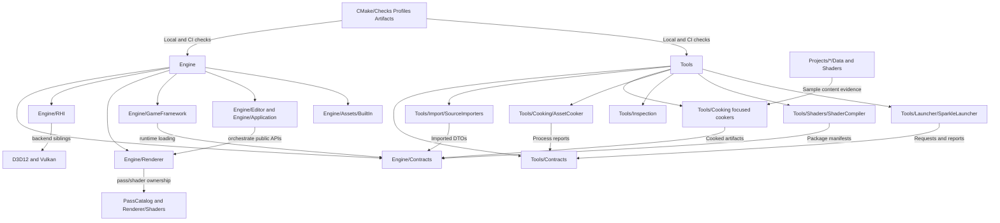

# Repository Target Folder Architecture

Status: target folder architecture
Date: 2026-06-13
Last synchronized: 2026-06-13

Related architecture:

- [repository-target-architecture.md](repository-target-architecture.md)
- [repository-target-graphs.md](repository-target-graphs.md)
- [repository-threading-readiness.md](repository-threading-readiness.md)
- [system-design-index.md](system-design-index.md)
- [../../plans/after/repository-refactor-stage-map.md](../../plans/after/repository-refactor-stage-map.md)

## Purpose

Folder architecture is part of the architecture. A reviewer should be able to open a source root and infer ownership, allowed dependencies, data flow, and validation responsibility before reading implementation details.

This document defines the target folder shape for the whole-repository refactor. It is not a snapshot of folders that already exist. It names current folders where they exist, target folders where they should move, and paths that should be removed, renamed, or kept only as transitional migration sources.

## Reference Folder Patterns

The target is based on visible patterns from established graphics and tooling repositories, not invented structure.

| Reference | Observed folder pattern | Sparkle folder rule |
| --- | --- | --- |
| NVIDIA NVRHI: https://github.com/NVIDIA-RTX/NVRHI | Public API under `include/nvrhi`, implementation under `src`, CMake/build support under `cmake`, and separate backend targets such as `nvrhi_d3d12` and `nvrhi_vk`. | Public GPU contracts and backend implementation must be visibly separated. D3D12/Vulkan code should be sibling backend implementations, not renderer folders. |
| NVIDIA NRI: https://github.com/NVIDIA-RTX/NRI | `Include`, `Source`, `Resources`, and `Shaders` are explicit roots. | Public contracts, implementation, resources, and shaders should not be mixed under vague common roots. |
| NVIDIA Donut: https://github.com/NVIDIA-RTX/Donut | Static libraries separate core, engine, render, app, and shader build surfaces. | Sparkle should keep foundation, renderer, host/application, and shader tooling as separate targets and folders. |
| NVIDIA Donut-Samples threaded rendering: https://github.com/NVIDIA-RTX/Donut-Samples/tree/main/examples/threaded_rendering | Threaded command recording is isolated by command list/view work, not by mixing app and backend state. | Renderer/RHI folders must make command batch, frame, and queue ownership separable later. |
| NVIDIA Falcor: https://github.com/NVIDIAGameWorks/Falcor | Core framework, shared render passes, samples, render-graph app, `Data`, and `Shaders` are distinct source/content roots. | Renderer passes, sample projects, data, and shaders need explicit owner roots. Ordinary passes should not live in RHI folders. |
| AMD Cauldron: https://github.com/GPUOpen-LibrariesAndSDKs/Cauldron | `src/common`, `src/DX12`, `src/VK`, `libs`, and `media` expose backend and content separation. | Backend implementations are sibling roots with symmetric service folders; sample media/content is not hidden inside runtime code. |
| AMD Cauldron command-list rings: https://github.com/GPUOpen-LibrariesAndSDKs/Cauldron | Backend command buffers/lists are allocated and recycled per frame/back buffer. | RHI backend folders should keep command allocation, queue, and fence ownership visible. |
| AMD FidelityFX SDK: https://github.com/GPUOpen-LibrariesAndSDKs/FidelityFX-SDK | `Kits`, `Samples`, `Tools`, and `docs` separate reusable effects, sample integration, tooling, and documentation. | Vendor/provider integrations, samples, tools, and docs should have separate ownership and validation paths. |
| AMD Compressonator: https://github.com/GPUOpen-Tools/compressonator | `applications`, core/framework libraries, runtime, examples, scripts, docs, and tests are separate. | Developer tools should expose focused libraries/CLIs/apps rather than one broad conversion or common folder. |

## Current Folder Findings

Current durable roots have useful foundations, but several names and placements hide target ownership.

| Current path | Current observation | Target decision |
| --- | --- | --- |
| `Engine/Core`, `Engine/Platform` | Already visible engine foundations. | Keep/refine. Do not move render, tool, or host policy into these roots. |
| `Engine/RHI/Public`, `Engine/RHI/Private/D3D12`, `Engine/RHI/Private/Vulkan` | Strong public/private and backend split, but the RHI private tree still has generic and renderer-adjacent pressure. | Keep/refine backend roots; organize private non-backend services by ownership and keep renderer pass names out. |
| `Engine/Renderer/Private` | Renderer subsystems exist but many peers sit at one level, making frame pipeline, features, resources, and pass authoring harder to scan. | Improve/extract into host facade, frame pipeline, frame graph, pass catalog, pipeline runtime, scene staging, resources, and features. |
| `Engine/Renderer/ShaderRegistrations` | Stage 4 migration source for renderer-owned shader registrations; Stage 17A/17B target is generated output or manifest-backed records, not hand-written per-shader boilerplate or central pass-add ceremony. | Replace with renderer-owned pass catalog/package metadata under renderer private authoring and neutral `ShaderContracts`. Do not keep as a parallel handwritten registry. |
| `Tools/Shaders/PassAuthoring` | Candidate Stage 17B location for pass scaffolding or generation if the pass-add audit proves a tool removes real mechanical edits while improving validation. | Renderer runtime behavior, backend compiler logic, or broad code generation without a measured authoring-friction win. |
| `Engine/Assets/Meshes`, `Engine/Assets/Shaders`, `Engine/Assets/Textures` | This is a non-code asset root, not an empty root. Its ownership is ambiguous: engine built-ins, renderer shaders, and project content should not share one unqualified policy. | Replace/redesign. Either narrow it to documented built-in engine assets or move content to owner-specific `Engine/*/Shaders` and `Projects/*/Data` roots. |
| `Engine/GameFramework` | Correct runtime place for gameplay-facing scene and cooked loading, but shared schema gravity can pull tools and renderer into it. | Improve/extract shared schemas to `AssetContracts` and render handoff to `RenderContracts` only when the shared type is real data, not renderer packing constants. |
| `Tools/Import/SourceImporters` | Role-centered source import owner for source-format families such as glTF and FBX. | Keep/refine per-format importers that emit DTOs, import reports, and diagnostics. |
| `Tools/Support/ToolConsoleSupport` | Generic console/report support can become a vague policy sink if it grows domain behavior. | Keep as console/report plumbing only; create `Tools/Cooking/CookDiagnostics` only when shared cook-domain diagnostics are real. |
| `Tools/Conversion/AssetConverter` | A direct conversion CLI can become a second production cook path. | Remove as a production path. Useful read-only commands move to explicit inspection/debug tools or AssetCooker subcommands. |
| `Tools/Launcher/SparkleLauncher` | Already has useful `Private/Core`, `Private/Gui`, and workflow-oriented folders. | Keep/refine; consider `Private/Workflows` grouping when it makes process ownership clearer. |
| `Tools/Shaders/ShaderCompiler` | Good backend, cooking, inspection, and verification structure. | Keep/refine; consume `ShaderContracts` instead of full renderer runtime. |
| `CMake` | Build profiles, dependencies, artifacts, release, Qt, and checks are present but flat. | Improve/extract checks/profiles/artifacts into named build-support folders as Stage 28 cleanup, if it improves navigation. |
| `Projects/Showcase` | Useful evidence project. | Keep/refine; project data and shaders should be explicit sample roots. |
| `tmp_*`, `build*`, `artifacts`, `dist`, `logs` | Local/generated/reference scratch roots. | Exclude from durable architecture. Do not place source decisions there. |

## Target Folder Shape

This tree is the target navigation model. A stage may choose smaller intermediate moves, but final folder names should converge on this shape or document a stricter alternative.

```text
Engine/
  Core/
    Public/
    Private/
  Platform/
    Public/
    Private/
  Contracts/
    Asset/
      Public/
      Private/
    Render/
      Public/
      Private/
    Shader/
      Public/
      Private/
    Threading/
      Public/
      Private/
  RHI/
    Public/
      Capture/
      Diagnostics/
      Interop/
      Presentation/
    Private/
      Services/
        Capability/
        Device/
        Commands/
        Descriptors/
        Resources/
        Pipeline/
        Memory/
        Presentation/
        Capture/
        Interop/
        Diagnostics/
        Validation/
      D3D12/
        Commands/
        Descriptors/
        Device/
        Diagnostics/
        Memory/
        Pipeline/
        RayTracing/
        Resources/
        SwapChain/
        Textures/
      Vulkan/
        Commands/
        Descriptors/
        Device/
        Diagnostics/
        Memory/
        Pipeline/
        RayTracing/
        Resources/
        SwapChain/
        Textures/
    Shaders/
      BuiltIn/
  Renderer/
    Public/
    Private/
      Host/
      FramePipeline/
      FrameGraph/
      Passes/
      PassCatalog/
      PipelineRuntime/
      Scene/
      Resources/
      Features/
        Debug/
        RayTracing/
        Denoising/
        Upscaling/
      Diagnostics/
    Shaders/
  GameFramework/
    Public/
    Private/
  Editor/
    Public/
    Private/
  Application/
    Public/
    Private/
  Assets/
    BuiltIn/

Tools/
  Contracts/
    Public/
    Private/
  Import/
    SourceImporters/
  Cooking/
    TextureCooker/
    MeshCooker/
    MaterialCooker/
    SceneCooker/
    AssetCooker/
    CookDiagnostics/
  Inspection/
    AssetInspector/
  Support/
    ToolConsoleSupport/
  Shaders/
    ShaderCompiler/
  Launcher/
    SparkleLauncher/

Projects/
  Showcase/
    Data/
    Shaders/

CMake/
  Checks/
  Dependencies/
  Profiles/
  Artifacts/
  Release/
```

## Folder Ownership Graph



## Target Folder Ownership Rules

| Target folder | Owns | Must not own |
| --- | --- | --- |
| `Engine/Contracts/Asset` | Versioned cooked/imported schema contracts shared by tools and runtime. | Source import algorithms, runtime loader bodies, renderer resource caches. |
| `Engine/Contracts/Render` | Immutable renderer-facing snapshots, viewport products, render-domain DTOs. | Frame graph internals, pass code, gameplay mutation. |
| `Engine/Contracts/Shader` | Pass catalog records, shader package manifests, reflection/binding schema shared by Renderer and ShaderCompiler. | Renderer runtime execution, backend compiler implementation, RHI pass ownership. |
| `Engine/Contracts/Threading` | Optional future home for public job, command-batch, queue-packet, or report primitives once real callers exist. | A premature global job system, hidden scheduler policy, or domain-specific mutable owner state. |
| `Tools/Contracts` | Process requests, tool reports, artifact reports, operation history records. | Engine runtime schemas or GUI widget logic. |
| `Engine/RHI/Private/Services` | API-neutral GPU service implementations that back public RHI contracts. | Renderer pass names, GameFramework scene data, source/cook policy. |
| `Engine/RHI/Private/D3D12` and `Engine/RHI/Private/Vulkan` | Native API translation, backend resources, memory, descriptors, pipelines, diagnostics. | Cross-backend includes, renderer feature policy, Application validation ownership. |
| `Engine/RHI/Shaders/BuiltIn` | Generic RHI shader fixtures needed by RHI validation. | GBuffer, lighting, sky, debug visualization, or other renderer pass shaders. |
| `Engine/Renderer/Private/PassCatalog` | Renderer-owned pass definitions, package identities, shader paths, entry points, binding layout IDs. | Backend-native API code or RHI-private primitives. |
| `Engine/Renderer/Shaders` | Renderer-owned shader source grouped by pass/feature. | Generic RHI validation shaders or project/sample shader overrides. |
| `Engine/Renderer/Private/Features` | Optional renderer feature systems such as ray tracing, denoising, upscaling, and debug visualization. | Backend service implementations or GameFramework-owned scene mutation. |
| `Engine/Assets/BuiltIn` | Small built-in engine assets with manifest, owner, and validation. | Project content, renderer pass shader ownership, or untracked source dumps. |
| `Projects/*/Data` and `Projects/*/Shaders` | Sample/project content used as validation evidence. | Engine built-ins, tool implementation code, or generated artifacts without source manifest. |
| `Tools/Import/SourceImporters` | Per-format source readers and imported DTO diagnostics. | Cooked artifact emission, runtime loading, renderer GPU resource creation. |
| `Tools/Cooking/*Cooker` | Focused deterministic artifact transforms. | Project workflow UI, runtime mutation, or unrelated format import policy. |
| `Tools/Cooking/AssetCooker` | Discovery, planning, dispatch, aggregation, reports. | Reimplementation of focused cooker algorithms. |
| `Tools/Inspection/AssetInspector` | Read-only artifact/package/report inspection commands. | Production cook policy or source import transformation. |
| `Tools/Support/ToolConsoleSupport` | Console/log/report plumbing reused by tools. | Asset, shader, project, launcher, or cook-domain policy. |
| `Tools/Launcher/SparkleLauncher/Private/Core` | Workflow catalogs, process requests, execution, history. | Focused cook/import/shader algorithms. |
| `Tools/Launcher/SparkleLauncher/Private/Gui` | Qt presentation, models, widgets, prompts, styling. | Tool algorithms or build/cook process ownership. |
| `CMake/Checks` | Local/CI-friendly architecture and validation checks. | Runtime logic or generated artifacts. |

## Stage Folder Migration Map

Each implementation prompt must name the current folders touched, target folders created or strengthened, forbidden folders, and deletion/rename cleanup.

| Stage | Folder architecture action |
| --- | --- |
| 1-3 | Keep docs and boundary checks navigable. Stage 3 starts in `CMake/ArchitectureBoundaryCheck.cmake`; Stage 28 may move checks to `CMake/Checks` with a compatibility note. |
| 4-5 | Move renderer pass shader metadata out of `Engine/RHI/Private/Shaders` into renderer pass catalog/package ownership. RHI keeps only generic shader primitives and `Engine/RHI/Shaders/BuiltIn` style fixtures. |
| 6-10 | Split broad RHI responsibilities into public RHI contracts plus `Engine/RHI/Private/Services` and backend-private D3D12/Vulkan implementations. Application validation remains orchestration only. |
| 11-15 | Decompose `Engine/Renderer/Private` toward `Host`, `FramePipeline`, `FrameGraph`, `Scene`, `Resources`, `Passes`, `PassCatalog`, `PipelineRuntime`, `Features`, and `Diagnostics`. |
| 16-20 | Move pass/package/PSO identity into pass definitions, generated/manifest shader registration records, pass authoring friction budget, `PipelineRuntime`, and `Engine/Contracts/Shader`; keep ray tracing and upscaling as renderer features with RHI interop only through public contracts. |
| 21-23 | Ensure docs, coverage, and source root inventory agree with actual folder ownership. Every durable root gets an owner, allowed dependencies, forbidden dependencies, and validation command. |
| 25 | Extract shared cooked/runtime schemas from GameFramework pressure into `Engine/Contracts/Asset`; extract renderer handoff types into `Engine/Contracts/Render` only when the type earns a real shared owner. Stage 25 rejected a contract target for lighting constants and kept GPU capacity in renderer/RHI packing code. |
| 27-30 | Keep `Tools/Import/SourceImporters` as the role-centered import target; keep generic support in `Tools/Support/ToolConsoleSupport`; retire `Tools/Conversion/AssetConverter` as a production path. |
| 26 | Keep launcher workflow code under `SparkleLauncher/Private/Core` or a clear `Private/Workflows` grouping, and keep Qt code under `Private/Gui`. Do not create cooker/compiler implementation folders under Launcher. |
| 27 | Add or update inspection/validation folders only where they have read-only artifact ownership, such as `Tools/Inspection/AssetInspector` or ShaderCompiler inspection commands. |
| 28 | Expand CMake and CI guardrail folders: prefer `CMake/Checks`, `CMake/Profiles`, `CMake/Artifacts`, and documented `.github` workflow commands over flat, unowned scripts. |
| 29 | Remove stale transitional folders, aliases, duplicate bodies, old registry paths, empty/unowned roots, and compatibility shims that fail the right-to-exist test. |
| 30 | Verify future-threading folder readiness: no permanent source root should require workers to access private owner state; optional `Engine/Contracts/Threading` or `Tools/Contracts` additions must have real callers and validation value before landing. |

## Implementation Prompt Folder Contract

Every stage prompt must include folder architecture rules in addition to code rules.

Positive folder guardrails:

- Name the current path, target path, owning module, target CMake target, and validation command before moving code.
- Prefer public `Contracts` roots for shared schemas instead of private includes between systems.
- Prefer owner-specific shader/data roots: `Engine/RHI/Shaders` for generic RHI fixtures, `Engine/Renderer/Shaders` for renderer pass shaders, and `Projects/*/Shaders` for sample/project shaders.
- Prefer sibling backend folders with matching service names where D3D12/Vulkan parity matters.
- Prefer explicit tool folders by role: `SourceImporters`, focused `*Cooker`, `AssetCooker`, `ShaderCompiler`, `AssetInspector`, and `ToolConsoleSupport`.

Negative folder guardrails:

- Do not keep an old folder and a replacement folder as parallel production paths.
- Do not create broad `Common`, `Utils`, `Helpers`, `Bridge`, or `Managers` folders without a contract, owner, validation value, and removal alternative.
- Do not move source import, cook, launcher, or inspector code into runtime engine modules to avoid fixing tool contracts.
- Do not move renderer pass data into RHI or GameFramework to satisfy include rules.
- Do not put generated output, local scratch references, or validation artifacts under durable source folders.

Controlled data-transfer folders:

- Tool-to-runtime data moves through `Engine/Contracts/Asset`, cooked artifacts, manifests, reports, and inspection commands.
- Runtime-to-renderer data moves through `Engine/Contracts/Render` snapshots and viewport products.
- Renderer-to-shader-tool data moves through `Engine/Contracts/Shader` pass catalogs, package manifests, reflection, and binding layouts.
- Launcher-to-tool data moves through `Tools/Contracts` process requests, tool reports, artifact paths, and operation history.
- RHI/backend data moves through public RHI descriptors, capabilities, native interop records, validation reports, and backend diagnostics.
- Future threaded data moves through immutable snapshots, job requests, command batches, queue packets, fences, and reports named by [repository-threading-readiness.md](repository-threading-readiness.md).
