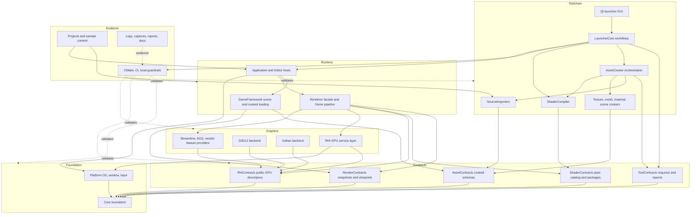
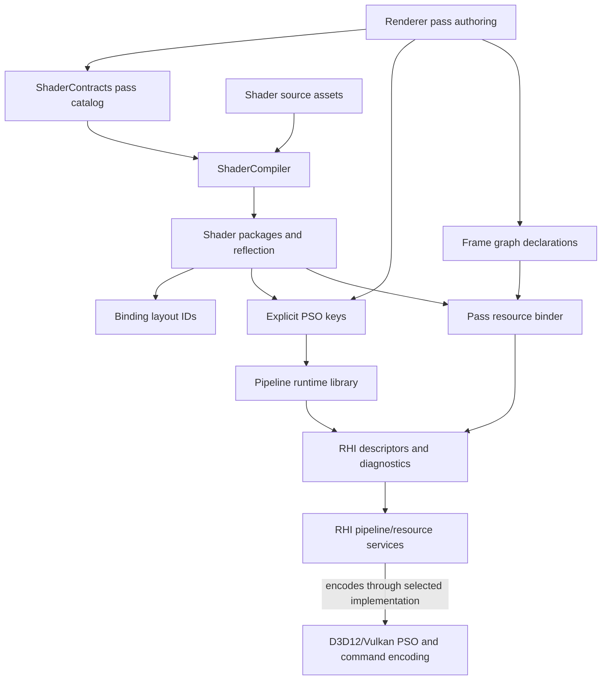
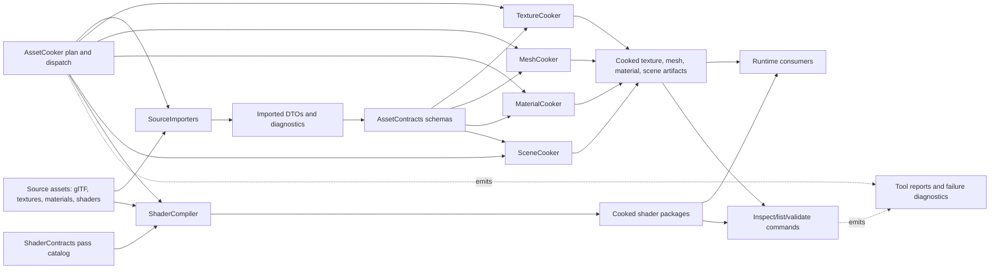
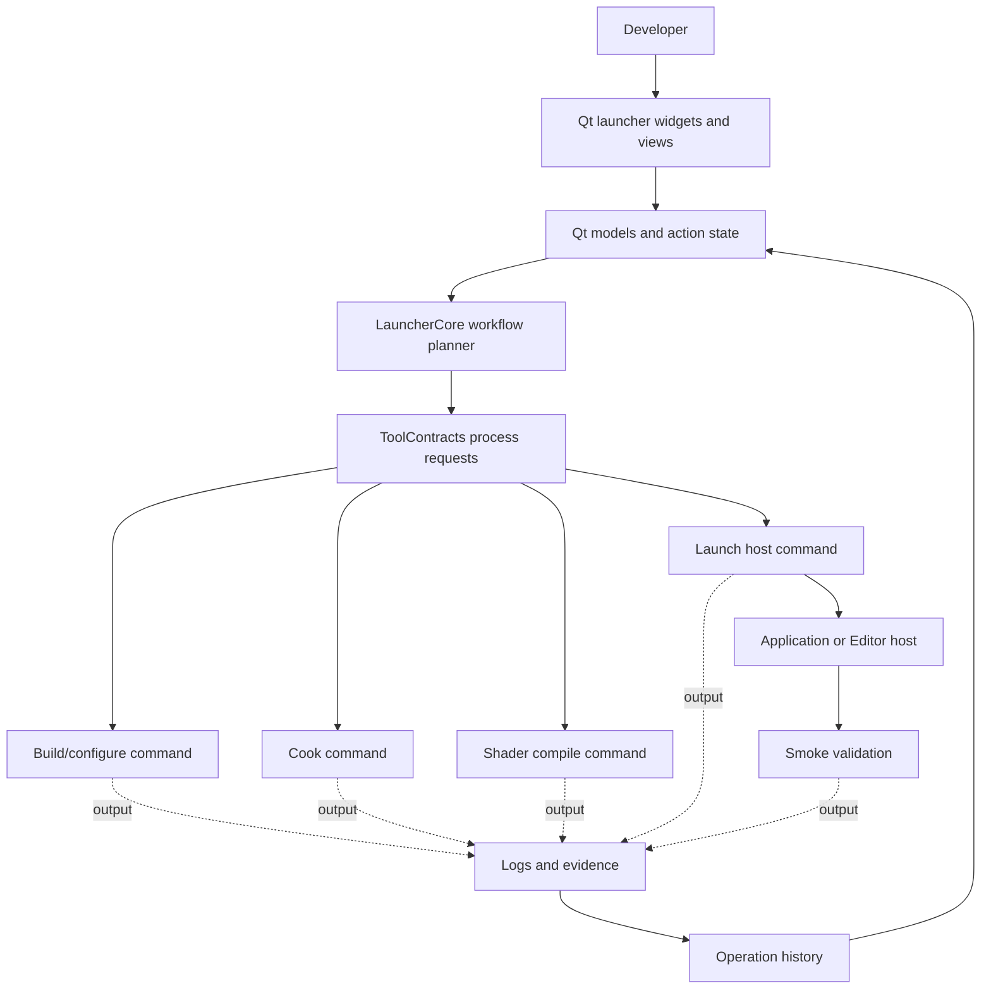
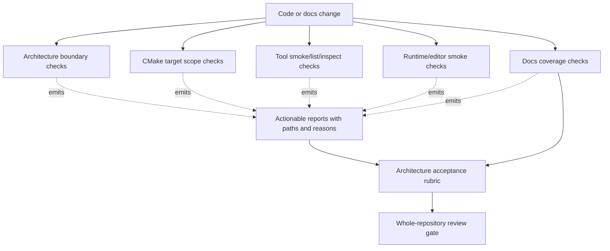

# Repository Target Architecture Graphs

Status: after/target architecture graphs
Date: 2026-06-12
Last synchronized: 2026-06-13

## Purpose

This page shows the finished-product architecture as graphs. It is deliberately stricter than the current repository shape: direct edges are shown only when they represent ownership, public contracts, produced artifacts, or runtime execution. Validation and evidence edges are dashed so they cannot be mistaken for production dependencies.

Folder/source-root flow is tracked in [repository-target-folder-architecture.md](repository-target-folder-architecture.md).

Reference model:

- NVIDIA NVRHI/NRI: low-level graphics interfaces sit below renderer code and hide D3D12/Vulkan backends.
- NVIDIA Donut/Falcor: renderer passes and render graphs live above the hardware abstraction.
- AMD Cauldron/FidelityFX: sample/runtime rendering, backend implementations, assets, shaders, and validation artifacts are separated enough to make D3D12/Vulkan parity reviewable.
- AMD Compressonator, Khronos glTF, and Khronos KTX: source/import/cook tooling should have explicit artifact schemas and inspection paths.
- Qt model/view: the Launcher UI presents operation state; orchestration and process execution live behind UI models/core workflows.

## Graph Legend

| Edge type | Meaning |
| --- | --- |
| Solid arrow | Runtime dependency, compile dependency, or producer/consumer relation allowed in target architecture. |
| Dashed arrow | Validation, evidence, report, or documentation relation. Not a runtime/module dependency. |
| `Contracts` nodes | Versioned schema and API surfaces that prevent private module coupling. |
| `Providers` nodes | Narrow vendor integrations owned by Renderer/RHI public interop contracts, not broad backend leakage. |

## Target Global Module Graph

Target edge rules:

- `Renderer -> GameFramework` is not present. GameFramework produces `RenderContracts`; Renderer consumes them.
- `Tools -> GameFramework` is not present. Tools produce `AssetContracts`; runtime consumes them.
- `ShaderCompiler -> Renderer` is not present. Renderer owns pass authoring metadata; ShaderCompiler consumes `ShaderContracts`.
- `Renderer -> D3D12/Vulkan private` is not present. Renderer uses RHI public services and narrow provider contracts.
- `LauncherGui -> tool internals` is not present. The GUI speaks to LauncherCore and models operation state.
- `AssetConverter` is not a target production node. It is folded into `AssetCooker` or explicit inspect/debug commands.
- `CookCommon` is not a target production node. Shared tool helpers are renamed/split into `ToolConsoleSupport` and focused diagnostics surfaces.

## Target Runtime Data Graph

```mermaid
flowchart LR
    Cooked[Cooked artifacts]
    AssetContracts[AssetContracts schemas and validators]
    Loaders[GameFramework cooked loaders]
    Scene[Runtime scene and gameplay state]
    Snapshots[RenderContracts immutable frame snapshots]
    Viewports[Viewport and presentation contracts]
    RendererScene[Renderer scene/resource staging]
    FramePipeline[Renderer frame pipeline]
    FrameGraph[Frame graph]
    RHI[RHI public services]
    Backend[D3D12 or Vulkan backend]

    Cooked --> AssetContracts
    AssetContracts --> Loaders
    Loaders --> Scene
    Scene --> Snapshots
    Viewports --> Snapshots
    Snapshots --> RendererScene
    RendererScene --> FramePipeline
    FramePipeline --> FrameGraph
    FrameGraph --> RHI
    RHI -->|executes through selected implementation| Backend
```

Target rule:

- Gameplay mutation stops before `RenderContracts`. Renderer receives stable, render-domain snapshots and builds GPU-facing data from those snapshots.

## Target Graphics Pipeline Graph

Target rule:

- Adding Bloom, SSAO, SSR, debug visualization, material variants, or lighting variants edits Renderer/pass/shader authoring and shader assets, not `Engine/RHI`.

## Target Asset And Tool Pipeline Graph

Target rule:

- Every artifact has a producer, schema owner, runtime consumer, inspector, and smoke/load evidence. Cookers should not include private GameFramework, Renderer, or RHI backend headers.

## Target Launcher And Host Graph

Target rule:

- LauncherCore owns workflow planning and process execution. Qt widgets and models only present/edit workflow state and history.

## Target Guardrail And Evidence Graph

Target rule:

- A refactor is not finished when code compiles. It is finished when ownership, checks, validation artifacts, and docs agree.

## Edge Quality Checklist

| Question | Required answer before an edge is accepted |
| --- | --- |
| What is the disposition of each touched system? | `Keep and refine`, `Improve and extract`, or `Replace or redesign`. |
| Does this edge add complexity that earns its right to exist? | It must name owner, consumer, contract, validation value, and smaller alternative considered. |
| Who owns the data crossing this edge? | A named contract surface or public module API. |
| Is this a runtime dependency, producer/consumer relation, or validation relation? | The graph edge type and label must say so. |
| Does the name match the production role? | Use the naming canon from `repository-target-architecture.md`; rename vague or misleading names during the owning stage. |
| Does this edge expose private headers across module boundaries? | No, unless the stage explicitly documents a transitional exception and removal stage. |
| Could the dependency be reversed by extracting a contract? | If yes, extract or document the contract before wiring the edge. |
| Does the edge make a tool depend on runtime internals? | No; use artifact schemas, DTOs, reports, or CLI/process contracts. |
| Does the edge make renderer code depend on backend-native APIs? | No; use RHI public descriptors, capabilities, or narrow provider interop. |
| Does the edge hide dependency ownership through broad CMake `PUBLIC` links? | No; target scopes must match the documented owner/consumer direction. |
