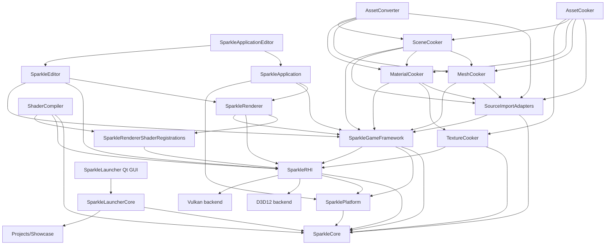
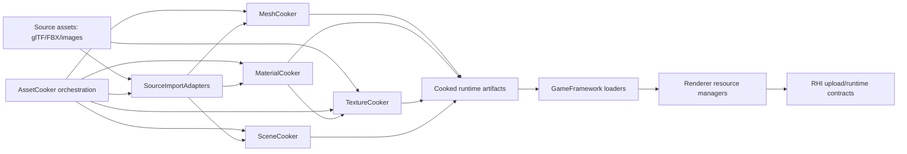
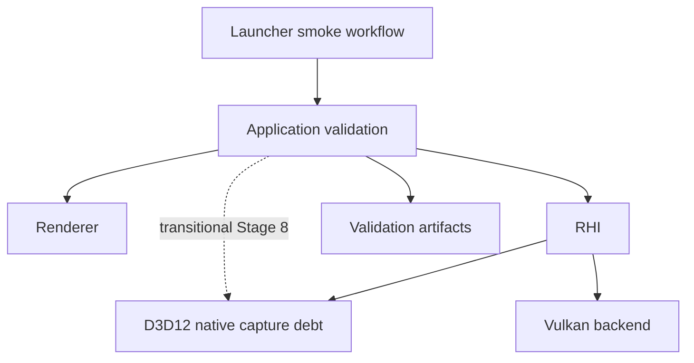
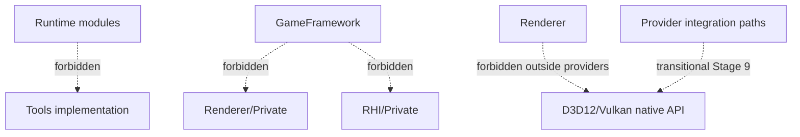
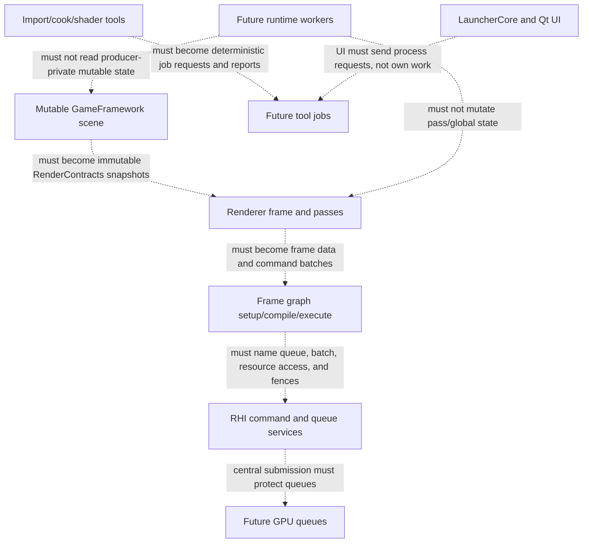

# Repository Current-State Graphs

Status: before/current architecture graphs
Date: 2026-06-12
Last synchronized: 2026-06-13

## Purpose

This page shows the current architecture as graphs. Use it to understand existing module edges, artifact flow, and transitional risk points before continuing the global refactor.

Target threading-readiness comparison: [../after/repository-threading-readiness.md](../after/repository-threading-readiness.md)

## Current Global Module Graph

## Current Graphics And Shader Flow

```mermaid
flowchart LR
    ShaderSource[Engine/Assets/Shaders]
    RendererRegs[Renderer shader registrations]
    ShaderCompiler[ShaderCompiler]
    CookedPackages[Cooked shader packages]
    RHIShader[RHI shader package/runtime primitives]
    RendererRuntime[Renderer pass and PSO runtime]
    Backends[D3D12/Vulkan PSO creation]

    ShaderSource --> RendererRegs
    RendererRegs --> ShaderCompiler
    ShaderCompiler --> CookedPackages
    CookedPackages --> RHIShader
    RHIShader --> RendererRuntime
    RendererRuntime --> Backends
```

Current note:

- Renderer pass registrations now live above RHI.
- The remaining risk is keeping `ShaderCompiler` linked to the narrow registration target, not full renderer runtime behavior.

## Current Content Pipeline Flow

Current note:

- This flow is the area most likely to be damaged by graphics refactors unless artifact schemas and runtime consumers are checked together.

## Current Host And Validation Flow

Current note:

- The dotted edge is the known Application validation debt: backend-native capture/readback must move behind RHI/backend validation services.

## Current Boundary Risk Graph

Current boundary checks protect the RHI/Renderer edges today. Stage 28 expands the same mechanical protection to the rest of this graph.

## Current Threading Readiness Risk Graph

Current note:

- The repository is not required to implement multithreading now. The risk is preserving live mutable owner access in places where future workers, render-thread work, async queues, cook jobs, shader jobs, or launcher workflows would need stable handoff data.
