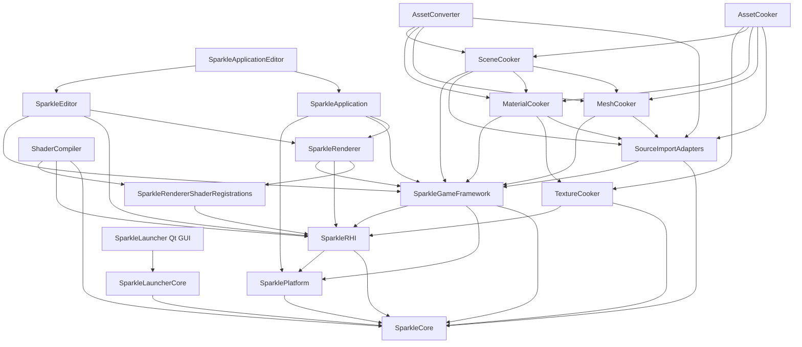

# Repository Current-State Architecture

Status: before/baseline architecture
Date: 2026-06-12
Last synchronized: 2026-06-13

Graph view: [repository-current-graphs.md](repository-current-graphs.md)
Target folder comparison: [../after/repository-target-folder-architecture.md](../after/repository-target-folder-architecture.md)
Threading readiness target: [../after/repository-threading-readiness.md](../after/repository-threading-readiness.md)

## Purpose

This document captures the current broad architecture before the whole-repository refactor reaches its final state. It is the baseline used to prove that RHI/Renderer improvements do not damage GameFramework, tools, launcher workflows, content cooking, CMake, CI, projects, or docs.

## Broad Current View

Current interpretation:

- `RHI -> Renderer` has been removed as an include relationship and is mechanically checked.
- `ShaderCompiler -> RendererShaderRegistrations` is intentionally narrow so tools can enumerate renderer-owned packages without linking full renderer runtime behavior.
- `Renderer -> GameFramework` is expected while renderer consumes runtime scene/camera/light/material/mesh state, but this should become an immutable snapshot/DTO boundary.
- `GameFramework -> RHI` exists for runtime/cooked GPU-adjacent contracts. It must not grow into descriptors, command recording, backend-native handles, or renderer pass ownership.
- `Tools -> GameFramework/RHI public contracts` is expected for cooked schemas. Runtime modules must not depend on tool internals.
- Launcher currently has a useful split between `SparkleLauncherCore` and Qt GUI code. That split must be preserved.

Current threading-readiness interpretation:

- The repository is not yet implementing a job system, render thread, parallel cooker, or async queue scheduler.
- Several good foundations already exist: renderer pass/frame graph phases, focused cookers, LauncherCore/Qt separation, backend-private RHI folders, and Stage 4's narrow shader-registration target.
- The current architecture still needs a stricter data-shape audit before multithreading would be safe: Renderer should not rely on mutable GameFramework internals, frame graph execution needs frozen plans and future command-batch identity, RHI command/queue ownership needs frame/queue/batch labels, and tools need deterministic job requests/reports.
- The target for this audit is [repository-threading-readiness.md](../after/repository-threading-readiness.md), not broad locks or premature worker abstractions.

## Current Source-Root Shape

Observed durable roots:

| Root | Current substructure | Baseline risk |
| --- | --- | --- |
| `Engine` | `Application`, `Assets`, `Core`, `Editor`, `GameFramework`, `Platform`, `Renderer`, `RHI`. | Good high-level module names, but shared contracts are still implicit in several owners. |
| `Engine/Assets` | `Meshes`, `Shaders`, `Textures`. | Non-code asset ownership is ambiguous: built-ins, renderer shaders, RHI fixtures, and project content need explicit policies. |
| `Engine/RHI/Private` | Backend folders `D3D12`, `Vulkan`, plus shared service-like folders such as bindings, config, device, shaders, validation. | Backend roots are strong; API-neutral services and shader ownership need stricter folder policy. |
| `Engine/Renderer/Private` | Camera, commands, debug, denoising, diagnostics, frame, frame graph, meshes, passes, pipeline, ray tracing, scene data, temporal, textures, upscaling. | Useful subsystems exist, but target navigation should group host facade, frame pipeline, resources, features, pass catalog, and pipeline runtime more clearly. |
| `Engine/Renderer/ShaderRegistrations` | Renderer shader registration migration folder. | Useful Stage 4 migration path; must not become a permanent duplicate pass registry if `PassCatalog`/`ShaderContracts` replace it. |
| `Tools` | `Conversion`, `Cooking`, `Import`, `Launcher`, `Shaders`. | Good tool/runtime separation, but `Conversion`, `CookCommon`, and `SourceImportAdapters` names need disposition. |
| `Tools/Cooking` | `AssetCooker`, `CookCommon`, `MaterialCooker`, `MeshCooker`, `SceneCooker`, `TextureCooker`. | Focused cookers are strong; common support and orchestration must stay precise. |
| `Tools/Launcher/SparkleLauncher` | `Assets`, `Private`, `Probe`, `Public`, `Source`; private folders include build, cook, core, GUI, launch, maintenance, shell. | Good workflow/UI split; launcher must not absorb cooker/compiler algorithms. |
| `Tools/Shaders/ShaderCompiler` | `Backends`, `Private`, `Source`; private analysis/backend/CLI/compiler/cooking/inspection/verification folders. | Strong tool foundation; final dependency should be `ShaderContracts`, not full renderer runtime. |
| `CMake` | Dependency fetch, profiles, artifacts, Qt discovery, release assembly, architecture check. | Build support is useful but can become clearer with `Checks`, `Profiles`, `Artifacts`, and related folders. |
| `Projects` | Showcase/sample project content. | Needs explicit project `Data`/`Shaders` ownership as validation content evolves. |

Generated/local-only roots seen in this workspace, such as `build/`, `build-*`, `cmake-build-debug/`, `artifacts/`, `dist/`, `logs/`, and `tmp_*`, are not durable architecture roots.

## Current Transitional Exceptions

| Exception | Current location | Removal stage |
| --- | --- | --- |
| NVIDIA DLSS provider target links `Vulkan::Vulkan` for Streamline Vulkan support. | `Engine/Renderer/CMakeLists.txt` | Provider contract |
| Streamline DLSS Vulkan bridge uses native Vulkan identifiers in provider integration. | `Engine/Renderer/Private/Upscaling/NvidiaDlss` | Provider contract |

## Current Detailed Risks

| Area | Current state | Main risk before final refactor |
| --- | --- | --- |
| Core | Broad foundation utilities used by nearly every module. | Policy or platform/render/tool behavior can spread globally if placed here. |
| Platform | Small OS/window/input layer. | Window/input code can accidentally absorb renderer/editor presentation policy. |
| RHI | GPU/API contracts plus D3D12/Vulkan backends; renderer pass registrations have moved out. | Root facade and backend implementations remain broad; capture/interop pressure can turn RHI into a catch-all. |
| Renderer | Frame graph, passes, shader registrations, PSO runtime, scene data, ray tracing, textures, upscaling. | Refactors can break GameFramework snapshots, ShaderCompiler enumeration, launcher smoke, or editor viewport behavior. |
| GameFramework | Runtime scene, levels, components, cooked asset loaders, gameplay-facing data. | Cooked schema changes can desync cookers, runtime loaders, and renderer scene/resource consumers. |
| Editor | Panels, viewport, profiler, output, scene/material/mesh/shader inspectors. | Editor can absorb tool-private or backend-native shortcuts if host contracts are unclear. |
| Application | Runtime/editor host lifecycle, runtime console, shader recook bridge, RHI smoke validation. | Existing backend-native D3D12 validation code should move behind RHI/backend services. |
| ShaderCompiler | Shader backend, CLI, cooking/cache, inspection, reflection, verification. | Tool must depend on renderer-owned registrations narrowly, not full renderer runtime. |
| SourceImportAdapters | glTF/FBX/source scene import into imported DTOs. | Source format assumptions can leak into runtime loading if schemas are not explicit. |
| TextureCooker | Source texture processing and cooked texture output. | Cooked texture schema can drift from RHI upload and renderer texture manager expectations. |
| Mesh/Material/Scene cookers | Focused conversion from imported DTOs to cooked runtime records. | Focused cookers can drift from GameFramework loaders and renderer resource consumers. |
| AssetCooker | Project-level cook planning and dispatch. | Can become a duplicate implementation of focused cooker algorithms. |
| AssetConverter | Direct developer/debug conversion CLI. | Can become a parallel production cook path. |
| Launcher | Workflow core plus Qt GUI presentation. | GUI or workflow code can duplicate focused tool algorithms instead of invoking tools. |
| CMake/CI | Profiles, dependencies, target links, boundary checks, shader-cook workflow. | Target scopes and CI can lag the intended architecture and hide drift. |
| Projects | Showcase sample content and launch targets. | Sample content can stop exercising representative cook/runtime/render paths. |
| Docs | Architecture contracts, plans, and coverage maps. | Flat structure and stale wording make before/after reasoning hard. |
| Threading readiness | Future parallelism is mostly implicit today. | Without explicit owners, snapshots, command batches, queue packets, tool jobs, and reports, future multithreading would require risky redesign. |

## Baseline Acceptance

Before moving a subsystem further, preserve these current guarantees:

- `Engine/RHI` has no `Renderer/Private` include hits.
- Runtime engine modules do not depend on `Tools/*` implementation headers.
- GameFramework and Tools do not include `Engine/Renderer/Private` or `Engine/RHI/Private`.
- Boundary check exceptions remain counted and stage-labeled.
- RHI/Renderer changes update the whole-repo blast-radius matrix in the implementation plan when they affect tools, GameFramework, launcher, CMake, CI, Projects, or docs.
