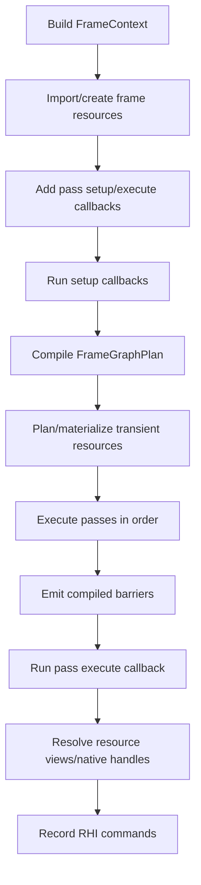
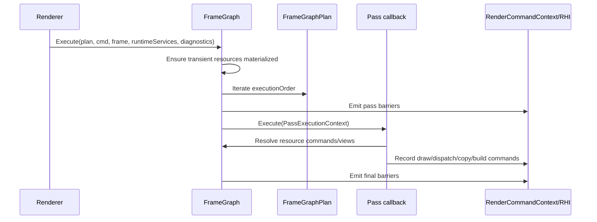

# Frame Graph Contract

Status: Stage 2 reviewer contract
Date: 2026-06-12
Last synchronized: 2026-06-13

## Purpose

This document defines the current and target contract for Sparkle's renderer frame graph. The frame graph is the renderer-owned system that turns per-frame pass/resource declarations into an executable command-recording plan.

Primary code references:

- [FrameGraph.h](../../Engine/Renderer/Private/FrameGraph/FrameGraph.h)
- [PassResourceBuilder.h](../../Engine/Renderer/Private/FrameGraph/Builder/PassResourceBuilder.h)
- [FrameGraphPlan.h](../../Engine/Renderer/Private/FrameGraph/Compiler/FrameGraphPlan.h)
- [PassExecutionContext.h](../../Engine/Renderer/Private/FrameGraph/Execution/PassExecutionContext.h)
- [FrameGraphResourceCommands.h](../../Engine/Renderer/Private/FrameGraph/Execution/FrameGraphResourceCommands.h)
- [Target folder architecture](after/repository-target-folder-architecture.md)

Reference basis:

- arc42 runtime-view and crosscutting-concept guidance: https://arc42.org/overview
- Falcor's documentation presents render passes and render graphs as the recommended rendering workflow: https://github.com/NVIDIAGameWorks/Falcor/blob/master/docs/getting-started.md

## Contract Summary

The frame graph owns:

- Pass registration for the current frame graph instance.
- Resource handle allocation and resource metadata registration.
- Pass resource access declarations.
- Dependency planning.
- Barrier planning.
- Transient resource planning and aliasing.
- Execution order and execution diagnostics.
- Resource resolution during pass execution.

The frame graph does not own:

- Game scene state.
- Shader package cooking.
- Backend-native API objects beyond opaque RHI handles.
- Pass-specific feature policy.
- Vendor SDK behavior.

Target folder ownership:

| Folder | Owns | Must not own |
| --- | --- | --- |
| `Engine/Renderer/Private/FrameGraph/Builder` | Pass/resource declaration APIs and setup helpers. | Command recording or hidden resource allocation side effects. |
| `Engine/Renderer/Private/FrameGraph/Compiler` | Dependency planning, barrier planning, transient lifetime/aliasing plan. | Pass-specific feature policy. |
| `Engine/Renderer/Private/FrameGraph/Execution` | Ordered pass execution, resource resolution, RHI command handoff. | Pass reordering at execute time or backend-native API implementation. |
| `Engine/Renderer/Private/FrameGraph/Resources` | Graph resource descriptors, transient allocation, import/persistent resource bookkeeping. | Renderer scene ownership or RHI backend allocation policy. |
| `Engine/Renderer/Private/FrameGraph/Diagnostics` | Warnings, validation records, graph dumps, smoke-visible failure details. | Suppressed warning state or generic "graph failed" messages. |

## Runtime Flow

## Pass Contract

Each frame graph pass has two responsibilities:

| Step | Current API | Owns | Must not own |
| --- | --- | --- | --- |
| Setup | `AddPass`, `AddRasterPass`, `AddComputePass`, `PassResourceBuilder` | Declares reads, writes, use, and parameter-derived resource usage. | Command recording, resource allocation side effects, backend-specific layout logic. |
| Execute | `PassExecutionContext` | Records commands using `RenderCommandContext`, resolves graph resources through `FrameGraphResourceCommands`, consumes frame/runtime services. | Reordering other passes, silently transitioning undeclared resources, creating hidden graph dependencies. |

The setup declaration is the source of truth for dependency and barrier planning. If execute touches a resource that setup did not declare, the frame graph cannot reason about correctness.

## Resource Contract

Frame graph resource classes:

- Texture: `FrameGraphTextureHandle` plus `FrameGraphTextureDesc`.
- Buffer: `FrameGraphBufferHandle` plus `FrameGraphBufferDesc`.
- Acceleration structure: `FrameGraphAccelerationStructureHandle` plus `FrameGraphAccelerationStructureDesc`.

Resource ownership classes:

| Ownership | Meaning | Current references | Rule |
| --- | --- | --- | --- |
| Back buffer/imported | Externally owned resource visible to the graph. | `ImportTexture`, `ImportBuffer` in [FrameGraph.h](../../Engine/Renderer/Private/FrameGraph/FrameGraph.h) | External owner keeps lifetime. Graph tracks state/access during execution. |
| External persistent | Resource owned outside the graph but reused across graph rebuilds or frames. | `ImportPersistentTexture`, `ImportPersistentBuffer`, persistent AS methods | Persistent binding must be refreshed if the backing resource changes. |
| Transient | Graph-created temporary resource. | `CreateTexture`, `CreateBuffer`, [FrameGraphTransientAllocator.h](../../Engine/Renderer/Private/FrameGraph/Resources/FrameGraphTransientAllocator.h) | Graph plans lifetime and aliasing; RHI creates backing resources/memory. |

Resource usage vocabulary:

- `DepthRead`
- `DepthWrite`
- `ShaderRead`
- `ShaderWrite`
- `AccelerationStructureRead`
- `AccelerationStructureBuild`

Current mapping lives in [ResourceUsage.h](../../Engine/Renderer/Private/FrameGraph/ResourceUsage.h) and [FrameGraphCompiler.cpp](../../Engine/Renderer/Private/FrameGraph/Compiler/FrameGraphCompiler.cpp).

## Compiler Contract

The compiler consumes registered passes/resources and produces `FrameGraphPlan`.

`FrameGraphPlan` contains:

- `passes`: pass records, declarations, dependencies, successors, barriers.
- `resources`: resource records, versions, states, ownership, debug names.
- `executionOrder`: pass order.
- `transients`: transient resource and physical block plan.
- `finalTransientAliasingBarriers` and `finalBarriers`.

Compiler responsibilities:

- Build resource nodes from the registry.
- Convert pass declarations into dependencies.
- Track versions for reads/writes.
- Infer required `ResourceState`.
- Plan transition/UAV/AS barriers.
- Plan transient aliasing.
- Preserve diagnostics labels.

Compiler must not:

- Execute pass callbacks.
- Create backend-native resources directly.
- Hide unresolved resources as success.

## Execution Contract

Execution consumes a compiled plan.

Execution responsibilities:

- Materialize transient resources before use.
- Emit aliasing and resource barriers from the compiled plan.
- Provide `PassExecutionContext`.
- Record diagnostics around each pass.
- Preserve final resource state for imported/persistent resources.

## Diagnostics Contract

Frame graph diagnostics are review-critical because previous smoke output showed unresolved resource/barrier warnings.

Current diagnostic files:

- [FrameGraphPlanDiagnostics.cpp](../../Engine/Renderer/Private/FrameGraph/Diagnostics/FrameGraphPlanDiagnostics.cpp)
- [FrameGraphResourceContractDiagnostics.cpp](../../Engine/Renderer/Private/FrameGraph/Diagnostics/FrameGraphResourceContractDiagnostics.cpp)
- [FrameExecutionDiagnostics.cpp](../../Engine/Renderer/Private/Diagnostics/FrameExecutionDiagnostics.cpp)
- [PassExecutionDiagnostics.cpp](../../Engine/Renderer/Private/Diagnostics/PassExecutionDiagnostics.cpp)

Target policy:

- Development smoke must fail unresolved handles/resources/barriers.
- Warnings may remain only when classified with a known issue and acceptance owner.
- Diagnostics must include pass name, resource name/handle, expected usage, and owning stage.

## Current Gaps

| Gap | Current evidence | Target stage |
| --- | --- | --- |
| Unresolved resource/barrier warnings are possible. | Prior smoke logs showed unresolved handles for passes such as `LightingComposite`, `VisualizeBuffers`, `Sky`, and `EvaluateExternalUpscalerProvider`. | Stage 14, Stage 15, Stage 20 |
| Frame graph contract is in code, not reviewer docs. | Implementation spread across `Builder`, `Compiler`, `Execution`, `Resources`, and `Diagnostics`. | Stage 2 |
| Resource declarations and parameter binding validation are separate concepts. | `PassResourceBuilder` declares graph usage; `PassBinder` validates runtime bindings. | Stage 14, Stage 17 |
| Persistent acceleration structure binding is specialized. | Persistent AS functions live on `FrameGraph`. | Stage 18 |

## Change Rules

Before changing frame graph code:

1. State whether the change affects declaration, compile, transient planning, execution, diagnostics, or resource resolution.
2. State whether D3D12/Vulkan resource states/layouts are affected.
3. Add or update diagnostics for new failure paths.
4. Keep pass setup as the source of truth for resource usage.
5. Do not silence unresolved resource problems to keep smoke green.

## Acceptance Evidence

The frame graph contract is complete when:

- All unresolved resource/barrier cases become development-smoke failures or explicitly classified known issues.
- D3D12 and Vulkan smoke logs show no unresolved frame graph warnings.
- A frame graph plan diagnostic artifact can explain pass order, resource usage, barriers, and transients.
- Pass authoring docs show how pass parameter usage enters frame graph declarations.
