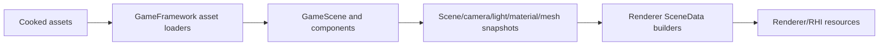

# GameFramework Contract

Status: whole-repository GameFramework contract
Date: 2026-06-12

## Purpose

This document defines how `Engine/GameFramework` participates in the whole-repository architecture. The goal is to keep runtime scene/gameplay code stable while RHI, Renderer, and tool-side cooking are refactored.

GameFramework is the runtime owner for levels, scene entities/components, cameras, lighting descriptions, runtime asset payloads, cooked mesh/material/scene/animation/skeleton data, and gameplay-facing scene APIs.

It must stay cooked-data oriented. Source import, authoring conversion, and cook algorithms belong in `Tools/`.

Reference basis:

- NVIDIA Donut scene/component framework above NVRHI: https://github.com/NVIDIA-RTX/Donut
- NVIDIA Falcor scene/rendering separation: https://github.com/NVIDIAGameWorks/Falcor
- AMD Cauldron glTF/sample framework over DX12/Vulkan backends: https://github.com/GPUOpen-LibrariesAndSDKs/Cauldron
- Khronos glTF runtime asset delivery format: https://registry.khronos.org/glTF/specs/2.0/glTF-2.0.html
- Khronos KTX texture container/tooling model: https://github.com/KhronosGroup/KTX-Software

## Ownership Summary

| Area | Owns | Does not own |
| --- | --- | --- |
| `Assets` | Runtime asset IDs, registries, cooked payload loading, payload assembly, cooked record translators/loaders. | Source import adapters, cook planning, renderer GPU resources. |
| `Level` | Registered levels, level descriptions, level loading/change requests, level parsing. | Renderer frame graph, launcher workflows, source scene import. |
| `Scene` root | Runtime scene entities, components, scene snapshots, runtime scene API. | RHI command recording, renderer pass execution. |
| `Scene/Camera` | Runtime camera components/controllers and camera snapshot data. | Backend projection convention policy beyond documented shared DTOs. |
| `Scene/Lighting` | Runtime light descriptions, scene lighting state, lighting snapshots. | Direct lighting shader ownership, TLAS/BLAS ownership. |
| `Scene/Materials` | Runtime material descriptions, handles, variants, snapshots. | Texture decoding/compression, renderer material cache internals. |
| `Scene/Meshes` | Runtime mesh data/components, cooked mesh references, skeletal/static mesh data. | Renderer GPU mesh cache, backend buffers. |
| `Scene/Skeletons` / `Scene/Animations` | Runtime skeletal/animation data contracts. | Import/cook algorithms and renderer skinning buffer allocation. |

## Allowed Dependencies

GameFramework may depend on:

- `SparkleCore` for foundation types, diagnostics, files, math, IDs, strings, and events.
- `SparklePlatform` for runtime host/platform concepts already exposed through the module.
- Stable public RHI data contracts that currently own cooked GPU-adjacent types.

GameFramework must not depend on:

- `Engine/Renderer/Private` or renderer pass/pipeline/frame graph internals.
- `Engine/RHI/Private`, D3D12, Vulkan, or backend-native headers.
- `Tools/*` private or public implementation headers for source import/cooking.
- Launcher UI or workflow internals.

## Runtime Data Flow

Rules:

- GameFramework loads cooked data and exposes runtime scene snapshots.
- Renderer converts snapshots into render-domain DTOs and GPU resources.
- Tools produce cooked assets using public cooked/runtime schemas.
- RHI remains GPU/API-level; GameFramework should not receive descriptor, command-list, pipeline, or backend-native handles.

## Tooling Contract

Tools may use public GameFramework cooked data contracts to write artifacts that GameFramework later loads. Tools must not rely on private GameFramework loader internals as a substitute for a schema.

Impact checklist for GameFramework schema changes:

| Changed schema | Must update |
| --- | --- |
| Cooked mesh records | `MeshCooker`, `SceneCooker`, GameFramework mesh loaders, renderer mesh scene builders. |
| Cooked material records | `MaterialCooker`, `SceneCooker`, GameFramework material loaders, renderer material cache. |
| Cooked scene manifest | `SceneCooker`, GameFramework scene manifest loader/validators, renderer scene data builders. |
| Camera/light/component snapshot types | Source import/cook translators, GameFramework snapshots, Renderer frame builders. |
| Texture references | `TextureCooker`, `MaterialCooker`, GameFramework material/texture records, renderer texture manager. |

## Refactor Guardrails

Positive guardrails:

- Prefer immutable snapshot/DTO handoff from GameFramework to Renderer.
- Keep cooked schema changes paired with cooker and runtime loader updates.
- Keep runtime failure messages asset-oriented: asset id, file path, record kind, expected version/feature, and reason.
- Keep gameplay/component ownership out of renderer features.

Negative guardrails:

- Do not move renderer-specific shader/pass data into GameFramework to avoid RHI/Renderer dependencies.
- Do not make GameFramework load source glTF/FBX/images directly.
- Do not let tools reach into GameFramework private loaders as the only way to understand cooked schema.
- Do not make GameFramework own RHI backend-native handles or command submission.

## Validation

Smallest meaningful validation:

- GameFramework-only schema/docs change: no runtime build required; update coverage/status docs.
- Cooked asset schema change: build affected cooker plus `SparkleGameFramework`.
- Scene/camera/light/material/mesh runtime change: build affected runtime/editor target and run sample load or smoke validation.
- Renderer snapshot contract change: run renderer/RHI boundary check and targeted renderer smoke after the paired Renderer update.
