# GameFramework Contract

Status: whole-repository GameFramework contract
Date: 2026-06-12
Last synchronized: 2026-06-13

## Purpose

This document defines how `Engine/GameFramework` participates in the whole-repository architecture. The goal is to keep runtime scene/gameplay code stable while RHI, Renderer, and tool-side cooking are refactored.

GameFramework is the runtime owner for levels, scene entities/components, cameras, lighting descriptions, runtime asset payloads, cooked mesh/material/scene/animation/skeleton data, and gameplay-facing scene APIs.

It must stay cooked-data oriented. Source import, authoring conversion, and cook algorithms belong in `Tools/`.

Target folder structure for shared schemas and render handoff is tracked in [after/repository-target-folder-architecture.md](after/repository-target-folder-architecture.md). Renderer-facing snapshot ownership is detailed in [render-scene-data-contract.md](render-scene-data-contract.md).

Stage 25 removed the full `SparkleRHI` dependency from `SparkleGameFramework` and kept lighting limits out of GameFramework. `LevelDesc` now stores typed `SceneLightDesc` records for directional, point, and spot lights directly; runtime lighting snapshots remain dynamic scene data; fixed light capacities remain renderer/RHI GPU packing policy.

Reference basis:

- NVIDIA Donut scene/component framework above NVRHI: https://github.com/NVIDIA-RTX/Donut
- NVIDIA Falcor scene/rendering separation: https://github.com/NVIDIAGameWorks/Falcor
- AMD Cauldron glTF/sample framework over DX12/Vulkan backends: https://github.com/GPUOpen-LibrariesAndSDKs/Cauldron
- NVIDIA Donut threaded rendering and scene loading patterns: https://github.com/NVIDIA-RTX/Donut-Samples/tree/main/examples/threaded_rendering
- Khronos glTF runtime asset delivery format: https://registry.khronos.org/glTF/specs/2.0/glTF-2.0.html
- Khronos KTX texture container/tooling model: https://github.com/KhronosGroup/KTX-Software
- Repository threading readiness: [after/repository-threading-readiness.md](after/repository-threading-readiness.md)
- Render scene data contract: [render-scene-data-contract.md](render-scene-data-contract.md)

## Ownership Summary

| Area | Owns | Does not own |
| --- | --- | --- |
| `Assets` | Runtime asset IDs, registries, cooked payload loading, payload assembly, cooked record translators/loaders. | Source importers, cook planning, renderer GPU resources, shared schema ownership when tools also produce the data. |
| `Level` | Registered levels, level descriptions, level loading/change requests, level parsing. | Renderer frame graph, launcher workflows, source scene import. |
| `Scene` root | Runtime scene entities, components, scene snapshots, runtime scene API. | RHI command recording, renderer pass execution. |
| `Scene/Camera` | Runtime camera components/controllers and camera snapshot data. | Backend projection convention policy beyond documented shared DTOs. |
| `Scene/Lighting` | Runtime light descriptions, scene lighting state, lighting snapshots. | Direct lighting shader ownership, TLAS/BLAS ownership. |
| `Scene/Materials` | Runtime material descriptions, handles, variants, snapshots. | Texture decoding/compression, renderer material cache internals. |
| `Scene/Meshes` | Runtime mesh data/components, cooked mesh references, skeletal/static mesh data. | Renderer GPU mesh cache, backend buffers. |
| `Scene/Skeletons` / `Scene/Animations` | Runtime skeletal/animation data contracts. | Import/cook algorithms and renderer skinning buffer allocation. |

## Active Refactor Stages

GameFramework work is routed through active implementation stages:

| Stage | Scope | Required outcome |
| --- | --- | --- |
| Stage 25 | Runtime scene, render handoff, shared schema ownership | GameFramework remains runtime/cooked-data owned; `LevelDesc::lights` supports directional, point, and spot records through typed scene lights; lighting snapshots are dynamic scene data; GameFramework no longer links the full RHI target. |
| Stage 26 | Runtime cooked asset loaders and schema pairing | Mesh/material/texture/scene/animation/skeleton loader expectations are paired with producer cookers, renderer consumers, and validation/inspection evidence. |
| Stage 31 | Artifact validation matrix | Cooked artifacts name producer, schema owner, runtime consumer, inspector, and smoke/load evidence. |
| Stage 34-36 | Final evidence, threading readiness, cleanup | GameFramework has no tool-private, renderer-private, backend-private, or ambiguous schema ownership left unaccepted. |

## Disposition Decisions

| Current area | Disposition | Target decision |
| --- | --- | --- |
| GameFramework runtime world | Keep and refine | Preserve runtime scene, levels, components, gameplay-facing APIs, and cooked loading responsibilities. |
| GameFramework as cooked schema owner | Improve and extract | Move shared producer/consumer schemas to `AssetContracts` when tools and runtime both need the type. |
| Renderer-facing scene state | Improve and extract | Current Stage 13 handoff is `GameSceneSnapshot -> RenderSceneSnapshot`; later `RenderContracts` extraction can move shared snapshot schemas out of GameFramework/Renderer when tool/runtime consumers need the same types. |
| Source asset handling in runtime | Replace or redesign | Do not add glTF/FBX/image parsing to GameFramework; source formats belong to `SourceImporters` and cookers. |
| RHI-facing runtime asset data | Improve and extract | Keep only public GPU-adjacent descriptors needed for loading; route final GPU creation through Renderer/RHI contracts. |

## Folder Target

| Current pressure | Target folder rule | Cleanup rule |
| --- | --- | --- |
| Shared cooked schemas in GameFramework | Move tool/runtime shared records to `Engine/Contracts/Asset` when cookers and runtime both need them. | Do not let GameFramework become the schema dumping ground for tools. |
| Renderer-facing scene handoff | Move immutable snapshot/viewport/product types to `Engine/Contracts/Render` only when the shared type is real domain data. Stage 25 rejected a contract target for numeric light limits because they are GPU packing policy. | Do not let Renderer include GameFramework private scene/component folders. |
| Source import assumptions | Keep source-format handling in `Tools/Import/SourceImporters` and focused cookers. | Do not create glTF/FBX/image importer folders under GameFramework. |
| Runtime loaders | Keep loader bodies in GameFramework private folders and expose only public runtime/cooked contracts. | Do not make tools depend on private loader folders. |
| Project/sample content | Keep project content under `Projects/*/Data` and `Projects/*/Shaders`. | Do not put project validation content under GameFramework. |

## GameFramework Complexity Budget

| GameFramework complexity | Earns its right when | Remove or extract when |
| --- | --- | --- |
| Runtime components and scene APIs | They serve gameplay/runtime ownership and can produce stable snapshots. | They exist only to feed a renderer pass or cooker shortcut. |
| Cooked loaders | They validate versioned `AssetContracts` and report asset-oriented errors. | They become the only schema documentation tools can understand. |
| Snapshot builders | They produce immutable `RenderContracts` with clear frame ownership. | Renderer still needs mutable gameplay internals. |
| RHI-facing data | It is a narrow public contract needed for loading/upload handoff. | It exposes descriptors, command recording, backend handles, or pass policy. |

## Allowed Dependencies

GameFramework may depend on:

- `SparkleCore` for foundation types, diagnostics, files, math, IDs, strings, and events.
- `SparklePlatform` for runtime host/platform concepts already exposed through the module.
- Stable public `AssetContracts` and `RenderContracts`. Direct RHI target dependencies are not part of the Stage 25 GameFramework boundary; if a future cooked GPU-adjacent type needs to be shared, extract it to a narrow contract owner instead of linking the full RHI implementation target.

GameFramework must not depend on:

- `Engine/Renderer/Private` or renderer pass/pipeline/frame graph internals.
- `Engine/RHI/Private`, D3D12, Vulkan, or backend-native headers.
- `Tools/*` private or public implementation headers for source import/cooking.
- Launcher UI or workflow internals.

## Runtime Data Flow

```mermaid
flowchart LR
    Cooked[Cooked assets]
    AssetContracts[AssetContracts schemas]
    GameAssets[GameFramework asset loaders]
    Scene[GameScene and components]
    Snapshot[RenderSceneSnapshot / RenderContracts snapshots]
    Renderer[Renderer SceneData builders]
    GPU[Renderer/RHI resources]

    Cooked --> AssetContracts
    AssetContracts --> GameAssets
    GameAssets --> Scene
    Scene --> Snapshot
    Snapshot --> Renderer
    Renderer --> GPU
```

Rules:

- GameFramework loads cooked data and exposes runtime scene snapshots.
- Renderer captures those snapshots into `RenderSceneSnapshot`, then converts them into render-domain DTOs and GPU resources.
- Tools produce cooked assets using public cooked/runtime schemas.
- RHI remains GPU/API-level; GameFramework should not receive descriptor, command-list, pipeline, or backend-native handles.

## Threading Readiness Contract

GameFramework is the owner of gameplay/runtime scene mutation. Future renderer and cook parallelism depends on keeping that mutable state isolated.

| Area | Threading-ready rule |
| --- | --- |
| Scene mutation | Mutate entities/components in the GameFramework/runtime phase only. Renderer and tools consume copies, snapshots, or cooked records. |
| Render handoff | Build immutable `RenderContracts` snapshots with frame/generation id, camera/light/material/mesh references, and diagnostics labels. |
| Cooked loading | Load versioned `AssetContracts` records and report schema/asset failures before exposing runtime payloads to renderer staging. |
| Runtime asset caches | Give caches one owner and generation policy; do not let cook jobs or renderer jobs mutate loader internals. |
| Editor interaction | Editor writes intent through public runtime/editor APIs; background jobs should not mutate live scene components directly. |

Forbidden threading shortcuts:

- Do not let Renderer read mutable GameFramework components to avoid writing a snapshot.
- Do not let SourceImporters, cookers, or AssetCooker write GameFramework runtime objects directly.
- Do not add background loading that publishes partially validated cooked data.
- Do not move renderer pass data into GameFramework to make a future worker job easier.

## Tooling Contract

Tools may use public GameFramework cooked data contracts to write artifacts that GameFramework later loads. Tools must not rely on private GameFramework loader internals as a substitute for a schema.

Impact checklist for GameFramework schema changes:

| Changed schema | Must update |
| --- | --- |
| Cooked mesh records | `MeshCooker`, `SceneCooker`, GameFramework mesh loaders, renderer mesh scene builders. |
| Cooked material records | `MaterialCooker`, `SceneCooker`, GameFramework material loaders, renderer material cache. |
| Cooked scene manifest | `SceneCooker`, GameFramework scene manifest loader/validators, renderer scene data builders. |
| Camera/light/component snapshot types | Source import/cook translators, GameFramework snapshots, Renderer frame builders. |
| Texture references | `TextureCooker`, `MaterialCooker`, GameFramework material/texture records, renderer texture manager. |

## Refactor Guardrails

Positive guardrails:

- Prefer immutable snapshot/DTO handoff from GameFramework to Renderer.
- Keep cooked schema changes paired with cooker and runtime loader updates.
- Keep runtime failure messages asset-oriented: asset id, file path, record kind, expected version/feature, and reason.
- Keep gameplay/component ownership out of renderer features.

Negative guardrails:

- Do not move renderer-specific shader/pass data into GameFramework to avoid RHI/Renderer dependencies.
- Do not make GameFramework load source glTF/FBX/images directly.
- Do not let tools reach into GameFramework private loaders as the only way to understand cooked schema.
- Do not make GameFramework own RHI backend-native handles or command submission.

## Validation

Smallest meaningful validation:

- GameFramework-only schema/docs change: no runtime build required; update coverage/status docs.
- Cooked asset schema change: build affected cooker plus `SparkleGameFramework`.
- Scene/camera/light/material/mesh runtime change: build affected runtime/editor target and run sample load or smoke validation.
- Renderer snapshot contract change: run renderer/RHI boundary check and targeted renderer smoke after the paired Renderer update.
